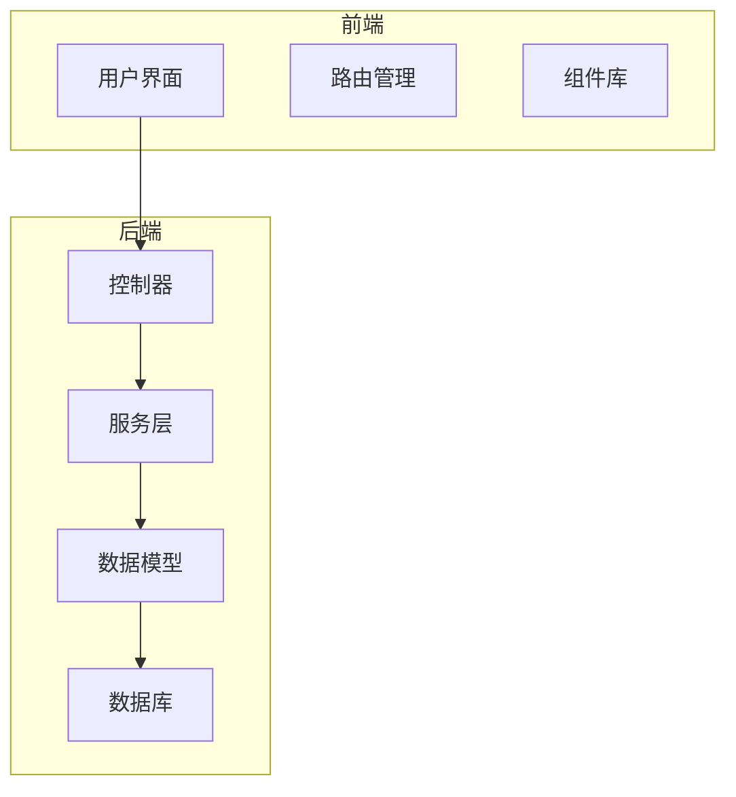
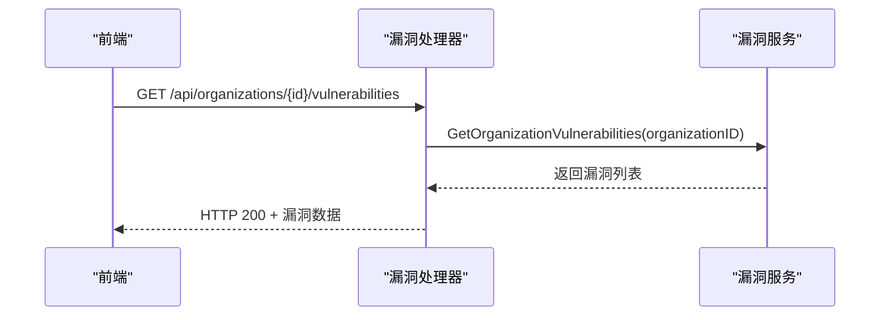
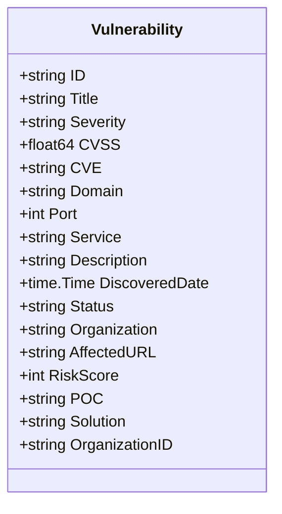
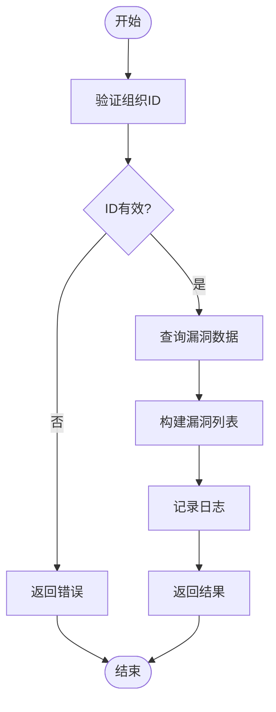
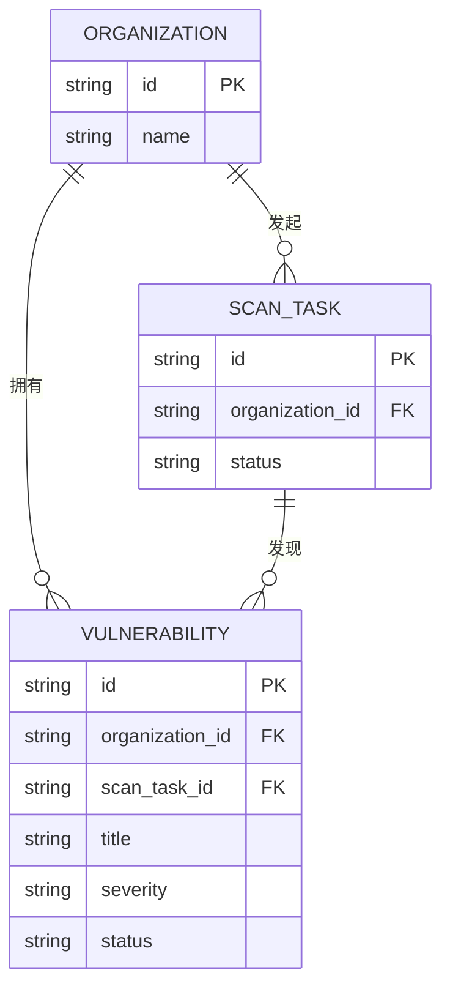

# 漏洞模型

<cite>
**本文档引用的文件**  
- [vulnerability.go](file://backend/internal/models/vulnerability.go)
- [vulnerability-service.go](file://backend/internal/services/vulnerability-service.go)
- [vulnerability-handler.go](file://backend/internal/handlers/vulnerability-handler.go)
- [scan.go](file://backend/internal/models/scan.go)
- [organization-vulnerabilities.tsx](file://front/components/pages/assets/organizations/detail/organization-vulnerabilities.tsx)
- [API_DOCUMENTATION.md](file://backend/API_DOCUMENTATION.md)
</cite>

## 目录
1. [引言](#引言)
2. [项目结构](#项目结构)
3. [核心组件](#核心组件)
4. [架构概览](#架构概览)
5. [详细组件分析](#详细组件分析)
6. [数据关联与溯源机制](#数据关联与溯源机制)
7. [漏洞评分与状态管理](#漏洞评分与状态管理)
8. [复合查询与索引策略](#复合查询与索引策略)
9. [数据生命周期管理](#数据生命周期管理)
10. [结论](#结论)

## 引言
本文档全面解析漏洞模型的设计与实现，重点围绕`Vulnerability`结构体的字段设计、与扫描结果的关联关系、漏洞评分机制、状态管理以及数据生命周期。通过分析后端模型、服务逻辑与前端展示，揭示系统如何支持漏洞数据的存储、查询与展示。文档结合代码实现与业务逻辑，为开发与维护提供详尽参考。

## 项目结构
项目采用前后端分离架构，后端使用Go语言实现RESTful API，前端使用React框架构建用户界面。后端代码组织遵循分层设计，包括`handlers`（控制器）、`services`（业务逻辑）、`models`（数据模型）和`utils`（工具函数）。前端组件按功能模块化组织，支持资产、组织、扫描和工作流等核心功能。



**图示来源**  
- [vulnerability.go](file://backend/internal/models/vulnerability.go)
- [vulnerability-service.go](file://backend/internal/services/vulnerability-service.go)

## 核心组件
漏洞管理的核心组件包括`Vulnerability`数据模型、`VulnerabilityService`服务和`GetOrganizationVulnerabilities`处理函数。这些组件协同工作，实现漏洞数据的获取与响应。

**组件来源**  
- [vulnerability.go](file://backend/internal/models/vulnerability.go#L1-L30)
- [vulnerability-service.go](file://backend/internal/services/vulnerability-service.go#L1-L125)
- [vulnerability-handler.go](file://backend/internal/handlers/vulnerability-handler.go#L1-L26)

## 架构概览
系统通过分层架构实现漏洞数据的管理。前端通过HTTP请求调用后端API，后端控制器调用服务层获取数据，服务层返回模拟或真实漏洞数据，最终通过JSON格式响应给前端。



**图示来源**  
- [vulnerability-handler.go](file://backend/internal/handlers/vulnerability-handler.go#L1-L26)
- [vulnerability-service.go](file://backend/internal/services/vulnerability-service.go#L1-L125)

## 详细组件分析

### 漏洞数据模型分析
`Vulnerability`结构体定义了漏洞的核心属性，包括标识、严重性、影响资产和状态等。

#### 漏洞结构体字段说明


**图示来源**  
- [vulnerability.go](file://backend/internal/models/vulnerability.go#L1-L30)

**字段说明**  
- **ID**: 漏洞唯一标识符，如"VUL-001"
- **Title**: 漏洞名称，如"SQL 注入漏洞"
- **Severity**: 严重等级，分为"高危"、"中危"、"低危"
- **CVSS**: 通用漏洞评分系统分数，范围0.0-10.0
- **CVE**: CVE编号，如"CVE-2024-1234"
- **Domain**: 受影响域名
- **Port**: 受影响端口
- **Service**: 服务类型，如"Web Application"
- **Description**: 漏洞描述
- **DiscoveredDate**: 发现时间
- **Status**: 状态，包括"待修复"、"已修复"、"已忽略"、"处理中"
- **Organization**: 所属组织
- **AffectedURL**: 受影响URL
- **RiskScore**: 风险评分，整数形式
- **POC**: 漏洞验证代码
- **Solution**: 修复方案
- **OrganizationID**: 组织ID，用于数据关联

**组件来源**  
- [vulnerability.go](file://backend/internal/models/vulnerability.go#L1-L30)

### 漏洞服务层分析
`VulnerabilityService`提供获取组织漏洞的业务逻辑，目前返回模拟数据，实际项目中应从数据库查询。

#### 服务方法流程


**图示来源**  
- [vulnerability-service.go](file://backend/internal/services/vulnerability-service.go#L1-L125)

**方法说明**  
- **GetOrganizationVulnerabilities**: 根据组织ID返回该组织的所有漏洞，包含5个模拟漏洞，涵盖不同严重等级和状态。

**组件来源**  
- [vulnerability-service.go](file://backend/internal/services/vulnerability-service.go#L1-L125)

## 数据关联与溯源机制
漏洞数据通过`OrganizationID`字段与组织实体关联，确保数据归属清晰。虽然当前为模拟数据，但设计上支持与扫描结果的关联。

### 与扫描结果的潜在关联
尽管当前代码未直接实现，但可通过`ScanResult`模型与漏洞建立联系。例如，一次扫描任务可能产生多个漏洞记录。



**图示来源**  
- [scan.go](file://backend/internal/models/scan.go#L1-L40)
- [vulnerability.go](file://backend/internal/models/vulnerability.go#L1-L30)

**关联说明**  
- **OrganizationID**: 漏洞与组织的直接关联
- **ScanTaskID**: 可扩展字段，用于关联发现该漏洞的扫描任务
- 数据溯源可通过组织→扫描任务→漏洞的链路实现

**组件来源**  
- [scan.go](file://backend/internal/models/scan.go#L1-L40)
- [vulnerability.go](file://backend/internal/models/vulnerability.go#L1-L30)

## 漏洞评分与状态管理

### CVSS评分与风险评分
系统同时存储CVSS分数（float64）和风险评分（int）。CVSS为国际标准评分，风险评分为内部整数评分，便于前端展示。

**评分示例**  
- SQL注入: CVSS 9.8, 风险评分 95
- XSS: CVSS 6.1, 风险评分 72
- 信息泄露: CVSS 3.7, 风险评分 25

**评分来源**  
- [vulnerability-service.go](file://backend/internal/services/vulnerability-service.go#L1-L125)

### 状态管理
漏洞状态包括：
- **待修复**: 新发现的漏洞
- **已修复**: 已经修复的漏洞
- **已忽略**: 误报或无需修复的漏洞
- **处理中**: 正在修复的漏洞

状态管理支持漏洞生命周期的跟踪，前端可根据状态进行不同颜色的展示。

**状态来源**  
- [vulnerability-service.go](file://backend/internal/services/vulnerability-service.go#L1-L125)

## 复合查询与索引策略

### 复合查询示例
系统支持基于漏洞类型、等级和状态的复合查询。虽然当前为模拟数据，但设计上支持数据库查询。

**查询示例**  
```sql
-- 查询某组织高危且未修复的漏洞
SELECT * FROM vulnerabilities 
WHERE organization_id = 'org-123' 
  AND severity = '高危' 
  AND status IN ('待修复', '处理中');
```

### 索引策略
为支持高效查询，建议在数据库中创建复合索引：
```sql
CREATE INDEX idx_vuln_org_severity_status 
ON vulnerabilities(organization_id, severity, status);
```

**查询来源**  
- [vulnerability-service.go](file://backend/internal/services/vulnerability-service.go#L1-L125)

## 数据生命周期管理

### 自动关闭策略
系统可通过定时任务自动处理长期未修复的漏洞。例如，发现超过90天且状态为"待修复"的漏洞可自动标记为"已忽略"。

### 历史记录保留
所有漏洞状态变更应记录历史，支持审计与追溯。当前模型未包含历史表，但可通过扩展实现。

### 报告生成与数据聚合
系统支持生成漏洞报告，聚合数据按严重等级统计：
```json
{
  "summary": {
    "total": 5,
    "high": 2,
    "medium": 2,
    "low": 1,
    "fixed": 1,
    "ignored": 1
  }
}
```

**生命周期来源**  
- [API_DOCUMENTATION.md](file://backend/API_DOCUMENTATION.md#L251-L257)

## 结论
本文档详细分析了漏洞模型的设计与实现，涵盖数据结构、服务逻辑、数据关联与生命周期管理。当前系统使用模拟数据，为实际数据库集成提供了清晰的设计蓝图。通过`Vulnerability`结构体的丰富字段，系统能够全面描述漏洞特征，支持高效的查询与展示。未来可扩展扫描结果关联、自动化工作流和增强的报告功能。