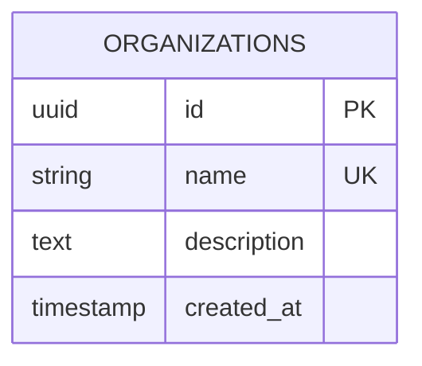
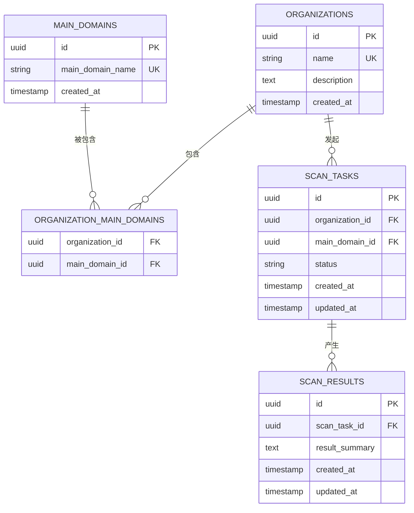
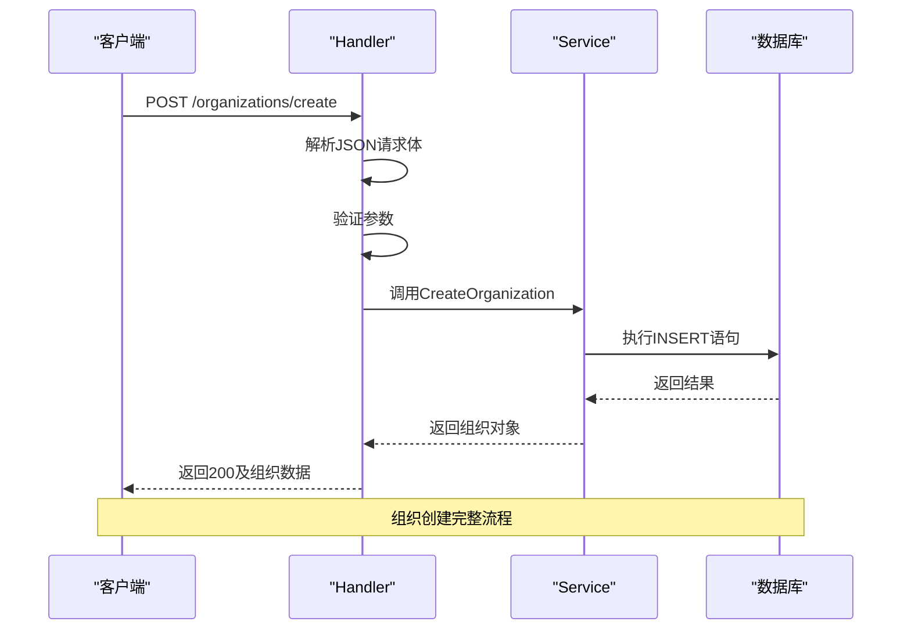

# 组织模型

<cite>
**本文档中引用的文件**  
- [organization.go](file://backend/internal/models/organization.go)
- [organization-service.go](file://backend/internal/services/organization-service.go)
- [organization-handler.go](file://backend/internal/handlers/organization-handler.go)
- [routes.go](file://backend/routes/routes.go)
- [初始化.sql](file://backend/初始化.sql)
</cite>

## 目录
1. [组织模型](#组织模型)
2. [核心字段定义与业务含义](#核心字段定义与业务含义)
3. [GORM标签与数据库映射](#gorm标签与数据库映射)
4. [与其他模型的关联关系](#与其他模型的关联关系)
5. [服务层实现与数据操作](#服务层实现与数据操作)
6. [API层接口与路由配置](#api层接口与路由配置)
7. [软删除机制与数据一致性](#软删除机制与数据一致性)
8. [典型使用场景与代码示例](#典型使用场景与代码示例)
9. [常见问题与并发控制](#常见问题与并发控制)

## 组织模型

本节详细分析`Organization`结构体的设计、字段定义、数据库映射以及在整个系统中的作用。该模型是资产管理系统的核心实体之一，用于表示一个安全扫描任务所属的组织单位。

**Section sources**
- [organization.go](file://backend/internal/models/organization.go#L6-L12)

## 核心字段定义与业务含义

`Organization`结构体定义了组织的基本属性，每个字段都有明确的数据类型和业务语义：

```go
type Organization struct {
	ID          string    `json:"id" db:"id"`
	Name        string    `json:"name" db:"name"`
	Description string    `json:"description" db:"description"`
	CreatedAt   time.Time `json:"created_at" db:"created_at"`
}
```

### 字段说明

- **ID**: 组织唯一标识符，数据类型为字符串，在数据库中存储为UUID。作为主键确保全局唯一性。
- **Name**: 组织名称，字符串类型，具有唯一性约束，用于标识和展示组织。
- **Description**: 组织描述，可选的文本字段，用于记录组织的详细信息或备注。
- **CreatedAt**: 创建时间戳，记录组织创建的具体时间，用于排序和审计。

这些字段共同构成了组织的基础信息，支持前端展示、搜索和权限管理等核心功能。

**Section sources**
- [organization.go](file://backend/internal/models/organization.go#L6-L12)

## GORM标签与数据库映射

尽管代码中未显式使用GORM标签（如`gorm:"column:name"`），但从SQL脚本和业务逻辑可以推断出完整的数据库映射关系：

```sql
CREATE TABLE organizations (
    id UUID PRIMARY KEY DEFAULT gen_random_uuid(),
    name VARCHAR(255) NOT NULL UNIQUE,
    description TEXT,
    created_at TIMESTAMP WITH TIME ZONE NOT NULL
);
```

### 映射关系

| 结构体字段 | 数据库列名 | 数据类型 | 约束条件 |
|-----------|------------|----------|----------|
| ID | id | UUID | 主键，自动生成 |
| Name | name | VARCHAR(255) | 非空，唯一 |
| Description | description | TEXT | 可为空 |
| CreatedAt | created_at | TIMESTAMP WITH TIME ZONE | 非空 |

虽然Go结构体使用了`db`标签而非`gorm`标签，但系统通过原生SQL查询与数据库交互，实现了等效的ORM映射。`created_at`字段在插入时由数据库`NOW()`函数自动填充，确保时间一致性。

**Diagram sources**
- [初始化.sql](file://backend/初始化.sql#L10-L14)



## 与其他模型的关联关系

`Organization`模型通过外键与其他多个模型建立关联，形成完整的资产管理体系。

### 关联模型分析

1. **主域名 (Main Domains)**: 通过`organization_main_domains`关联表实现多对多关系
2. **子域名 (Sub Domains)**: 间接关联，通过主域名进行级联
3. **扫描任务 (Scan Tasks)**: 一对多关系，一个组织可有多个扫描任务
4. **漏洞 (Vulnerabilities)**: 间接关联，通过扫描结果链式关联

```sql
CREATE TABLE organization_main_domains (
    organization_id UUID NOT NULL REFERENCES organizations(id) ON DELETE CASCADE,
    main_domain_id UUID NOT NULL REFERENCES main_domains(id) ON DELETE CASCADE,
    PRIMARY KEY (organization_id, main_domain_id)
);
```

### 级联删除策略

当删除组织时，相关数据将被自动清理：
- `ON DELETE CASCADE`确保关联的`organization_main_domains`记录被删除
- 进而触发`main_domains`的级联删除（如果无其他组织引用）
- 扫描任务、扫描结果等下游数据也随之清除

这种设计保障了数据的一致性和完整性，避免了孤儿记录的产生。

**Diagram sources**
- [初始化.sql](file://backend/初始化.sql#L16-L22)



## 服务层实现与数据操作

`OrganizationService`提供了对组织模型的完整CRUD操作，封装了数据库访问逻辑。

### 服务结构

```go
type OrganizationService struct {
	db *sql.DB
}
```

服务通过依赖注入获取数据库连接，遵循单一职责原则，专注于组织相关的业务逻辑。

### 核心方法

#### 获取所有组织
```go
func (s *OrganizationService) GetOrganizations() ([]models.Organization, error)
```
执行SQL查询，按创建时间倒序返回所有组织列表。

#### 根据ID获取组织
```go
func (s *OrganizationService) GetOrganizationByID(id string) (*models.Organization, error)
```
使用参数化查询防止SQL注入，未找到时返回特定错误。

#### 创建组织
```go
func (s *OrganizationService) CreateOrganization(req models.CreateOrganizationRequest) (*models.Organization, error)
```
1. 生成UUID作为ID
2. 执行INSERT语句并返回结果
3. 记录创建日志

#### 更新组织
```go
func (s *OrganizationService) UpdateOrganization(req models.UpdateOrganizationRequest) (*models.Organization, error)
```
仅更新提供的字段，`updated_at`自动设置为当前时间。

#### 删除组织
```go
func (s *OrganizationService) DeleteOrganization(organizationID string) error
```
执行DELETE语句，检查`RowsAffected`确保删除成功。

**Section sources**
- [organization-service.go](file://backend/internal/services/organization-service.go#L13-L157)

## API层接口与路由配置

API层通过Gin框架暴露RESTful接口，处理HTTP请求并调用服务层。

### 路由配置

```go
func SetupOrganizationRoutes(api *gin.RouterGroup) {
	orgGroup := api.Group("/organizations")
	{
		orgGroup.GET("", handlers.GetOrganizations)
		orgGroup.POST("/create", handlers.CreateOrganization)
		orgGroup.GET("/:id", handlers.GetOrganizationByID)
		orgGroup.POST("/:id/update", handlers.UpdateOrganization)
		orgGroup.POST("/delete", handlers.DeleteOrganization)
		orgGroup.POST("/batch-delete", handlers.BatchDeleteOrganizations)
		orgGroup.GET("/search", handlers.SearchOrganizations)
	}
}
```

### 请求处理流程

以创建组织为例：
1. 解析JSON请求体到`CreateOrganizationRequest`
2. 参数验证（使用binding tag）
3. 调用`OrganizationService.CreateOrganization`
4. 返回成功或错误响应

### 请求模型

```go
type CreateOrganizationRequest struct {
	Name        string `json:"name" binding:"required"`
	Description string `json:"description"`
}
```

使用`binding:"required"`确保必填字段的存在性。

**Section sources**
- [organization-handler.go](file://backend/internal/handlers/organization-handler.go#L15-L211)
- [routes.go](file://backend/routes/routes.go#L8-L34)



## 软删除机制与数据一致性

当前系统实现的是**硬删除**而非软删除。从代码和SQL脚本可以看出：

1. 数据库表没有`deleted_at`字段
2. 删除操作使用`DELETE FROM`而非UPDATE
3. 外键约束使用`ON DELETE CASCADE`

### 数据一致性保障

- **事务性操作**: 每个数据库操作都是原子的
- **外键约束**: 数据库层面保证引用完整性
- **级联删除**: 自动清理关联数据，防止数据孤岛
- **错误处理**: 服务层捕获并处理各种数据库错误

### 软删除改进建议

若需实现软删除，建议：
1. 在`organizations`表添加`deleted_at TIMESTAMP`
2. 修改删除逻辑为UPDATE语句
3. 查询时默认过滤`deleted_at IS NULL`的记录
4. 提供恢复接口

**Section sources**
- [organization-service.go](file://backend/internal/services/organization-service.go#L142-L157)
- [初始化.sql](file://backend/初始化.sql#L10-L14)

## 典型使用场景与代码示例

### 场景1：创建新组织

```go
// 请求示例
POST /organizations/create
{
  "name": "新组织",
  "description": "这是一个测试组织"
}
```

### 场景2：批量删除组织

```go
func BatchDeleteOrganizations(c *gin.Context) {
	var req struct {
		OrganizationIDs []string `json:"organization_ids" binding:"required"`
	}
	// ... 处理逻辑
	for _, id := range req.OrganizationIDs {
		err := service.DeleteOrganization(id)
		// 分别处理成功和失败情况
	}
}
```

### 场景3：搜索组织

```go
func SearchOrganizations(c *gin.Context) {
	query := c.Query("q")
	// 在名称和描述中进行模糊匹配
}
```

### 场景4：获取组织详情

```go
func GetOrganizationByID(c *gin.Context) {
	id := c.Param("id")
	organization, err := service.GetOrganizationByID(id)
	// 返回组织及其关联资产信息
}
```

这些场景覆盖了组织管理的核心功能，支持前端界面的完整操作流程。

**Section sources**
- [organization-handler.go](file://backend/internal/handlers/organization-handler.go#L15-L211)

## 常见问题与并发控制

### 并发创建冲突

由于`name`字段具有唯一性约束，多个请求同时创建同名组织会导致数据库唯一性冲突。

#### 解决方案

1. **应用层加锁**: 对组织名称使用读写锁
2. **重试机制**: 捕获唯一性约束错误后重试或提示用户
3. **预检查**: 先查询是否存在同名组织

```go
// 伪代码示例
func CreateOrganization(req CreateOrganizationRequest) error {
    // 检查名称是否已存在
    exists, err := s.CheckNameExists(req.Name)
    if exists {
        return fmt.Errorf("组织名称已存在")
    }
    // 继续创建逻辑
}
```

### 其他常见问题

- **ID生成冲突**: 使用UUID基本避免此问题
- **删除不存在的组织**: 服务层返回明确的"组织不存在"错误
- **权限控制**: 当前代码未体现，需在中间件中实现
- **性能问题**: 对大型组织列表需实现分页和索引优化

通过合理的错误处理和用户提示，可以提升系统的健壮性和用户体验。

**Section sources**
- [organization-service.go](file://backend/internal/services/organization-service.go#L85-L100)
- [organization-handler.go](file://backend/internal/handlers/organization-handler.go#L85-L100)