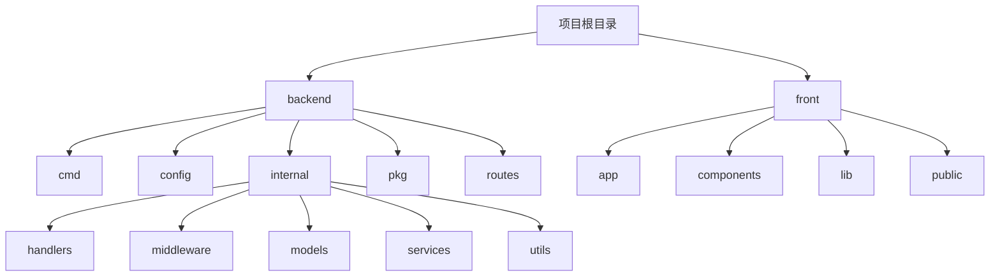
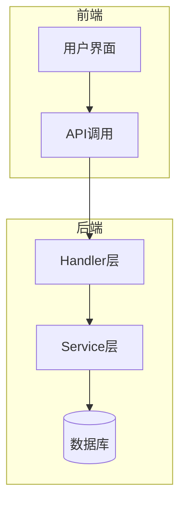
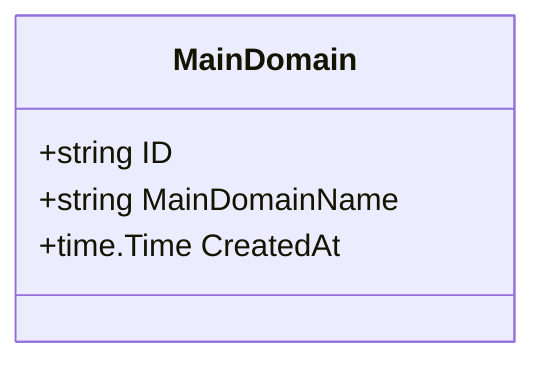
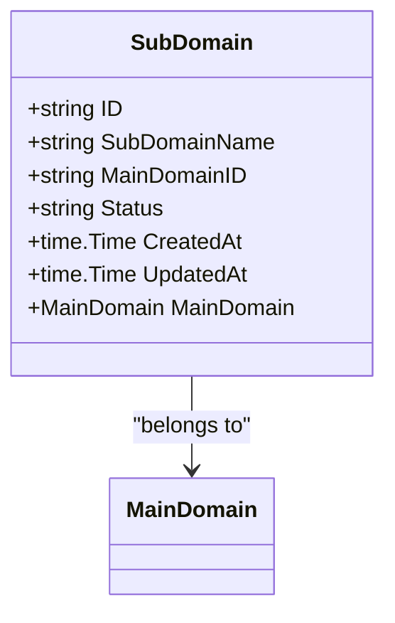
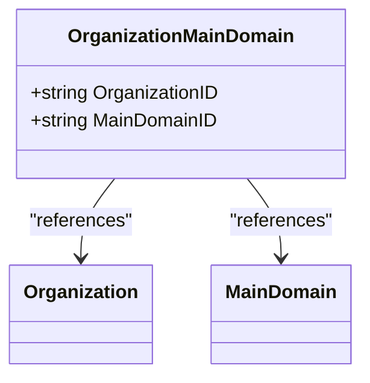
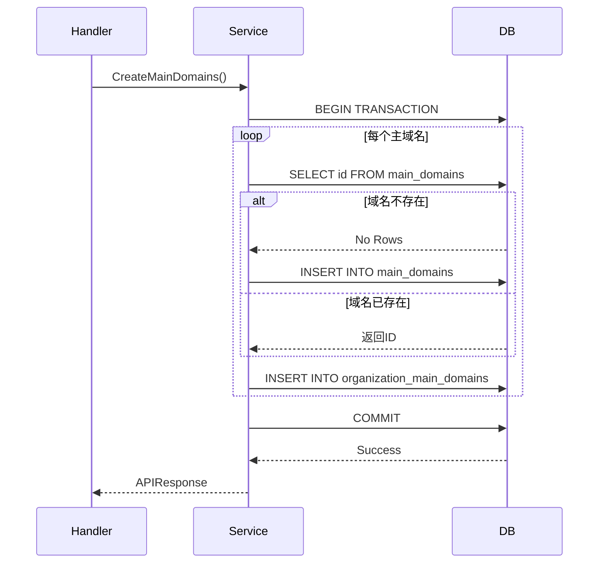
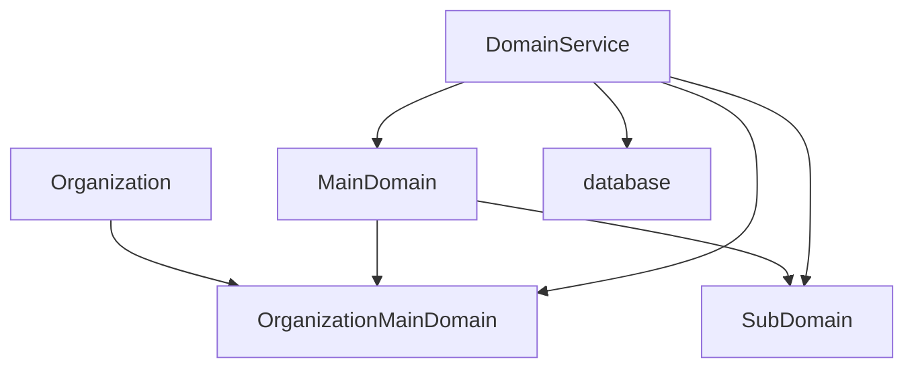

# 资产模型

<cite>
**本文档中引用的文件**   
- [domain.go](file://backend/internal/models/domain.go)
- [domain-service.go](file://backend/internal/services/domain-service.go)
- [domain-handler.go](file://backend/internal/handlers/domain-handler.go)
- [organization.go](file://backend/internal/models/organization.go)
- [初始化.sql](file://backend/初始化.sql)
</cite>

## 目录
1. [资产模型](#资产模型)
2. [项目结构](#项目结构)
3. [核心组件](#核心组件)
4. [架构概述](#架构概述)
5. [详细组件分析](#详细组件分析)
6. [依赖分析](#依赖分析)
7. [性能考虑](#性能考虑)
8. [故障排除指南](#故障排除指南)
9. [结论](#结论)

## 项目结构

项目结构遵循典型的Go后端应用分层架构，主要分为前端（front）和后端（backend）两大部分。后端采用MVC模式组织代码，包含cmd、config、internal、pkg、routes等目录。internal目录下进一步划分为handlers、middleware、models、services和utils，实现了关注点分离。models目录定义了所有数据模型，services目录包含业务逻辑，handlers目录处理HTTP请求。前端使用Next.js框架，包含app、components、hooks、lib等目录，实现了组件化开发。

**图源**
- [项目结构](file://workspace_path)

## 核心组件

资产模型是本系统的核心数据结构之一，主要由主域名、子域名和组织主域名关联三个模型构成。主域名模型（MainDomain）包含ID、主域名名称和创建时间三个字段，用于表示一个独立的域名资产。子域名模型（SubDomain）包含ID、子域名名称、主域名ID、状态、创建时间和更新时间等字段，用于表示属于某个主域名的子域名资产。组织主域名关联模型（OrganizationMainDomain）通过组织ID和主域名ID的组合，建立了组织与域名之间的多对多关联关系。

**节源**
- [domain.go](file://backend/internal/models/domain.go#L1-L61)

## 架构概述

系统采用前后端分离架构，前端通过API与后端交互。后端采用Gin框架处理HTTP请求，通过服务层调用数据库操作。资产模型的CRUD操作通过DomainService实现，该服务封装了所有与域名相关的业务逻辑。数据库使用PostgreSQL，通过UUID作为主键，确保了数据的唯一性和安全性。系统通过外键约束和唯一索引保证了数据完整性。

**图源**
- [domain-handler.go](file://backend/internal/handlers/domain-handler.go#L1-L133)
- [domain-service.go](file://backend/internal/services/domain-service.go#L1-L343)

## 详细组件分析

### 主域名模型分析

主域名模型是资产管理系统的基础，每个主域名都有唯一的ID和域名名称。该模型通过UUID作为主键，避免了自增ID可能带来的安全风险。主域名名称字段设置了唯一约束，防止重复添加相同的域名。创建时间字段记录了域名资产的创建时间，便于后续的审计和统计分析。

**图源**
- [domain.go](file://backend/internal/models/domain.go#L7-L13)

### 子域名模型分析

子域名模型与主域名模型存在Belongs To关系，通过MainDomainID字段建立外键关联。该模型包含状态字段，用于表示子域名的解析状态，如"active"（活跃）、"inactive"（不活跃）或"unknown"（未知）。状态字段的默认值为"unknown"，确保了数据的完整性。子域名名称和主域名ID的组合具有唯一性，防止重复添加相同的子域名。

**图源**
- [domain.go](file://backend/internal/models/domain.go#L15-L25)

### 组织主域名关联模型分析

组织主域名关联模型实现了组织与主域名之间的多对多关系。该模型没有独立的ID字段，而是以组织ID和主域名ID的组合作为复合主键。这种设计避免了不必要的ID字段，同时通过外键约束确保了引用完整性。ON DELETE CASCADE规则确保了当主域名或组织被删除时，相关的关联记录也会被自动删除。

**图源**
- [domain.go](file://backend/internal/models/domain.go#L27-L31)
- [初始化.sql](file://backend/初始化.sql#L1-L29)

### 域名服务分析

域名服务（DomainService）是资产模型的核心业务逻辑实现。该服务提供了创建主域名、创建子域名、获取组织主域名、获取组织子域名和移除组织主域名关联等方法。所有写操作都使用数据库事务确保了数据的一致性。在创建主域名时，服务会先检查域名是否已存在，如果不存在则创建新的主域名，然后建立与组织的关联。这种设计避免了重复数据的产生。

**图源**
- [domain-service.go](file://backend/internal/services/domain-service.go#L54-L99)

### 批量导入性能优化

在批量导入场景下，域名服务采用了事务处理和批量检查的策略来优化性能。通过单个事务处理所有操作，减少了数据库连接的开销。在创建多个主域名时，服务会逐个检查每个域名的存在性，并在同一个事务中完成所有插入操作。这种设计虽然不能完全避免N+1查询问题，但通过事务的原子性保证了数据的一致性。对于大规模数据导入，建议采用批量插入语句或COPY命令来进一步提高性能。

**节源**
- [domain-service.go](file://backend/internal/services/domain-service.go#L54-L99)

## 依赖分析

资产模型与其他模型存在明确的依赖关系。子域名模型依赖于主域名模型，通过外键约束确保了引用完整性。组织主域名关联模型依赖于组织模型和主域名模型，建立了两者之间的多对多关系。这些依赖关系通过数据库外键和Go代码中的结构体引用共同维护。服务层依赖于模型层和数据库包，实现了业务逻辑与数据访问的分离。

**图源**
- [domain.go](file://backend/internal/models/domain.go#L1-L61)
- [domain-service.go](file://backend/internal/services/domain-service.go#L1-L343)

## 性能考虑

资产模型的性能主要受数据库查询效率的影响。系统通过创建适当的索引来优化查询性能。在主域名名称、子域名名称、状态等常用查询字段上都建立了索引。特别是对organization_main_domains表的组织ID和主域名ID字段建立了索引，大大提高了关联查询的效率。对于大规模资产数据的分页查询，系统采用了LIMIT和OFFSET的方式，并通过预先计算总数来支持分页显示。缓存策略方面，虽然当前代码中没有显式实现，但可以通过Redis等缓存系统缓存常用的查询结果来进一步提高性能。

**节源**
- [初始化.sql](file://backend/初始化.sql#L270-L278)

## 故障排除指南

在使用资产模型时可能遇到的常见问题包括：主域名重复添加、组织关联失败、子域名创建冲突等。对于主域名重复添加，系统会自动检查并跳过已存在的域名，同时在响应中返回已存在的域名列表。组织关联失败通常是由于组织ID或主域名ID不存在导致的，需要检查输入参数的正确性。子域名创建冲突是由于同一主域名下不能有重复的子域名名称，系统会检查并避免这种情况。在调试时，可以查看日志中的错误信息，特别是数据库错误和事务回滚信息，有助于快速定位问题。

**节源**
- [domain-service.go](file://backend/internal/services/domain-service.go#L54-L99)
- [domain-handler.go](file://backend/internal/handlers/domain-handler.go#L1-L133)

## 结论

资产模型设计合理，通过主域名、子域名和组织关联三个核心模型，实现了对域名资产的全面管理。模型之间的关系清晰，通过外键约束保证了数据完整性。服务层实现了丰富的业务逻辑，支持批量操作和事务处理。数据库设计考虑了查询性能，通过适当的索引优化了查询效率。整体架构遵循了良好的软件设计原则，具有良好的可维护性和扩展性。对于未来的优化，可以考虑引入更高效的批量导入机制和缓存策略，以应对更大规模的数据处理需求。