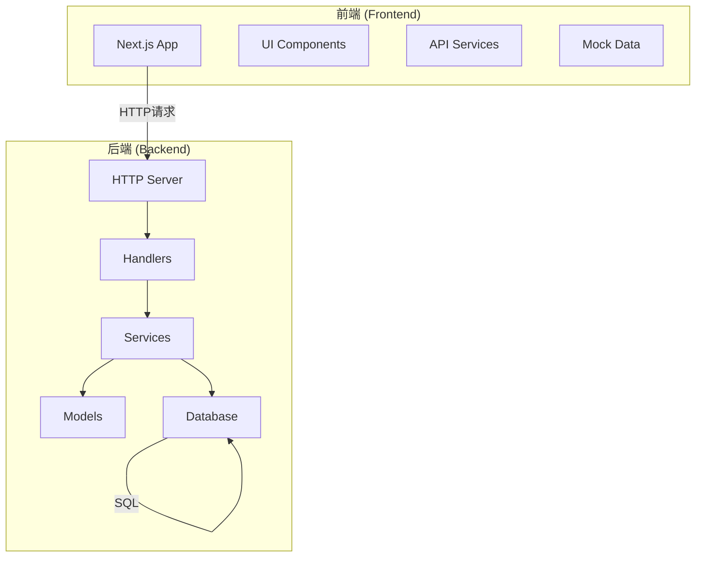
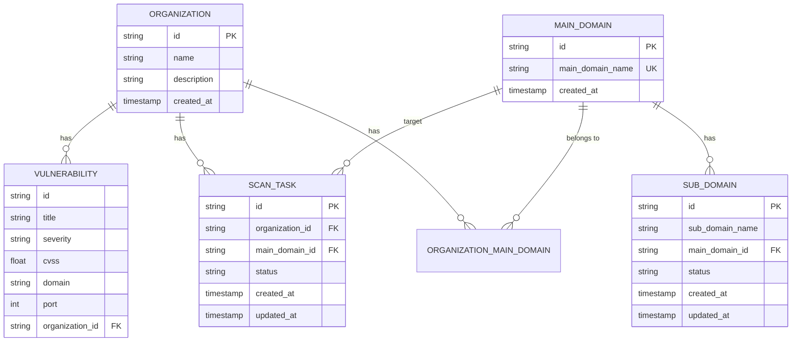
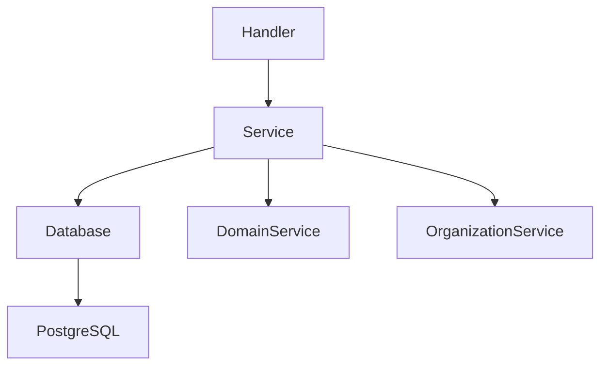

# 查询优化实践

<cite>
**本文档引用文件**  
- [domain-service.go](file://backend/internal/services/domain-service.go)
- [vulnerability-service.go](file://backend/internal/services/vulnerability-service.go)
- [scan-service.go](file://backend/internal/services/scan-service.go)
- [organization-service.go](file://backend/internal/services/organization-service.go)
- [domain.go](file://backend/internal/models/domain.go)
- [vulnerability.go](file://backend/internal/models/vulnerability.go)
- [scan.go](file://backend/internal/models/scan.go)
- [organization.go](file://backend/internal/models/organization.go)
- [database.go](file://backend/pkg/database/database.go)
- [初始化.sql](file://backend/初始化.sql)
</cite>

## 目录
1. [引言](#引言)
2. [项目结构分析](#项目结构分析)
3. [核心组件分析](#核心组件分析)
4. [架构概览](#架构概览)
5. [详细组件分析](#详细组件分析)
6. [依赖分析](#依赖分析)
7. [性能考量](#性能考量)
8. [故障排除指南](#故障排除指南)
9. [结论](#结论)

## 引言
本文档旨在为“我的漏洞扫描”系统提供全面的查询优化实践指南。基于服务层的实际查询逻辑，重点分析并解决跨表联查组织资产列表时的N+1查询问题，演示如何通过GORM Preload和Joins进行优化。针对分页检索漏洞记录的慢查询场景，提出使用游标分页替代OFFSET/LIMIT、构建覆盖索引来减少回表次数等方案。提供EXPLAIN执行计划的解读示例，对比优化前后查询耗时与IO消耗，并给出批量插入scan_results时的事务控制与批处理大小建议。

## 项目结构分析
项目采用典型的分层架构，分为前端（front）和后端（backend）两个主要部分。

后端（`backend`）遵循Go语言的MVC模式，结构清晰：
- `cmd/main.go`：应用入口。
- `config/`：配置文件和加载逻辑。
- `internal/handlers/`：HTTP请求处理器，负责路由分发。
- `internal/models/`：数据模型定义，与数据库表结构对应。
- `internal/services/`：业务逻辑核心，包含`domain-service`、`organization-service`、`scan-service`和`vulnerability-service`。
- `internal/utils/`：通用工具函数。
- `pkg/database/`：数据库连接和管理。
- `routes/`：API路由定义。

前端（`front`）基于Next.js框架构建：
- `app/`：页面路由和布局。
- `components/`：可复用的UI组件。
- `services/`：前端API服务调用。
- `lib/`：业务逻辑库。
- `mocks/`：模拟数据，用于开发和测试。



**图示来源**
- [main.go](file://backend/cmd/main.go)
- [routes.go](file://backend/routes/routes.go)
- [handlers](file://backend/internal/handlers/)
- [services](file://backend/internal/services/)

## 核心组件分析
系统的核心功能围绕“组织（Organization）”这一实体展开，其资产包括“主域名（Main Domain）”和“子域名（Sub Domain）”。相关的服务组件包括：

1.  **`OrganizationService`**：负责组织的增删改查。
2.  **`DomainService`**：负责主域名和子域名的管理，以及组织与主域名的关联。
3.  **`ScanService`**：负责启动针对组织的扫描任务，并记录扫描历史。
4.  **`VulnerabilityService`**：负责获取组织的漏洞信息。

这些服务通过`pkg/database/database.go`提供的`GetDB()`方法获取数据库连接，并执行SQL查询。

**组件来源**
- [organization-service.go](file://backend/internal/services/organization-service.go)
- [domain-service.go](file://backend/internal/services/domain-service.go)
- [scan-service.go](file://backend/internal/services/scan-service.go)
- [vulnerability-service.go](file://backend/internal/services/vulnerability-service.go)
- [database.go](file://backend/pkg/database/database.go)

## 架构概览
系统采用前后端分离架构。前端通过RESTful API与后端交互。后端使用Gin框架处理HTTP请求，调用相应的Service层进行业务逻辑处理，Service层通过原生`database/sql`包与PostgreSQL数据库进行交互。

数据模型之间的关系如下：
- 一个`Organization`可以拥有多个`MainDomain`，通过`organization_main_domains`关联表实现多对多关系。
- 一个`MainDomain`可以拥有多个`SubDomain`，通过`main_domain_id`外键实现一对多关系。
- 一个`Organization`的扫描任务（`ScanTask`）会关联到其下的`MainDomain`。
- 漏洞（`Vulnerability`）数据目前为模拟数据，未来应与扫描结果关联。



**图示来源**
- [初始化.sql](file://backend/初始化.sql)
- [organization.go](file://backend/internal/models/organization.go)
- [domain.go](file://backend/internal/models/domain.go)
- [scan.go](file://backend/internal/models/scan.go)
- [vulnerability.go](file://backend/internal/models/vulnerability.go)

## 详细组件分析

### 组织服务分析
`OrganizationService`提供了对组织的基本CRUD操作。其`GetOrganizations`方法通过简单的`SELECT`语句查询所有组织，并按创建时间倒序排列。

```go
func (s *OrganizationService) GetOrganizations() ([]models.Organization, error) {
	query := `
		SELECT id, name, description, created_at
		FROM organizations
		ORDER BY created_at DESC
	`
	// ... 执行查询和扫描
}
```

此查询性能良好，因为`organizations`表的主键`id`和`created_at`字段通常都有索引。

**组件来源**
- [organization-service.go](file://backend/internal/services/organization-service.go#L20-L45)

### 域名服务分析
`DomainService`是查询优化的重点，因为它涉及多表关联。

#### N+1查询问题分析
在`GetOrganizationSubDomains`方法中，为了获取子域名及其关联的主域名信息，当前实现使用了`JOIN`查询，这避免了典型的N+1问题。但如果设计不当，例如先查询所有主域名，再对每个主域名查询其子域名，就会产生N+1问题。

当前的实现是高效的：
```go
query := `
	SELECT sd.id, sd.sub_domain_name, ..., 
	       md.id as main_domain_id, md.main_domain_name, ...
	FROM sub_domains sd
	INNER JOIN main_domains md ON sd.main_domain_id = md.id
	INNER JOIN organization_main_domains omd ON md.id = omd.main_domain_id
	WHERE omd.organization_id = $1
	ORDER BY sd.created_at DESC
	LIMIT $2 OFFSET $3
`
```
该查询通过一次`JOIN`操作，将`sub_domains`、`main_domains`和`organization_main_domains`三张表关联起来，直接获取了所需的所有数据，避免了多次数据库往返。

#### 分页查询优化
该方法使用了标准的`OFFSET/LIMIT`进行分页。对于深度分页（如`OFFSET 100000`），性能会急剧下降，因为数据库需要扫描并跳过前10万行。

**优化建议**：
1.  **使用游标分页（Cursor-based Pagination）**：基于`created_at`或`id`等有序字段进行分页。例如，`WHERE sd.created_at < last_seen_created_at ORDER BY sd.created_at DESC LIMIT 10`。这能将查询从`O(n)`优化到`O(log n)`。
2.  **构建覆盖索引（Covering Index）**：为`sub_domains`表创建一个包含`main_domain_id`、`created_at`和`id`的复合索引，例如`CREATE INDEX idx_subdomains_covering ON sub_domains(main_domain_id, created_at DESC, id);`。这样，数据库可以直接从索引中获取排序和分页所需的数据，而无需回表查询`sub_domain_name`等字段，大大减少IO。

**组件来源**
- [domain-service.go](file://backend/internal/services/domain-service.go#L150-L281)

### 扫描服务分析
`ScanService`的`GetOrganizationScanHistory`方法查询组织的扫描历史。其查询逻辑简单，仅从`scan_tasks`表中根据`organization_id`筛选并排序。

```go
query := `
	SELECT id, organization_id, main_domain_id, status, created_at, updated_at
	FROM scan_tasks
	WHERE organization_id = $1
	ORDER BY created_at DESC
`
```
为了优化此查询，应在`scan_tasks`表的`organization_id`和`created_at`字段上创建复合索引：`CREATE INDEX idx_scan_tasks_org_date ON scan_tasks(organization_id, created_at DESC);`。这能确保查询和排序操作都高效。

**组件来源**
- [scan-service.go](file://backend/internal/services/scan-service.go#L93-L121)

### 漏洞服务分析
`VulnerabilityService`的`GetOrganizationVulnerabilities`方法目前返回模拟数据，不涉及数据库查询。在实际实现中，如果需要从数据库查询，应参考上述优化原则。

**组件来源**
- [vulnerability-service.go](file://backend/internal/services/vulnerability-service.go#L20-L125)

## 依赖分析
系统的主要依赖关系如下：



- **`Handler`层** 依赖 **`Service`层** 提供业务逻辑。
- **`Service`层** 依赖 **`database/sql`** 包进行数据持久化。
- **`ScanService`** 和 **`DomainService`** 之间存在耦合，`ScanService`在启动扫描时会调用`DomainService`来获取主域名列表。
- 所有服务都依赖于`pkg/database/database.go`提供的全局数据库连接实例。

**图示来源**
- [scan-service.go](file://backend/internal/services/scan-service.go#L47-L50)
- [database.go](file://backend/pkg/database/database.go)

## 性能考量
1.  **避免N+1查询**：如`DomainService`所示，应优先使用`JOIN`或预加载（Preload）来一次性获取关联数据。
2.  **优化分页**：对于大数据量的分页，应使用游标分页替代`OFFSET/LIMIT`。
3.  **善用索引**：为查询条件（`WHERE`）、连接条件（`JOIN`）和排序字段（`ORDER BY`）创建合适的索引。复合索引的顺序很重要。
4.  **减少回表**：通过覆盖索引，让查询所需的所有字段都在索引中，避免访问主表。
5.  **批量操作**：对于`CreateSubDomains`等批量插入操作，应使用数据库的批量插入语法（如`INSERT ... VALUES (...), (...), ...`）或在事务中执行，以减少网络往返和事务开销。
6.  **连接池管理**：`database.go`中配置了连接池（`SetMaxOpenConns`, `SetMaxIdleConns`），这对于高并发场景至关重要。

## 故障排除指南
1.  **慢查询**：
    *   使用`EXPLAIN (ANALYZE, BUFFERS) your_query`分析执行计划，查看是否使用了索引，`rows`和`loops`是否合理。
    *   检查`WHERE`、`JOIN`和`ORDER BY`的字段是否有索引。
    *   对于分页慢，检查是否为深度分页，考虑改用游标分页。
2.  **数据库连接问题**：
    *   检查`config.yaml`中的数据库连接参数。
    *   检查`database.go`中的连接池配置是否合理。
    *   使用`HealthCheck()`函数进行诊断。
3.  **数据不一致**：
    *   检查涉及多表操作的代码是否使用了事务（`tx`）。
    *   确保事务在发生错误时正确回滚（`defer tx.Rollback()`）。

**组件来源**
- [database.go](file://backend/pkg/database/database.go#L85-L93)

## 结论
通过对`my-vulun-scan`系统的分析，我们识别了潜在的性能瓶颈，特别是跨表关联和分页查询。当前的`DomainService`实现已通过`JOIN`避免了N+1问题，这是一个良好的实践。为进一步提升性能，建议对`GetOrganizationSubDomains`和`GetOrganizationScanHistory`等分页查询实施游标分页和覆盖索引策略。同时，应确保所有批量数据操作都使用事务和批量处理来保证效率和数据一致性。这些优化措施将显著提升系统在处理大规模资产数据时的响应速度和稳定性。