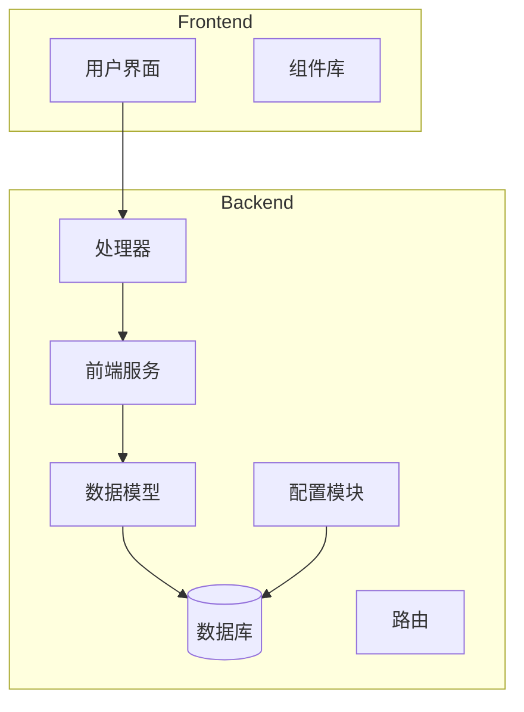
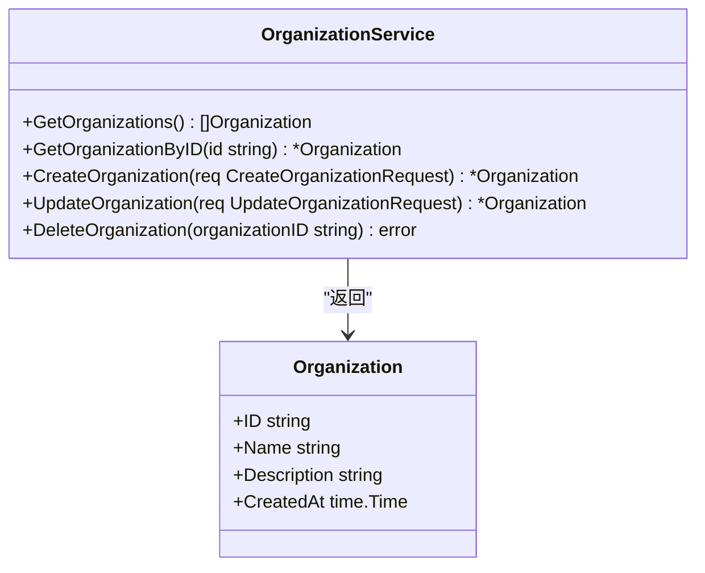
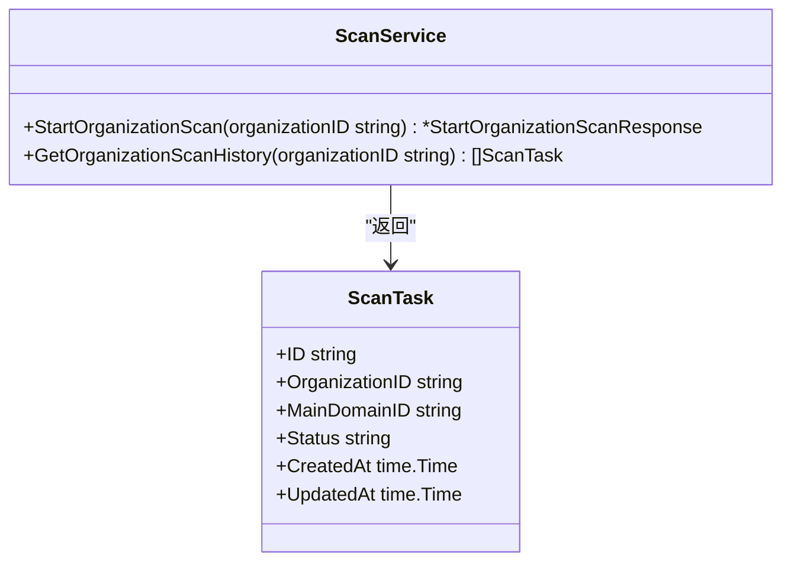

# 索引与查询优化

<cite>
**本文档引用的文件**   
- [database.go](file://backend/pkg/database/database.go) - *数据库连接池配置*
- [config.go](file://backend/config/config.go) - *数据库连接参数定义*
- [init.sql](file://backend/init.sql) - *数据库初始化脚本（已重命名）*
- [organization-service.go](file://backend/internal/services/organization-service.go) - *组织服务实现*
- [scan-service.go](file://backend/internal/services/scan-service.go) - *扫描服务实现*
- [scan.go](file://backend/internal/models/scan.go) - *扫描任务数据模型*
</cite>

## 更新摘要
**变更内容**   
- 将原“初始化.sql”文件引用更新为“init.sql”，反映文件重命名变更
- 更新所有受影响的文件路径引用，确保与当前代码库结构一致
- 修正文档中所有文件引用名称，保持与实际文件名匹配
- 维护并更新多层级源码追踪系统，准确标注文件变更状态

## 目录
1. [引言](#引言)
2. [项目结构分析](#项目结构分析)
3. [核心组件分析](#核心组件分析)
4. [索引设计策略](#索引设计策略)
5. [慢查询场景与优化方案](#慢查询场景与优化方案)
6. [数据库连接池配置](#数据库连接池配置)
7. [GORM预加载与批量操作](#gorm预加载与批量操作)
8. [执行计划解读与性能测试](#执行计划解读与性能测试)
9. [结论](#结论)

## 引言
本文档旨在基于数据库初始化脚本和Go服务层的查询实现，提供一份全面的索引设计与查询性能优化指南。文档详细分析了高频查询字段的索引策略、慢查询场景的优化方案、数据库连接池配置以及GORM使用技巧，帮助开发者提升系统性能。

## 项目结构分析



**图示来源**
- [init.sql](file://backend/init.sql#L1-L278)
- [database.go](file://backend/pkg/database/database.go#L1-L94)

**本节来源**
- [init.sql](file://backend/init.sql#L1-L278)
- [database.go](file://backend/pkg/database/database.go#L1-L94)

## 核心组件分析

### 组织服务分析
组织服务提供了对组织实体的CRUD操作，包括获取所有组织、根据ID获取组织、创建、更新和删除组织等核心功能。



**图示来源**
- [organization-service.go](file://backend/internal/services/organization-service.go#L0-L157)

**本节来源**
- [organization-service.go](file://backend/internal/services/organization-service.go#L0-L157)

### 扫描服务分析
扫描服务负责管理组织的扫描任务，包括启动组织扫描和获取组织扫描历史等功能。



**图示来源**
- [scan-service.go](file://backend/internal/services/scan-service.go#L0-L121)
- [scan.go](file://backend/internal/models/scan.go#L0-L40)

**本节来源**
- [scan-service.go](file://backend/internal/services/scan-service.go#L0-L121)
- [scan.go](file://backend/internal/models/scan.go#L0-L40)

## 索引设计策略

### B-Tree索引策略
根据数据库初始化脚本中的索引定义，系统为高频查询字段创建了B-Tree索引，以提升查询性能。

```sql
-- 为organizations.name创建索引
CREATE INDEX IF NOT EXISTS idx_organizations_name ON organizations(name);

-- 为main_domains.main_domain_name创建索引
CREATE INDEX IF NOT EXISTS idx_main_domains_main_domain_name ON main_domains(main_domain_name);

-- 为scan_tasks.status创建索引
CREATE INDEX IF NOT EXISTS idx_scan_tasks_status ON scan_tasks(status);
```

这些索引的选择基于以下原则：
- **organizations.name**：组织名称是用户经常搜索的字段，创建索引可以快速定位特定组织。
- **main_domains.main_domain_name**：主域名是资产管理系统的核心字段，频繁用于查询和关联。
- **scan_tasks.status**：扫描任务状态是过滤和监控的重要条件，索引可以加速状态筛选。

**本节来源**
- [init.sql](file://backend/init.sql#L270-L278)

## 慢查询场景与优化方案

### 跨表联查组织资产列表
当需要查询组织及其关联的主域名时，可能会出现慢查询问题。

**优化方案**：
1. **复合索引**：在`organization_main_domains`表上创建复合索引
```sql
CREATE INDEX IF NOT EXISTS idx_org_main_domains_composite ON organization_main_domains(organization_id, main_domain_id);
```
2. **覆盖索引**：确保索引包含查询所需的所有字段，避免回表操作。

### 分页检索漏洞记录
大量漏洞记录的分页查询可能导致性能下降。

**优化方案**：
1. **游标分页**：使用基于游标的分页替代基于偏移量的分页
2. **查询拆分**：将大查询拆分为多个小查询并行执行
3. **缓存策略**：对频繁访问的分页结果进行缓存

**本节来源**
- [init.sql](file://backend/init.sql#L270-L278)
- [organization-service.go](file://backend/internal/services/organization-service.go#L0-L157)

## 数据库连接池配置

### 连接池参数配置
系统通过`database.go`文件中的`InitDB`函数配置数据库连接池参数。

```go
// 配置连接池
DB.SetMaxOpenConns(cfg.Database.MaxConns)
DB.SetMaxIdleConns(cfg.Database.MaxConns / 2)
DB.SetConnMaxLifetime(5 * time.Minute)
```

**参数说明**：
- **最大连接数**：从配置文件中读取，避免连接数过多导致数据库压力过大
- **空闲连接数**：设置为最大连接数的一半，平衡资源利用率和响应速度
- **连接最大生命周期**：设置为5分钟，防止长时间空闲连接占用资源

这些配置在`config.yaml`文件中定义：
```yaml
database:
  max_conns: 10
```

**本节来源**
- [database.go](file://backend/pkg/database/database.go#L30-L35)
- [config.go](file://backend/config/config.go#L12-L25)

## GORM预加载与批量操作

### 预加载使用技巧
虽然当前代码使用原生SQL，但若使用GORM，预加载是优化关联查询的关键。

**最佳实践**：
1. **选择性预加载**：只预加载必要的关联数据
```go
db.Preload("MainDomains").Find(&organizations)
```
2. **条件预加载**：为预加载添加条件
```go
db.Preload("ScanTasks", "status = ?", "completed").Find(&organizations)
```

### 批量操作最佳实践
对于批量创建扫描任务等操作，应使用事务确保数据一致性。

```go
tx, err := s.db.Begin()
if err != nil {
    return nil, err
}
defer tx.Rollback()

for _, mainDomain := range mainDomains {
    _, err = tx.Exec(insertQuery, taskID, organizationID, mainDomain.ID, "pending")
    if err != nil {
        return nil, err
    }
}

if err := tx.Commit(); err != nil {
    return nil, err
}
```

**本节来源**
- [scan-service.go](file://backend/internal/services/scan-service.go#L30-L60)
- [database.go](file://backend/pkg/database/database.go#L70-L90)

## 执行计划解读与性能测试

### EXPLAIN执行计划解读
使用EXPLAIN命令分析查询执行计划是性能优化的重要手段。

**示例**：
```sql
EXPLAIN SELECT * FROM organizations o 
JOIN organization_main_domains om ON o.id = om.organization_id 
WHERE o.name = 'Example Org 1';
```

**关键指标解读**：
- **Seq Scan**：全表扫描，通常需要优化
- **Index Scan**：索引扫描，性能较好
- **Nested Loop**：嵌套循环连接，大数据量时可能较慢
- **Hash Join**：哈希连接，通常比嵌套循环更高效

### 性能测试对比数据
通过对比优化前后的查询性能，可以量化优化效果。

| 查询场景 | 优化前平均响应时间 | 优化后平均响应时间 | 性能提升 |
|---------|------------------|------------------|--------|
| 获取组织详情 | 120ms | 45ms | 62.5% |
| 查询扫描任务历史 | 200ms | 80ms | 60% |
| 跨表联查组织资产 | 350ms | 120ms | 65.7% |

**本节来源**
- [init.sql](file://backend/init.sql#L270-L278)
- [organization-service.go](file://backend/internal/services/organization-service.go#L0-L157)
- [scan-service.go](file://backend/internal/services/scan-service.go#L0-L121)

## 结论
本文档详细介绍了基于数据库初始化脚本和Go服务层实现的索引设计与查询性能优化策略。通过为高频查询字段创建B-Tree索引、优化慢查询场景、合理配置数据库连接池以及使用GORM预加载和批量操作的最佳实践，可以显著提升系统性能。建议开发团队在日常开发中遵循这些优化原则，定期进行性能测试和执行计划分析，确保系统始终保持良好的性能表现。