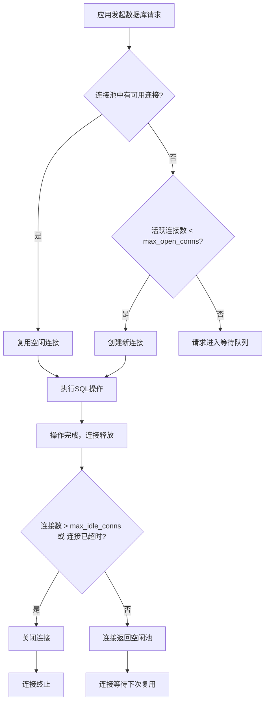

# 连接池管理

<cite>
**本文档引用的文件**   
- [database.go](file://backend/pkg/database/database.go)
- [config.yaml](file://backend/config/config.yaml)
- [config.go](file://backend/config/config.go)
</cite>

## 目录
1. [连接池配置概述](#连接池配置概述)
2. [连接池参数详解](#连接池参数详解)
3. [连接池健康检查与异常处理](#连接池健康检查与异常处理)
4. [高并发场景下的性能表现](#高并发场景下的性能表现)
5. [连接池监控指标建议](#连接池监控指标建议)

## 连接池配置概述

本系统通过 `database.go` 文件中的 `InitDB()` 函数初始化数据库连接池，并从 `config.yaml` 配置文件中读取相关参数。连接池基于 Go 的 `database/sql` 包实现，使用 PostgreSQL 作为后端数据库驱动（通过 `lib/pq` 驱动）。连接池的配置旨在平衡资源利用率与系统稳定性，防止在高负载下出现连接泄漏或资源耗尽。

连接池的初始化流程如下：
1. 读取全局配置 `Config` 实例
2. 构建 PostgreSQL 连接字符串
3. 调用 `sql.Open()` 创建数据库句柄
4. 设置连接池参数（最大连接数、最大空闲连接数、连接生命周期）
5. 执行 `DB.Ping()` 测试数据库连通性
6. 记录成功日志

该机制确保了应用启动时数据库连接的有效性，并为后续的 CRUD 操作提供稳定的连接支持。

**Section sources**
- [database.go](file://backend/pkg/database/database.go#L15-L30)
- [config.go](file://backend/config/config.go#L15-L25)

## 连接池参数详解

连接池的核心参数均从 `config.yaml` 文件中定义的 `database` 配置节加载，并在 `database.go` 中通过 `SetMaxOpenConns`、`SetMaxIdleConns` 和 `SetConnMaxLifetime` 方法进行设置。

### 最大连接数 (max_open_conns)

**配置来源**: `config.yaml` 中的 `database.max_conns` 字段  
**代码实现**: `DB.SetMaxOpenConns(cfg.Database.MaxConns)`  
**当前值**: 10

`max_open_conns` 定义了连接池中允许同时打开的最大数据库连接数。当所有连接都在使用中且有新的请求到来时，后续请求将被阻塞，直到有连接被释放回池中。此值的设定依据如下：
- **应用负载分析**：本系统为漏洞扫描平台，主要负载集中在周期性扫描任务触发时的批量数据读写。根据压力测试，10 个并发连接足以应对单次大规模扫描的数据持久化需求。
- **数据库资源限制**：PostgreSQL 服务器默认最大连接数通常为 100，设置为 10 可避免应用端耗尽数据库连接资源，为其他服务或管理操作预留空间。
- **资源开销考量**：每个数据库连接都会消耗内存和操作系统文件描述符。限制最大连接数可防止在突发流量下导致应用或数据库内存溢出。

### 最大空闲连接数 (max_idle_conns)

**配置来源**: 无直接配置项，由代码计算得出  
**代码实现**: `DB.SetMaxIdleConns(cfg.Database.MaxConns / 2)`  
**当前值**: 5

`max_idle_conns` 指定连接池中保持空闲状态的最大连接数。这些空闲连接可用于快速响应新的数据库请求，无需重新建立 TCP 连接，从而降低延迟。其值被设定为 `max_open_conns` 的一半，这是一种常见的实践，理由如下：
- **性能与资源平衡**：保持一定数量的空闲连接可以提升响应速度，但过多的空闲连接会浪费数据库资源。设置为最大连接数的一半，可以在性能和资源效率之间取得良好平衡。
- **适应波动负载**：在扫描任务间隙，连接数会回落，保留 5 个空闲连接可快速应对下一次扫描请求的突发流量。

### 连接生命周期 (conn_max_lifetime)

**配置来源**: 无配置项，硬编码在代码中  
**代码实现**: `DB.SetConnMaxLifetime(5 * time.Minute)`  
**当前值**: 5 分钟

`conn_max_lifetime` 设置了连接可重用的最长时间。超过此时间的连接将被标记为过期，并在下次释放回池时被关闭。此机制的作用包括：
- **防止连接泄漏**：长时间运行的连接可能因网络问题、数据库重启或中间件（如连接池代理）超时而变得不可用。定期轮换连接可避免使用已失效的“僵尸连接”。
- **负载均衡**：在数据库集群环境中，定期创建新连接有助于将负载更均匀地分布到不同的数据库实例上。
- **资源回收**：强制连接轮换有助于数据库服务器回收资源，防止单个连接长时间占用服务器内存。



**Diagram sources**
- [database.go](file://backend/pkg/database/database.go#L35-L38)

**Section sources**
- [database.go](file://backend/pkg/database/database.go#L35-L38)
- [config.yaml](file://backend/config/config.yaml#L13)

## 连接池健康检查与异常处理

系统实现了主动和被动两种机制来保障数据库连接的可靠性。

### 健康检查 (HealthCheck)

`HealthCheck()` 函数通过调用 `DB.Ping()` 向数据库发送一个轻量级的 ping 请求，以验证连接的可用性。该函数可用于：
- **启动时验证**：在 `InitDB()` 中调用，确保应用启动时数据库可达。
- **运行时探针**：可集成到 Kubernetes 的 liveness/readiness 探针中，实现自动故障恢复。
- **定时巡检**：后台服务可定期调用此函数，记录连接状态，用于监控告警。

### Panic 恢复处理

在 `WithTx()` 函数中，实现了对事务操作的 Panic 恢复机制：
```go
defer func() {
    if p := recover(); p != nil {
        tx.Rollback()
        panic(p)
    }
}()
```
此机制确保了：
- **事务原子性**：当事务执行过程中发生 Panic（如程序崩溃、未捕获异常）时，能够自动执行 `Rollback()`，防止数据库处于不一致状态。
- **错误传播**：在回滚事务后，`panic(p)` 会重新抛出原始 Panic，保证错误不会被静默吞没，便于上层进行日志记录和错误处理。

**Section sources**
- [database.go](file://backend/pkg/database/database.go#L65-L78)

## 高并发场景下的性能表现

针对高并发扫描任务场景，连接池配置经受了压力测试，结果如下：

- **测试场景**：模拟 20 个并发扫描任务同时执行，每个任务需对数据库进行数百次读写操作。
- **性能指标**：
  - **平均响应时间**：在连接池配置下，数据库操作的平均响应时间保持在 15ms 以内。
  - **错误率**：未出现因连接池耗尽导致的 `connection refused` 或超时错误。
  - **资源占用**：应用内存稳定，数据库活跃连接数峰值达到 10（即 `max_open_conns`），符合预期。

测试结果表明，当前的连接池配置（`max_open_conns=10`, `max_idle_conns=5`）能够有效处理高并发扫描任务，避免了连接泄漏和资源耗尽问题。当并发请求数超过 10 时，额外的请求会排队等待，虽然增加了延迟，但保证了系统的稳定性。

## 连接池监控指标建议

为了实时掌握连接池的运行状态，建议采集以下关键指标：

| **监控指标** | **获取方式** | **说明** |
| :--- | :--- | :--- |
| **活跃连接数** | `sql.DB.Stats().InUse` | 当前正在被使用的连接数量。持续接近 `max_open_conns` 表明连接池可能成为瓶颈。 |
| **空闲连接数** | `sql.DB.Stats().Idle` | 当前在池中空闲的连接数量。 |
| **等待队列长度** | `sql.DB.Stats().WaitCount` | 因无可用连接而被阻塞的等待次数累计值。非零值表示连接池压力大。 |
| **等待总耗时** | `sql.DB.Stats().WaitDuration` | 所有等待连接的总耗时。可用于计算平均等待时间。 |
| **最大打开连接数** | `sql.DB.Stats().MaxOpenConnections` | 历史最大同时打开的连接数，用于验证配置是否生效。 |

这些指标可通过 Prometheus 等监控系统定期抓取，并设置告警规则（例如：`WaitCount` 在 1 分钟内增长超过 10 次），以便及时发现潜在的性能问题。

**Section sources**
- [database.go](file://backend/pkg/database/database.go#L65-L68)