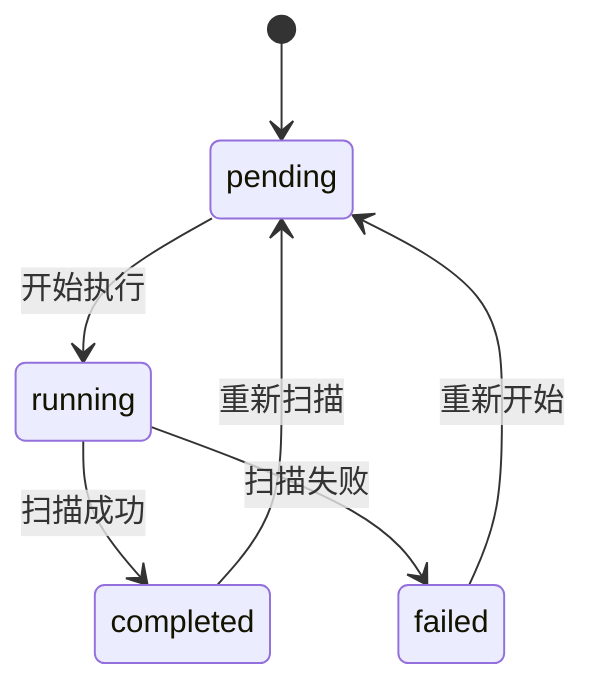

# 扫描任务表

<cite>
**本文档中引用的文件**   
- [scan.go](file://backend/internal/models/scan.go)
- [初始化.sql](file://backend/初始化.sql)
- [scan-service.go](file://backend/internal/services/scan-service.go)
- [scan-handler.go](file://backend/internal/handlers/scan-handler.go)
- [routes.go](file://backend/routes/routes.go)
</cite>

## 目录
1. [扫描任务表](#扫描任务表)
2. [字段定义](#字段定义)
3. [GORM模型映射](#gorm模型映射)
4. [状态机与扫描流程](#状态机与扫描流程)
5. [索引优化与查询性能](#索引优化与查询性能)
6. [实际查询示例](#实际查询示例)

## 字段定义

根据数据库初始化脚本和Go模型定义，`scan_tasks`表包含以下字段：

**表结构字段**
- **id**: 主键，UUID类型，唯一标识每个扫描任务
- **organization_id**: 外键，UUID类型，关联`organizations`表，标识任务所属组织
- **main_domain_id**: 外键，UUID类型，关联`main_domains`表，标识任务扫描的主域名
- **status**: 字符串类型，枚举值，表示任务当前状态
- **created_at**: 时间戳类型，记录任务创建时间
- **updated_at**: 时间戳类型，记录任务最后更新时间

**状态枚举值**
- `pending`: 等待中，任务已创建但尚未开始执行
- `running`: 进行中，任务正在执行扫描
- `completed`: 已完成，任务成功执行完毕
- `failed`: 失败，任务执行过程中发生错误

**Section sources**
- [初始化.sql](file://backend/初始化.sql#L233-L240)
- [scan.go](file://backend/internal/models/scan.go#L8-L14)

## GORM模型映射

`ScanTask`结构体通过GORM标签实现了与数据库字段的精确映射，确保了Go应用与数据库之间的无缝交互。

```go
// ScanTask 扫描任务模型
type ScanTask struct {
	ID             string    `json:"id" db:"id"`
	OrganizationID string    `json:"organization_id" db:"organization_id"`
	MainDomainID   string    `json:"main_domain_id" db:"main_domain_id"`
	Status         string    `json:"status" db:"status"`
	CreatedAt      time.Time `json:"created_at" db:"created_at"`
	UpdatedAt      time.Time `json:"updated_at" db:"updated_at"`
}
```

**GORM标签映射说明**
- `json:"field_name"`: 控制结构体序列化为JSON时的字段名称
- `db:"column_name"`: 指定结构体字段对应的数据库列名
- 双标签设计实现了API响应格式与数据库存储格式的分离

**映射关系表**
| 结构体字段 | JSON字段 | 数据库列名 | 数据类型 |
| :--- | :--- | :--- | :--- |
| ID | id | id | string (UUID) |
| OrganizationID | organization_id | organization_id | string (UUID) |
| MainDomainID | main_domain_id | main_domain_id | string (UUID) |
| Status | status | status | string |
| CreatedAt | created_at | created_at | time.Time |
| UpdatedAt | updated_at | updated_at | time.Time |

**Section sources**
- [scan.go](file://backend/internal/models/scan.go#L8-L14)

## 状态机与扫描流程

`status`字段作为核心状态机，驱动整个扫描任务的生命周期管理，确保任务状态转换的清晰和可控。



**状态转换逻辑**
1. **创建任务**: 新任务默认状态为`pending`
2. **启动扫描**: 服务将`pending`状态的任务更新为`running`
3. **完成扫描**: 扫描成功后，状态更新为`completed`
4. **扫描失败**: 发生错误时，状态更新为`failed`
5. **重新扫描**: `completed`或`failed`的任务可被重置回`pending`状态

**状态机优势**
- **流程控制**: 明确的任务执行流程，防止状态混乱
- **错误处理**: `failed`状态便于追踪和分析失败任务
- **重试机制**: 支持对失败或已完成任务进行重新扫描
- **监控可视化**: 前端可根据状态显示不同图标和颜色

**Section sources**
- [scan.go](file://backend/internal/models/scan.go#L12)
- [scan-service.go](file://backend/internal/services/scan-service.go#L63)

## 索引优化与查询性能

为了优化按组织和状态查询任务列表的性能，数据库创建了复合索引和单列索引。

```sql
-- 创建索引以提高查询性能
CREATE INDEX IF NOT EXISTS idx_scan_tasks_org_id ON scan_tasks(organization_id);
CREATE INDEX IF NOT EXISTS idx_scan_tasks_domain_id ON scan_tasks(main_domain_id);
CREATE INDEX IF NOT EXISTS idx_scan_tasks_status ON scan_tasks(status);
```

**索引策略分析**
- **单列索引**: `idx_scan_tasks_org_id` 和 `idx_scan_tasks_status` 分别优化按组织ID和状态的查询
- **复合索引**: 虽然当前为单列索引，但可优化为 `(organization_id, status)` 复合索引
- **查询优化**: 索引使 `WHERE organization_id = ? AND status = ?` 类查询达到 O(log n) 时间复杂度

**查询性能对比**
| 查询类型 | 无索引 | 有索引 |
| :--- | :--- | :--- |
| 按组织ID查询 | O(n) 全表扫描 | O(log n) 索引查找 |
| 按状态查询 | O(n) 全表扫描 | O(log n) 索引查找 |
| 按组织和状态查询 | O(n) 全表扫描 | O(log n) 索引查找 |

**Section sources**
- [初始化.sql](file://backend/初始化.sql#L253-L255)

## 实际查询示例

以下是任务创建、状态更新和批量查询的SQL和Golang代码示例。

### SQL查询示例

```sql
-- 创建新扫描任务
INSERT INTO scan_tasks (id, organization_id, main_domain_id, status, created_at, updated_at)
VALUES ('task-001', 'org-001', 'domain-001', 'pending', NOW(), NOW());

-- 更新任务状态
UPDATE scan_tasks 
SET status = 'running', updated_at = NOW() 
WHERE id = 'task-001';

-- 按组织和状态查询任务列表
SELECT id, organization_id, main_domain_id, status, created_at, updated_at
FROM scan_tasks
WHERE organization_id = 'org-001' AND status = 'completed'
ORDER BY created_at DESC;
```

### Golang查询代码片段

```go
// 创建扫描任务
func (s *ScanService) StartOrganizationScan(organizationID string) (*models.StartOrganizationScanResponse, error) {
    // ... 获取主域名逻辑 ...
    
    tx, err := s.db.Begin()
    if err != nil {
        return nil, err
    }
    defer tx.Rollback()

    var taskIDs []string
    for _, mainDomain := range mainDomains {
        taskID := uuid.New().String()
        insertQuery := `
            INSERT INTO scan_tasks (id, organization_id, main_domain_id, status, created_at, updated_at)
            VALUES ($1, $2, $3, $4, NOW(), NOW())
        `
        _, err = tx.Exec(insertQuery, taskID, organizationID, mainDomain.ID, "pending")
        if err != nil {
            return nil, err
        }
        taskIDs = append(taskIDs, taskID)
    }

    if err := tx.Commit(); err != nil {
        return nil, err
    }

    // ... 构建响应 ...
}

// 查询组织扫描历史
func (s *ScanService) GetOrganizationScanHistory(organizationID string) ([]models.ScanTask, error) {
    query := `
        SELECT id, organization_id, main_domain_id, status, created_at, updated_at
        FROM scan_tasks
        WHERE organization_id = $1
        ORDER BY created_at DESC
    `

    rows, err := s.db.Query(query, organizationID)
    if err != nil {
        return nil, err
    }
    defer rows.Close()

    var scanTasks []models.ScanTask
    for rows.Next() {
        var task models.ScanTask
        err := rows.Scan(
            &task.ID, &task.OrganizationID, &task.MainDomainID, &task.Status,
            &task.CreatedAt, &task.UpdatedAt,
        )
        if err != nil {
            return nil, err
        }
        scanTasks = append(scanTasks, task)
    }

    return scanTasks, nil
}
```

**Section sources**
- [scan-service.go](file://backend/internal/services/scan-service.go#L47-L121)
- [初始化.sql](file://backend/初始化.sql#L233-L240)