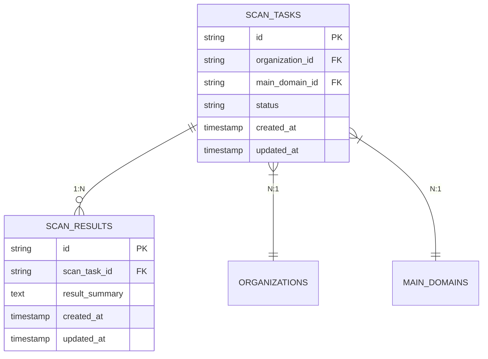
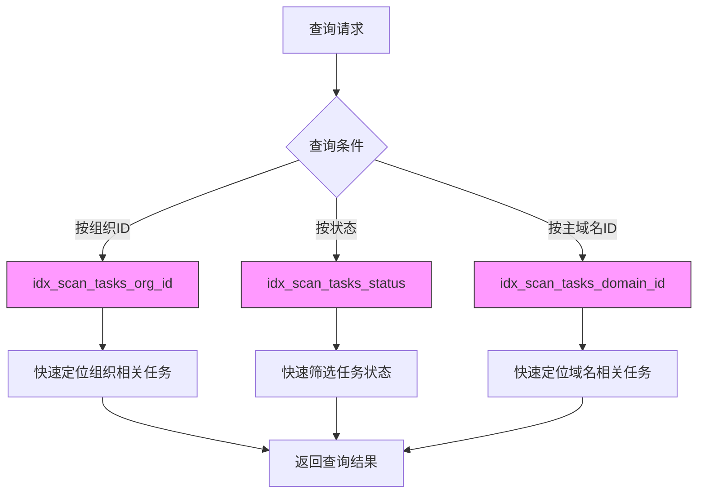

# 扫描相关表

<cite>
**本文档中引用的文件**   
- [scan.go](file://backend/internal/models/scan.go)
- [初始化.sql](file://backend/初始化.sql)
- [scan-service.go](file://backend/internal/services/scan-service.go)
- [scan-handler.go](file://backend/internal/handlers/scan-handler.go)
</cite>

## 目录
1. [扫描任务表 (scan_tasks)](#扫描任务表-scan_tasks)
2. [扫描结果表 (scan_results)](#扫描结果表-scan_results)
3. [Golang结构体映射](#golang结构体映射)
4. [时间戳字段分析](#时间戳字段分析)
5. [复合索引与查询性能](#复合索引与查询性能)

## 扫描任务表 (scan_tasks)

**scan_tasks** 表是系统中用于管理扫描任务的核心数据表，存储了所有扫描任务的元数据和状态信息。该表通过外键与组织表和主域名表建立关联，实现了任务与资产的绑定。

### 表结构与字段说明

```sql
CREATE TABLE scan_tasks (
    id UUID PRIMARY KEY DEFAULT gen_random_uuid(),
    organization_id UUID NOT NULL REFERENCES organizations(id) ON DELETE CASCADE,
    main_domain_id UUID NOT NULL REFERENCES main_domains(id) ON DELETE CASCADE,
    status VARCHAR(50) NOT NULL DEFAULT 'pending',
    created_at TIMESTAMP WITH TIME ZONE NOT NULL,
    updated_at TIMESTAMP WITH TIME ZONE NOT NULL
);
```

- **id**: 任务唯一标识符，使用UUID生成，作为主键
- **organization_id**: 组织ID外键，关联到 `organizations` 表，标识该扫描任务所属的组织
- **main_domain_id**: 主域名ID外键，关联到 `main_domains` 表，标识该扫描任务针对的主域名
- **status**: 任务状态字段，存储任务的当前状态
- **created_at**: 任务创建时间戳
- **updated_at**: 任务最后更新时间戳

### 组织ID与主域名ID外键关联

**scan_tasks** 表通过 `organization_id` 和 `main_domain_id` 两个外键字段与系统其他核心表建立关联：

- `organization_id` 字段引用 `organizations` 表的 `id` 字段，实现任务与组织的关联。当组织被删除时，其所有扫描任务也会被级联删除（ON DELETE CASCADE）
- `main_domain_id` 字段引用 `main_domains` 表的 `id` 字段，实现任务与主域名的关联。当主域名被删除时，相关的扫描任务也会被级联删除

这种设计确保了数据的一致性和完整性，同时也支持了按组织或按域名查询扫描任务的功能。

### Status字段状态机设计

**status** 字段实现了扫描任务的完整状态机，定义了任务的生命周期。根据数据库初始化脚本和前端代码中的状态过滤器，该字段支持以下状态值：

- **pending (等待中)**: 任务已创建但尚未开始执行
- **running (进行中)**: 任务正在执行扫描
- **completed (已完成)**: 任务成功完成扫描
- **failed (失败)**: 任务执行过程中发生错误

状态机的转换流程如下：
1. 任务创建时，状态默认为 **pending**
2. 当扫描服务开始执行任务时，状态更新为 **running**
3. 任务成功完成后，状态更新为 **completed**
4. 任务执行失败时，状态更新为 **failed**

这种状态机设计使得系统能够清晰地跟踪每个扫描任务的生命周期，并为用户提供直观的任务状态展示。

**Section sources**
- [初始化.sql](file://backend/初始化.sql#L48-L54)
- [scan.go](file://backend/internal/models/scan.go#L8-L14)
- [scan-service.go](file://backend/internal/services/scan-service.go#L38-L41)
- [scan-overview.tsx](file://front/components/pages/scan/overview/scan-overview.tsx#L332-L340)

## 扫描结果表 (scan_results)

**scan_results** 表用于存储扫描任务的执行结果，与扫描任务表形成一对一或一对多的关系。

### 表结构与字段说明

```sql
CREATE TABLE scan_results (
    id UUID PRIMARY KEY DEFAULT gen_random_uuid(),
    scan_task_id UUID NOT NULL REFERENCES scan_tasks(id) ON DELETE CASCADE,
    result_summary TEXT,
    created_at TIMESTAMP WITH TIME ZONE NOT NULL,
    updated_at TIMESTAMP WITH TIME ZONE NOT NULL
);
```

- **id**: 结果唯一标识符，使用UUID生成，作为主键
- **scan_task_id**: 扫描任务ID外键，关联到 `scan_tasks` 表，标识该结果所属的扫描任务
- **result_summary**: 结果摘要文本字段，存储扫描结果的摘要信息
- **created_at**: 结果创建时间戳
- **updated_at**: 结果最后更新时间戳

### 与扫描任务的关系

**scan_results** 表与 **scan_tasks** 表之间存在明确的关联关系：

- 通过 `scan_task_id` 外键字段与 `scan_tasks` 表的 `id` 字段建立关联
- 关系类型为 **一对多**，即一个扫描任务可以有多个扫描结果。这为系统未来的扩展提供了灵活性，例如支持分阶段扫描或不同类型的扫描结果
- 当扫描任务被删除时，其所有相关结果也会被级联删除（ON DELETE CASCADE）

### Result_summary文本字段存储策略

**result_summary** 字段采用 `TEXT` 数据类型，这种设计具有以下优势：

- **存储容量大**: TEXT类型可以存储大量文本数据，适合存储详细的扫描结果摘要
- **灵活性高**: 可以存储结构化或非结构化的文本内容，如JSON格式的摘要、纯文本报告等
- **性能优化**: 对于不需要全文搜索的场景，TEXT字段的查询性能良好

根据数据库初始化脚本中的示例数据，该字段通常存储类似"Found 6 subdomains for example1.com and 2 open ports."这样的摘要信息，为用户提供快速的任务结果概览。

**Section sources**
- [初始化.sql](file://backend/初始化.sql#L56-L62)
- [scan.go](file://backend/internal/models/scan.go#L16-L22)

## Golang结构体映射

在Golang代码中，数据库表通过结构体进行映射，实现了ORM（对象关系映射）模式。

### ScanTask结构体

```go
// ScanTask 扫描任务模型
type ScanTask struct {
	ID             string    `json:"id" db:"id"`
	OrganizationID string    `json:"organization_id" db:"organization_id"`
	MainDomainID   string    `json:"main_domain_id" db:"main_domain_id"`
	Status         string    `json:"status" db:"status"`
	CreatedAt      time.Time `json:"created_at" db:"created_at"`
	UpdatedAt      time.Time `json:"updated_at" db:"updated_at"`
}
```

该结构体与 **scan_tasks** 表完全对应，通过 `db` 标签将结构体字段映射到数据库列名。`json` 标签则用于API序列化，确保前后端数据交互的一致性。

### ScanResult结构体

```go
// ScanResult 扫描结果模型
type ScanResult struct {
	ID            string    `json:"id" db:"id"`
	ScanTaskID    string    `json:"scan_task_id" db:"scan_task_id"`
	ResultSummary string    `json:"result_summary" db:"result_summary"`
	CreatedAt     time.Time `json:"created_at" db:"created_at"`
	UpdatedAt     time.Time `json:"updated_at" db:"updated_at"`
}
```

该结构体与 **scan_results** 表对应，同样使用 `db` 和 `json` 标签进行字段映射。

### 结构体与数据库的对应关系图



**Diagram sources**
- [scan.go](file://backend/internal/models/scan.go#L8-L22)
- [初始化.sql](file://backend/初始化.sql#L48-L62)

**Section sources**
- [scan.go](file://backend/internal/models/scan.go#L8-L22)

## 时间戳字段分析

**created_at** 和 **updated_at** 是两个关键的时间戳字段，在任务生命周期追踪中发挥着重要作用。

### 字段作用

- **created_at**: 记录任务或结果的创建时间，用于确定资源的生命周期起点
- **updated_at**: 记录任务或结果的最后更新时间，用于跟踪状态变化和活动情况

### 在任务生命周期追踪中的作用

这两个时间戳字段为系统提供了以下功能：

1. **生命周期监控**: 通过比较 `created_at` 和 `updated_at`，可以计算任务的执行时长和响应时间
2. **状态变更追踪**: 每次任务状态变化时更新 `updated_at`，可以精确记录状态变更的时间点
3. **数据排序**: 支持按创建时间或更新时间对任务进行排序，便于用户查看最新的任务
4. **性能分析**: 通过时间戳可以分析任务的平均执行时间、等待时间等性能指标

在数据库初始化脚本中，这些字段的值都设置为 `NOW()`，确保了时间戳的准确性和一致性。

**Section sources**
- [初始化.sql](file://backend/初始化.sql#L52-L53)
- [scan.go](file://backend/internal/models/scan.go#L13-L14)

## 复合索引与查询性能

为优化查询性能，系统为 **scan_tasks** 表建立了多个复合索引。

### 现有索引分析

根据数据库初始化脚本，系统创建了以下索引：

```sql
CREATE INDEX IF NOT EXISTS idx_scan_tasks_org_id ON scan_tasks(organization_id);
CREATE INDEX IF NOT EXISTS idx_scan_tasks_domain_id ON scan_tasks(main_domain_id);
CREATE INDEX IF NOT EXISTS idx_scan_tasks_status ON scan_tasks(status);
```

### 查询性能优化效果

这些索引对查询性能的优化效果体现在以下几个方面：

1. **按组织ID查询**: `idx_scan_tasks_org_id` 索引显著提升了按组织查询扫描任务的性能，支持了 `GetOrganizationScanHistory` 服务方法的高效执行
2. **按状态查询**: `idx_scan_tasks_status` 索引优化了按状态筛选任务的查询，支持了前端界面中的状态过滤功能
3. **组合查询**: 虽然当前没有创建复合索引，但单字段索引的组合使用仍然能够有效提升多条件查询的性能

### 索引优化建议

根据查询模式分析，建议考虑创建以下复合索引以进一步优化性能：

```sql
-- 按组织和状态查询的复合索引
CREATE INDEX IF NOT EXISTS idx_scan_tasks_org_status ON scan_tasks(organization_id, status);

-- 按组织和创建时间查询的复合索引（支持按时间排序）
CREATE INDEX IF NOT EXISTS idx_scan_tasks_org_created ON scan_tasks(organization_id, created_at DESC);
```

这些复合索引将特别有利于组织扫描历史查询等常见操作，进一步提升系统响应速度。



**Diagram sources**
- [初始化.sql](file://backend/初始化.sql#L100-L102)
- [scan-service.go](file://backend/internal/services/scan-service.go#L75-L85)

**Section sources**
- [初始化.sql](file://backend/初始化.sql#L100-L102)
- [scan-service.go](file://backend/internal/services/scan-service.go#L75-L85)