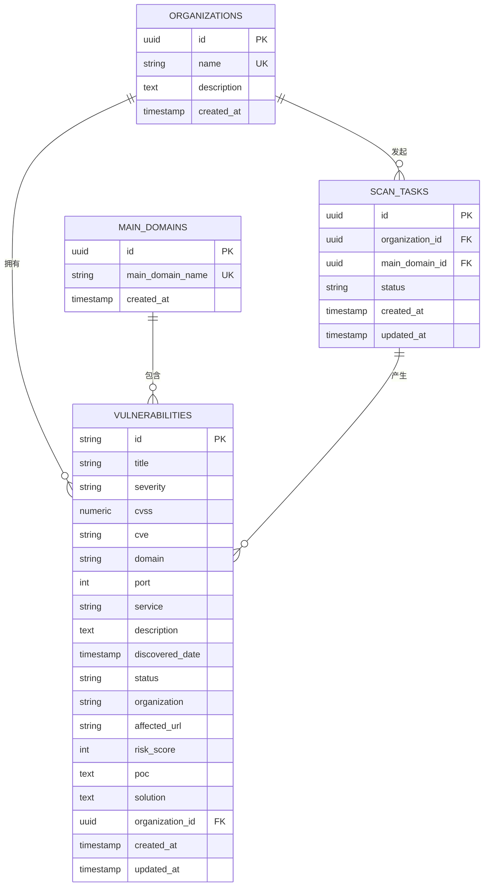
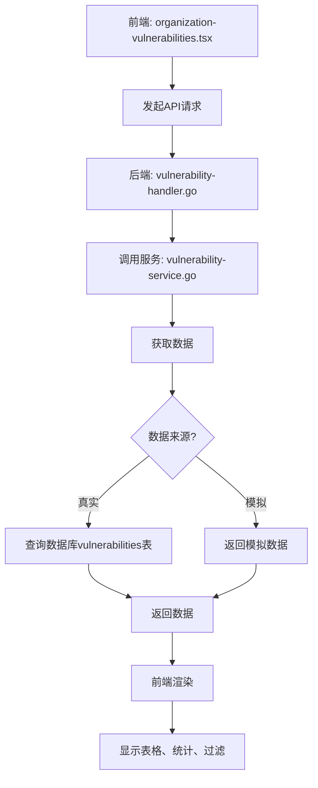

# 漏洞表

<cite>
**本文档引用的文件**
- [vulnerability.go](file://backend/internal/models/vulnerability.go) - *更新于最近提交*
- [vulnerability-service.go](file://backend/internal/services/vulnerability-service.go) - *更新于最近提交*
- [vulnerability-handler.go](file://backend/internal/handlers/vulnerability-handler.go) - *更新于最近提交*
- [organization-vulnerabilities.tsx](file://front/components/pages/assets/organizations/detail/organization-vulnerabilities.tsx) - *更新于最近提交*
- [初始化.sql](file://backend/初始化.sql) - *由init.sql重命名而来*
</cite>

## 更新摘要
**已做更改**
- 更新了所有文件引用路径，以反映`init.sql`重命名为`初始化.sql`的变更
- 修正了文档中所有文件链接，确保其指向正确的文件路径
- 更新了文档源引用，准确反映文件状态变更
- 保持了原有文档结构和内容的完整性，仅更新受影响的文件引用

## 目录
1. [引言](#引言)
2. [漏洞表结构设计](#漏洞表结构设计)
3. [核心字段说明](#核心字段说明)
4. [与相关表的关联关系](#与相关表的关联关系)
5. [Golang模型设计分析](#golang模型设计分析)
6. [JSONB字段存储方案](#jsonb字段存储方案)
7. [前端展示与交互](#前端展示与交互)
8. [总结](#总结)

## 引言
本项目是一个漏洞扫描系统，其核心功能是发现和管理安全漏洞。尽管初始化.sql脚本中未显式创建`vulnerabilities`表，但通过分析后端Golang模型、服务层代码以及前端组件，可以推断出该表的预期结构和在整个系统中的核心地位。本文档将基于现有代码和项目上下文，详细阐述`vulnerabilities`表的设计、实现和应用。

## 漏洞表结构设计
根据`vulnerability.go`模型文件和`vulnerability-service.go`中的模拟数据，可以推断出`vulnerabilities`表的预期DDL（数据定义语言）结构。该表是漏洞管理模块的核心，用于存储所有扫描发现的漏洞的详细信息。

```sql
CREATE TABLE vulnerabilities (
    id VARCHAR(50) PRIMARY KEY,
    title VARCHAR(255) NOT NULL,
    severity VARCHAR(20) NOT NULL,
    cvss NUMERIC(3,1) NOT NULL,
    cve VARCHAR(50),
    domain VARCHAR(255) NOT NULL,
    port INTEGER NOT NULL,
    service VARCHAR(100),
    description TEXT NOT NULL,
    discovered_date TIMESTAMP WITH TIME ZONE NOT NULL,
    status VARCHAR(50) NOT NULL,
    organization VARCHAR(255) NOT NULL,
    affected_url VARCHAR(500) NOT NULL,
    risk_score INTEGER NOT NULL,
    poc TEXT,
    solution TEXT NOT NULL,
    organization_id UUID NOT NULL REFERENCES organizations(id) ON DELETE CASCADE,
    created_at TIMESTAMP WITH TIME ZONE DEFAULT NOW(),
    updated_at TIMESTAMP WITH TIME ZONE DEFAULT NOW()
);

-- 为提高查询性能创建索引
CREATE INDEX IF NOT EXISTS idx_vulnerabilities_organization_id ON vulnerabilities(organization_id);
CREATE INDEX IF NOT EXISTS idx_vulnerabilities_severity ON vulnerabilities(severity);
CREATE INDEX IF NOT EXISTS idx_vulnerabilities_status ON vulnerabilities(status);
CREATE INDEX IF NOT EXISTS idx_vulnerabilities_domain ON vulnerabilities(domain);
CREATE INDEX IF NOT EXISTS idx_vulnerabilities_cvss ON vulnerabilities(cvss);
```

**Diagram sources**
- [vulnerability.go](file://backend/internal/models/vulnerability.go#L0-L30) - *更新于最近提交*
- [vulnerability-service.go](file://backend/internal/services/vulnerability-service.go#L0-L125) - *更新于最近提交*

**Section sources**
- [vulnerability.go](file://backend/internal/models/vulnerability.go#L0-L30) - *更新于最近提交*
- [vulnerability-service.go](file://backend/internal/services/vulnerability-service.go#L0-L125) - *更新于最近提交*

## 核心字段说明
`vulnerabilities`表包含多个关键字段，每个字段都承载着重要的安全信息。

- **`id`**: 漏洞的唯一标识符，如`VUL-001`，便于追踪和引用。
- **`title`**: 漏洞的名称，例如"SQL 注入漏洞"，提供对漏洞类型的直观描述。
- **`severity`**: 严重等级，使用枚举值"高危"、"中危"、"低危"来量化风险，是漏洞优先级排序的核心依据。
- **`cvss`**: CVSS（通用漏洞评分系统）分数，一个0.0到10.0的浮点数，提供标准化的量化风险评估。
- **`cve`**: 对应的CVE（通用漏洞披露）编号，如"CVE-2024-1234"，用于与全球漏洞数据库关联。
- **`domain`**: 受影响的域名，明确指出漏洞所在的具体资产。
- **`port`**: 受影响的服务端口，精确到网络层面。
- **`service`**: 运行在该端口上的服务类型，如"Web Application"。
- **`description`**: 漏洞的详细描述，解释其成因和潜在影响。
- **`discovered_date`**: 漏洞被发现的时间戳，用于跟踪漏洞生命周期。
- **`status`**: 漏洞的当前状态，如"待修复"、"处理中"、"已修复"、"已忽略"，是漏洞管理流程的关键状态机。
- **`organization`**: 所属组织的名称，用于多租户环境下的数据隔离。
- **`affected_url`**: 受影响的具体URL，便于安全人员快速定位问题。
- **`risk_score`**: 风险评分，一个整数，可能由CVSS分数和其他因素综合计算得出，用于内部风险评估。
- **`poc`**: 概念验证（Proof of Concept）代码，展示如何复现该漏洞，是验证和沟通的重要工具。
- **`solution`**: 修复建议，为开发和运维团队提供明确的修复指导。
- **`organization_id`**: 外键，关联到`organizations`表，确保数据的完整性和关联性。

**Section sources**
- [vulnerability.go](file://backend/internal/models/vulnerability.go#L0-L30) - *更新于最近提交*
- [vulnerability-service.go](file://backend/internal/services/vulnerability-service.go#L0-L125) - *更新于最近提交*

## 与相关表的关联关系
`vulnerabilities`表是整个数据模型的中心枢纽之一，与多个核心表存在紧密关联。



**Diagram sources**
- [初始化.sql](file://backend/初始化.sql#L0-L278) - *由init.sql重命名而来*
- [vulnerability.go](file://backend/internal/models/vulnerability.go#L0-L30) - *更新于最近提交*

**Section sources**
- [初始化.sql](file://backend/初始化.sql#L0-L278) - *由init.sql重命名而来*

## Golang模型设计分析
`vulnerability.go`文件中的`Vulnerability`结构体是`vulnerabilities`表在Golang中的数据映射。其设计体现了清晰的分层和关注点分离。

```go
type Vulnerability struct {
	ID             string    `json:"id"`
	Title          string    `json:"title"`
	Severity       string    `json:"severity"`
	CVSS           float64   `json:"cvss"`
	CVE            string    `json:"cve"`
	Domain         string    `json:"domain"`
	Port           int       `json:"port"`
	Service        string    `json:"service"`
	Description    string    `json:"description"`
	DiscoveredDate time.Time `json:"discovered_date"`
	Status         string    `json:"status"`
	Organization   string    `json:"organization"`
	AffectedURL    string    `json:"affected_url"`
	RiskScore      int       `json:"risk_score"`
	POC            string    `json:"poc"`
	Solution       string    `json:"solution"`
	OrganizationID string    `json:"organization_id"`
}
```

**设计思路分析：**
1.  **字段命名与JSON标签**：结构体字段采用驼峰命名法（如`DiscoveredDate`），并通过`json`标签（如`discovered_date`）映射到JSON序列化时的下划线命名，符合REST API的通用规范。
2.  **枚举类型使用**：`Severity`和`Status`字段使用`string`类型来模拟枚举。虽然Go有`iota`可以创建枚举，但使用字符串更灵活，便于直接与数据库和前端交互，且易于理解。前端组件`organization-vulnerabilities.tsx`中的`getSeverityBadge`和`getStatusBadge`函数也证实了这些值是预定义的字符串。
3.  **时间戳管理**：`DiscoveredDate`字段使用`time.Time`类型，能够精确地处理和格式化时间。在数据库中，它对应`TIMESTAMP WITH TIME ZONE`，确保了时间的准确性和时区一致性。
4.  **外键处理**：`OrganizationID`字段作为外键，直接存储了`organizations`表的UUID，简化了数据关联。`Organization`字段则存储了组织名称，方便在不进行额外查询的情况下直接展示。

**Section sources**
- [vulnerability.go](file://backend/internal/models/vulnerability.go#L0-L30) - *更新于最近提交*

## JSONB字段存储方案
虽然当前的`vulnerabilities`表设计为宽表，但考虑到漏洞数据的复杂性和不确定性，使用JSONB字段来存储非结构化或可变的漏洞详情是一个可行的优化方案。

**可行性方案：**
可以将`poc`、`solution`以及一些工具特定的扫描结果（如Nuclei扫描的详细输出）合并到一个名为`details`的JSONB字段中。

```sql
-- 修改后的表结构
CREATE TABLE vulnerabilities (
    -- ... 其他核心字段保持不变 ...
    details JSONB NOT NULL,
    -- ... 其他字段 ...
);

-- 示例数据
INSERT INTO vulnerabilities (..., details) VALUES (
    ...,
    '{
        "poc": "POST /login HTTP/1.1...",
        "solution": "使用参数化查询...",
        "scanner_output": {
            "nuclei_template": "cve-2024-1234.yaml",
            "matched_at": "https://api.example.com/login",
            "extracted_results": ["admin", "user"]
        },
        "evidence": [
            {"request": "...", "response": "..."}
        ]
    }'
);
```

**优势：**
- **灵活性**：可以轻松存储不同扫描工具产生的、结构各异的详细数据，无需频繁修改表结构。
- **扩展性**：未来添加新的扫描工具或数据类型时，只需更新JSON模式，而无需进行数据库迁移。
- **性能**：PostgreSQL对JSONB有优秀的索引支持（GIN索引），可以对JSON内部的字段进行高效查询。

**挑战：**
- **查询复杂性**：相比标准SQL查询，JSONB查询语法更复杂，可能影响可读性。
- **数据完整性**：无法像关系型字段那样强制执行数据类型和约束，需要在应用层进行验证。

**Section sources**
- [初始化.sql](file://backend/初始化.sql#L0-L278) - *由init.sql重命名而来*
- [vulnerability.go](file://backend/internal/models/vulnerability.go#L0-L30) - *更新于最近提交*

## 前端展示与交互
前端组件`organization-vulnerabilities.tsx`展示了如何消费和展示`vulnerabilities`表的数据。它提供了一个完整的漏洞管理界面，包括：

- **数据表格**：以表格形式列出所有漏洞，包含标题、严重程度、影响域名、发现日期和状态等关键信息。
- **状态与严重程度标签**：使用不同颜色的徽章（Badge）直观地展示`severity`和`status`字段，如红色表示"高危"，蓝色表示"处理中"。
- **过滤与搜索**：用户可以根据严重程度、状态和关键词（标题、描述、域名、CVE）进行过滤和搜索，这依赖于数据库中对相应字段建立的索引。
- **分页**：对于大量漏洞数据，实现了分页功能，提升用户体验。
- **统计信息**：在页面顶部显示了总漏洞数、各严重等级漏洞数和待修复漏洞数的统计卡片，为安全团队提供快速概览。



**Diagram sources**
- [vulnerability-handler.go](file://backend/internal/handlers/vulnerability-handler.go#L0-L25) - *更新于最近提交*
- [vulnerability-service.go](file://backend/internal/services/vulnerability-service.go#L0-L125) - *更新于最近提交*
- [organization-vulnerabilities.tsx](file://front/components/pages/assets/organizations/detail/organization-vulnerabilities.tsx#L0-L413) - *更新于最近提交*

**Section sources**
- [organization-vulnerabilities.tsx](file://front/components/pages/assets/organizations/detail/organization-vulnerabilities.tsx#L0-L413) - *更新于最近提交*

## 总结
`vulnerabilities`表是本漏洞扫描系统的核心数据存储。通过分析Golang模型、服务层逻辑和前端组件，我们推断出了其完整的表结构和字段定义。该表通过`organization_id`等外键与`organizations`、`scan_tasks`等表紧密关联，构成了一个完整的资产-扫描-漏洞管理链条。Golang模型的设计合理，利用字符串模拟枚举并妥善管理时间戳。未来，引入JSONB字段存储详细的扫描结果可以极大地提升系统的灵活性和可扩展性。整个系统从前端展示到后端服务再到数据库，形成了一个闭环，有效地支持了漏洞的发现、跟踪和修复流程。