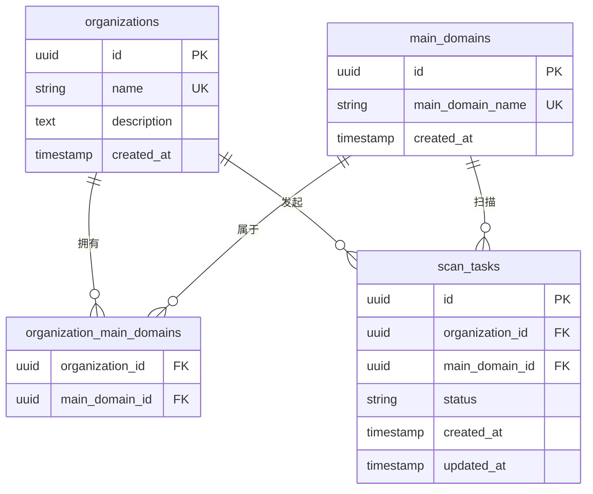
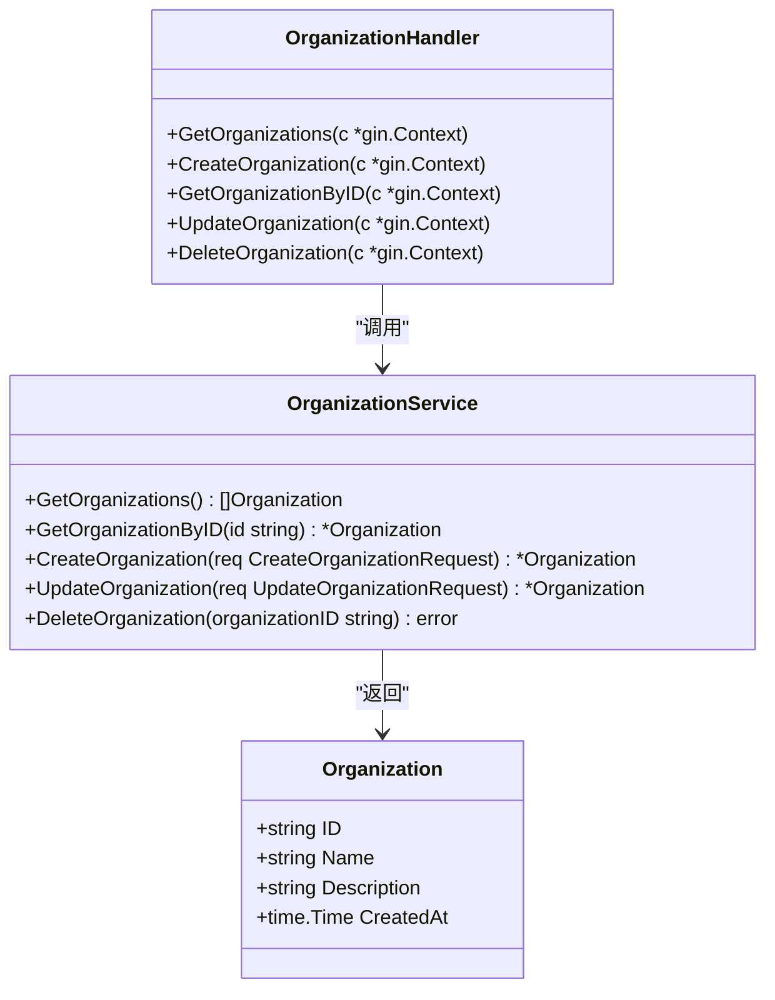

# 组织表

<cite>
**本文档引用的文件**  
- [初始化.sql](file://backend/初始化.sql#L31-L56)
- [organization.go](file://backend/internal/models/organization.go#L1-L32)
- [organization-service.go](file://backend/internal/services/organization-service.go#L1-L158)
- [organization-handler.go](file://backend/internal/handlers/organization-handler.go#L1-L212)
</cite>

## 目录
1. [组织表](#组织表)
2. [字段详解](#字段详解)
   - [id 字段](#id-字段)
   - [name 字段](#name-字段)
   - [description 字段](#description-字段)
   - [created_at 字段](#created_at-字段)
3. [核心作用与关联关系](#核心作用与关联关系)
4. [Golang 模型映射](#golang-模型映射)
5. [UUID 主键的并发优势与潜在问题](#uuid-主键的并发优势与潜在问题)

## 字段详解

### id 字段
:id: 字段是组织表的主键，采用 UUID（通用唯一标识符）作为数据类型。其定义为 `UUID PRIMARY KEY DEFAULT gen_random_uuid()`，表示该字段为表的主键，并使用 PostgreSQL 的 `gen_random_uuid()` 函数自动生成唯一值。这种设计避免了传统自增整数主键在分布式系统中可能出现的冲突问题，确保了在多节点环境下主键的全局唯一性。

**Section sources**
- [初始化.sql](file://backend/初始化.sql#L31-L33)

### name 字段
:name: 字段用于存储组织的名称，数据类型为 `VARCHAR(255)`，且具有 `NOT NULL` 和 `UNIQUE` 约束。这意味着每个组织的名称必须提供且在整个表中是唯一的，防止了重复组织的创建。此约束对于维护数据的完整性和避免业务逻辑中的歧义至关重要。

**Section sources**
- [初始化.sql](file://backend/初始化.sql#L31-L33)

### description 字段
:description: 字段用于存储组织的描述信息，数据类型为 `TEXT`，允许存储较长的文本内容。该字段为可选字段（无 `NOT NULL` 约束），用于提供关于组织的详细说明或备注。

**Section sources**
- [初始化.sql](file://backend/初始化.sql#L31-L33)

### created_at 字段
:created_at: 字段记录了组织创建的时间戳，数据类型为 `TIMESTAMP WITH TIME ZONE NOT NULL`，表示必须提供带有时区信息的时间戳。该字段用于追踪组织的创建时间，对于审计、日志记录和数据分析具有重要意义。

**Section sources**
- [初始化.sql](file://backend/初始化.sql#L31-L33)

## 核心作用与关联关系

组织表作为系统顶层的组织单元，是整个资产管理系统的核心。它通过外键与其他实体建立关联，形成完整的数据模型。

- **与主域名的关联**：通过 `organization_main_domains` 关联表，一个组织可以拥有多个主域名，一个主域名也可以被多个组织共享。这实现了组织与资产的多对多关系。
- **与扫描任务的关联**：`scan_tasks` 表中的 `organization_id` 字段直接引用 `organizations(id)`，表明每个扫描任务都归属于一个特定的组织。这使得扫描任务可以按组织进行管理和统计。



**Diagram sources**
- [初始化.sql](file://backend/初始化.sql#L31-L56)

**Section sources**
- [初始化.sql](file://backend/初始化.sql#L97-L119)

## Golang 模型映射

在 Golang 代码中，`organization.go` 文件定义了 `Organization` 结构体，它与数据库中的 `organizations` 表一一对应。通过结构体标签 `json` 和 `db`，实现了 JSON 序列化和数据库字段的映射。

```go
// Organization 组织模型
type Organization struct {
	ID          string    `json:"id" db:"id"`
	Name        string    `json:"name" db:"name"`
	Description string    `json:"description" db:"description"`
	CreatedAt   time.Time `json:"created_at" db:"created_at"`
}
```

该结构体被 `organization-service.go` 中的服务层使用，进行数据库的增删改查操作，并通过 `organization-handler.go` 的处理器层暴露为 RESTful API。



**Diagram sources**
- [organization.go](file://backend/internal/models/organization.go#L1-L32)
- [organization-service.go](file://backend/internal/services/organization-service.go#L1-L158)
- [organization-handler.go](file://backend/internal/handlers/organization-handler.go#L1-L212)

**Section sources**
- [organization.go](file://backend/internal/models/organization.go#L1-L32)

## UUID 主键的并发优势与潜在问题

### 优势
- **分布式友好**：UUID 可以在客户端生成，无需与数据库交互获取自增值，非常适合分布式系统和高并发场景，避免了主键冲突。
- **安全性**：UUID 的随机性使得外部难以猜测其他记录的 ID，相比自增 ID 更安全。
- **合并方便**：在数据迁移或合并不同数据库时，UUID 可以保证主键的唯一性，无需重新编号。

### 潜在问题
- **存储空间**：UUID 占用 16 字节，远大于整数主键（通常 4 或 8 字节），会增加存储和索引的开销。
- **索引性能**：UUID 的无序性可能导致 B-Tree 索引的插入性能下降，因为新记录可能插入到索引的任何位置，引发页分裂。使用时间有序的 UUID（如 UUID7）可以缓解此问题。
- **可读性差**：UUID 是一长串字符，对人类不友好，不利于调试和日志分析。

**Section sources**
- [初始化.sql](file://backend/初始化.sql#L31-L33)