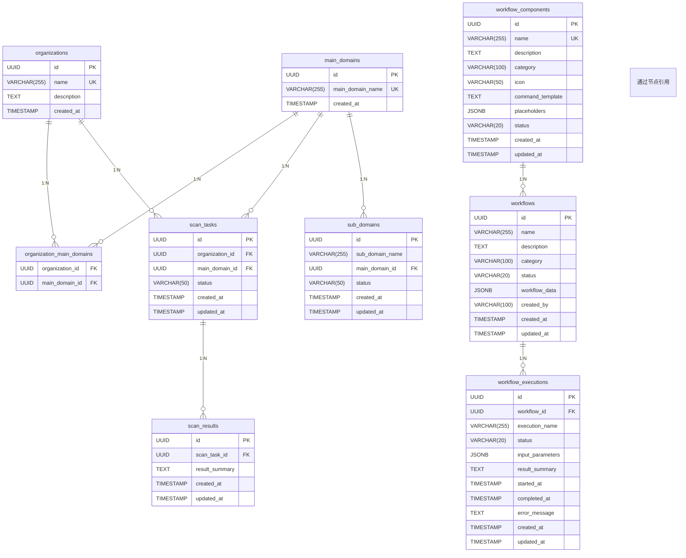

# 表结构

<cite>
**本文档中引用的文件**  
- [init.sql](file://backend/init.sql) - *数据库初始化脚本，包含所有表的DDL定义*
- [vulnerability.go](file://backend/internal/models/vulnerability.go) - *漏洞数据模型定义*
- [vulnerability-service.go](file://backend/internal/services/vulnerability-service.go) - *漏洞服务逻辑实现*
- [organization-handler.go](file://backend/internal/handlers/organization-handler.go) - *组织相关API处理*
- [domain-service.go](file://backend/internal/services/domain-service.go) - *域名服务逻辑实现*
- [scan-handler.go](file://backend/internal/handlers/scan-handler.go) - *扫描任务API处理*
</cite>

## 目录
1. [组织表 (organizations)](#组织表-organizations)  
2. [主域名表 (main_domains)](#主域名表-main_domains)  
3. [组织与主域名关联表 (organization_main_domains)](#组织与主域名关联表-organization_main_domains)  
4. [子域名表 (sub_domains)](#子域名表-sub_domains)  
5. [扫描任务表 (scan_tasks)](#扫描任务表-scan_tasks)  
6. [扫描结果表 (scan_results)](#扫描结果表-scan_results)  
7. [工作流组件表 (workflow_components)](#工作流组件表-workflow_components)  
8. [工作流定义表 (workflows)](#工作流定义表-workflows)  
9. [工作流执行记录表 (workflow_executions)](#工作流执行记录表-workflow_executions)  
10. [表间关系分析](#表间关系分析)  
11. [关键设计决策说明](#关键设计决策说明)

## 组织表 (organizations)

该表用于存储组织的基本信息，是资产管理的顶层实体。

**表结构：organizations**

| 列名 | 类型 | 是否可为空 | 默认值 | 注释 |
|------|------|------------|--------|------|
| id | UUID | 否 | gen_random_uuid() | 主键，唯一标识组织 |
| name | VARCHAR(255) | 否 | 无 | 组织名称，必须唯一 |
| description | TEXT | 是 | 无 | 组织描述信息 |
| created_at | TIMESTAMP WITH TIME ZONE | 否 | 无 | 组织创建时间 |

**建表语句示例：**
```sql
CREATE TABLE organizations (
    id UUID PRIMARY KEY DEFAULT gen_random_uuid(),
    name VARCHAR(255) NOT NULL UNIQUE,
    description TEXT,
    created_at TIMESTAMP WITH TIME ZONE NOT NULL
);
```

**Section sources**
- [init.sql](file://backend/init.sql#L12-L17)
- [organization-handler.go](file://backend/internal/handlers/organization-handler.go#L56-L104)

## 主域名表 (main_domains)

该表存储主域名信息，作为资产扫描的目标入口。

**表结构：main_domains**

| 列名 | 类型 | 是否可为空 | 默认值 | 注释 |
|------|------|------------|--------|------|
| id | UUID | 否 | gen_random_uuid() | 主键，唯一标识主域名 |
| main_domain_name | VARCHAR(255) | 否 | 无 | 主域名名称，必须唯一 |
| created_at | TIMESTAMP WITH TIME ZONE | 否 | 无 | 主域名创建时间 |

**建表语句示例：**
```sql
CREATE TABLE main_domains (
    id UUID PRIMARY KEY DEFAULT gen_random_uuid(),
    main_domain_name VARCHAR(255) NOT NULL UNIQUE,
    created_at TIMESTAMP WITH TIME ZONE NOT NULL
);
```

**Section sources**
- [init.sql](file://backend/init.sql#L19-L23)
- [domain-service.go](file://backend/internal/services/domain-service.go#L54-L99)

## 组织与主域名关联表 (organization_main_domains)

该表为多对多关联表，用于建立组织与主域名之间的关联关系。

**表结构：organization_main_domains**

| 列名 | 类型 | 是否可为空 | 默认值 | 注释 |
|------|------|------------|--------|------|
| organization_id | UUID | 否 | 无 | 外键，引用 organizations.id，级联删除 |
| main_domain_id | UUID | 否 | 无 | 外键，引用 main_domains.id，级联删除 |
| (联合主键) | - | - | - | (organization_id, main_domain_id) |

**建表语句示例：**
```sql
CREATE TABLE organization_main_domains (
    organization_id UUID NOT NULL REFERENCES organizations(id) ON DELETE CASCADE,
    main_domain_id UUID NOT NULL REFERENCES main_domains(id) ON DELETE CASCADE,
    PRIMARY KEY (organization_id, main_domain_id)
);
```

**Section sources**
- [init.sql](file://backend/init.sql#L25-L29)
- [domain-service.go](file://backend/internal/services/domain-service.go#L101-L150)

## 子域名表 (sub_domains)

该表存储从主域名发现的子域名信息，是资产发现的重要组成部分。

**表结构：sub_domains**

| 列名 | 类型 | 是否可为空 | 默认值 | 注释 |
|------|------|------------|--------|------|
| id | UUID | 否 | gen_random_uuid() | 主键，唯一标识子域名 |
| sub_domain_name | VARCHAR(255) | 否 | 无 | 子域名名称 |
| main_domain_id | UUID | 否 | 无 | 外键，引用 main_domains.id，级联删除 |
| status | VARCHAR(50) | 否 | 'unknown' | 子域名状态（active, inactive, unknown） |
| created_at | TIMESTAMP WITH TIME ZONE | 否 | 无 | 子域名创建时间 |
| updated_at | TIMESTAMP WITH TIME ZONE | 否 | 无 | 子域名更新时间 |

**约束：** (sub_domain_name, main_domain_id) 组合唯一

**建表语句示例：**
```sql
CREATE TABLE sub_domains (
    id UUID PRIMARY KEY DEFAULT gen_random_uuid(),
    sub_domain_name VARCHAR(255) NOT NULL,
    main_domain_id UUID NOT NULL REFERENCES main_domains(id) ON DELETE CASCADE,
    status VARCHAR(50) NOT NULL DEFAULT 'unknown',
    created_at TIMESTAMP WITH TIME ZONE NOT NULL,
    updated_at TIMESTAMP WITH TIME ZONE NOT NULL,
    UNIQUE (sub_domain_name, main_domain_id)
);
```

**Section sources**
- [init.sql](file://backend/init.sql#L31-L39)

## 扫描任务表 (scan_tasks)

该表记录所有发起的扫描任务，是扫描流程的起点。

**表结构：scan_tasks**

| 列名 | 类型 | 是否可为空 | 默认值 | 注释 |
|------|------|------------|--------|------|
| id | UUID | 否 | gen_random_uuid() | 主键，唯一标识扫描任务 |
| organization_id | UUID | 否 | 无 | 外键，引用 organizations.id，级联删除 |
| main_domain_id | UUID | 否 | 无 | 外键，引用 main_domains.id，级联删除 |
| status | VARCHAR(50) | 否 | 'pending' | 任务状态（pending, running, completed, failed） |
| created_at | TIMESTAMP WITH TIME ZONE | 否 | 无 | 任务创建时间 |
| updated_at | TIMESTAMP WITH TIME ZONE | 否 | 无 | 任务更新时间 |

**建表语句示例：**
```sql
CREATE TABLE scan_tasks (
    id UUID PRIMARY KEY DEFAULT gen_random_uuid(),
    organization_id UUID NOT NULL REFERENCES organizations(id) ON DELETE CASCADE,
    main_domain_id UUID NOT NULL REFERENCES main_domains(id) ON DELETE CASCADE,
    status VARCHAR(50) NOT NULL DEFAULT 'pending',
    created_at TIMESTAMP WITH TIME ZONE NOT NULL,
    updated_at TIMESTAMP WITH TIME ZONE NOT NULL
);
```

**Section sources**
- [init.sql](file://backend/init.sql#L41-L48)
- [scan-handler.go](file://backend/internal/handlers/scan-handler.go#L20-L60)

## 扫描结果表 (scan_results)

该表存储扫描任务的执行结果，与扫描任务表形成1:N关系。

**表结构：scan_results**

| 列名 | 类型 | 是否可为空 | 默认值 | 注释 |
|------|------|------------|--------|------|
| id | UUID | 否 | gen_random_uuid() | 主键，唯一标识扫描结果 |
| scan_task_id | UUID | 否 | 无 | 外键，引用 scan_tasks.id，级联删除 |
| result_summary | TEXT | 是 | 无 | 扫描结果摘要 |
| created_at | TIMESTAMP WITH TIME ZONE | 否 | 无 | 结果创建时间 |
| updated_at | TIMESTAMP WITH TIME ZONE | 否 | 无 | 结果更新时间 |

**建表语句示例：**
```sql
CREATE TABLE scan_results (
    id UUID PRIMARY KEY DEFAULT gen_random_uuid(),
    scan_task_id UUID NOT NULL REFERENCES scan_tasks(id) ON DELETE CASCADE,
    result_summary TEXT,
    created_at TIMESTAMP WITH TIME ZONE NOT NULL,
    updated_at TIMESTAMP WITH TIME ZONE NOT NULL
);
```

**Section sources**
- [init.sql](file://backend/init.sql#L50-L56)

## 工作流组件表 (workflow_components)

该表存储可复用的工作流组件信息，包括工具模板和配置。

**表结构：workflow_components**

| 列名 | 类型 | 是否可为空 | 默认值 | 注释 |
|------|------|------------|--------|------|
| id | UUID | 否 | gen_random_uuid() | 主键，唯一标识组件 |
| name | VARCHAR(255) | 否 | 无 | 组件名称，必须唯一 |
| description | TEXT | 是 | 无 | 组件描述信息 |
| category | VARCHAR(100) | 否 | 无 | 组件分类（信息收集、网络扫描等） |
| icon | VARCHAR(50) | 否 | 'Terminal' | 图标标识 |
| command_template | TEXT | 否 | 无 | 命令模板，包含占位符 |
| placeholders | JSONB | 是 | 无 | 占位符数组，定义模板变量 |
| status | VARCHAR(20) | 否 | 'active' | 组件状态（active, inactive） |
| created_at | TIMESTAMP WITH TIME ZONE | 否 | 无 | 创建时间 |
| updated_at | TIMESTAMP WITH TIME ZONE | 否 | 无 | 更新时间 |

**建表语句示例：**
```sql
CREATE TABLE workflow_components (
    id UUID PRIMARY KEY DEFAULT gen_random_uuid(),
    name VARCHAR(255) NOT NULL UNIQUE,
    description TEXT,
    category VARCHAR(100) NOT NULL,
    icon VARCHAR(50) NOT NULL DEFAULT 'Terminal',
    command_template TEXT NOT NULL,
    placeholders JSONB,
    status VARCHAR(20) NOT NULL DEFAULT 'active',
    created_at TIMESTAMP WITH TIME ZONE NOT NULL,
    updated_at TIMESTAMP WITH TIME ZONE NOT NULL
);
```

**Section sources**
- [init.sql](file://backend/init.sql#L58-L70)

## 工作流定义表 (workflows)

该表存储完整的工作流定义，包含节点和边的JSON结构。

**表结构：workflows**

| 列名 | 类型 | 是否可为空 | 默认值 | 注释 |
|------|------|------------|--------|------|
| id | UUID | 否 | gen_random_uuid() | 主键，唯一标识工作流 |
| name | VARCHAR(255) | 否 | 无 | 工作流名称 |
| description | TEXT | 是 | 无 | 工作流描述 |
| category | VARCHAR(100) | 否 | 无 | 分类（网络扫描、Web扫描等） |
| status | VARCHAR(20) | 否 | 'active' | 状态（active, inactive） |
| workflow_data | JSONB | 否 | 无 | 工作流数据，包含节点和边的完整定义 |
| created_by | VARCHAR(100) | 是 | 无 | 创建者标识 |
| created_at | TIMESTAMP WITH TIME ZONE | 否 | 无 | 创建时间 |
| updated_at | TIMESTAMP WITH TIME ZONE | 否 | 无 | 更新时间 |

**建表语句示例：**
```sql
CREATE TABLE workflows (
    id UUID PRIMARY KEY DEFAULT gen_random_uuid(),
    name VARCHAR(255) NOT NULL,
    description TEXT,
    category VARCHAR(100) NOT NULL,
    status VARCHAR(20) NOT NULL DEFAULT 'active',
    workflow_data JSONB NOT NULL,
    created_by VARCHAR(100),
    created_at TIMESTAMP WITH TIME ZONE NOT NULL,
    updated_at TIMESTAMP WITH TIME ZONE NOT NULL
);
```

**Section sources**
- [init.sql](file://backend/init.sql#L71-L82)

## 工作流执行记录表 (workflow_executions)

该表存储工作流的执行实例和结果。

**表结构：workflow_executions**

| 列名 | 类型 | 是否可为空 | 默认值 | 注释 |
|------|------|------------|--------|------|
| id | UUID | 否 | gen_random_uuid() | 主键，唯一标识执行记录 |
| workflow_id | UUID | 否 | 无 | 外键，引用 workflows.id，级联删除 |
| execution_name | VARCHAR(255) | 是 | 无 | 执行名称 |
| status | VARCHAR(20) | 否 | 'pending' | 执行状态（pending, running, completed, failed） |
| input_parameters | JSONB | 是 | 无 | 输入参数，JSON格式 |
| result_summary | TEXT | 是 | 无 | 结果摘要 |
| started_at | TIMESTAMP WITH TIME ZONE | 是 | 无 | 开始时间 |
| completed_at | TIMESTAMP WITH TIME ZONE | 是 | 无 | 完成时间 |
| error_message | TEXT | 是 | 无 | 错误信息 |
| created_at | TIMESTAMP WITH TIME ZONE | 否 | 无 | 记录创建时间 |
| updated_at | TIMESTAMP WITH TIME ZONE | 否 | 无 | 记录更新时间 |

**建表语句示例：**
```sql
CREATE TABLE workflow_executions (
    id UUID PRIMARY KEY DEFAULT gen_random_uuid(),
    workflow_id UUID NOT NULL REFERENCES workflows(id) ON DELETE CASCADE,
    execution_name VARCHAR(255),
    status VARCHAR(20) NOT NULL DEFAULT 'pending',
    input_parameters JSONB,
    result_summary TEXT,
    started_at TIMESTAMP WITH TIME ZONE,
    completed_at TIMESTAMP WITH TIME ZONE,
    error_message TEXT,
    created_at TIMESTAMP WITH TIME ZONE NOT NULL,
    updated_at TIMESTAMP WITH TIME ZONE NOT NULL
);
```

**Section sources**
- [init.sql](file://backend/init.sql#L83-L97)

## 表间关系分析



**Diagram sources**
- [init.sql](file://backend/init.sql#L12-L97)
- [workflow_components.go](file://backend/internal/models/workflow_components.go#L10-L50)

**Section sources**
- [init.sql](file://backend/init.sql#L12-L97)
- [workflow_components.go](file://backend/internal/models/workflow_components.go#L10-L50)

## 关键设计决策说明

1. **UUID作为主键**：所有表均使用UUID作为主键，避免了自增ID的安全风险（如ID猜测），并支持分布式系统下的数据合并。

2. **软删除替代硬删除**：通过ON DELETE CASCADE实现级联删除，确保数据一致性。实际应用中可考虑添加is_deleted字段实现软删除。

3. **多对多关系处理**：组织与主域名之间采用独立的关联表organization_main_domains，支持一个组织拥有多个主域名，一个主域名也可被多个组织共享。

4. **时间戳精度**：使用TIMESTAMP WITH TIME ZONE确保时间记录的准确性，避免时区问题。

5. **状态字段设计**：status字段使用预定义的字符串值（如pending, running, completed），提高可读性，避免使用数字编码。

6. **索引优化**：为频繁查询的字段（如name, status, created_at）创建索引，提升查询性能。使用GIN索引支持JSONB字段的高效查询。

7. **JSONB数据类型**：在workflow_data、input_parameters等字段使用JSONB，支持复杂数据结构的存储和查询，同时保持数据库的灵活性。

8. **工作流组件化设计**：通过workflow_components表实现工具的组件化管理，支持命令模板和占位符，提高工作流的可复用性和灵活性。

**Section sources**
- [init.sql](file://backend/init.sql#L278-L279)
- [workflow_components.go](file://backend/internal/models/workflow_components.go#L10-L50)