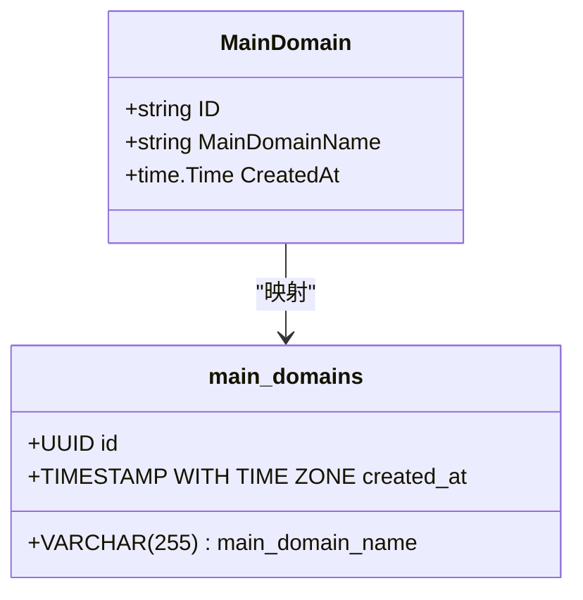
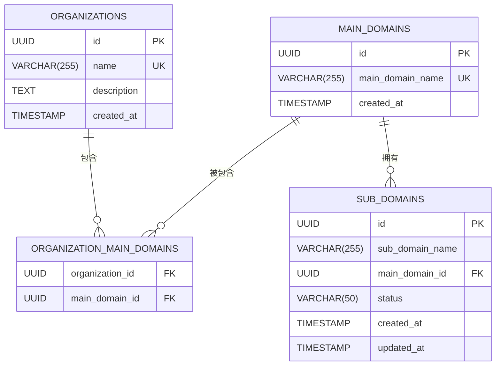

# 主域名表

<cite>
**本文档引用文件**   
- [初始化.sql](file://backend/初始化.sql#L31-L56)
- [domain.go](file://backend/internal/models/domain.go#L1-L62)
- [domain-service.go](file://backend/internal/services/domain-service.go#L0-L150)
- [domain-handler.go](file://backend/internal/handlers/domain-handler.go#L0-L133)
</cite>

## 目录
1. [主域名表](#主域名表)
2. [字段设计与约束](#字段设计与约束)
3. [数据模型映射](#数据模型映射)
4. [核心业务功能](#核心业务功能)
5. [数据库操作示例](#数据库操作示例)
6. [业务场景分析](#业务场景分析)

## 字段设计与约束

### id 字段
**id** 字段是 `main_domains` 表的主键，采用 UUID 类型并设置为自动生成。与传统的自增整数主键不同，UUID 提供了全局唯一性，避免了在分布式系统中可能出现的主键冲突问题。

在数据库初始化脚本中，`id` 字段的定义如下：
```sql
id UUID PRIMARY KEY DEFAULT gen_random_uuid()
```

该设计确保了每个主域名记录都有一个全局唯一的标识符，无论在哪个系统或数据库实例中创建，都不会产生重复。这种设计特别适合资产管理系统，因为资产数据可能在多个系统之间同步或迁移。

### main_domain_name 字段
**main_domain_name** 字段存储主域名的名称，其设计包含两个关键约束：

1. **非空约束 (NOT NULL)**：确保每个主域名记录都必须包含有效的域名名称，防止出现空值或未定义的记录。
2. **唯一性约束 (UNIQUE)**：通过 `UNIQUE` 约束防止系统中重复注册相同的主域名。

在数据库初始化脚本中，该字段的定义如下：
```sql
main_domain_name VARCHAR(255) NOT NULL UNIQUE
```

唯一性约束是防止重复数据的关键机制。当尝试插入一个已存在的主域名时，数据库会抛出唯一性约束违反错误，从而保证了数据的完整性。这种设计避免了同一主域名被多次注册，确保了资产数据的准确性。

**Section sources**
- [初始化.sql](file://backend/初始化.sql#L31-L56)

## 数据模型映射

### Golang 结构体定义
在后端代码中，`main_domains` 表对应的 Golang 结构体定义在 `domain.go` 文件中：

```go
// MainDomain 主域名模型
type MainDomain struct {
	ID             string    `json:"id" db:"id"`
	MainDomainName string    `json:"main_domain_name" db:"main_domain_name"`
	CreatedAt      time.Time `json:"created_at" db:"created_at"`
}
```

该结构体与数据库表的字段映射关系如下：
- **ID** 字段映射到数据库的 `id` 字段，用于 JSON 序列化和数据库操作
- **MainDomainName** 字段映射到数据库的 `main_domain_name` 字段，存储主域名名称
- **CreatedAt** 字段记录主域名的创建时间

结构体标签中的 `json` 标签定义了 JSON 序列化时的字段名称，而 `db` 标签定义了与数据库字段的映射关系。这种设计使得 Go 代码能够无缝地与数据库交互，同时保持良好的 API 设计。

### 字段映射关系图


**Diagram sources**
- [domain.go](file://backend/internal/models/domain.go#L1-L10)

## 核心业务功能

### 主域名创建流程
主域名的创建和关联功能由 `DomainService` 的 `CreateMainDomains` 方法实现。该方法在一个数据库事务中执行以下操作：

1. **检查主域名是否存在**：对于每个要创建的主域名，首先查询数据库检查是否已存在。
2. **创建新主域名**：如果主域名不存在，则生成新的 UUID 并插入 `main_domains` 表。
3. **建立组织关联**：检查组织与主域名的关联关系是否存在，如果不存在则在 `organization_main_domains` 表中创建关联记录。

```go
func (s *DomainService) CreateMainDomains(req models.CreateMainDomainsRequest) (*models.APIResponse, error) {
	tx, err := s.db.Begin()
	if err != nil {
		return nil, err
	}
	defer tx.Rollback()

	for _, domainName := range req.MainDomains {
		// 检查主域名是否已存在
		var existingID string
		checkQuery := `SELECT id FROM main_domains WHERE main_domain_name = $1`
		err := tx.QueryRow(checkQuery, domainName).Scan(&existingID)

		var domainID string
		if err == sql.ErrNoRows {
			// 主域名不存在，创建新的
			domainID = uuid.New().String()
			insertQuery := `
				INSERT INTO main_domains (id, main_domain_name, created_at)
				VALUES ($1, $2, NOW())
			`
			_, err = tx.Exec(insertQuery, domainID, domainName)
			if err != nil {
				return nil, err
			}
		} else if err != nil {
			return nil, err
		} else {
			// 主域名已存在
			domainID = existingID
		}

		// 检查并创建组织关联
		var associationExists bool
		associationQuery := `
			SELECT EXISTS(
				SELECT 1 FROM organization_main_domains 
				WHERE organization_id = $1 AND main_domain_id = $2
			)
		`
		err = tx.QueryRow(associationQuery, req.OrganizationID, domainID).Scan(&associationExists)
		if err != nil {
			return nil, err
		}

		if !associationExists {
			associateQuery := `
				INSERT INTO organization_main_domains (organization_id, main_domain_id)
				VALUES ($1, $2)
			`
			_, err = tx.Exec(associateQuery, req.OrganizationID, domainID)
			if err != nil {
				return nil, err
			}
		}
	}

	if err := tx.Commit(); err != nil {
		return nil, err
	}

	return response, nil
}
```

该流程使用了数据库事务来确保操作的原子性，要么全部成功，要么全部回滚，保证了数据的一致性。

### 主域名查询流程
获取组织的主域名列表功能由 `GetOrganizationMainDomains` 方法实现。该方法通过 SQL JOIN 查询，从 `main_domains` 表和 `organization_main_domains` 关联表中获取数据：

```go
func (s *DomainService) GetOrganizationMainDomains(organizationID string) ([]models.MainDomain, error) {
	query := `
		SELECT md.id, md.main_domain_name, md.created_at
		FROM main_domains md
		INNER JOIN organization_main_domains omd ON md.id = omd.main_domain_id
		WHERE omd.organization_id = $1
		ORDER BY md.created_at DESC
	`

	rows, err := s.db.Query(query, organizationID)
	if err != nil {
		return nil, err
	}
	defer rows.Close()

	var mainDomains []models.MainDomain
	for rows.Next() {
		var domain models.MainDomain
		err := rows.Scan(&domain.ID, &domain.MainDomainName, &domain.CreatedAt)
		if err != nil {
			return nil, err
		}
		mainDomains = append(mainDomains, domain)
	}

	return mainDomains, nil
}
```

**Section sources**
- [domain-service.go](file://backend/internal/services/domain-service.go#L0-L150)
- [domain-handler.go](file://backend/internal/handlers/domain-handler.go#L0-L133)

## 数据库操作示例

### 创建主域名
以下 SQL 语句演示了如何创建主域名记录：

```sql
INSERT INTO main_domains (id, main_domain_name, created_at)
VALUES ('00000000-0000-0000-0000-000000000008', 'example1.com', NOW());
```

### 查询主域名
以下 SQL 语句演示了如何查询特定组织的主域名列表：

```sql
SELECT md.id, md.main_domain_name, md.created_at
FROM main_domains md
INNER JOIN organization_main_domains omd ON md.id = omd.main_domain_id
WHERE omd.organization_id = '00000000-0000-0000-0000-000000000001'
ORDER BY md.created_at DESC;
```

### 检查主域名唯一性
以下 SQL 语句演示了如何检查主域名是否已存在：

```sql
SELECT id FROM main_domains WHERE main_domain_name = 'example1.com';
```

**Section sources**
- [初始化.sql](file://backend/初始化.sql#L97-L119)

## 业务场景分析

### 资产管理系统核心
`main_domains` 表在资产管理系统中扮演着核心角色，是整个资产数据模型的基础。它作为子域名归属和组织关联的中心枢纽，连接了多个关键实体：

1. **子域名归属**：`sub_domains` 表通过 `main_domain_id` 外键引用 `main_domains` 表，建立了子域名与主域名的从属关系。
2. **组织关联**：`organization_main_domains` 关联表将 `organizations` 表和 `main_domains` 表连接起来，实现了组织与主域名的多对多关系。

这种设计模式体现了规范化数据库设计的原则，避免了数据冗余，提高了数据一致性。

### 实际使用模式
在实际业务场景中，`main_domains` 表的使用模式如下：

1. **资产录入**：当用户为组织添加新的主域名时，系统首先检查该域名是否已存在，如果不存在则创建新的主域名记录，并建立与组织的关联。
2. **资产查询**：当用户查看组织的资产信息时，系统通过 JOIN 查询获取该组织关联的所有主域名，然后可以进一步查询每个主域名下的子域名。
3. **扫描任务**：在创建扫描任务时，系统需要指定目标主域名，`main_domains` 表提供了有效的域名列表，确保扫描任务的目标是系统中已注册的资产。



**Diagram sources**
- [初始化.sql](file://backend/初始化.sql#L31-L56)