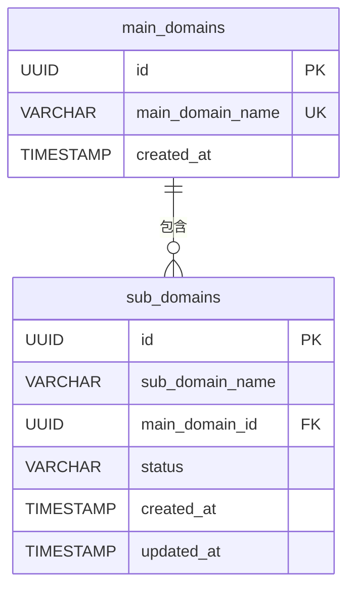
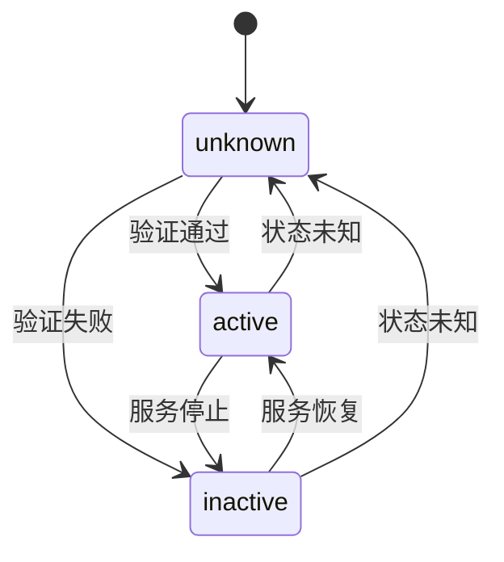

# 子域名表

<cite>
**本文档引用的文件**   
- [初始化.sql](file://backend/初始化.sql#L136-L168)
- [domain.go](file://backend/internal/models/domain.go#L14-L22)
</cite>

## 目录
1. [子域名表结构](#子域名表结构)
2. [外键关联机制](#外键关联机制)
3. [联合唯一索引](#联合唯一索引)
4. [Golang数据映射](#golang数据映射)
5. [数据插入示例](#数据插入示例)
6. [状态字段说明](#状态字段说明)

## 子域名表结构

子域名表（sub_domains）用于存储系统中所有发现的子域名信息。该表通过`main_domain_id`字段与主域名表（main_domains）建立关联，形成清晰的层级关系。

```sql
CREATE TABLE sub_domains (
    id UUID PRIMARY KEY DEFAULT gen_random_uuid(),
    sub_domain_name VARCHAR(255) NOT NULL,
    main_domain_id UUID NOT NULL REFERENCES main_domains(id) ON DELETE CASCADE,
    status VARCHAR(50) NOT NULL DEFAULT 'unknown',
    created_at TIMESTAMP WITH TIME ZONE NOT NULL,
    updated_at TIMESTAMP WITH TIME ZONE NOT NULL,
    UNIQUE (sub_domain_name, main_domain_id)
);
```

**表字段说明**:
- **id**: 主键，使用UUID作为唯一标识符
- **sub_domain_name**: 子域名名称，存储完整的子域名字符串
- **main_domain_id**: 外键，关联到主域名表的ID
- **status**: 状态字段，表示子域名的当前状态
- **created_at**: 创建时间戳
- **updated_at**: 更新时间戳

**Section sources**
- [初始化.sql](file://backend/初始化.sql#L136-L168)

## 外键关联机制

子域名表通过`main_domain_id`字段与主域名表建立外键关联，确保数据的完整性和一致性。



**外键约束细节**:
- **字段**: `main_domain_id`
- **引用**: `main_domains.id`
- **级联行为**: `ON DELETE CASCADE`
- **约束作用**: 当主域名被删除时，其所有关联的子域名将自动被级联删除

这种级联删除机制确保了数据的一致性，避免了孤儿记录的存在。当一个主域名不再需要时，系统会自动清理其所有子域名，简化了数据管理。

**Diagram sources**
- [初始化.sql](file://backend/初始化.sql#L136-L168)

**Section sources**
- [初始化.sql](file://backend/初始化.sql#L136-L168)

## 联合唯一索引

子域名表通过`(sub_domain_name, main_domain_id)`联合唯一索引来防止数据重复。

```sql
UNIQUE (sub_domain_name, main_domain_id)
```

**索引作用**:
- 防止在同一主域名下重复添加相同的子域名
- 提高查询性能，特别是在按主域名查找子域名时
- 确保数据的唯一性和完整性

例如，系统允许存在`www.example.com`和`www.another.com`，因为它们属于不同的主域名。但不允许在`example.com`主域名下添加两个`www.example.com`子域名。

**业务逻辑验证**:
在`domain-service.go`文件中，创建子域名的服务层实现了双重检查机制：

```go
// 检查子域名是否已存在于该主域名下
checkQuery := `
    SELECT id FROM sub_domains 
    WHERE sub_domain_name = $1 AND main_domain_id = $2
`
```

这种设计确保了即使在高并发场景下，也能有效防止重复数据的产生。

**Section sources**
- [初始化.sql](file://backend/初始化.sql#L136-L168)
- [domain-service.go](file://backend/internal/services/domain-service.go#L280-L322)

## Golang数据映射

在Golang层面，子域名表通过`SubDomain`结构体进行数据映射，实现了数据库字段与程序对象的对应关系。

```go
type SubDomain struct {
    ID            string      `json:"id" db:"id"`
    SubDomainName string      `json:"sub_domain_name" db:"sub_domain_name"`
    MainDomainID  string      `json:"main_domain_id" db:"main_domain_id"`
    Status        string      `json:"status" db:"status"`
    CreatedAt     time.Time   `json:"created_at" db:"created_at"`
    UpdatedAt     time.Time   `json:"updated_at" db:"updated_at"`
    MainDomain    *MainDomain `json:"main_domain,omitempty"`
}
```

**字段映射说明**:
- **ID**: 数据库`id`字段，JSON序列化为`id`
- **SubDomainName**: 数据库`sub_domain_name`字段，JSON序列化为`sub_domain_name`
- **MainDomainID**: 数据库`main_domain_id`字段，JSON序列化为`main_domain_id`
- **Status**: 数据库`status`字段，JSON序列化为`status`
- **CreatedAt**: 数据库`created_at`字段，JSON序列化为`created_at`
- **UpdatedAt**: 数据库`updated_at`字段，JSON序列化为`updated_at`
- **MainDomain**: 嵌套的`MainDomain`对象，用于存储关联的主域名信息

特别值得注意的是`MainDomain`字段，它是一个指向`MainDomain`结构体的指针，允许在查询子域名时同时获取其关联的主域名信息，实现了类似数据库JOIN操作的效果。

**Section sources**
- [domain.go](file://backend/internal/models/domain.go#L14-L22)

## 数据插入示例

以下是正确插入子域名数据的SQL语句示例：

```sql
INSERT INTO sub_domains (sub_domain_name, main_domain_id, status, created_at, updated_at)
VALUES
    ('api.xingra.io', '00000000-0000-0000-0000-00000000000a', 'active', NOW(), NOW()),
    ('dev.xingra.io', '00000000-0000-0000-0000-00000000000a', 'unknown', NOW(), NOW()),
    ('www.xingra.io', '00000000-0000-0000-0000-00000000000a', 'active', NOW(), NOW());
```

**插入注意事项**:
1. `main_domain_id`必须是`main_domains`表中存在的有效ID
2. `status`字段应使用预定义的值（'active', 'inactive', 'unknown'）
3. `created_at`和`updated_at`通常使用`NOW()`函数自动填充当前时间
4. 系统会自动检查`(sub_domain_name, main_domain_id)`组合的唯一性

在实际应用中，这些插入操作通常通过API服务层进行，服务层会进行参数验证、业务逻辑检查和事务管理。

**Section sources**
- [初始化.sql](file://backend/初始化.sql#L136-L168)

## 状态字段说明

子域名的状态字段（status）用于标识子域名的当前状态，具有明确的业务含义。



**状态值及其业务含义**:
- **active (活跃)**: 子域名正常运行，服务可访问
- **inactive (非活跃)**: 子域名存在但服务已停止或不可访问
- **unknown (未知)**: 尚未验证或无法确定子域名的状态

**前端状态展示**:
在前端界面中，不同状态会以不同的视觉样式呈现：
- **活跃**: 绿色徽章，表示正常运行
- **非活跃**: 灰色徽章，表示服务停止
- **未知**: 边框徽章，表示状态待确认

这种状态管理机制帮助安全团队快速识别和关注需要处理的资产，提高了漏洞扫描和资产管理的效率。

**Section sources**
- [初始化.sql](file://backend/初始化.sql#L136-L168)
- [organization-subdomains.tsx](file://front/components/pages/assets/organizations/detail/organization-subdomains.tsx#L84-L126)