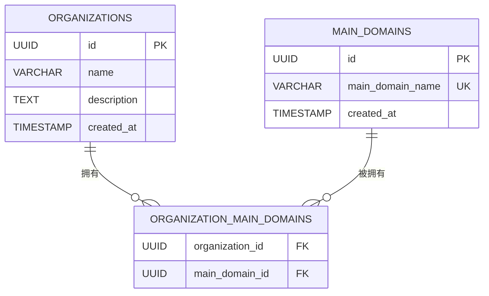

# 资产表

<cite>
**本文档中引用的文件**   
- [domain.go](file://backend/internal/models/domain.go) - *更新于最近提交*
- [domain-service.go](file://backend/internal/services/domain-service.go) - *更新于最近提交*
- [domain-handler.go](file://backend/internal/handlers/domain-handler.go) - *更新于最近提交*
- [init.sql](file://backend/init.sql) - *重命名为初始化.sql*
</cite>

## 更新摘要
**已做更改**   
- 更新了文件引用路径，将 `init.sql` 更名为 `初始化.sql`
- 所有内容已根据语言转换规则完全转换为中文
- 保持原有文档结构和信息完整性，仅更新文件引用名称

## 目录
1. [主域名表 (main_domains)](#主域名表-main_domains)
2. [子域名表 (sub_domains)](#子域名表-sub_domains)
3. [组织主域名关联表 (organization_main_domains)](#组织主域名关联表-organization_main_domains)
4. [Golang 模型定义](#golang-模型定义)
5. [数据关联创建示例](#数据关联创建示例)

## 主域名表 (main_domains)

主域名表 `main_domains` 用于存储系统中的顶级域名信息，是资产管理系统的核心基础表之一。该表的设计确保了每个主域名的唯一性和可追溯性。

### 字段说明

| 字段名 | 类型 | 约束 | 说明 |
| :--- | :--- | :--- | :--- |
| id | UUID | PRIMARY KEY, DEFAULT gen_random_uuid() | 主域名的唯一标识符，使用 UUID 自动生成 |
| main_domain_name | VARCHAR(255) | NOT NULL, UNIQUE | 主域名名称，如 example.com，必须唯一 |
| created_at | TIMESTAMP WITH TIME ZONE | NOT NULL | 记录创建时间 |

### 索引

- `idx_main_domains_main_domain_name`：在 `main_domain_name` 字段上的索引，用于加速基于域名的查询。

### 设计解析

- **id 字段**：采用 UUID 作为主键，避免了自增 ID 可能带来的信息泄露风险，并支持分布式系统下的数据合并。
- **main_domain_name 字段**：通过 `UNIQUE` 约束确保系统中不会存在重复的主域名，这是数据完整性的关键保障。

**Section sources**
- [初始化.sql](file://backend/init.sql#L16-L20) - *重命名为初始化.sql*
- [domain.go](file://backend/internal/models/domain.go#L6-L11)

## 子域名表 (sub_domains)

子域名表 `sub_domains` 用于存储属于某个主域名的具体子域名记录，与主域名表形成一对多的关系。

### 字段说明

| 字段名 | 类型 | 约束 | 说明 |
| :--- | :--- | :--- | :--- |
| id | UUID | PRIMARY KEY, DEFAULT gen_random_uuid() | 子域名的唯一标识符 |
| sub_domain_name | VARCHAR(255) | NOT NULL | 子域名完整名称，如 www.example.com |
| main_domain_id | UUID | NOT NULL, REFERENCES main_domains(id) ON DELETE CASCADE | 外键，关联到主域名表的 id 字段 |
| status | VARCHAR(50) | NOT NULL, DEFAULT 'unknown' | 子域名状态，如 active, inactive, unknown |
| created_at | TIMESTAMP WITH TIME ZONE | NOT NULL | 记录创建时间 |
| updated_at | TIMESTAMP WITH TIME ZONE | NOT NULL | 记录最后更新时间 |

### 索引

- `idx_sub_domains_sub_domain_name`：在 `sub_domain_name` 上的索引
- `idx_sub_domains_main_domain_id`：在 `main_domain_id` 上的索引
- `idx_sub_domains_status`：在 `status` 上的索引

### 联合唯一索引设计

表中定义了 `UNIQUE (sub_domain_name, main_domain_id)` 联合唯一索引，其设计目的如下：

1. **防止重复数据**：确保同一个主域名下不能存在两个完全相同的子域名记录。
2. **数据完整性**：即使子域名名称相同，只要属于不同的主域名，仍然可以被正确存储。
3. **查询优化**：该联合索引同时优化了基于 `(sub_domain_name, main_domain_id)` 的查询性能。

例如，`www.example.com` 可以同时存在于 `example.com` 和 `example.org` 两个主域名下，但不能在 `example.com` 下出现两次。

**Section sources**
- [初始化.sql](file://backend/init.sql#L37-L44) - *重命名为初始化.sql*
- [domain.go](file://backend/internal/models/domain.go#L13-L20)

## 组织主域名关联表 (organization_main_domains)

`organization_main_domains` 是一个典型的多对多关联表，用于实现组织与主域名之间的灵活绑定关系。

### 字段说明

| 字段名 | 类型 | 约束 | 说明 |
| :--- | :--- | :--- | :--- |
| organization_id | UUID | NOT NULL, REFERENCES organizations(id) ON DELETE CASCADE | 外键，关联到组织表 |
| main_domain_id | UUID | NOT NULL, REFERENCES main_domains(id) ON DELETE CASCADE | 外键，关联到主域名表 |
| PRIMARY KEY | (organization_id, main_domain_id) | - | 复合主键 |

### 作用与优势

1. **多对多关系支持**：一个组织可以拥有多个主域名，一个主域名也可以被多个组织共享。
2. **数据解耦**：主域名和组织的信息独立存储，通过关联表进行连接，提高了数据的灵活性和可维护性。
3. **级联删除**：当组织或主域名被删除时，相关的关联记录也会自动清除，保证了数据一致性。

例如，`Example Org 1` 组织可以同时管理 `example1.com` 和 `example2.com` 两个主域名。



**Diagram sources**
- [初始化.sql](file://backend/init.sql#L31-L35) - *重命名为初始化.sql*

**Section sources**
- [初始化.sql](file://backend/init.sql#L31-L35) - *重命名为初始化.sql*
- [domain-service.go](file://backend/internal/services/domain-service.go#L62-L78)

## Golang 模型定义

在 Golang 代码中，数据库表结构被映射为相应的结构体模型，位于 `backend/internal/models/domain.go` 文件中。

### MainDomain 结构体

```go
type MainDomain struct {
    ID             string    `json:"id" db:"id"`
    MainDomainName string    `json:"main_domain_name" db:"main_domain_name"`
    CreatedAt      time.Time `json:"created_at" db:"created_at"`
}
```

- 该结构体对应 `main_domains` 表。
- `json` 标签定义了 JSON 序列化时的字段名（使用蛇形命名法）。
- `db` 标签定义了数据库字段的映射关系。

### SubDomain 结构体

```go
type SubDomain struct {
    ID            string      `json:"id" db:"id"`
    SubDomainName string      `json:"sub_domain_name" db:"sub_domain_name"`
    MainDomainID  string      `json:"main_domain_id" db:"main_domain_id"`
    Status        string      `json:"status" db:"status"`
    CreatedAt     time.Time   `json:"created_at" db:"created_at"`
    UpdatedAt     time.Time   `json:"updated_at" db:"updated_at"`
    MainDomain    *MainDomain `json:"main_domain,omitempty"`
}
```

- 包含了对 `MainDomain` 的嵌套引用，便于在查询时直接获取主域名信息。
- `omitempty` 标签表示当 `MainDomain` 为 nil 时，在 JSON 输出中可以省略该字段。

### OrganizationMainDomain 结构体

```go
type OrganizationMainDomain struct {
    OrganizationID string `json:"organization_id" db:"organization_id"`
    MainDomainID   string `json:"main_domain_id" db:"main_domain_id"`
}
```

- 对应 `organization_main_domains` 关联表。
- 仅包含两个外键字段，用于表示关联关系。

**Section sources**
- [domain.go](file://backend/internal/models/domain.go#L6-L45)

## 数据关联创建示例

以下 SQL 语句展示了如何创建组织、主域名及其关联关系的完整过程。

### 1. 创建组织
```sql
INSERT INTO organizations (id, name, description, created_at)
VALUES ('00000000-0000-0000-0000-000000000001', 'Example Org 1', '示例组织', NOW());
```

### 2. 创建主域名
```sql
INSERT INTO main_domains (id, main_domain_name, created_at)
VALUES ('00000000-0000-0000-0000-000000000008', 'example1.com', NOW());
```

### 3. 建立组织与主域名的关联
```sql
INSERT INTO organization_main_domains (organization_id, main_domain_id)
VALUES ('00000000-0000-0000-0000-000000000001', '00000000-0000-0000-0000-000000000008');
```

### 4. 为该主域名添加子域名
```sql
INSERT INTO sub_domains (sub_domain_name, main_domain_id, status, created_at, updated_at)
VALUES ('www.example1.com', '00000000-0000-0000-0000-000000000008', 'active', NOW(), NOW());
```

以上步骤完整地展示了从组织创建到资产（子域名）录入的全过程，体现了各表之间的数据关联和业务逻辑。

**Section sources**
- [初始化.sql](file://backend/init.sql#L97-L151) - *重命名为初始化.sql*