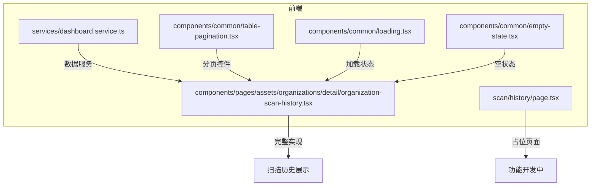
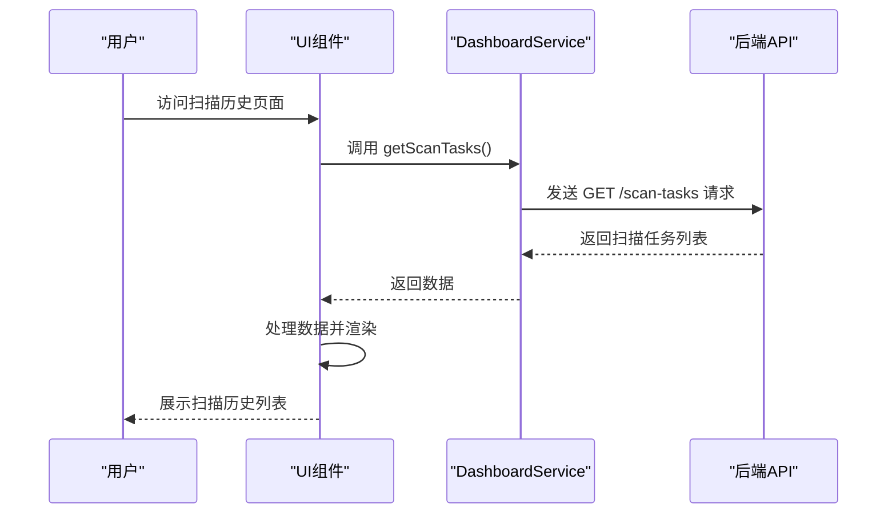
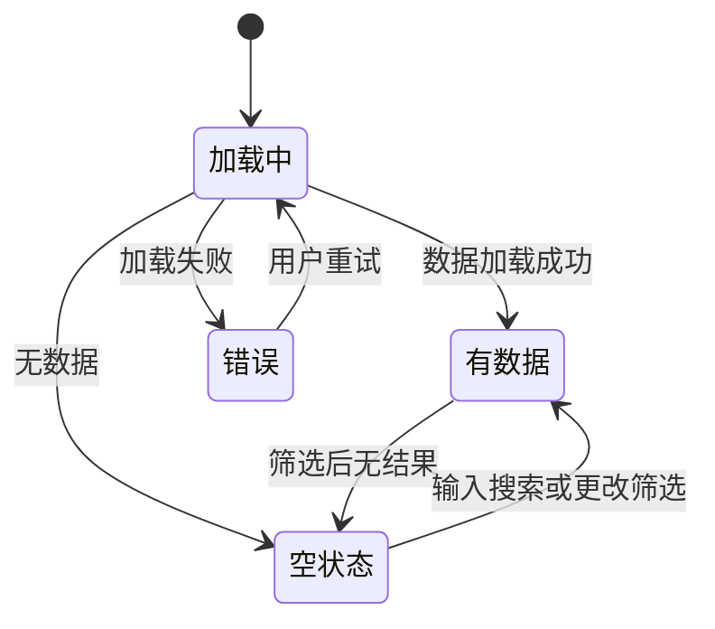
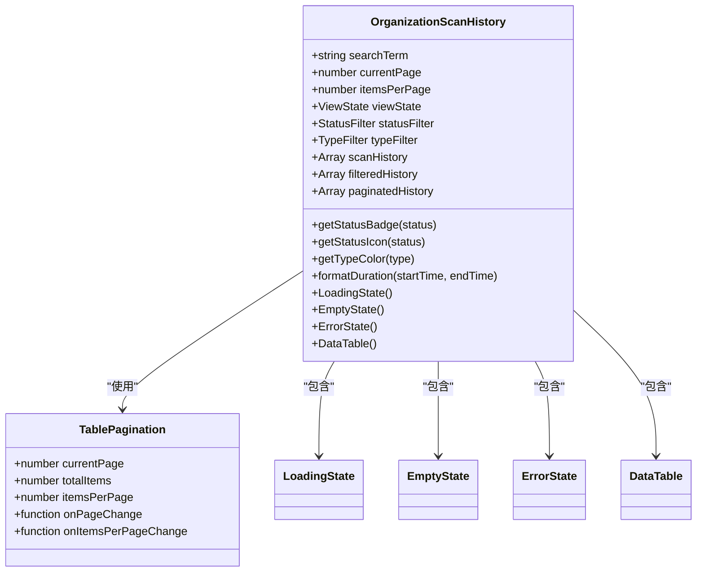
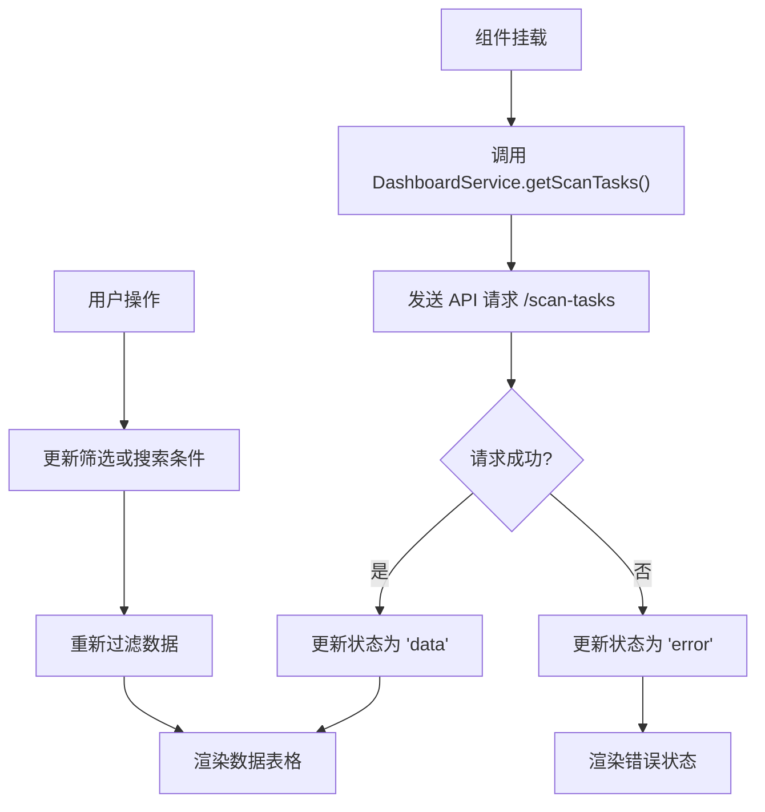
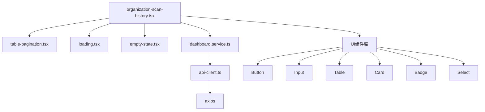

# 前端扫描历史展示

<cite>
**本文档引用的文件**  
- [page.tsx](file://front/app/scan/history/page.tsx)
- [organization-scan-history.tsx](file://front/components/pages/assets/organizations/detail/organization-scan-history.tsx)
- [dashboard.service.ts](file://front/services/dashboard.service.ts)
- [table-pagination.tsx](file://front/components/common/table-pagination.tsx)
- [loading.tsx](file://front/components/common/loading.tsx)
- [empty-state.tsx](file://front/components/common/empty-state.tsx)
</cite>

## 目录
1. [简介](#简介)
2. [项目结构](#项目结构)
3. [核心组件](#核心组件)
4. [架构概览](#架构概览)
5. [详细组件分析](#详细组件分析)
6. [依赖分析](#依赖分析)
7. [性能考虑](#性能考虑)
8. [故障排除指南](#故障排除指南)
9. [结论](#结论)

## 简介
本文档深入解析前端扫描历史页面的实现机制。尽管扫描历史功能尚未完全开发完成，但通过组织详情页中的 `organization-scan-history.tsx` 组件，可以清晰地看到其设计思路和功能预期。该页面旨在为用户提供一个直观、可交互的界面，用于查看、筛选和管理所有扫描任务的历史记录。

## 项目结构
扫描历史功能主要分布在前端应用的两个位置：全局扫描历史页面和组织详情页中的扫描历史模块。前者目前处于开发中状态，后者则提供了完整的功能原型。

**图示来源**  
- [page.tsx](file://front/app/scan/history/page.tsx)
- [organization-scan-history.tsx](file://front/components/pages/assets/organizations/detail/organization-scan-history.tsx)

**本节来源**  
- [page.tsx](file://front/app/scan/history/page.tsx)
- [organization-scan-history.tsx](file://front/components/pages/assets/organizations/detail/organization-scan-history.tsx)

## 核心组件
`organization-scan-history.tsx` 是扫描历史功能的核心实现组件，它集成了数据过滤、状态管理、UI渲染和用户交互等关键功能。该组件使用 React 的 `useState` 钩子来管理搜索、筛选、分页和视图状态，确保了用户操作的响应性和数据的一致性。

**本节来源**  
- [organization-scan-history.tsx](file://front/components/pages/assets/organizations/detail/organization-scan-history.tsx)

## 架构概览
扫描历史页面采用典型的客户端-服务端架构。前端组件负责UI展示和用户交互，通过服务层调用后端API获取数据。由于 `page.tsx` 仅显示开发中提示，实际的数据流和架构体现在 `organization-scan-history.tsx` 中。

**图示来源**  
- [dashboard.service.ts](file://front/services/dashboard.service.ts)
- [organization-scan-history.tsx](file://front/components/pages/assets/organizations/detail/organization-scan-history.tsx)

## 详细组件分析

### 扫描历史组件分析
`OrganizationScanHistory` 组件实现了完整的扫描历史管理功能，包括数据展示、过滤、分页和状态指示。

#### 数据状态管理
组件使用多种状态来管理不同的视图：
- `searchTerm`: 管理搜索输入
- `currentPage` 和 `itemsPerPage`: 管理分页
- `viewState`: 管理加载、数据、空状态和错误状态
- `statusFilter` 和 `typeFilter`: 管理筛选条件

**图示来源**  
- [organization-scan-history.tsx](file://front/components/pages/assets/organizations/detail/organization-scan-history.tsx)

#### UI组件与交互
组件提供了丰富的UI元素和交互功能：
- **头部统计卡片**: 显示总扫描次数、成功扫描、失败扫描和最近扫描时间
- **搜索栏**: 支持按扫描ID或执行者搜索
- **筛选下拉框**: 支持按扫描类型和状态筛选
- **数据表格**: 展示扫描历史的详细信息
- **分页控件**: 支持分页浏览

**图示来源**  
- [organization-scan-history.tsx](file://front/components/pages/assets/organizations/detail/organization-scan-history.tsx)
- [table-pagination.tsx](file://front/components/common/table-pagination.tsx)

**本节来源**  
- [organization-scan-history.tsx](file://front/components/pages/assets/organizations/detail/organization-scan-history.tsx)
- [table-pagination.tsx](file://front/components/common/table-pagination.tsx)

### 数据获取流程
尽管 `organization-scan-history.tsx` 使用了模拟数据，但其设计与 `dashboard.service.ts` 中的服务方法相匹配，预示了未来的真实数据获取流程。

**图示来源**  
- [dashboard.service.ts](file://front/services/dashboard.service.ts)
- [organization-scan-history.tsx](file://front/components/pages/assets/organizations/detail/organization-scan-history.tsx)

**本节来源**  
- [dashboard.service.ts](file://front/services/dashboard.service.ts)
- [organization-scan-history.tsx](file://front/components/pages/assets/organizations/detail/organization-scan-history.tsx)

## 依赖分析
扫描历史组件依赖于多个前端模块和服务，形成了清晰的依赖链。

**图示来源**  
- [organization-scan-history.tsx](file://front/components/pages/assets/organizations/detail/organization-scan-history.tsx)
- [dashboard.service.ts](file://front/services/dashboard.service.ts)
- [table-pagination.tsx](file://front/components/common/table-pagination.tsx)
- [loading.tsx](file://front/components/common/loading.tsx)
- [empty-state.tsx](file://front/components/common/empty-state.tsx)

**本节来源**  
- [organization-scan-history.tsx](file://front/components/pages/assets/organizations/detail/organization-scan-history.tsx)
- [dashboard.service.ts](file://front/services/dashboard.service.ts)

## 性能考虑
当前实现使用了客户端分页和过滤，这对于小到中等规模的数据集是高效的。对于大规模数据，建议实现服务器端分页和过滤，以减少前端内存占用和提高响应速度。此外，可以考虑使用虚拟滚动来优化长列表的渲染性能。

## 故障排除指南
- **页面显示“功能开发中”**: 这是正常现象，因为 `page.tsx` 尚未实现完整功能。
- **数据加载失败**: 检查网络连接和后端API服务状态。
- **筛选无结果**: 确认筛选条件是否过于严格，或尝试清除搜索框。
- **分页不工作**: 检查 `currentPage` 和 `itemsPerPage` 状态是否正确更新。

**本节来源**  
- [page.tsx](file://front/app/scan/history/page.tsx)
- [organization-scan-history.tsx](file://front/components/pages/assets/organizations/detail/organization-scan-history.tsx)

## 结论
虽然全局扫描历史页面仍在开发中，但 `organization-scan-history.tsx` 组件提供了一个功能完整、设计良好的实现范例。它展示了如何通过React组件化开发，结合状态管理、数据过滤和分页控件，构建一个用户友好的扫描历史管理界面。未来的工作应集中在将模拟数据替换为真实API调用，并优化大规模数据的处理性能。