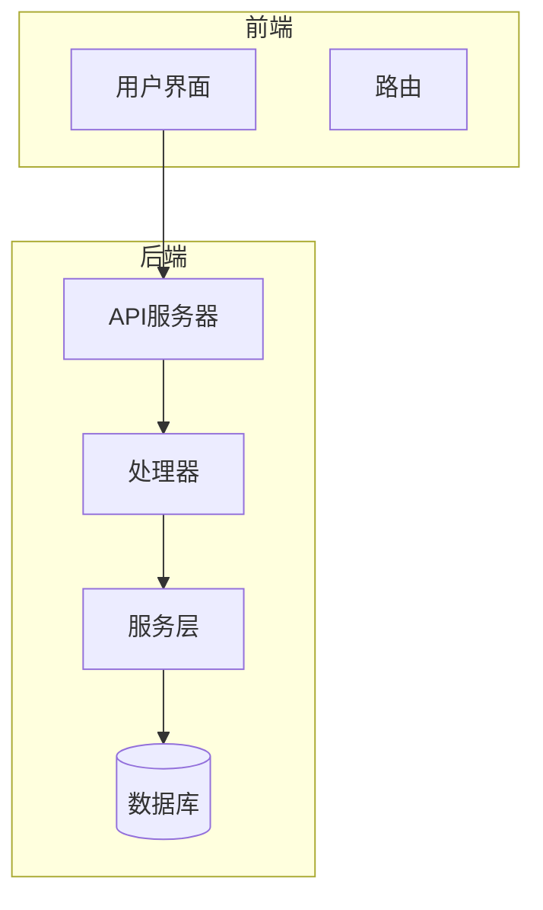
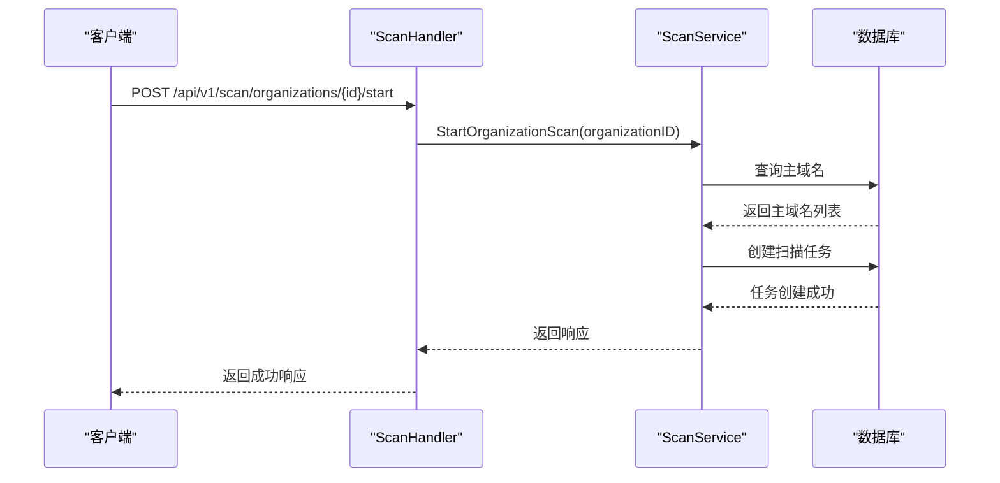
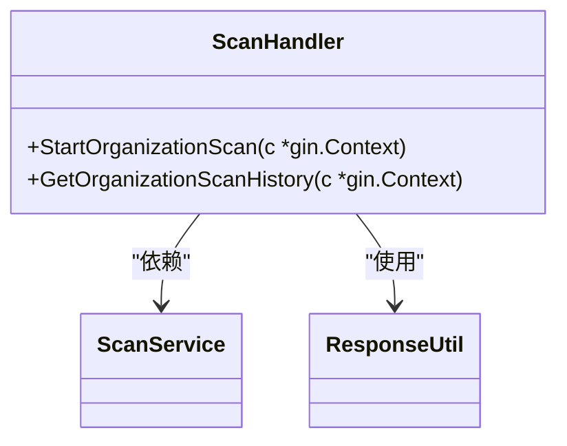
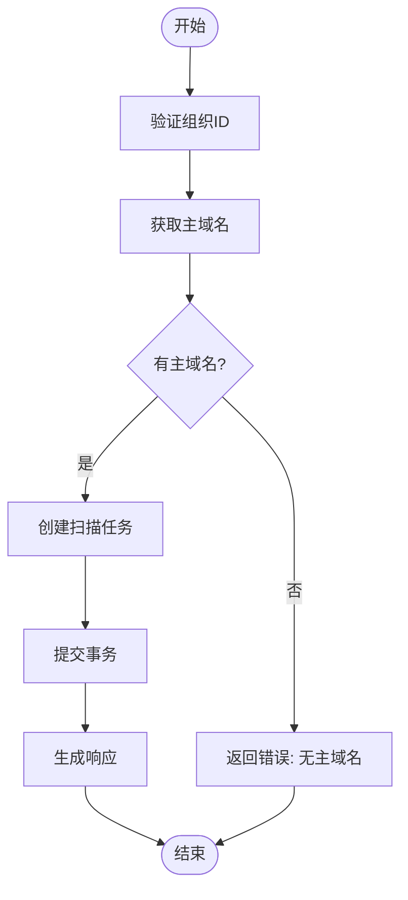
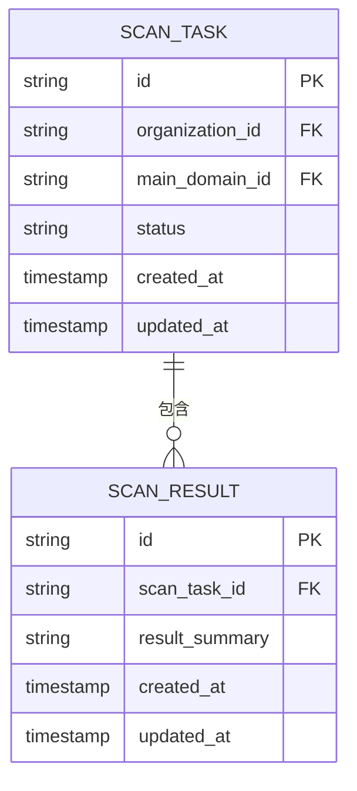
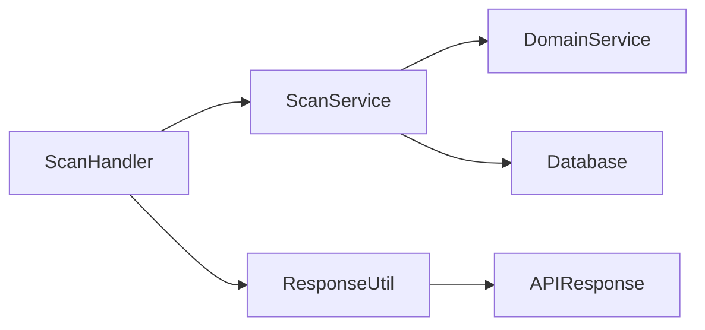

# 扫描API接口

<cite>
**本文档引用的文件**   
- [scan-handler.go](file://backend/internal/handlers/scan-handler.go)
- [scan-service.go](file://backend/internal/services/scan-service.go)
- [scan.go](file://backend/internal/models/scan.go)
- [response.go](file://backend/internal/models/response.go)
- [utils/response.go](file://backend/internal/utils/response.go)
- [routes.go](file://backend/routes/routes.go)
</cite>

## 目录
1. [简介](#简介)
2. [项目结构](#项目结构)
3. [核心组件](#核心组件)
4. [架构概览](#架构概览)
5. [详细组件分析](#详细组件分析)
6. [依赖分析](#依赖分析)
7. [性能考虑](#性能考虑)
8. [故障排除指南](#故障排除指南)
9. [结论](#结论)

## 简介
本文档详细描述了与扫描管理相关的RESTful API接口。重点涵盖启动扫描任务、获取扫描历史和查询单个扫描详情等核心功能。文档详细说明了每个接口的HTTP方法、URL路径、请求头、请求体结构和响应格式，并解释了参数校验逻辑、错误码定义以及安全控制措施。

## 项目结构
项目采用分层架构设计，后端基于Gin框架实现RESTful API，前端使用Next.js构建用户界面。后端代码组织清晰，分为`handlers`（控制器）、`services`（服务层）、`models`（数据模型）和`routes`（路由配置）等模块。

**图示来源**
- [routes.go](file://backend/routes/routes.go#L1-L64)
- [scan-handler.go](file://backend/internal/handlers/scan-handler.go#L1-L48)

**本节来源**
- [routes.go](file://backend/routes/routes.go#L1-L64)
- [scan-handler.go](file://backend/internal/handlers/scan-handler.go#L1-L48)

## 核心组件
核心组件包括扫描处理器（scan-handler）、扫描服务（scan-service）和扫描数据模型（scan.go）。这些组件共同实现了扫描任务的创建、状态管理和历史记录查询功能。

**本节来源**
- [scan-handler.go](file://backend/internal/handlers/scan-handler.go#L1-L48)
- [scan-service.go](file://backend/internal/services/scan-service.go#L1-L121)

## 架构概览
系统采用典型的MVC架构模式，API请求通过路由分发到对应的处理器，处理器调用服务层进行业务逻辑处理，服务层与数据库交互完成数据持久化。

**图示来源**
- [scan-handler.go](file://backend/internal/handlers/scan-handler.go#L1-L48)
- [scan-service.go](file://backend/internal/services/scan-service.go#L1-L121)

## 详细组件分析

### 扫描处理器分析
扫描处理器负责处理与扫描相关的HTTP请求，包括启动扫描和获取扫描历史。

#### 处理器方法

**图示来源**
- [scan-handler.go](file://backend/internal/handlers/scan-handler.go#L1-L48)

**本节来源**
- [scan-handler.go](file://backend/internal/handlers/scan-handler.go#L1-L48)

### 扫描服务分析
扫描服务实现了核心业务逻辑，包括验证组织是否有可扫描的主域名、创建扫描任务等。

#### 服务方法流程

**图示来源**
- [scan-service.go](file://backend/internal/services/scan-service.go#L1-L121)

**本节来源**
- [scan-service.go](file://backend/internal/services/scan-service.go#L1-L121)

### 数据模型分析
定义了扫描相关的数据结构，包括扫描任务、扫描结果和API响应格式。

#### 数据模型关系

**图示来源**
- [scan.go](file://backend/internal/models/scan.go#L1-L40)
- [response.go](file://backend/internal/models/response.go#L1-L8)

**本节来源**
- [scan.go](file://backend/internal/models/scan.go#L1-L40)
- [response.go](file://backend/internal/models/response.go#L1-L8)

## 依赖分析
扫描功能依赖于组织和域名管理模块，通过服务层的协作完成完整的业务流程。

**图示来源**
- [scan-handler.go](file://backend/internal/handlers/scan-handler.go#L1-L48)
- [scan-service.go](file://backend/internal/services/scan-service.go#L1-L121)

**本节来源**
- [scan-handler.go](file://backend/internal/handlers/scan-handler.go#L1-L48)
- [scan-service.go](file://backend/internal/services/scan-service.go#L1-L121)

## 性能考虑
- 使用数据库事务确保批量创建扫描任务的原子性
- 查询操作添加了适当的索引以提高性能
- 响应数据经过精简，只返回必要信息

## 故障排除指南
常见问题及解决方案：

**本节来源**
- [utils/response.go](file://backend/internal/utils/response.go#L1-L48)
- [scan-service.go](file://backend/internal/services/scan-service.go#L1-L121)

### 错误码说明
- **400 Bad Request**: 请求参数错误，如组织ID为空或组织没有主域名
- **404 Not Found**: 请求的资源不存在
- **500 Internal Server Error**: 服务器内部错误，如数据库操作失败

## 结论
扫描API接口设计合理，功能完整，通过清晰的分层架构实现了扫描任务的全生命周期管理。建议在实际部署时添加更多的监控和日志记录，以便更好地跟踪扫描任务的执行情况。