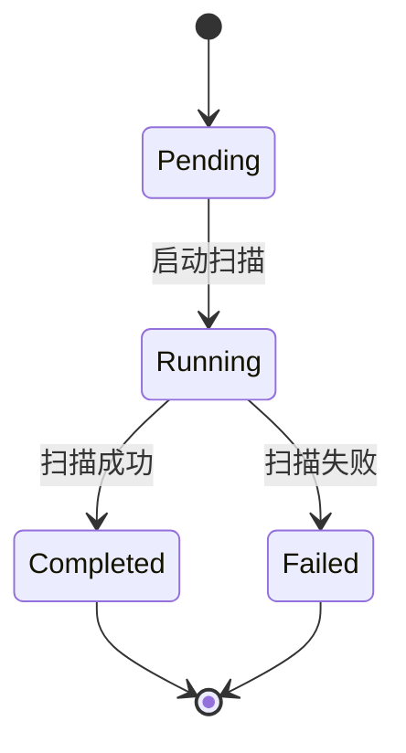
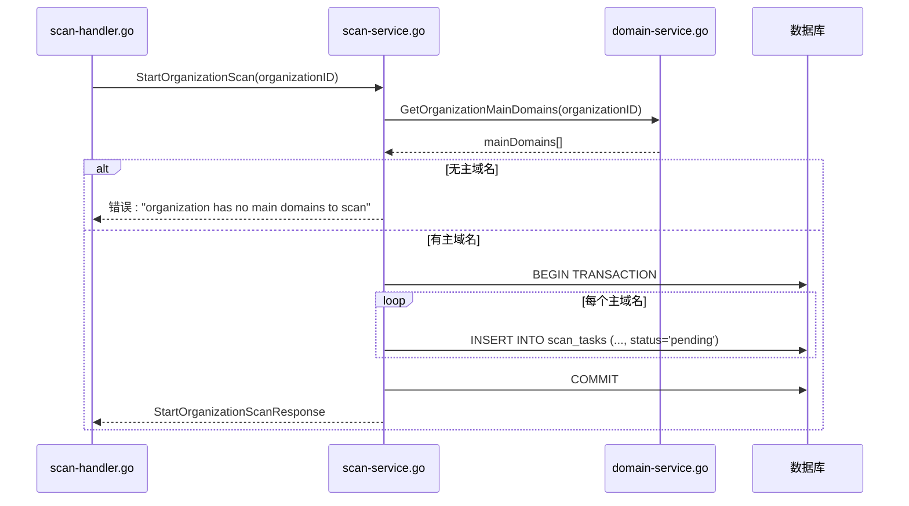

# 扫描任务模型

<cite>
**本文档引用的文件**   
- [scan.go](file://backend/internal/models/scan.go)
- [scan-service.go](file://backend/internal/services/scan-service.go)
- [scan-handler.go](file://backend/internal/handlers/scan-handler.go)
- [初始化.sql](file://backend/初始化.sql)
</cite>

## 目录
1. [扫描任务模型](#扫描任务模型)
2. [核心数据结构](#核心数据结构)
3. [扫描状态机与生命周期](#扫描状态机与生命周期)
4. [数据库设计与索引策略](#数据库设计与索引策略)
5. [实体关系与ER图](#实体关系与er图)
6. [业务逻辑与服务流程](#业务逻辑与服务流程)
7. [API接口与请求处理](#api接口与请求处理)
8. [模型验证与边界处理](#模型验证与边界处理)

## 核心数据结构

本节详细说明 `scan.go` 文件中定义的核心数据结构及其字段含义。

### ScanTask 扫描任务模型

`ScanTask` 结构体是扫描任务的核心数据模型，用于表示一次针对特定主域名的扫描任务。

**字段说明：**

- **ID**: `string` - 任务的唯一标识符，使用UUID生成，对应数据库中的 `id` 字段。
- **OrganizationID**: `string` - 关联的组织ID，标识该扫描任务属于哪个组织，对应数据库中的 `organization_id` 字段。
- **MainDomainID**: `string` - 关联的主域名ID，标识本次扫描的目标主域名，对应数据库中的 `main_domain_id` 字段。
- **Status**: `string` - 任务当前状态，表示扫描的执行阶段，其值为预定义的字符串（如 "pending", "running", "completed", "failed"），对应数据库中的 `status` 字段。
- **CreatedAt**: `time.Time` - 任务创建时间，记录任务被创建的精确时间戳，对应数据库中的 `created_at` 字段。
- **UpdatedAt**: `time.Time` - 任务更新时间，每次任务状态变更时，此字段都会被更新为当前时间，对应数据库中的 `updated_at` 字段。

```go
// ScanTask 扫描任务模型
type ScanTask struct {
	ID             string    `json:"id" db:"id"`
	OrganizationID string    `json:"organization_id" db:"organization_id"`
	MainDomainID   string    `json:"main_domain_id" db:"main_domain_id"`
	Status         string    `json:"status" db:"status"`
	CreatedAt      time.Time `json:"created_at" db:"created_at"`
	UpdatedAt      time.Time `json:"updated_at" db:"updated_at"`
}
```

### 其他相关模型

- **ScanResult**: 扫描结果模型，通过 `ScanTaskID` 字段与 `ScanTask` 建立关联，存储扫描的摘要信息。
- **StartOrganizationScanRequest**: 启动组织扫描的请求体模型，包含 `OrganizationID` 字段。
- **StartOrganizationScanResponse**: 启动组织扫描的响应体模型，包含 `TaskID` 和 `Message` 字段。
- **GetOrganizationScanHistoryResponse**: 获取组织扫描历史的响应体模型，包含 `ScanTasks` 切片。

**Section sources**
- [scan.go](file://backend/internal/models/scan.go#L7-L40)

## 扫描状态机与生命周期

扫描任务在其生命周期内会经历一系列状态转换，形成一个状态机。

### 状态定义

根据 `初始化.sql` 文件中的表结构和 `scan-service.go` 中的代码，`scan_tasks` 表的 `status` 字段默认值为 `'pending'`，并且在示例数据中出现了以下状态：
- **待扫描 (pending)**: 任务已创建，但尚未开始执行。
- **进行中 (running)**: 任务已启动，正在执行扫描。
- **已完成 (completed)**: 任务成功执行完毕。
- **失败 (failed)**: 任务执行过程中发生错误而终止。

### 状态转换逻辑与触发条件

状态转换由业务逻辑驱动，主要在 `scan-service.go` 的 `StartOrganizationScan` 方法中实现。

1.  **创建 (Creation)**:
    *   **触发条件**: 调用 `StartOrganizationScan` 服务方法。
    *   **转换**: 任务被创建时，其状态**直接初始化为 "pending"**。这是通过SQL语句中的 `DEFAULT 'pending'` 和代码中显式插入 `'pending'` 实现的。
    *   **代码依据**: `scan-service.go` 第55行：`_, err = tx.Exec(insertQuery, taskID, organizationID, mainDomain.ID, "pending")`

2.  **待扫描 -> 进行中 (Pending -> Running)**:
    *   **触发条件**: 在 `StartOrganizationScan` 方法中，事务成功提交后，理论上应有后续的异步处理逻辑（如Goroutine）来启动实际的扫描工作。虽然当前代码注释了此部分，但设计上应在此时将状态更新为 "running"。
    *   **转换**: 任务从等待队列中被取出并开始执行。
    *   **代码依据**: `scan-service.go` 第68行注释：`// 这里可以添加实际的扫描逻辑，比如启动 goroutine 进行扫描`

3.  **进行中 -> 已完成 (Running -> Completed)**:
    *   **触发条件**: 扫描过程成功结束。
    *   **转换**: 更新 `scan_tasks` 表中该任务的 `status` 为 "completed"，并创建对应的 `ScanResult` 记录。
    *   **代码依据**: 此逻辑在当前代码中未实现，但 `初始化.sql` 中的示例数据证明了此状态的存在。

4.  **进行中 -> 失败 (Running -> Failed)**:
    *   **触发条件**: 扫描过程中发生不可恢复的错误。
    *   **转换**: 更新 `scan_tasks` 表中该任务的 `status` 为 "failed"，并可能在 `ScanResult` 或其他地方记录错误信息。
    *   **代码依据**: `初始化.sql` 中的示例数据包含状态为 "failed" 的任务。

**状态转换图**


**Diagram sources**
- [初始化.sql](file://backend/初始化.sql#L102-L103)
- [scan-service.go](file://backend/internal/services/scan-service.go#L55)

## 数据库设计与索引策略

### 数据库表结构

`scan_tasks` 表是 `ScanTask` 模型在数据库中的持久化形式。

```sql
CREATE TABLE scan_tasks (
    id UUID PRIMARY KEY DEFAULT gen_random_uuid(),
    organization_id UUID NOT NULL REFERENCES organizations(id) ON DELETE CASCADE,
    main_domain_id UUID NOT NULL REFERENCES main_domains(id) ON DELETE CASCADE,
    status VARCHAR(50) NOT NULL DEFAULT 'pending',
    created_at TIMESTAMP WITH TIME ZONE NOT NULL,
    updated_at TIMESTAMP WITH TIME ZONE NOT NULL
);
```

### 索引设计

为了支持高效的查询，数据库在 `初始化.sql` 脚本中创建了多个索引：

- **按组织ID查询**: `CREATE INDEX IF NOT EXISTS idx_scan_tasks_org_id ON scan_tasks(organization_id);`
  *   **目的**: 支持 `GetOrganizationScanHistory` 等功能，快速检索某个组织的所有扫描任务。
  *   **查询示例**: `SELECT * FROM scan_tasks WHERE organization_id = 'xxx';`

- **按状态查询**: `CREATE INDEX IF NOT EXISTS idx_scan_tasks_status ON scan_tasks(status);`
  *   **目的**: 支持监控和管理，例如快速找出所有 "pending" 或 "running" 的任务。
  *   **查询示例**: `SELECT * FROM scan_tasks WHERE status = 'running';`

- **复合索引**: 虽然没有显式创建 `(organization_id, status)` 的复合索引，但数据库优化器可以利用单列索引的组合来高效处理此类查询。如果此类查询非常频繁，创建复合索引将是进一步的优化。

**Section sources**
- [初始化.sql](file://backend/初始化.sql#L100-L111)

## 实体关系与ER图

扫描任务模型与组织、主域名等实体存在明确的关联关系。

```mermaid
erDiagram
ORGANIZATIONS {
UUID id PK
string name
timestamp created_at
}
MAIN_DOMAINS {
UUID id PK
string main_domain_name
timestamp created_at
}
SCAN_TASKS {
UUID id PK
UUID organization_id FK
UUID main_domain_id FK
string status
timestamp created_at
timestamp updated_at
}
SCAN_RESULTS {
UUID id PK
UUID scan_task_id FK
text result_summary
timestamp created_at
timestamp updated_at
}
ORGANIZATIONS ||--o{ SCAN_TASKS : "拥有"
MAIN_DOMAINS ||--o{ SCAN_TASKS : "作为目标"
SCAN_TASKS ||--o{ SCAN_RESULTS : "产生"
```



**Diagram sources**
- [初始化.sql](file://backend/初始化.sql#L78-L111)
- [scan.go](file://backend/internal/models/scan.go#L7-L15)

## 业务逻辑与服务流程

`ScanService` 是处理扫描任务业务逻辑的核心服务。

### StartOrganizationScan (启动组织扫描)

1.  **输入**: 组织ID (`organizationID`)。
2.  **获取主域名**: 通过 `DomainService` 查询该组织关联的所有主域名。
3.  **验证**: 如果组织没有主域名，则返回错误。
4.  **创建任务**: 在一个数据库事务中，为每个主域名创建一个 `scan_tasks` 记录，状态初始化为 "pending"。
5.  **提交事务**: 成功提交事务，确保数据一致性。
6.  **返回响应**: 返回一个包含代表性的任务ID和成功消息的 `StartOrganizationScanResponse`。



**Diagram sources**
- [scan-service.go](file://backend/internal/services/scan-service.go#L30-L75)
- [scan-handler.go](file://backend/internal/handlers/scan-handler.go#L7-L23)

### GetOrganizationScanHistory (获取组织扫描历史)

1.  **输入**: 组织ID (`organizationID`)。
2.  **查询数据库**: 执行SQL查询，从 `scan_tasks` 表中检索所有 `organization_id` 匹配的记录。
3.  **排序**: 按 `created_at` 降序排列，最新的任务在前。
4.  **返回结果**: 将查询到的 `ScanTask` 对象列表返回。

**Section sources**
- [scan-service.go](file://backend/internal/services/scan-service.go#L85-L115)

## API接口与请求处理

HTTP请求通过 `scan-handler.go` 中的Gin框架处理器进行路由和处理。

### StartOrganizationScan

- **HTTP方法**: `POST`
- **路径**: `/api/organizations/:id/scan` (根据 `c.Param("id")` 推断)
- **请求处理流程**:
    1.  从URL路径参数中提取 `organizationID`。
    2.  调用 `ScanService.StartOrganizationScan`。
    3.  根据服务返回结果，使用 `utils` 工具包返回成功或错误的HTTP响应。

### GetOrganizationScanHistory

- **HTTP方法**: `GET`
- **路径**: `/api/organizations/:id/scan-history` (根据 `c.Param("id")` 推断)
- **请求处理流程**:
    1.  从URL路径参数中提取 `organizationID`。
    2.  调用 `ScanService.GetOrganizationScanHistory`。
    3.  根据服务返回结果，使用 `utils` 工具包返回成功或错误的HTTP响应。

**Section sources**
- [scan-handler.go](file://backend/internal/handlers/scan-handler.go#L7-L48)

## 模型验证与边界情况处理

### 模型验证

- **输入验证**: 在 `scan-handler.go` 中，通过检查 `c.Param("id")` 是否为空来验证组织ID的有效性。
- **业务逻辑验证**: 在 `scan-service.go` 中，通过检查 `mainDomains` 切片的长度来验证组织是否有主域名。

### 边界情况处理

- **重复扫描请求**: 当前实现中，每次调用 `StartOrganizationScan` 都会为组织的每个主域名创建新的扫描任务，**没有内置的去重机制**。这意味着可以为同一个主域名创建多个状态为 "pending" 的任务。如果需要去重，可以在创建任务前查询数据库，检查是否存在相同 `organization_id` 和 `main_domain_id` 且状态为 "pending" 或 "running" 的任务。
- **空组织ID**: 请求处理器会检查 `organizationID` 是否为空，若为空则返回400错误。
- **不存在的组织ID**: 数据库查询会返回空结果，`GetOrganizationMainDomains` 会返回一个空切片，从而触发 "organization has no main domains to scan" 的错误。
- **数据库错误**: 服务层捕获所有数据库错误（如 `tx.Exec`, `rows.Scan`），记录日志，并将错误向上抛出，最终由处理器返回500错误。

**Section sources**
- [scan-handler.go](file://backend/internal/handlers/scan-handler.go#L8-L11)
- [scan-service.go](file://backend/internal/services/scan-service.go#L35-L38)