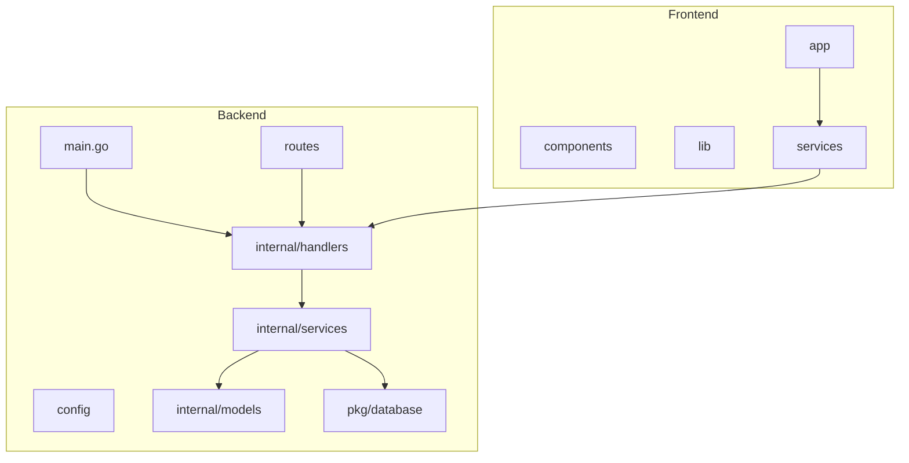
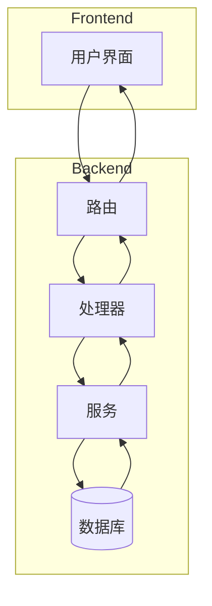
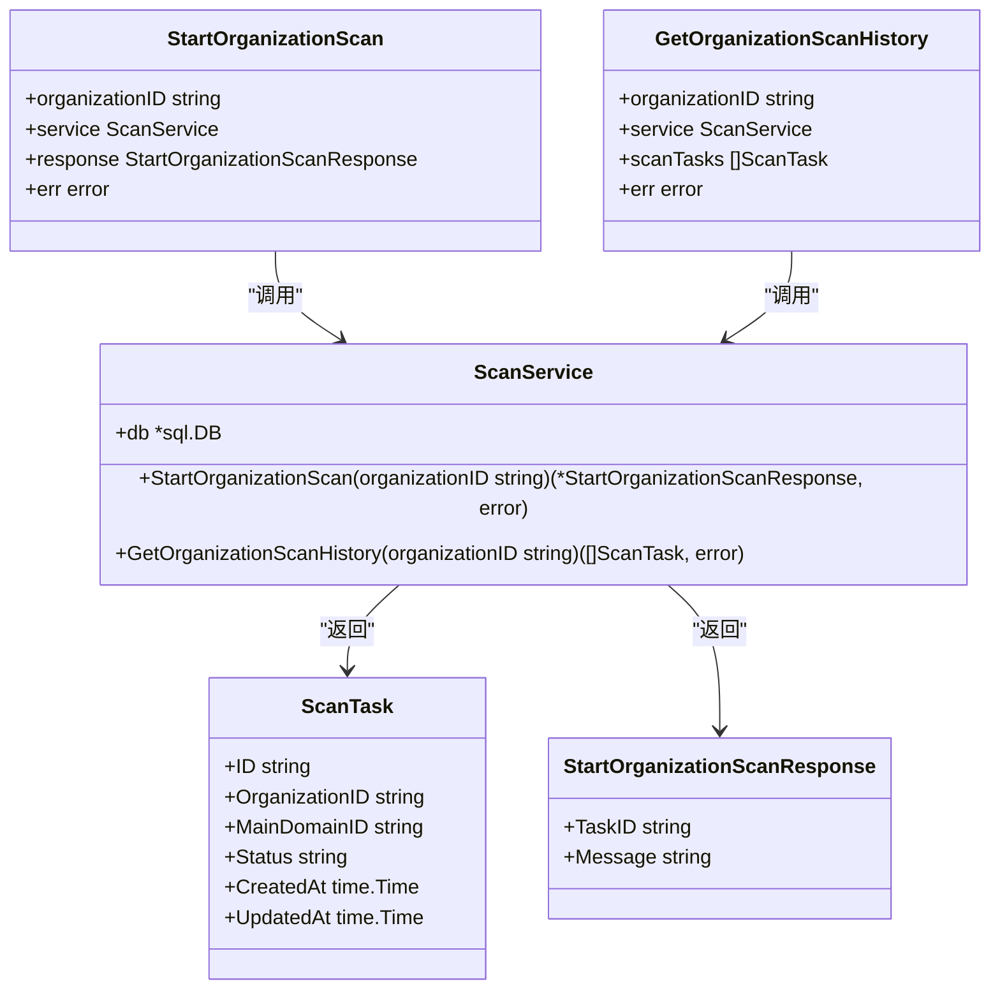
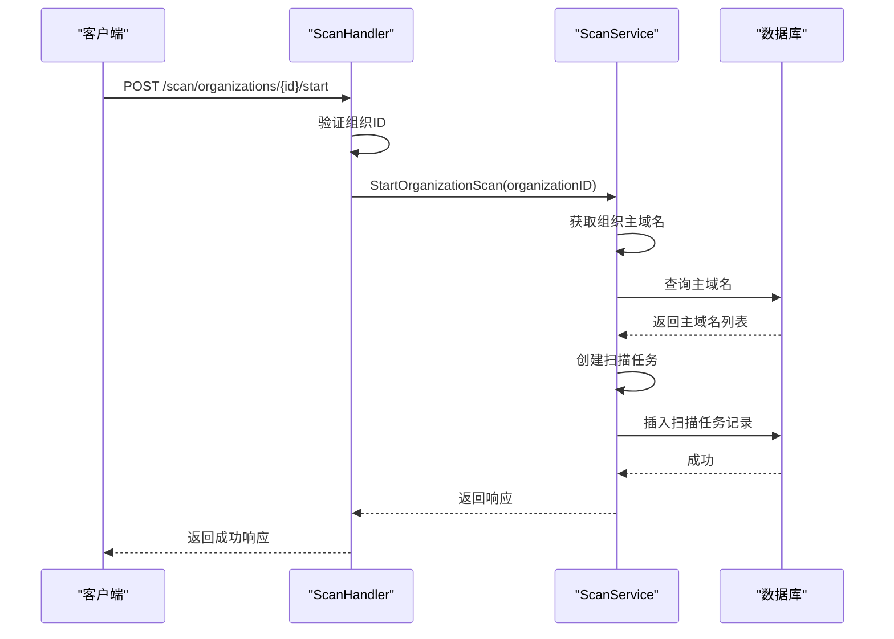
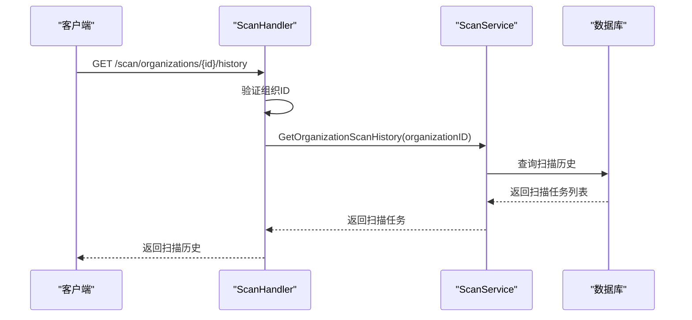
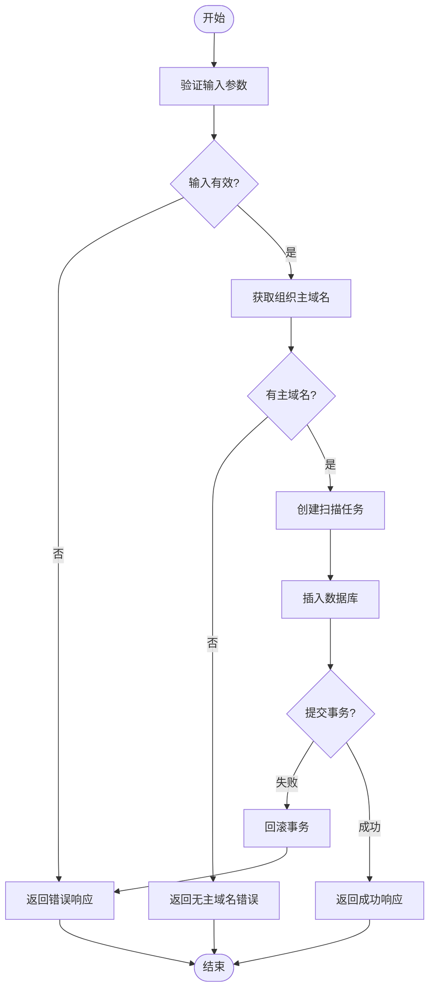
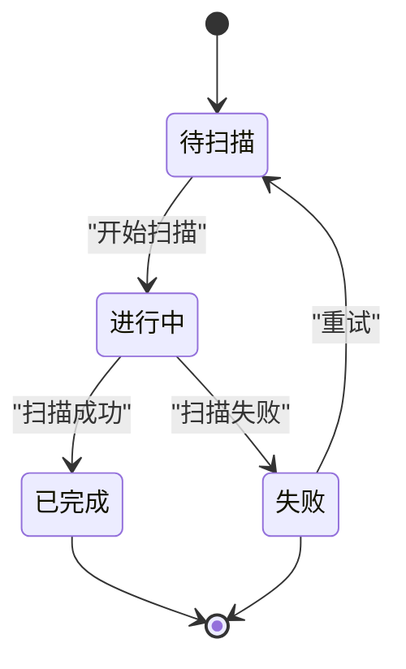

# 扫描管理模块

<cite>
**本文档引用的文件**   
- [scan-handler.go](file://backend/internal/handlers/scan-handler.go)
- [scan-service.go](file://backend/internal/services/scan-service.go)
- [scan.go](file://backend/internal/models/scan.go)
- [database.go](file://backend/pkg/database/database.go)
- [response.go](file://backend/internal/utils/response.go)
- [routes.go](file://backend/routes/routes.go)
- [domain-service.go](file://backend/internal/services/domain-service.go)
</cite>

## 目录
1. [简介](#简介)
2. [项目结构](#项目结构)
3. [核心组件](#核心组件)
4. [架构概览](#架构概览)
5. [详细组件分析](#详细组件分析)
6. [依赖分析](#依赖分析)
7. [性能考虑](#性能考虑)
8. [故障排查指南](#故障排查指南)
9. [结论](#结论)

## 简介
本文档系统性地文档化了扫描管理模块，涵盖扫描任务的启动、配置、执行监控和历史记录查看功能。重点分析了 `scan-handler.go` 中定义的 API 端点，包括扫描请求的参数结构、验证逻辑和响应格式。详细说明了扫描任务的状态机设计（如待扫描、进行中、已完成、失败等）及其在数据库中的存储方式。结合前端页面展示了扫描历史的实现逻辑，包括分页查询和状态过滤。提供了启动一次完整扫描任务的代码示例和调用流程图。讨论了扫描调度策略、资源隔离机制和超时处理方案。最后列出了常见扫描失败的原因及对应的日志排查路径。

## 项目结构
本项目采用分层架构设计，主要分为前端（front）和后端（backend）两大部分。后端采用 Go 语言开发，使用 Gin 框架处理 HTTP 请求，结构清晰，职责分明。



**图示来源**
- [main.go](file://backend/cmd/main.go)
- [routes.go](file://backend/routes/routes.go)

**本节来源**
- [scan-handler.go](file://backend/internal/handlers/scan-handler.go)
- [scan-service.go](file://backend/internal/services/scan-service.go)

## 核心组件
扫描管理模块的核心组件包括 `ScanHandler`、`ScanService` 和 `ScanTask` 模型。`ScanHandler` 负责处理 HTTP 请求，`ScanService` 实现业务逻辑，`ScanTask` 定义了扫描任务的数据结构。

**本节来源**
- [scan-handler.go](file://backend/internal/handlers/scan-handler.go#L1-L48)
- [scan-service.go](file://backend/internal/services/scan-service.go#L1-L121)
- [scan.go](file://backend/internal/models/scan.go#L1-L40)

## 架构概览
扫描管理模块的架构遵循典型的 MVC 模式，由路由层、处理器层、服务层和数据访问层组成。用户通过前端发起请求，路由将请求分发到相应的处理器，处理器调用服务层进行业务处理，服务层通过数据库访问层与数据库交互。



**图示来源**
- [routes.go](file://backend/routes/routes.go#L1-L64)
- [scan-handler.go](file://backend/internal/handlers/scan-handler.go#L1-L48)

## 详细组件分析

### 扫描处理器分析
`scan-handler.go` 文件定义了两个核心 API 端点：`StartOrganizationScan` 和 `GetOrganizationScanHistory`。前者用于启动组织扫描，后者用于获取组织扫描历史。

#### 扫描处理器类图


**图示来源**
- [scan-handler.go](file://backend/internal/handlers/scan-handler.go#L1-L48)
- [scan-service.go](file://backend/internal/services/scan-service.go#L1-L121)

#### 启动组织扫描序列图


**图示来源**
- [scan-handler.go](file://backend/internal/handlers/scan-handler.go#L7-L25)
- [scan-service.go](file://backend/internal/services/scan-service.go#L25-L75)

#### 获取组织扫描历史序列图


**图示来源**
- [scan-handler.go](file://backend/internal/handlers/scan-handler.go#L27-L48)
- [scan-service.go](file://backend/internal/services/scan-service.go#L77-L121)

**本节来源**
- [scan-handler.go](file://backend/internal/handlers/scan-handler.go#L1-L48)
- [scan-service.go](file://backend/internal/services/scan-service.go#L1-L121)

### 扫描服务分析
`ScanService` 是扫描管理模块的核心业务逻辑实现。它负责创建扫描任务、查询扫描历史等操作。服务通过数据库连接与 `scan_tasks` 表进行交互。

#### 扫描服务流程图


**图示来源**
- [scan-service.go](file://backend/internal/services/scan-service.go#L25-L75)

**本节来源**
- [scan-service.go](file://backend/internal/services/scan-service.go#L1-L121)

### 扫描任务状态机
扫描任务在系统中存在多种状态，构成了一个状态机。主要状态包括：待扫描（pending）、进行中（running）、已完成（completed）、失败（failed）。



**图示来源**
- [scan.go](file://backend/internal/models/scan.go#L1-L40)

**本节来源**
- [scan.go](file://backend/internal/models/scan.go#L1-L40)

## 依赖分析
扫描管理模块依赖于多个其他模块和服务，形成了复杂的依赖关系网络。

```mermaid
graph TD
scan-handler@StartOrganizationScan[StartOrganizationScan]:::function
scan-handler@GetOrganizationScanHistory[GetOrganizationScanHistory]:::function
scan-service@ScanService[ScanService]:::struct
scan-service@StartOrganizationScan[StartOrganizationScan]:::method
scan-service@GetOrganizationScanHistory[GetOrganizationScanHistory]:::method
database@GetDB[GetDB]:::function
domain-service@NewDomainService[NewDomainService]:::function
domain-service@GetOrganizationMainDomains[GetOrganizationMainDomains]:::method
utils@SuccessResponse[SuccessResponse]:::function
utils@BadRequestResponse[BadRequestResponse]:::function
utils@InternalServerErrorResponse[InternalServerErrorResponse]:::function
scan-handler@StartOrganizationScan --> scan-service@StartOrganizationScan
scan-handler@GetOrganizationScanHistory --> scan-service@GetOrganizationScanHistory
scan-service@StartOrganizationScan --> domain-service@GetOrganizationMainDomains
scan-service@StartOrganizationScan --> database@GetDB
scan-service@GetOrganizationScanHistory --> database@GetDB
scan-handler@StartOrganizationScan --> utils@SuccessResponse
scan-handler@StartOrganizationScan --> utils@BadRequestResponse
scan-handler@StartOrganizationScan --> utils@InternalServerErrorResponse
scan-handler@GetOrganizationScanHistory --> utils@SuccessResponse
scan-handler@GetOrganizationScanHistory --> utils@BadRequestResponse
scan-handler@GetOrganizationScanHistory --> utils@InternalServerErrorResponse
```

**图示来源**
- [scan-handler.go](file://backend/internal/handlers/scan-handler.go)
- [scan-service.go](file://backend/internal/services/scan-service.go)
- [domain-service.go](file://backend/internal/services/domain-service.go)
- [database.go](file://backend/pkg/database/database.go)
- [response.go](file://backend/internal/utils/response.go)

**本节来源**
- [scan-handler.go](file://backend/internal/handlers/scan-handler.go)
- [scan-service.go](file://backend/internal/services/scan-service.go)

## 性能考虑
扫描管理模块在设计时考虑了性能因素。通过使用数据库事务确保数据一致性，批量插入扫描任务提高效率。建议在高并发场景下对数据库连接池进行优化，并考虑使用消息队列异步处理扫描任务，避免阻塞 HTTP 请求。

## 故障排查指南
以下是常见扫描失败的原因及对应的日志排查路径：

1. **组织ID为空**：检查客户端请求参数，确保传递了有效的组织ID。
   - 日志路径：`scan-handler.go` 第10行

2. **组织没有主域名**：检查该组织是否已配置主域名。
   - 日志路径：`scan-service.go` 第45行

3. **数据库连接失败**：检查数据库服务是否正常运行，连接配置是否正确。
   - 日志路径：`database.go` 第35行

4. **事务提交失败**：检查数据库是否有足够的权限，表结构是否正确。
   - 日志路径：`scan-service.go` 第65行

5. **扫描任务创建失败**：检查 `scan_tasks` 表是否存在，字段定义是否匹配。
   - 日志路径：`scan-service.go` 第55行

**本节来源**
- [scan-handler.go](file://backend/internal/handlers/scan-handler.go#L1-L48)
- [scan-service.go](file://backend/internal/services/scan-service.go#L1-L121)
- [database.go](file://backend/pkg/database/database.go#L1-L94)

## 结论
扫描管理模块实现了完整的扫描任务生命周期管理，从任务创建到历史查询，功能完整，结构清晰。通过合理的分层设计和依赖管理，保证了代码的可维护性和可扩展性。建议后续增加扫描任务的实时状态推送功能，并优化扫描调度策略，提高系统整体性能。