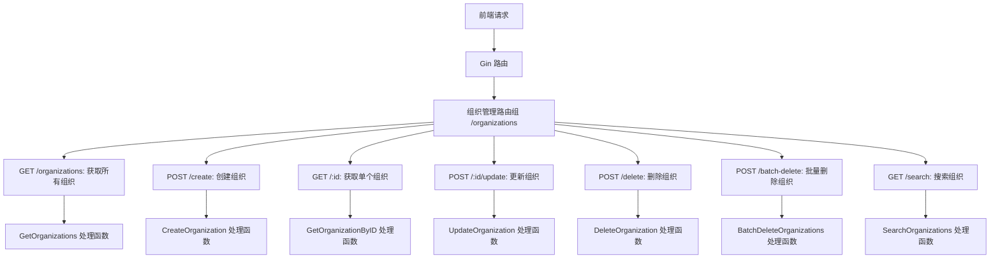
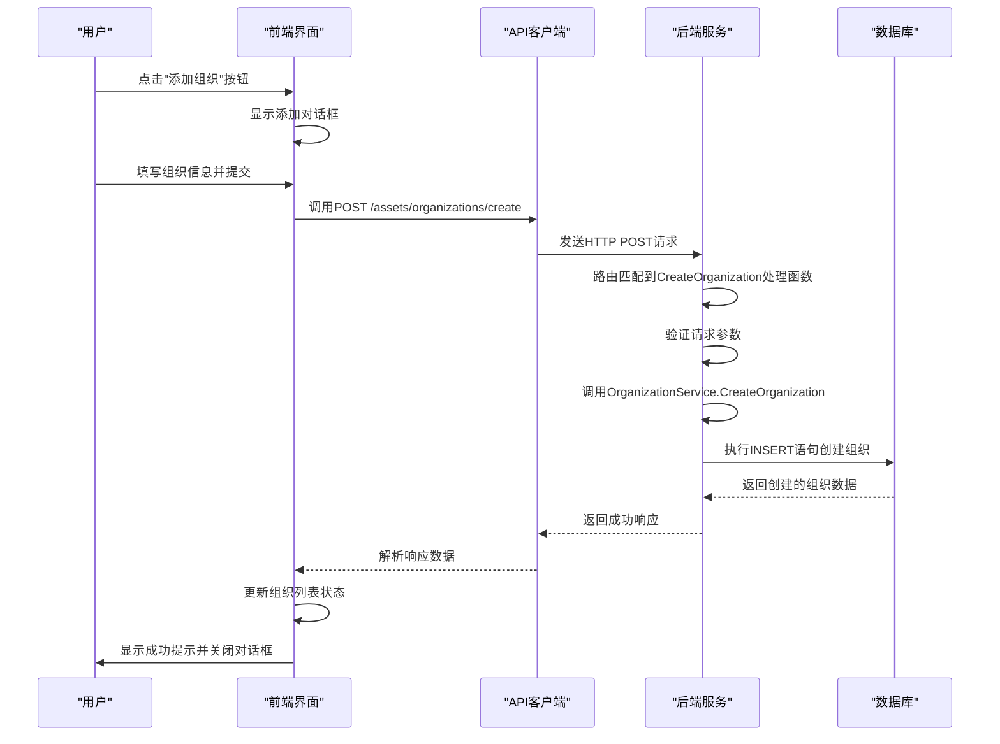
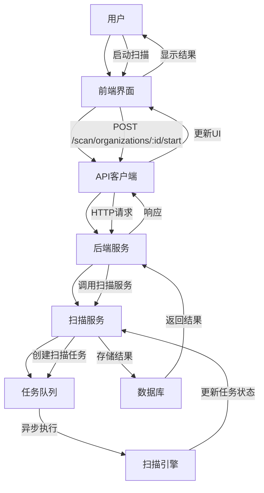

# 核心功能模块

<cite>
**本文档引用的文件**   
- [main.go](file://backend/cmd/main.go)
- [config.go](file://backend/config/config.go)
- [routes.go](file://backend/routes/routes.go)
- [organization-handler.go](file://backend/internal/handlers/organization-handler.go)
- [organization-service.go](file://backend/internal/services/organization-service.go)
- [organization.go](file://backend/internal/models/organization.go)
- [organization-list.tsx](file://front/components/pages/assets/organizations/organization-list.tsx)
- [add-organization-dialog.tsx](file://front/components/pages/assets/organizations/add-organization-dialog.tsx)
- [API_DOCUMENTATION.md](file://backend/API_DOCUMENTATION.md)
</cite>

## 目录
1. [组织管理模块](#组织管理模块)
2. [资产管理模块](#资产管理模块)
3. [扫描管理模块](#扫描管理模块)

## 组织管理模块

组织管理模块是系统的核心功能之一，提供组织的增删改查、搜索过滤和批量操作等完整功能。该模块采用前后端分离架构，通过RESTful API进行数据交互。

### 业务目标
组织管理模块旨在为用户提供一个集中管理资产组织的界面，支持创建、查看、编辑、删除组织信息，并提供搜索和批量操作功能，便于用户高效管理多个资产组织。

### 用户交互流程
1. **创建组织**：用户点击"添加组织"按钮，填写组织名称和描述，提交后组织被创建并实时显示在列表中。
2. **查看组织**：用户进入组织管理页面，系统自动加载所有组织列表，支持分页显示。
3. **编辑组织**：用户点击组织操作栏的编辑按钮，修改信息后保存。
4. **删除组织**：用户点击删除按钮，系统弹出确认对话框，确认后删除该组织。
5. **搜索组织**：用户在搜索框输入关键词，系统实时过滤显示匹配的组织。
6. **批量删除**：用户选择多个组织后执行批量删除操作。

### 技术实现路径

#### 后端实现
后端采用Gin框架实现RESTful API，组织管理相关的路由在`routes/routes.go`中定义：



**Diagram sources**
- [routes.go](file://backend/routes/routes.go#L10-L64)
- [organization-handler.go](file://backend/internal/handlers/organization-handler.go#L1-L211)

#### 服务层实现
组织服务层（`organization-service.go`）封装了数据库操作逻辑，实现了CRUD功能：

```go
// CreateOrganization 创建组织
func (s *OrganizationService) CreateOrganization(req models.CreateOrganizationRequest) (*models.Organization, error) {
	id := uuid.New().String()

	query := `
		INSERT INTO organizations (id, name, description, created_at)
		VALUES ($1, $2, $3, NOW())
		RETURNING id, name, description, created_at
	`

	var org models.Organization
	err := s.db.QueryRow(query, id, req.Name, req.Description).Scan(
		&org.ID, &org.Name, &org.Description, &org.CreatedAt)
	if err != nil {
		logrus.WithError(err).Error("Failed to create organization")
		return nil, err
	}

	return &org, nil
}

// DeleteOrganization 删除组织
func (s *OrganizationService) DeleteOrganization(organizationID string) error {
	query := `DELETE FROM organizations WHERE id = $1`

	result, err := s.db.Exec(query, organizationID)
	if err != nil {
		logrus.WithError(err).Error("Failed to delete organization")
		return err
	}

	rowsAffected, err := result.RowsAffected()
	if err != nil {
		logrus.WithError(err).Error("Failed to get rows affected")
		return err
	}

	if rowsAffected == 0 {
		return fmt.Errorf("organization not found")
	}

	return nil
}
```

**Section sources**
- [organization-service.go](file://backend/internal/services/organization-service.go#L56-L104)
- [organization-service.go](file://backend/internal/services/organization-service.go#L98-L156)

#### 前端实现
前端使用React组件实现用户界面，主要包含组织列表组件和添加组织对话框组件。

组织列表组件（`organization-list.tsx`）负责显示组织数据和处理用户交互：

```typescript
// 初始化时加载组织数据
useEffect(() => {
  fetchOrganizations();
}, []);

const fetchOrganizations = async () => {
  try {
    setViewState("loading");
    setError(null);

    const response = await api.get<OrganizationsApiResponse>('/assets/organizations');

    if (response.data.code === "SUCCESS" && Array.isArray(response.data.data)) {
      setOrganizations(response.data.data);
      setViewState(response.data.data.length > 0 ? "data" : "empty");
    } else {
      throw new Error("API 返回了无效的数据格式");
    }
  } catch (err: any) {
    console.error('Error fetching organizations:', err);
    setError(getErrorMessage(err));
    setViewState("error");
  }
};

// 删除组织
const confirmDelete = async () => {
  if (!organizationToDelete) return

  try {
    await api.post('/assets/organizations/delete', {
      organizationId: organizationToDelete.id
    });
    setOrganizations((prev) => prev.filter((org) => org.id !== organizationToDelete.id))
    toast({
      title: "删除成功",
      description: `组织 "${organizationToDelete.name}" 已被删除`,
    })
    setDeleteDialogOpen(false)
    setOrganizationToDelete(null)
  } catch (err: any) {
    console.error('Error deleting organization:', err);
    toast({
      title: "删除失败",
      description: getErrorMessage(err),
      variant: "destructive",
    });
  }
}
```

添加组织对话框组件（`add-organization-dialog.tsx`）处理组织创建逻辑：

```typescript
const handleSubmit = async () => {
  try {
    // 使用新的统一 POST API
    const response = await api.post("/assets/organizations/create", {
      name: formData.name,
      description: formData.description,
    })

    if (response.data.code === "SUCCESS" && response.data.data) {
      onAdd(response.data.data)
      toast({
        title: "添加成功",
        description: `组织 "${formData.name}" 已成功添加`,
      })
    } else {
      toast({
        title: "错误",
        description: response.data.message || "创建组织失败，请重试。",
        variant: "destructive",
      })
    }
  } catch (error: any) {
    toast({
      title: "错误",
      description: getErrorMessage(error),
      variant: "destructive",
    })
  } finally {
    setFormData({
      name: "",
      description: "",
    })
    setOpen(false)
  }
}
```

**Section sources**
- [organization-list.tsx](file://front/components/pages/assets/organizations/organization-list.tsx#L95-L141)
- [organization-list.tsx](file://front/components/pages/assets/organizations/organization-list.tsx#L139-L168)
- [add-organization-dialog.tsx](file://front/components/pages/assets/organizations/add-organization-dialog.tsx#L60-L101)

#### API调用流程
组织创建的完整API调用流程如下：



**Diagram sources**
- [organization-handler.go](file://backend/internal/handlers/organization-handler.go#L20-L40)
- [organization-service.go](file://backend/internal/services/organization-service.go#L56-L104)
- [add-organization-dialog.tsx](file://front/components/pages/assets/organizations/add-organization-dialog.tsx#L60-L101)

### 使用场景示例
1. **安全团队管理**：安全团队可以为不同的客户或项目创建独立的组织，便于分类管理资产和漏洞。
2. **多租户环境**：在多租户SaaS应用中，每个租户对应一个组织，实现数据隔离。
3. **部门资产管理**：大型企业可以为不同部门创建组织，如"研发部"、"市场部"等，分别管理各自的资产。

### 常见问题解决方案
1. **组织创建失败**：
   - 检查网络连接是否正常
   - 确认后端服务是否运行
   - 查看浏览器控制台和后端日志获取错误详情

2. **组织列表加载缓慢**：
   - 检查数据库性能
   - 确认是否有大量组织数据需要加载
   - 考虑实现分页加载而非一次性加载所有数据

3. **删除组织后列表未更新**：
   - 确认前端是否正确处理了删除响应
   - 检查是否需要手动刷新页面
   - 验证前端状态管理逻辑是否正确

## 资产管理模块

资产管理模块负责管理组织的主域名和子域名，支持域名的增删改查操作。

### 主域名管理
主域名是组织的核心资产，一个组织可以关联多个主域名。主域名管理提供以下功能：
- 获取组织的主域名列表
- 为组织创建主域名
- 移除组织与主域名的关联

### 子域名管理
子域名是主域名的派生资产，系统支持：
- 获取组织的子域名列表（支持分页）
- 为特定主域名创建子域名
- 管理子域名的状态信息

**Section sources**
- [API_DOCUMENTATION.md](file://backend/API_DOCUMENTATION.md#L65-L118)

## 扫描管理模块

扫描管理模块负责组织的漏洞扫描任务，提供扫描启动和历史记录查看功能。

### 扫描启动
用户可以为特定组织启动扫描任务，系统会为该组织的所有主域名创建相应的扫描任务。

### 扫描历史
用户可以查看指定组织的扫描历史记录，了解过去的扫描任务状态和时间。



**Diagram sources**
- [API_DOCUMENTATION.md](file://backend/API_DOCUMENTATION.md#L119-L140)
- [routes.go](file://backend/routes/routes.go#L35-L42)

**Section sources**
- [API_DOCUMENTATION.md](file://backend/API_DOCUMENTATION.md#L119-L140)