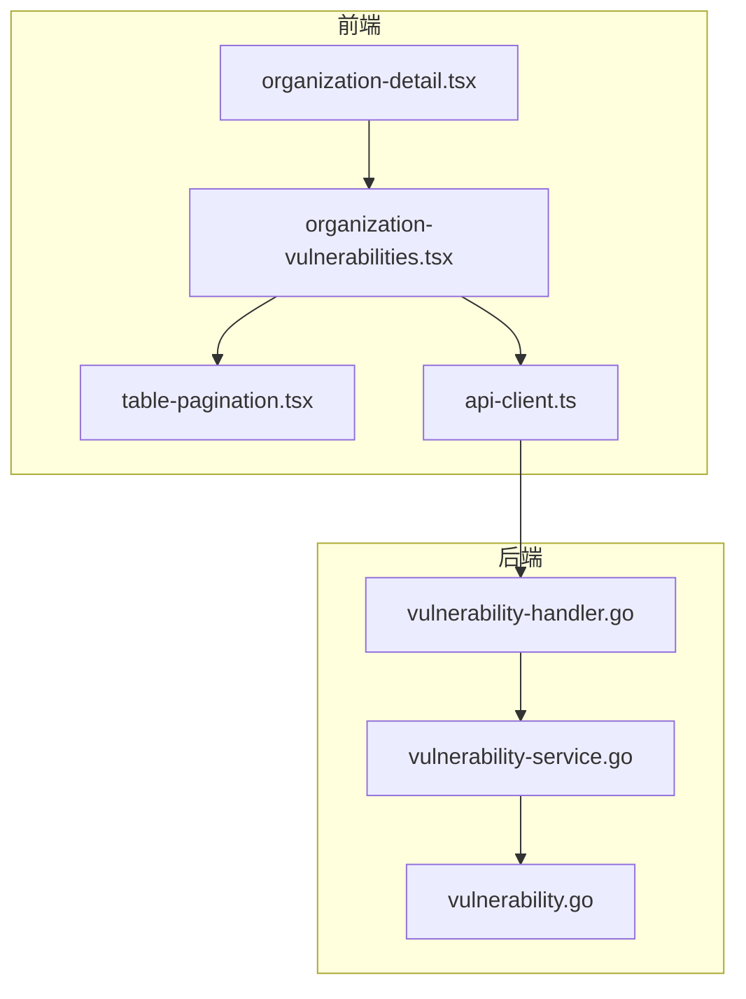
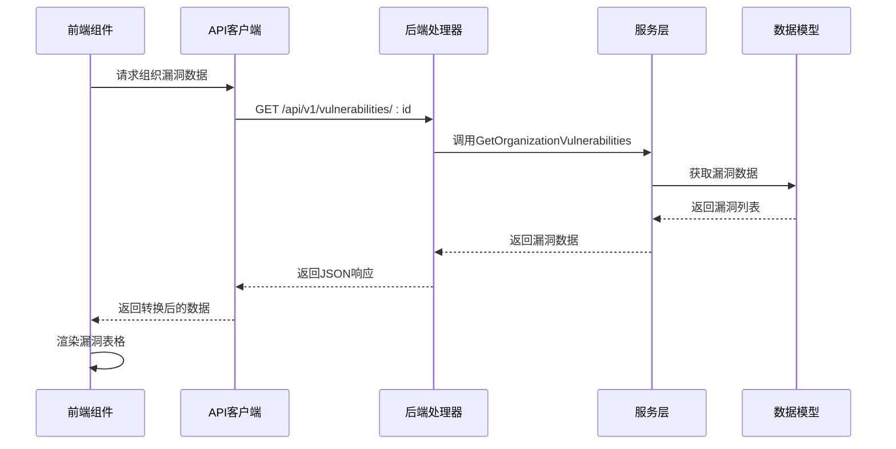
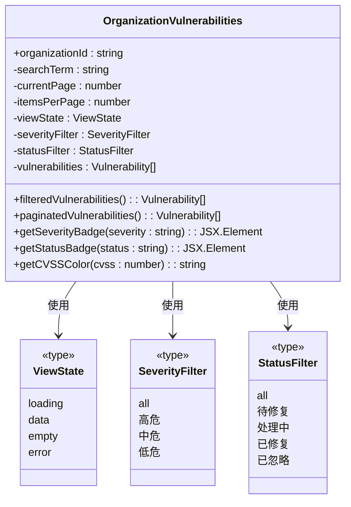
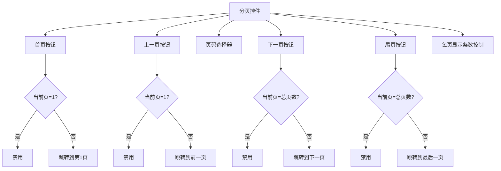
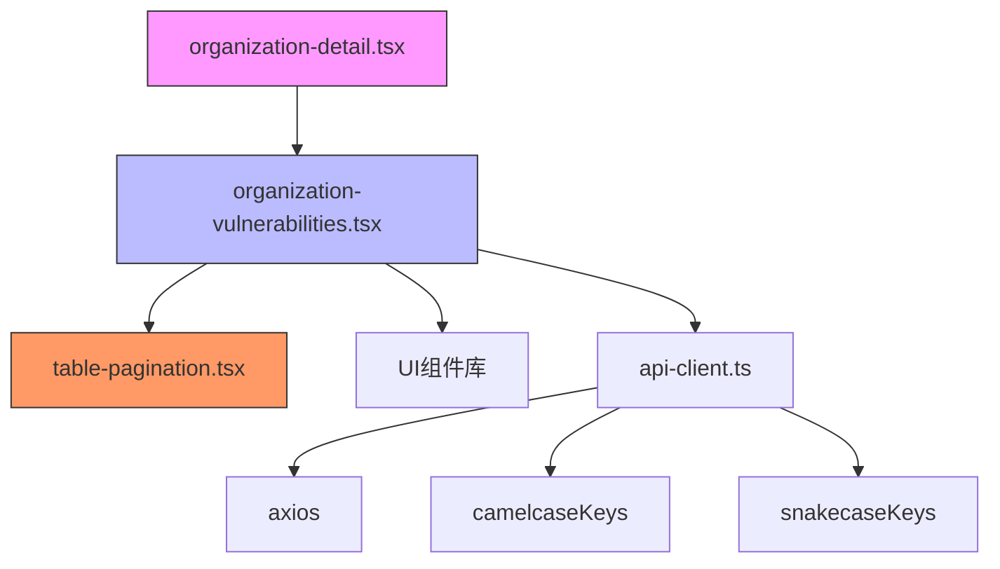

# 前端漏洞展示组件

<cite>
**本文档引用的文件**   
- [organization-vulnerabilities.tsx](file://front/components/pages/assets/organizations/detail/organization-vulnerabilities.tsx)
- [table-pagination.tsx](file://front/components/common/table-pagination.tsx)
- [vulnerability-handler.go](file://backend/internal/handlers/vulnerability-handler.go)
- [vulnerability-service.go](file://backend/internal/services/vulnerability-service.go)
- [vulnerability.go](file://backend/internal/models/vulnerability.go)
- [api-client.ts](file://front/lib/api-client.ts)
- [organization-detail.tsx](file://front/components/pages/assets/organizations/organization-detail.tsx)
</cite>

## 目录
1. [简介](#简介)
2. [项目结构](#项目结构)
3. [核心组件](#核心组件)
4. [架构概览](#架构概览)
5. [详细组件分析](#详细组件分析)
6. [依赖分析](#依赖分析)
7. [性能考虑](#性能考虑)
8. [故障排除指南](#故障排除指南)
9. [结论](#结论)

## 简介
本文档详细描述了前端漏洞展示组件 `organization-vulnerabilities.tsx` 的结构与功能。该组件用于展示组织相关的安全漏洞信息，包括漏洞表格渲染、分页控件集成、筛选器（按严重性、状态）实现等核心功能。文档将深入分析组件的数据获取机制、状态管理、UI交互流程以及可访问性设计。

## 项目结构
本项目采用前后端分离架构，前端使用React框架构建，后端使用Go语言开发。前端组件主要位于 `front/components` 目录下，按功能模块组织。漏洞展示组件位于 `front/components/pages/assets/organizations/detail/` 路径下，是组织详情页面的一个标签页。



**图示来源**
- [organization-vulnerabilities.tsx](file://front/components/pages/assets/organizations/detail/organization-vulnerabilities.tsx)
- [vulnerability-handler.go](file://backend/internal/handlers/vulnerability-handler.go)

## 核心组件
`organization-vulnerabilities.tsx` 组件是组织漏洞信息展示的核心，主要功能包括：
- 漏洞数据的表格化展示
- 支持按关键字、严重程度和状态进行筛选
- 分页功能支持大量数据的浏览
- 头部统计卡片显示关键指标
- 响应式设计适配不同屏幕尺寸

该组件通过API服务获取数据，并处理加载状态和错误情况。组件使用了React的 `useState` 和 `useEffect` 钩子进行状态管理，实现了完整的用户交互流程。

**组件来源**
- [organization-vulnerabilities.tsx](file://front/components/pages/assets/organizations/detail/organization-vulnerabilities.tsx)

## 架构概览
系统采用典型的前后端分离架构，前端通过RESTful API与后端通信。漏洞数据从后端数据库获取，经过服务层处理后返回给前端组件展示。



**图示来源**
- [organization-vulnerabilities.tsx](file://front/components/pages/assets/organizations/detail/organization-vulnerabilities.tsx)
- [vulnerability-handler.go](file://backend/internal/handlers/vulnerability-handler.go)
- [vulnerability-service.go](file://backend/internal/services/vulnerability-service.go)

## 详细组件分析

### 组件结构与功能
`organization-vulnerabilities.tsx` 组件实现了完整的漏洞信息展示功能，包括数据获取、状态管理、筛选过滤和分页控制。

#### 组件属性与状态管理
组件定义了明确的属性接口和多种状态类型，使用React的 `useState` 钩子进行状态管理。



**图示来源**
- [organization-vulnerabilities.tsx](file://front/components/pages/assets/organizations/detail/organization-vulnerabilities.tsx#L142-L170)

#### 漏洞表格渲染
组件使用UI库的Table组件渲染漏洞数据，表格包含多个列：漏洞标题、严重程度、影响域名、发现日期、状态和操作。

```tsx
<Table>
  <TableHeader>
    <TableRow>
      <TableHead>漏洞标题</TableHead>
      <TableHead>严重程度</TableHead>
      <TableHead>影响域名</TableHead>
      <TableHead>发现日期</TableHead>
      <TableHead>状态</TableHead>
      <TableHead>操作</TableHead>
    </TableRow>
  </TableHeader>
  <TableBody>
    {paginatedVulnerabilities.map((vuln) => (
      <TableRow key={vuln.id}>
        <TableCell>{vuln.title}</TableCell>
        <TableCell>{getSeverityBadge(vuln.severity)}</TableCell>
        <TableCell>{vuln.domain}</TableCell>
        <TableCell>{new Date(vuln.discoveredDate).toLocaleDateString("zh-CN")}</TableCell>
        <TableCell>{getStatusBadge(vuln.status)}</TableCell>
        <TableCell>
          <Button variant="ghost" size="sm">
            <Eye className="h-4 w-4" />
          </Button>
        </TableCell>
      </TableRow>
    ))}
  </TableBody>
</Table>
```

**组件来源**
- [organization-vulnerabilities.tsx](file://front/components/pages/assets/organizations/detail/organization-vulnerabilities.tsx)

#### 分页控件集成
组件集成了 `TablePagination` 组件，实现了完整的分页功能。分页控件支持跳转到首页、上一页、下一页、尾页，以及选择特定页码。



**图示来源**
- [table-pagination.tsx](file://front/components/common/table-pagination.tsx)

#### 筛选器实现
组件实现了两个主要的筛选器：按严重程度筛选和按状态筛选。用户可以通过下拉菜单选择筛选条件，组件会实时更新显示的数据。

```tsx
<Select value={severityFilter} onValueChange={(value: SeverityFilter) => setSeverityFilter(value)}>
  <SelectTrigger className="w-[120px]">
    <SelectValue placeholder="严重程度" />
  </SelectTrigger>
  <SelectContent>
    <SelectItem value="all">全部严重程度</SelectItem>
    <SelectItem value="高危">高危</SelectItem>
    <SelectItem value="中危">中危</SelectItem>
    <SelectItem value="低危">低危</SelectItem>
  </SelectContent>
</Select>
```

筛选逻辑通过数组的 `filter` 方法实现，结合搜索关键字、严重程度和状态三个条件进行过滤。

```typescript
const filteredVulnerabilities = vulnerabilities.filter((vuln) => {
  const matchesSearch = 
    vuln.title.toLowerCase().includes(searchTerm.toLowerCase()) ||
    vuln.description.toLowerCase().includes(searchTerm.toLowerCase()) ||
    vuln.domain.toLowerCase().includes(searchTerm.toLowerCase()) ||
    vuln.cve.toLowerCase().includes(searchTerm.toLowerCase())
  
  const matchesSeverity = severityFilter === "all" || vuln.severity === severityFilter
  const matchesStatus = statusFilter === "all" || vuln.status === statusFilter
  
  return matchesSearch && matchesSeverity && matchesStatus
})
```

**组件来源**
- [organization-vulnerabilities.tsx](file://front/components/pages/assets/organizations/detail/organization-vulnerabilities.tsx)

#### 数据获取与状态处理
虽然当前代码使用模拟数据，但组件设计支持从API获取真实数据。通过 `api-client.ts` 文件可以看出，前端使用axios进行HTTP请求，并配置了请求和响应拦截器。

```typescript
// 请求拦截器：发送时转换为 snake_case
apiClient.interceptors.request.use(
  (config) => {
    if (config.data && typeof config.data === 'object') {
      config.data = snakecaseKeys(config.data, { deep: true });
    }
    return config;
  }
);

// 响应拦截器：接收时转换为 camelCase
apiClient.interceptors.response.use(
  (response) => {
    if (response.data && typeof response.data === 'object') {
      response.data = camelcaseKeys(response.data, { deep: true });
    }
    return response;
  }
);
```

组件定义了四种视图状态：加载中、有数据、无数据和错误，通过条件渲染显示不同的UI。

```tsx
{viewState === "loading" && <LoadingState />}
{viewState === "empty" && <EmptyState />}
{viewState === "error" && <ErrorState />}
{viewState === "data" && <DataTable />}
```

**组件来源**
- [api-client.ts](file://front/lib/api-client.ts)
- [organization-vulnerabilities.tsx](file://front/components/pages/assets/organizations/detail/organization-vulnerabilities.tsx)

#### 详情弹窗设计
虽然当前代码未实现详情弹窗，但从操作按钮的设计可以看出，点击"查看"按钮应该会打开漏洞详情弹窗。弹窗应展示漏洞的详细技术信息和修复建议。

```tsx
<Button variant="ghost" size="sm">
  <Eye className="h-4 w-4" />
</Button>
```

理想的详情弹窗应包含以下信息：
- 漏洞标题和CVE编号
- 严重程度和CVSS评分
- 影响的域名和端口
- 漏洞描述和技术细节
- POC（概念验证）攻击代码
- 修复建议和解决方案
- 发现日期和当前状态

**组件来源**
- [organization-vulnerabilities.tsx](file://front/components/pages/assets/organizations/detail/organization-vulnerabilities.tsx)

### UI交互流程
用户与漏洞展示组件的交互流程如下：

```mermaid
flowchart TD
A[进入组织详情页面] --> B[选择"漏洞"标签页]
B --> C[显示漏洞表格]
C --> D{用户操作?}
D --> |输入搜索关键字| E[实时过滤数据]
D --> |选择严重程度| F[按严重程度筛选]
D --> |选择状态| G[按状态筛选]
D --> |点击分页按钮| H[切换数据页码]
D --> |点击查看按钮| I[打开详情弹窗]
E --> C
F --> C
G --> C
H --> C
I --> J[显示漏洞详情]
J --> K[关闭弹窗]
K --> C
```

**图示来源**
- [organization-vulnerabilities.tsx](file://front/components/pages/assets/organizations/detail/organization-vulnerabilities.tsx)

## 依赖分析
组件依赖关系清晰，遵循了良好的分层架构原则。



**图示来源**
- [organization-vulnerabilities.tsx](file://front/components/pages/assets/organizations/detail/organization-vulnerabilities.tsx)
- [organization-detail.tsx](file://front/components/pages/assets/organizations/organization-detail.tsx)

## 性能考虑
当前组件在性能方面有以下特点和优化建议：

### 当前性能特点
- 使用虚拟化技术：虽然当前未实现，但可以集成虚拟滚动来处理大量数据
- 懒加载：组件在标签页激活时才加载数据，减少初始加载负担
- 记忆化计算：`filteredVulnerabilities` 和 `paginatedVulnerabilities` 的计算结果可以使用 `useMemo` 进行缓存

### 性能优化建议
1. **实现虚拟滚动**：当漏洞数量较多时，使用虚拟滚动技术只渲染可见区域的数据，大幅提升性能。

2. **使用useMemo优化计算**：
```typescript
const filteredVulnerabilities = useMemo(() => {
  return vulnerabilities.filter((vuln) => {
    // 过滤逻辑
  });
}, [vulnerabilities, searchTerm, severityFilter, statusFilter]);

const paginatedVulnerabilities = useMemo(() => {
  return filteredVulnerabilities.slice(
    (currentPage - 1) * itemsPerPage,
    currentPage * itemsPerPage
  );
}, [filteredVulnerabilities, currentPage, itemsPerPage]);
```

3. **防抖搜索**：对搜索输入添加防抖处理，避免频繁重新渲染。
```typescript
useEffect(() => {
  const handler = setTimeout(() => {
    // 执行搜索
  }, 300);
  return () => clearTimeout(handler);
}, [searchTerm]);
```

4. **分页数据懒加载**：对于大量数据，实现分页数据的按需加载，而不是一次性获取所有数据。

**组件来源**
- [organization-vulnerabilities.tsx](file://front/components/pages/assets/organizations/detail/organization-vulnerabilities.tsx)

## 故障排除指南
### 常见问题及解决方案

**问题1：无法加载漏洞数据**
- **可能原因**：API请求失败、网络问题、后端服务异常
- **解决方案**：
  1. 检查网络连接
  2. 查看浏览器开发者工具中的网络请求
  3. 确认后端服务是否正常运行
  4. 检查API端点是否正确

**问题2：筛选功能不工作**
- **可能原因**：状态更新问题、过滤逻辑错误
- **解决方案**：
  1. 检查 `severityFilter` 和 `statusFilter` 状态是否正确更新
  2. 验证过滤条件逻辑是否正确
  3. 确保状态变化触发了组件重新渲染

**问题3：分页功能异常**
- **可能原因**：分页参数错误、数据切片逻辑问题
- **解决方案**：
  1. 检查 `currentPage` 和 `itemsPerPage` 状态
  2. 验证数据切片索引计算是否正确
  3. 确认总页数计算逻辑

**问题4：UI显示异常**
- **可能原因**：CSS样式冲突、响应式设计问题
- **解决方案**：
  1. 检查浏览器控制台是否有样式错误
  2. 验证Tailwind CSS类名是否正确
  3. 测试不同屏幕尺寸下的显示效果

**组件来源**
- [organization-vulnerabilities.tsx](file://front/components/pages/assets/organizations/detail/organization-vulnerabilities.tsx)

## 结论
`organization-vulnerabilities.tsx` 组件是一个功能完整的前端漏洞展示组件，具有良好的架构设计和用户体验。组件实现了漏洞数据的表格化展示、多维度筛选、分页浏览等核心功能，并通过清晰的状态管理处理各种UI场景。

虽然当前使用模拟数据，但组件设计支持与真实API集成。通过进一步优化，如实现虚拟滚动、添加防抖搜索、完善详情弹窗等功能，可以提升组件的性能和用户体验。

该组件遵循了现代前端开发的最佳实践，代码结构清晰，依赖关系明确，易于维护和扩展，为安全漏洞管理提供了有效的可视化界面。