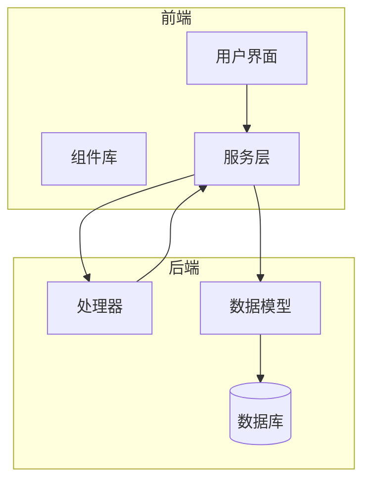
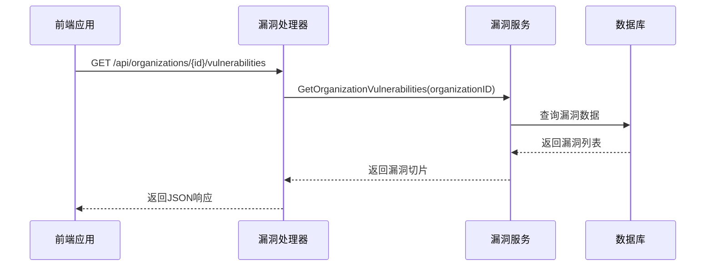
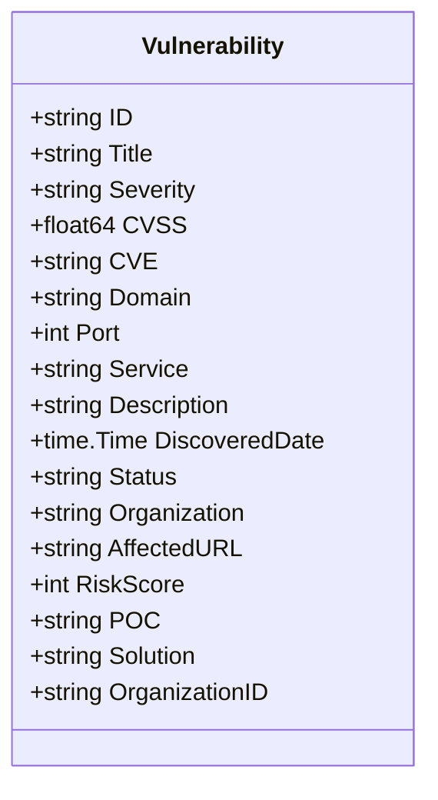
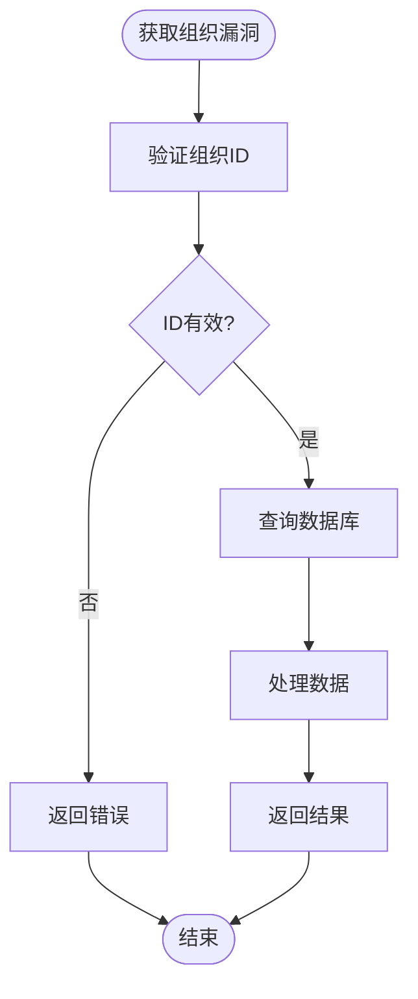
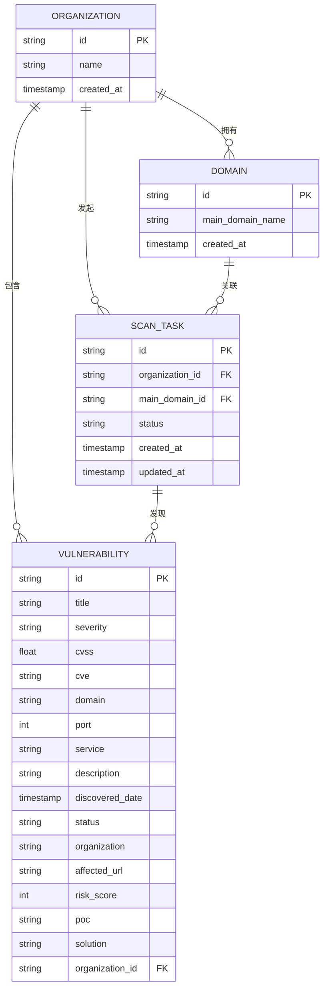

# 漏洞数据模型

<cite>
**本文档引用的文件**  
- [vulnerability.go](file://backend/internal/models/vulnerability.go)
- [vulnerability-service.go](file://backend/internal/services/vulnerability-service.go)
- [vulnerability-handler.go](file://backend/internal/handlers/vulnerability-handler.go)
- [domain.go](file://backend/internal/models/domain.go)
- [scan.go](file://backend/internal/models/scan.go)
- [初始化.sql](file://backend/初始化.sql)
- [organization-vulnerabilities.tsx](file://front/components/pages/assets/organizations/detail/organization-vulnerabilities.tsx)
</cite>

## 目录
1. [简介](#简介)
2. [项目结构](#项目结构)
3. [核心组件](#核心组件)
4. [架构概览](#架构概览)
5. [详细组件分析](#详细组件分析)
6. [依赖关系分析](#依赖关系分析)
7. [性能考虑](#性能考虑)
8. [故障排除指南](#故障排除指南)
9. [结论](#结论)

## 简介
本文档全面介绍了漏洞数据模型的设计与实现，涵盖其字段定义、数据库映射、与其他模型的关联关系、业务约束及实际应用示例。该模型是安全扫描系统的核心组成部分，用于存储和管理发现的安全漏洞信息。

## 项目结构
项目采用分层架构设计，主要分为前端（front）和后端（backend）两大部分。后端使用Go语言开发，遵循MVC模式，包含模型（models）、服务（services）、处理器（handlers）等模块；前端使用React框架构建用户界面。



**图示来源**  
- [vulnerability.go](file://backend/internal/models/vulnerability.go)
- [vulnerability-service.go](file://backend/internal/services/vulnerability-service.go)
- [vulnerability-handler.go](file://backend/internal/handlers/vulnerability-handler.go)

**本节来源**  
- [vulnerability.go](file://backend/internal/models/vulnerability.go)
- [vulnerability-service.go](file://backend/internal/services/vulnerability-service.go)

## 核心组件
漏洞数据模型是整个安全扫描系统的核心实体之一，负责存储所有发现的漏洞信息。它通过GORM与PostgreSQL数据库进行映射，并通过REST API暴露给前端使用。

**本节来源**  
- [vulnerability.go](file://backend/internal/models/vulnerability.go)
- [vulnerability-service.go](file://backend/internal/services/vulnerability-service.go)

## 架构概览
系统采用前后端分离架构，前端通过API调用获取漏洞数据，后端通过服务层处理业务逻辑并与数据库交互。



**图示来源**  
- [vulnerability-handler.go](file://backend/internal/handlers/vulnerability-handler.go)
- [vulnerability-service.go](file://backend/internal/services/vulnerability-service.go)
- [vulnerability.go](file://backend/internal/models/vulnerability.go)

## 详细组件分析

### 漏洞模型分析
漏洞模型定义了安全漏洞的所有属性，包括标识、严重性、技术细节和修复建议。

#### 字段说明
**Vulnerability 结构体字段说明**

| 字段名 | 类型 | JSON标签 | 说明 |
|--------|------|----------|------|
| ID | string | id | 漏洞唯一标识符 |
| Title | string | title | 漏洞名称 |
| Severity | string | severity | 严重等级（高危/中危/低危） |
| CVSS | float64 | cvss | CVSS评分（0.0-10.0） |
| CVE | string | cve | CVE编号（可选） |
| Domain | string | domain | 影响的域名 |
| Port | int | port | 影响的端口号 |
| Service | string | service | 影响的服务 |
| Description | string | description | 漏洞描述 |
| DiscoveredDate | time.Time | discovered_date | 发现时间 |
| Status | string | status | 状态（待修复/已修复/处理中/已忽略） |
| Organization | string | organization | 所属组织名称 |
| AffectedURL | string | affected_url | 受影响的URL |
| RiskScore | int | risk_score | 风险评分（0-100） |
| POC | string | poc | 漏洞验证代码（Proof of Concept） |
| Solution | string | solution | 修复建议 |
| OrganizationID | string | organization_id | 组织ID（外键） |



**图示来源**  
- [vulnerability.go](file://backend/internal/models/vulnerability.go)

**本节来源**  
- [vulnerability.go](file://backend/internal/models/vulnerability.go)

### 服务层分析
漏洞服务层实现了业务逻辑，负责从数据源获取漏洞信息并返回给处理器。



**本节来源**  
- [vulnerability-service.go](file://backend/internal/services/vulnerability-service.go)

## 依赖关系分析
漏洞模型与其他核心模型存在明确的关联关系，形成完整的资产-扫描-漏洞数据链。



**图示来源**  
- [vulnerability.go](file://backend/internal/models/vulnerability.go)
- [domain.go](file://backend/internal/models/domain.go)
- [scan.go](file://backend/internal/models/scan.go)
- [初始化.sql](file://backend/初始化.sql)

**本节来源**  
- [vulnerability.go](file://backend/internal/models/vulnerability.go)
- [domain.go](file://backend/internal/models/domain.go)
- [scan.go](file://backend/internal/models/scan.go)

## 性能考虑
数据库设计中包含了多个索引以优化查询性能，特别是在按组织、状态和严重性过滤时。

### 数据库表结构
根据`初始化.sql`文件，漏洞表虽然在代码中定义但尚未在SQL脚本中创建，建议添加如下表结构：

```sql
CREATE TABLE vulnerabilities (
    id UUID PRIMARY KEY DEFAULT gen_random_uuid(),
    title VARCHAR(255) NOT NULL,
    severity VARCHAR(20) NOT NULL,
    cvss NUMERIC(3,1) NOT NULL,
    cve VARCHAR(50),
    domain VARCHAR(255) NOT NULL,
    port INTEGER NOT NULL,
    service VARCHAR(100),
    description TEXT,
    discovered_date TIMESTAMP WITH TIME ZONE NOT NULL,
    status VARCHAR(20) NOT NULL,
    organization VARCHAR(255),
    affected_url TEXT,
    risk_score INTEGER NOT NULL,
    poc TEXT,
    solution TEXT,
    organization_id UUID NOT NULL REFERENCES organizations(id) ON DELETE CASCADE,
    created_at TIMESTAMP WITH TIME ZONE DEFAULT NOW()
);
```

### 索引设计
建议创建以下复合索引以提高查询效率：
- `(organization_id, severity)`：按组织和严重性查询
- `(organization_id, status)`：按组织和状态查询
- `(severity, status)`：按严重性和状态统计

## 故障排除指南
### 常见问题及解决方案
1. **漏洞数据未显示**
   - 检查组织ID是否正确传递
   - 验证数据库连接是否正常
   - 确认漏洞数据是否存在

2. **状态流转异常**
   - 确保状态值在允许范围内：待修复、已修复、处理中、已忽略
   - 检查服务层是否有状态验证逻辑

3. **性能问题**
   - 确认相关索引已创建
   - 检查查询是否使用了正确的过滤条件
   - 考虑对大数据集实施分页

**本节来源**  
- [vulnerability-service.go](file://backend/internal/services/vulnerability-service.go)
- [vulnerability-handler.go](file://backend/internal/handlers/vulnerability-handler.go)
- [organization-vulnerabilities.tsx](file://front/components/pages/assets/organizations/detail/organization-vulnerabilities.tsx)

## 结论
漏洞数据模型是安全扫描系统的核心组成部分，通过合理的字段设计和关联关系，能够有效管理安全漏洞的全生命周期。建议尽快完善数据库表结构和索引设计，以支持高效的查询和分析操作。