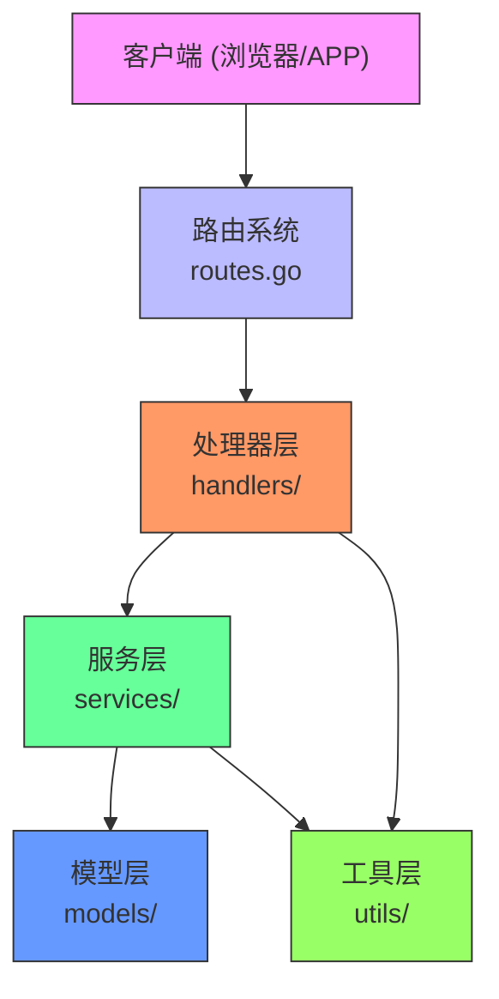
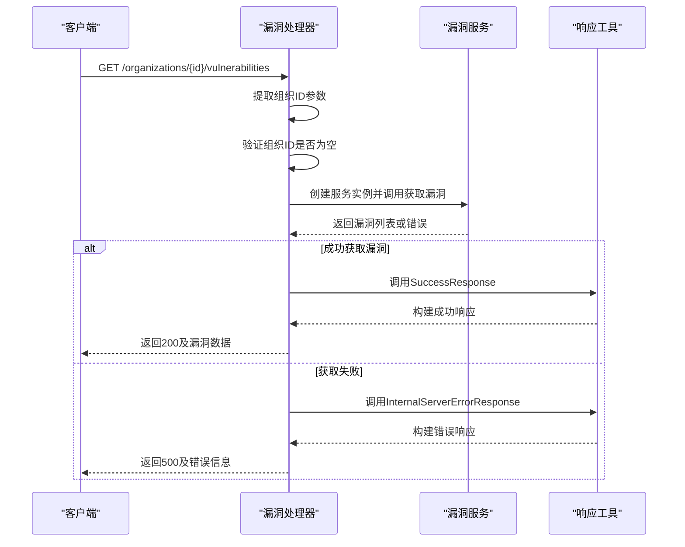
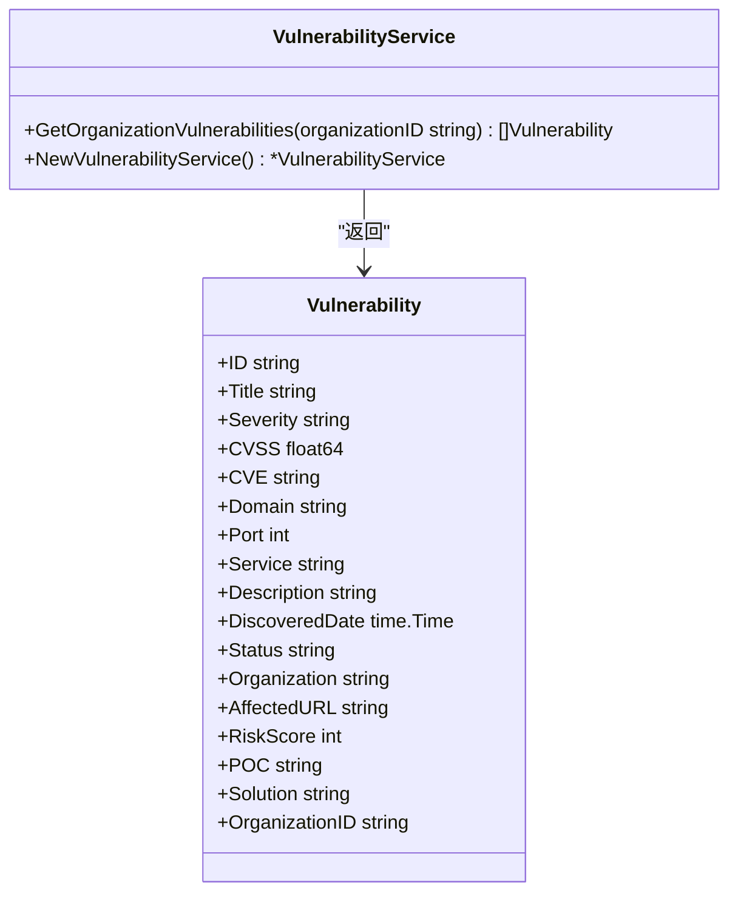
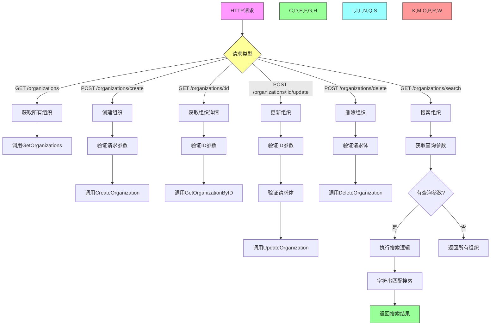
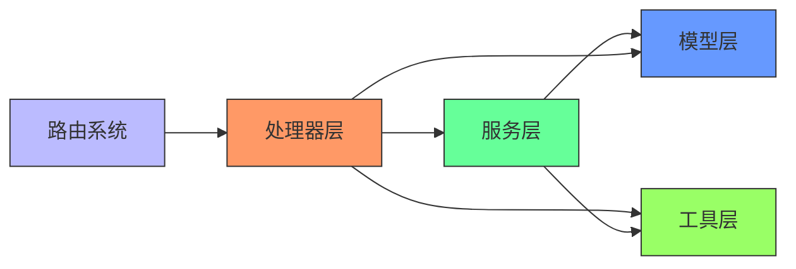

# 漏洞查询API

<cite>
**本文档引用的文件**   
- [vulnerability-handler.go](file://backend/internal/handlers/vulnerability-handler.go)
- [vulnerability-service.go](file://backend/internal/services/vulnerability-service.go)
- [vulnerability.go](file://backend/internal/models/vulnerability.go)
- [routes.go](file://backend/routes/routes.go)
- [organization-handler.go](file://backend/internal/handlers/organization-handler.go)
- [organization-service.go](file://backend/internal/services/organization-service.go)
- [organization.go](file://backend/internal/models/organization.go)
- [response.go](file://backend/internal/utils/response.go)
- [response.go](file://backend/internal/models/response.go)
</cite>

## 目录
1. [简介](#简介)
2. [项目结构](#项目结构)
3. [核心组件](#核心组件)
4. [架构概述](#架构概述)
5. [详细组件分析](#详细组件分析)
6. [依赖分析](#依赖分析)
7. [性能考虑](#性能考虑)
8. [故障排除指南](#故障排除指南)
9. [结论](#结论)

## 简介
本文档详细描述了漏洞查询API的设计与实现，涵盖组织漏洞的获取接口。该API基于Gin框架构建，采用分层架构设计，包含路由层、处理器层、服务层和模型层。系统通过RESTful端点提供组织漏洞数据，支持组织管理功能，并返回结构化的JSON响应。当前实现使用模拟数据，未来将集成数据库支持。

## 项目结构
项目采用标准的Go后端项目结构，按功能分层组织：

```
backend/
├── cmd/                  # 应用入口
├── config/               # 配置文件
├── internal/             # 核心业务逻辑
│   ├── handlers/         # HTTP请求处理器
│   ├── middleware/       # 中间件
│   ├── models/           # 数据模型
│   ├── services/         # 业务服务
│   └── utils/            # 工具函数
├── pkg/database/         # 数据库包
├── routes/               # 路由定义
└── scripts/              # 脚本文件
```

**Diagram sources**
- [routes.go](file://backend/routes/routes.go#L1-L65)

## 核心组件
核心组件包括漏洞处理器、漏洞服务、漏洞模型、通用响应工具和路由系统。处理器负责HTTP请求解析和响应生成，服务层包含业务逻辑，模型定义数据结构，工具包提供标准化的API响应格式。

**Section sources**
- [vulnerability-handler.go](file://backend/internal/handlers/vulnerability-handler.go#L1-L26)
- [vulnerability-service.go](file://backend/internal/services/vulnerability-service.go#L1-L125)
- [vulnerability.go](file://backend/internal/models/vulnerability.go#L1-L31)

## 架构概述
系统采用典型的分层架构模式，各层职责分明：



**Diagram sources**
- [vulnerability-handler.go](file://backend/internal/handlers/vulnerability-handler.go#L1-L26)
- [vulnerability-service.go](file://backend/internal/services/vulnerability-service.go#L1-L125)
- [routes.go](file://backend/routes/routes.go#L1-L65)

## 详细组件分析

### 漏洞处理器分析
漏洞处理器负责处理与漏洞相关的HTTP请求，主要实现`GetOrganizationVulnerabilities`函数。



**Diagram sources**
- [vulnerability-handler.go](file://backend/internal/handlers/vulnerability-handler.go#L1-L26)
- [vulnerability-service.go](file://backend/internal/services/vulnerability-service.go#L1-L125)
- [response.go](file://backend/internal/utils/response.go#L1-L48)

**Section sources**
- [vulnerability-handler.go](file://backend/internal/handlers/vulnerability-handler.go#L1-L26)

### 漏洞服务分析
漏洞服务层实现核心业务逻辑，当前返回模拟的漏洞数据。



**Diagram sources**
- [vulnerability-service.go](file://backend/internal/services/vulnerability-service.go#L1-L125)
- [vulnerability.go](file://backend/internal/models/vulnerability.go#L1-L31)

**Section sources**
- [vulnerability-service.go](file://backend/internal/services/vulnerability-service.go#L1-L125)

### 组织管理功能分析
系统提供完整的组织管理功能，包括增删改查和搜索。



**Diagram sources**
- [organization-handler.go](file://backend/internal/handlers/organization-handler.go#L1-L211)
- [organization-service.go](file://backend/internal/services/organization-service.go#L1-L157)
- [routes.go](file://backend/routes/routes.go#L1-L65)

**Section sources**
- [organization-handler.go](file://backend/internal/handlers/organization-handler.go#L1-L211)
- [organization-service.go](file://backend/internal/services/organization-service.go#L1-L157)

### 响应处理机制分析
系统采用统一的响应格式和错误处理机制。

```mermaid
classDiagram
class APIResponse {
+Code string
+Message string
+Data interface{}
}
class ResponseUtils {
+SuccessResponse(c *gin.Context, data interface{})
+ErrorResponse(c *gin.Context, statusCode int, message string)
+BadRequestResponse(c *gin.Context, message string)
+NotFoundResponse(c *gin.Context, message string)
+InternalServerErrorResponse(c *gin.Context, message string)
+ValidationErrorResponse(c *gin.Context, message string)
}
ResponseUtils --> APIResponse : "创建"
ResponseUtils --> APIResponse : "填充"
```

**Diagram sources**
- [response.go](file://backend/internal/utils/response.go#L1-L48)
- [response.go](file://backend/internal/models/response.go#L1-L8)

**Section sources**
- [response.go](file://backend/internal/utils/response.go#L1-L48)
- [response.go](file://backend/internal/models/response.go#L1-L8)

## 依赖分析
系统各组件间存在明确的依赖关系：



**Diagram sources**
- [vulnerability-handler.go](file://backend/internal/handlers/vulnerability-handler.go#L1-L26)
- [vulnerability-service.go](file://backend/internal/services/vulnerability-service.go#L1-L125)
- [routes.go](file://backend/routes/routes.go#L1-L65)

**Section sources**
- [vulnerability-handler.go](file://backend/internal/handlers/vulnerability-handler.go#L1-L26)
- [vulnerability-service.go](file://backend/internal/services/vulnerability-service.go#L1-L125)

## 性能考虑
当前系统使用模拟数据，性能表现良好。未来集成数据库后，建议考虑以下优化：
- 为组织ID和漏洞状态字段创建数据库索引
- 实现缓存机制，缓存频繁访问的组织漏洞数据
- 使用连接池管理数据库连接
- 对大规模数据查询实现分页功能
- 考虑使用异步处理模式处理耗时的扫描任务

## 故障排除指南
常见问题及解决方案：

1. **组织ID为空错误**：确保URL路径中的组织ID不为空
2. **组织不存在错误**：检查组织ID是否正确，或先创建组织
3. **JSON解析错误**：验证请求体格式是否符合API规范
4. **数据库连接错误**：检查数据库配置和连接状态
5. **权限错误**：确保用户具有访问特定组织的权限

**Section sources**
- [vulnerability-handler.go](file://backend/internal/handlers/vulnerability-handler.go#L1-L26)
- [organization-handler.go](file://backend/internal/handlers/organization-handler.go#L1-L211)
- [response.go](file://backend/internal/utils/response.go#L1-L48)

## 结论
漏洞查询API实现了组织漏洞数据的获取功能，采用清晰的分层架构设计。系统具有良好的扩展性，可通过替换服务层的数据源实现与真实数据库的集成。API设计遵循RESTful原则，返回结构化的响应数据，便于前端消费。建议后续实现完整的CRUD操作、分页查询、过滤功能和权限控制机制。