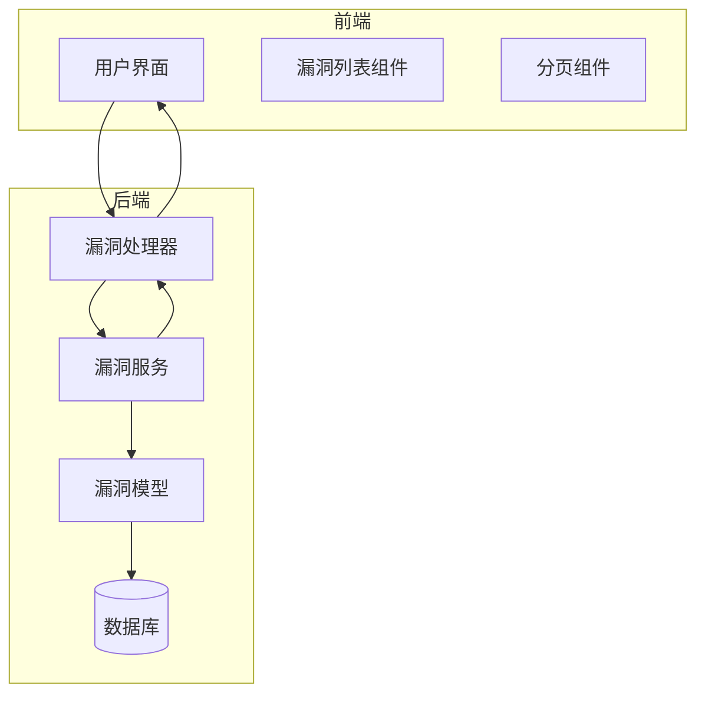
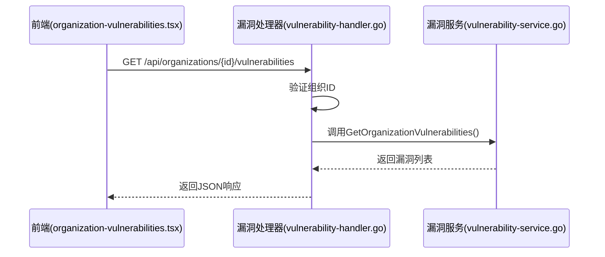
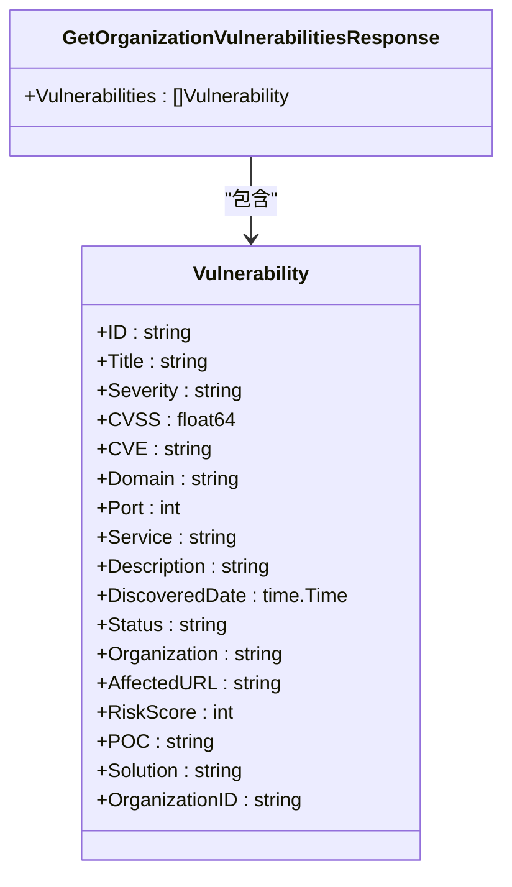
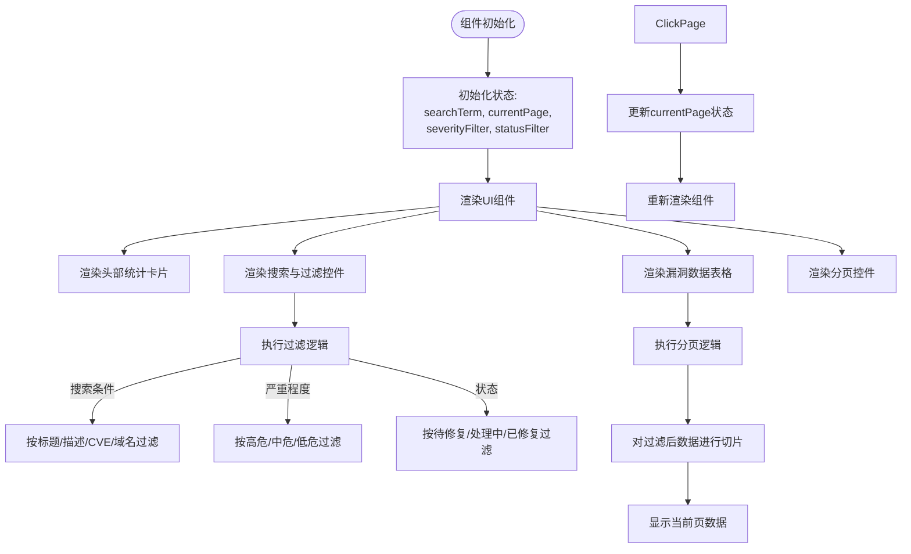
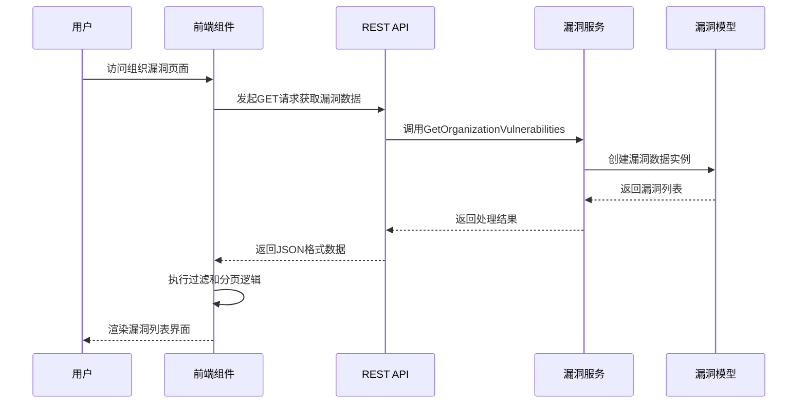
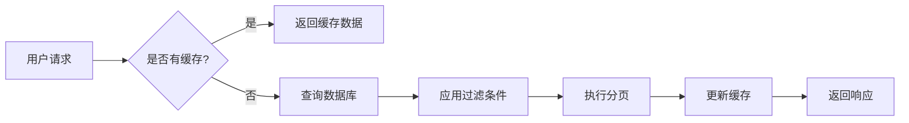

# 漏洞管理模块

<cite>
**本文档引用的文件**
- [vulnerability.go](file://backend/internal/models/vulnerability.go)
- [vulnerability-handler.go](file://backend/internal/handlers/vulnerability-handler.go)
- [vulnerability-service.go](file://backend/internal/services/vulnerability-service.go)
- [organization-vulnerabilities.tsx](file://front/components/pages/assets/organizations/detail/organization-vulnerabilities.tsx)
</cite>

## 目录
1. [简介](#简介)
2. [项目结构](#项目结构)
3. [核心组件](#核心组件)
4. [架构概览](#架构概览)
5. [详细组件分析](#详细组件分析)
6. [数据流分析](#数据流分析)
7. [性能与优化](#性能与优化)
8. [总结](#总结)

## 简介
本技术文档全面解析漏洞管理模块的设计与实现，重点阐述漏洞数据的存储、查询、展示及状态跟踪机制。文档涵盖后端API接口设计、数据模型定义、前端渲染逻辑以及完整的数据流转过程，为开发人员和安全管理人员提供详尽的技术参考。

## 项目结构
漏洞管理模块采用前后端分离架构，后端基于Go语言Gin框架实现，前端使用React与Tailwind CSS构建。系统通过清晰的分层设计，将模型、服务、处理器分离，确保代码的可维护性和扩展性。



**图示来源**
- [vulnerability.go](file://backend/internal/models/vulnerability.go)
- [vulnerability-handler.go](file://backend/internal/handlers/vulnerability-handler.go)
- [vulnerability-service.go](file://backend/internal/services/vulnerability-service.go)
- [organization-vulnerabilities.tsx](file://front/components/pages/assets/organizations/detail/organization-vulnerabilities.tsx)

## 核心组件
漏洞管理模块的核心组件包括漏洞数据模型、服务层逻辑、API处理器以及前端展示组件。这些组件协同工作，实现漏洞数据的全生命周期管理。

**组件来源**
- [vulnerability.go](file://backend/internal/models/vulnerability.go#L1-L31)
- [vulnerability-service.go](file://backend/internal/services/vulnerability-service.go#L1-L125)

## 架构概览
系统采用典型的三层架构：表现层（前端）、业务逻辑层（服务）和数据访问层（模型）。前端通过RESTful API与后端交互，后端服务处理业务逻辑并返回结构化数据。



**图示来源**
- [vulnerability-handler.go](file://backend/internal/handlers/vulnerability-handler.go#L1-L26)
- [vulnerability-service.go](file://backend/internal/services/vulnerability-service.go#L1-L125)
- [organization-vulnerabilities.tsx](file://front/components/pages/assets/organizations/detail/organization-vulnerabilities.tsx#L1-L413)

## 详细组件分析

### 漏洞数据模型分析
漏洞数据模型定义了漏洞的完整属性集合，采用Go结构体形式实现，通过JSON标签支持序列化。



**图示来源**
- [vulnerability.go](file://backend/internal/models/vulnerability.go#L1-L31)

**组件来源**
- [vulnerability.go](file://backend/internal/models/vulnerability.go#L1-L31)

### 后端服务与处理器分析
后端通过处理器接收HTTP请求，调用服务层获取数据，并返回标准化响应。服务层负责业务逻辑处理和数据组装。

```go
// vulnerability-handler.go
func GetOrganizationVulnerabilities(c *gin.Context) {
	organizationID := c.Param("id")
	if organizationID == "" {
		utils.BadRequestResponse(c, "组织ID不能为空")
		return
	}

	service := services.NewVulnerabilityService()
	vulnerabilities, err := service.GetOrganizationVulnerabilities(organizationID)
	if err != nil {
		utils.InternalServerErrorResponse(c, "获取组织漏洞失败: "+err.Error())
		return
	}

	utils.SuccessResponse(c, vulnerabilities)
}
```

该处理器实现了以下功能：
- 参数验证：检查组织ID是否为空
- 服务调用：创建漏洞服务实例并获取数据
- 错误处理：对业务错误返回相应HTTP状态码
- 响应封装：使用统一的成功响应格式

**组件来源**
- [vulnerability-handler.go](file://backend/internal/handlers/vulnerability-handler.go#L1-L26)
- [vulnerability-service.go](file://backend/internal/services/vulnerability-service.go#L1-L125)

### 前端组件分析
前端`organization-vulnerabilities.tsx`组件实现了漏洞列表的完整用户界面，包括搜索、过滤、分页和状态展示功能。



**图示来源**
- [organization-vulnerabilities.tsx](file://front/components/pages/assets/organizations/detail/organization-vulnerabilities.tsx#L1-L413)

**组件来源**
- [organization-vulnerabilities.tsx](file://front/components/pages/assets/organizations/detail/organization-vulnerabilities.tsx#L1-L413)

## 数据流分析
从用户请求到数据展示的完整数据流如下：



**图示来源**
- [vulnerability-handler.go](file://backend/internal/handlers/vulnerability-handler.go#L1-L26)
- [vulnerability-service.go](file://backend/internal/services/vulnerability-service.go#L1-L125)
- [organization-vulnerabilities.tsx](file://front/components/pages/assets/organizations/detail/organization-vulnerabilities.tsx#L1-L413)

## 性能与优化
当前实现使用模拟数据，实际生产环境需考虑以下性能优化措施：

### 查询性能问题
1. **数据库查询效率**：大量漏洞数据可能导致查询缓慢
2. **分页性能**：深分页（如第1000页）可能导致性能下降
3. **过滤组合**：多条件组合过滤可能影响查询速度

### 优化手段
1. **数据库索引优化**：为常用查询字段（如`organization_id`、`severity`、`status`）创建复合索引
2. **缓存机制**：使用Redis缓存频繁访问的漏洞数据
3. **分页优化**：采用游标分页（Cursor-based Pagination）替代传统偏移分页
4. **查询优化**：实现延迟加载，仅在需要时获取详细信息
5. **全文搜索**：集成Elasticsearch支持高效的全文搜索功能



**组件来源**
- [vulnerability-service.go](file://backend/internal/services/vulnerability-service.go#L1-L125)
- [organization-vulnerabilities.tsx](file://front/components/pages/assets/organizations/detail/organization-vulnerabilities.tsx#L1-L413)

## 总结
漏洞管理模块通过清晰的架构设计实现了漏洞数据的有效管理。后端提供标准化的API接口，前端实现丰富的交互功能。系统支持按严重程度、状态等多维度过滤，以及分页浏览，满足实际安全运营需求。未来可进一步优化数据存储和查询性能，提升大规模漏洞数据的处理能力。