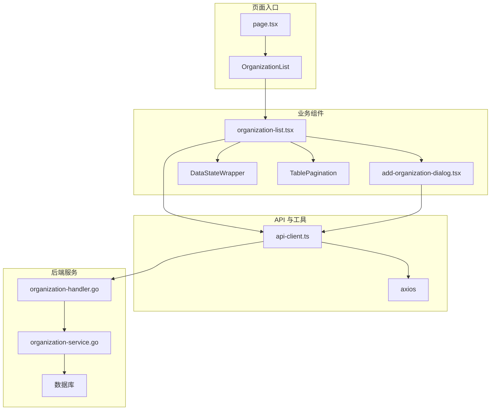
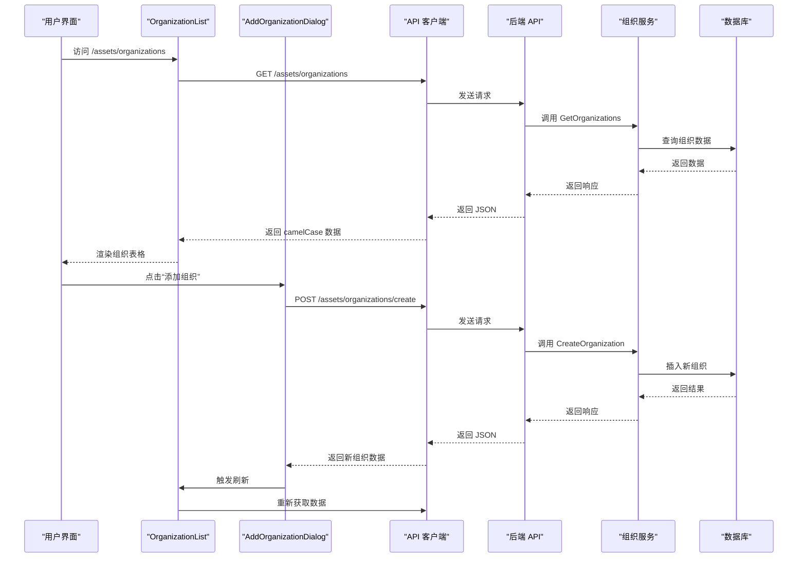
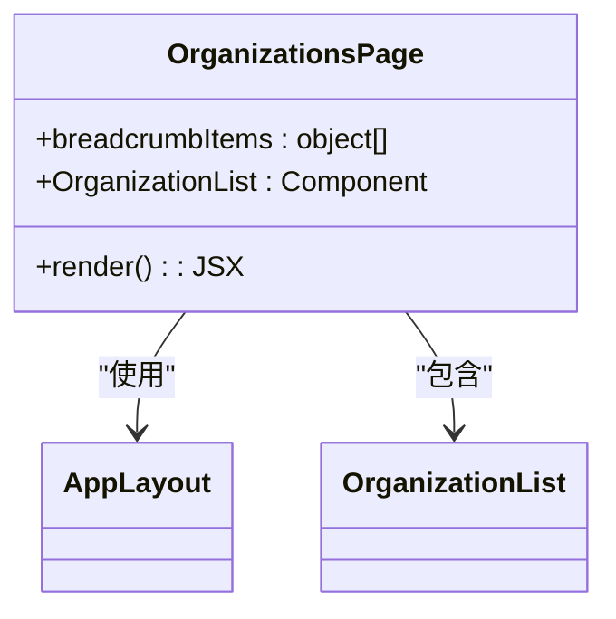
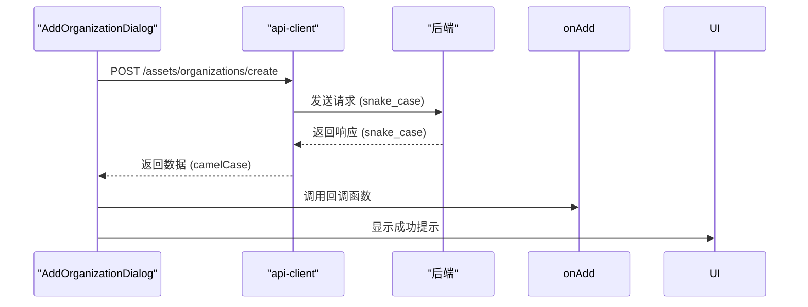
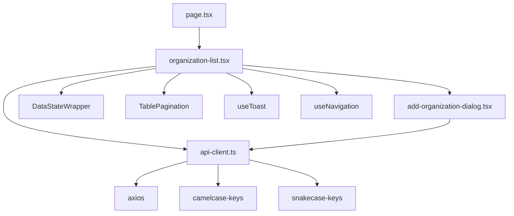

# 前端组织管理组件

<cite>
**本文档引用的文件**  
- [page.tsx](file://front/app/assets/organizations/page.tsx)
- [organization-list.tsx](file://front/components/pages/assets/organizations/organization-list.tsx)
- [add-organization-dialog.tsx](file://front/components/pages/assets/organizations/add-organization-dialog.tsx)
- [organization.service.ts](file://front/services/organization.service.ts)
- [api-client.ts](file://front/lib/api-client.ts)
- [organization-handler.go](file://backend/internal/handlers/organization-handler.go)
- [organization-service.go](file://backend/internal/services/organization-service.go)
- [config.go](file://backend/config/config.go)
</cite>

## 目录
1. [简介](#简介)
2. [项目结构](#项目结构)
3. [核心组件](#核心组件)
4. [架构概览](#架构概览)
5. [详细组件分析](#详细组件分析)
6. [依赖分析](#依赖分析)
7. [性能考虑](#性能考虑)
8. [故障排除指南](#故障排除指南)
9. [结论](#结论)

## 简介
本文档详细记录了前端组织管理功能的实现机制，重点分析了 `page.tsx` 作为页面容器的布局结构，`organization-list.tsx` 组件如何渲染可交互的组织表格，支持分页、搜索和批量操作。同时说明了 `add-organization-dialog.tsx` 对话框组件的表单验证逻辑和提交流程，以及其与 `organization.service.ts` 中 API 客户端的集成方式。文档还描述了使用 React 状态管理（`useState`、`useEffect`）同步 UI 与后端数据的过程，并提供了用户体验优化细节和常见问题的调试方法。

## 项目结构
前端组织管理功能的文件组织遵循功能模块化原则，主要文件位于 `front/app/assets/organizations/` 和 `front/components/pages/assets/organizations/` 目录下。



**图示来源**  
- [page.tsx](file://front/app/assets/organizations/page.tsx)
- [organization-list.tsx](file://front/components/pages/assets/organizations/organization-list.tsx)
- [add-organization-dialog.tsx](file://front/components/pages/assets/organizations/add-organization-dialog.tsx)
- [api-client.ts](file://front/lib/api-client.ts)
- [organization-handler.go](file://backend/internal/handlers/organization-handler.go)

## 核心组件
组织管理功能的核心由三个主要组件构成：页面容器 `page.tsx`、组织列表 `organization-list.tsx` 和添加组织对话框 `add-organization-dialog.tsx`。

**组件来源**  
- [page.tsx](file://front/app/assets/organizations/page.tsx)
- [organization-list.tsx](file://front/components/pages/assets/organizations/organization-list.tsx)
- [add-organization-dialog.tsx](file://front/components/pages/assets/organizations/add-organization-dialog.tsx)

## 架构概览
整个组织管理功能从前端到后端形成了一个清晰的数据流和控制流。



**图示来源**  
- [organization-list.tsx](file://front/components/pages/assets/organizations/organization-list.tsx#L95-L141)
- [add-organization-dialog.tsx](file://front/components/pages/assets/organizations/add-organization-dialog.tsx#L68-L104)
- [organization-handler.go](file://backend/internal/handlers/organization-handler.go)
- [organization-service.go](file://backend/internal/services/organization-service.go#L56-L104)

## 详细组件分析

### 页面容器分析
`page.tsx` 是组织列表页面的入口点，负责提供页面布局和导航路径。



**图示来源**  
- [page.tsx](file://front/app/assets/organizations/page.tsx)

#### 组件职责
- **布局管理**：通过 `AppLayout` 组件提供统一的页面框架。
- **懒加载**：使用 `next/dynamic` 动态加载 `OrganizationList` 组件，优化首屏加载性能。
- **导航路径**：定义面包屑导航，提升用户体验。

**组件来源**  
- [page.tsx](file://front/app/assets/organizations/page.tsx)

### 组织列表组件分析
`organization-list.tsx` 是核心业务组件，实现了组织数据的展示、搜索、分页和删除功能。

#### 状态管理
该组件使用 React 的 `useState` 和 `useEffect` 钩子来管理 UI 状态和数据同步。

```typescript
// 状态定义
const [searchTerm, setSearchTerm] = useState("")
const [currentPage, setCurrentPage] = useState(1)
const [organizations, setOrganizations] = useState<Organization[]>([])
const [viewState, setViewState] = useState<ViewState>("loading")
```

**组件来源**  
- [organization-list.tsx](file://front/components/pages/assets/organizations/organization-list.tsx#L44-L55)

#### 数据获取流程
组件在挂载时通过 `useEffect` 自动调用 `fetchOrganizations` 函数获取数据。

```mermaid
flowchart TD
A[组件挂载] --> B[调用 useEffect]
B --> C[执行 fetchOrganizations]
C --> D[设置 viewState 为 loading]
D --> E[调用 api.get]
E --> F{响应成功?}
F --> |是| G[检查 response.data.code]
G --> H{code === "SUCCESS"?}
H --> |是| I[更新 organizations 状态]
I --> J[设置 viewState 为 data 或 empty]
H --> |否| K[抛出错误]
F --> |否| K
K --> L[捕获异常]
L --> M[设置 error 状态]
M --> N[设置 viewState 为 error]
```

**图示来源**  
- [organization-list.tsx](file://front/components/pages/assets/organizations/organization-list.tsx#L95-L141)

#### 用户交互
- **搜索**：实时过滤组织列表，支持按名称和描述搜索。
- **分页**：使用 `TablePagination` 组件实现分页控制。
- **删除**：通过 `AlertDialog` 组件提供确认弹窗，防止误操作。

**组件来源**  
- [organization-list.tsx](file://front/components/pages/assets/organizations/organization-list.tsx)

### 添加组织对话框分析
`add-organization-dialog.tsx` 组件实现了组织的创建功能，包含表单验证和提交流程。

#### 表单验证逻辑
组件在提交前进行客户端验证，确保必填字段不为空。

```typescript
const handleSubmit = async (e: React.FormEvent) => {
    e.preventDefault()
    if (!formData.name.trim()) {
        toast({ title: "错误", description: "请输入组织名称", variant: "destructive" })
        return
    }
    // 提交逻辑...
}
```

**组件来源**  
- [add-organization-dialog.tsx](file://front/components/pages/assets/organizations/add-organization-dialog.tsx#L68-L75)

#### 提交流程


**图示来源**  
- [add-organization-dialog.tsx](file://front/components/pages/assets/organizations/add-organization-dialog.tsx#L77-L104)
- [api-client.ts](file://front/lib/api-client.ts)

#### 与 API 客户端集成
- **请求拦截**：`api-client.ts` 使用 axios 拦截器将 camelCase 请求数据自动转换为 snake_case。
- **响应拦截**：将后端返回的 snake_case 响应数据自动转换为 camelCase。
- **错误处理**：提供 `getErrorMessage` 工具函数统一处理网络和业务错误。

**组件来源**  
- [api-client.ts](file://front/lib/api-client.ts)

## 依赖分析
组织管理功能涉及多个层级的依赖关系。



**图示来源**  
- [page.tsx](file://front/app/assets/organizations/page.tsx)
- [organization-list.tsx](file://front/components/pages/assets/organizations/organization-list.tsx)
- [add-organization-dialog.tsx](file://front/components/pages/assets/organizations/add-organization-dialog.tsx)
- [api-client.ts](file://front/lib/api-client.ts)

## 性能考虑
- **懒加载**：`page.tsx` 使用 `dynamic` 实现组件懒加载，减少初始包体积。
- **状态优化**：`organization-list.tsx` 通过 `filteredOrganizations` 和 `paginatedOrganizations` 计算属性避免重复计算。
- **防抖处理**：虽然当前代码未实现，但搜索功能建议添加防抖以减少 API 调用频率。
- **错误重试**：`DataStateWrapper` 组件提供重试功能，提升弱网环境下的用户体验。

## 故障排除指南

### 状态不同步问题
**现象**：添加或删除组织后，列表未及时更新。
**解决方案**：
1. 确认 `AddOrganizationDialog` 的 `onAdd` 回调是否正确传递给 `handleOrganizationAdded`。
2. 检查 `fetchOrganizations` 函数是否被正确调用。
3. 在 `useEffect` 依赖数组中确保包含所有相关状态。

### 表单验证失败
**现象**：表单提交无反应或提示错误。
**解决方案**：
1. 检查 `formData.name` 是否有空格，使用 `trim()` 方法处理。
2. 确认 `handleSubmit` 函数中调用了 `e.preventDefault()`。
3. 检查 `toast` 组件是否正确导入和使用。

### API 调用失败
**现象**：网络请求返回 404 或 500 错误。
**解决方案**：
1. 检查 `api-client.ts` 中的 `baseURL` 配置是否正确。
2. 确认后端路由 `/assets/organizations/create` 是否已正确注册。
3. 查看浏览器开发者工具的网络面板，检查请求和响应详情。

**组件来源**  
- [organization-list.tsx](file://front/components/pages/assets/organizations/organization-list.tsx)
- [add-organization-dialog.tsx](file://front/components/pages/assets/organizations/add-organization-dialog.tsx)
- [api-client.ts](file://front/lib/api-client.ts)

## 结论
前端组织管理功能通过清晰的组件划分和状态管理，实现了高效、可维护的代码结构。`page.tsx` 作为容器组件提供布局，`organization-list.tsx` 处理核心业务逻辑，`add-organization-dialog.tsx` 封装创建功能。API 客户端的拦截器机制确保了前后端数据格式的无缝转换。整体设计遵循了现代 React 最佳实践，具有良好的扩展性和用户体验。