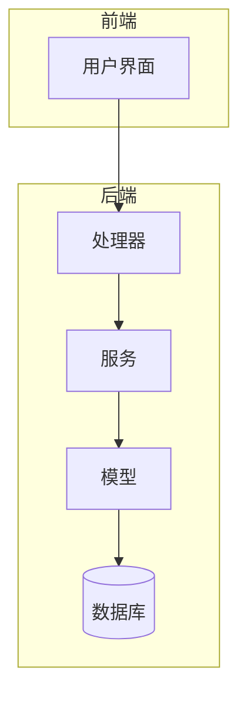
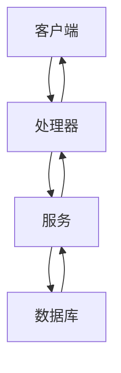
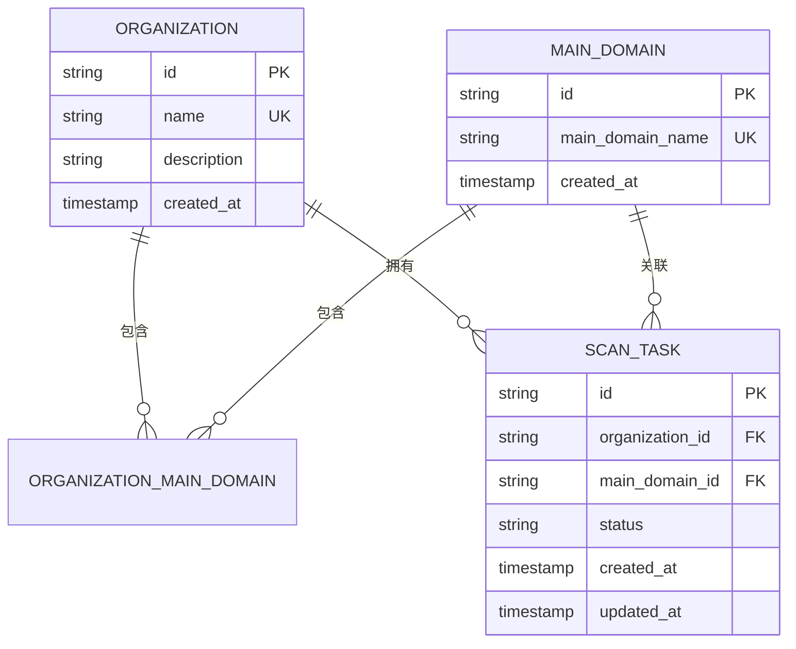
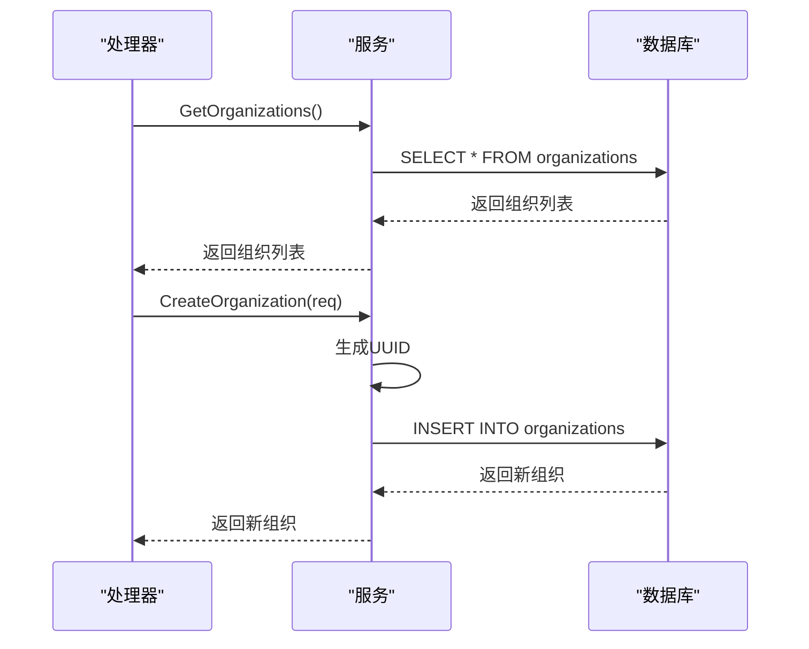
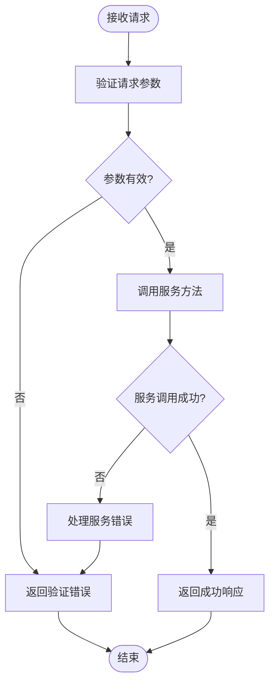
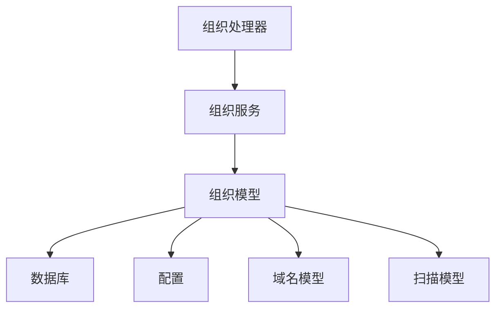

# 组织数据模型

<cite>
**本文档引用的文件**  
- [organization.go](file://backend/internal/models/organization.go)
- [organization-service.go](file://backend/internal/services/organization-service.go)
- [organization-handler.go](file://backend/internal/handlers/organization-handler.go)
- [database.go](file://backend/pkg/database/database.go)
- [config.go](file://backend/config/config.go)
- [初始化.sql](file://backend/初始化.sql)
- [domain.go](file://backend/internal/models/domain.go)
- [scan.go](file://backend/internal/models/scan.go)
</cite>

## 目录
1. [简介](#简介)
2. [项目结构](#项目结构)
3. [核心组件](#核心组件)
4. [架构概览](#架构概览)
5. [详细组件分析](#详细组件分析)
6. [依赖分析](#依赖分析)
7. [性能考虑](#性能考虑)
8. [故障排除指南](#故障排除指南)
9. [结论](#结论)

## 简介
本文档详细描述了漏洞扫描系统中的组织数据模型，重点分析了 `Organization` 结构体的定义、数据库映射、与其他模型的关联关系以及完整的CRUD操作实现。该模型是系统权限管理和资产归属的核心，用于组织用户、域名和扫描任务。

## 项目结构
项目采用典型的分层架构，组织相关代码分布在 `backend/internal` 目录下，包括模型、服务和处理器。前端通过API与后端交互，数据库使用PostgreSQL。



**图示来源**
- [organization.go](file://backend/internal/models/organization.go)
- [organization-service.go](file://backend/internal/services/organization-service.go)
- [organization-handler.go](file://backend/internal/handlers/organization-handler.go)

**章节来源**
- [organization.go](file://backend/internal/models/organization.go)
- [organization-service.go](file://backend/internal/services/organization-service.go)

## 核心组件
组织数据模型的核心由 `Organization` 结构体定义，包含ID、名称、描述和创建时间等字段。该模型通过GORM标签映射到数据库，并通过服务层和处理器层提供完整的REST API接口。

**章节来源**
- [organization.go](file://backend/internal/models/organization.go#L7-L14)
- [organization-service.go](file://backend/internal/services/organization-service.go#L15-L20)

## 架构概览
系统采用MVC（模型-视图-控制器）模式，组织模型作为数据层，服务层处理业务逻辑，处理器层处理HTTP请求。数据库通过原生SQL操作，未使用ORM框架。



**图示来源**
- [organization-handler.go](file://backend/internal/handlers/organization-handler.go)
- [organization-service.go](file://backend/internal/services/organization-service.go)
- [database.go](file://backend/pkg/database/database.go)

## 详细组件分析

### 组织模型分析
`Organization` 结构体定义了组织的基本属性，包括唯一ID、名称、描述和创建时间。该模型直接映射到数据库表 `organizations`。

#### 数据结构
```go
// Organization 组织模型
type Organization struct {
	ID          string    `json:"id" db:"id"`
	Name        string    `json:"name" db:"name"`
	Description string    `json:"description" db:"description"`
	CreatedAt   time.Time `json:"created_at" db:"created_at"`
}
```

**字段说明**:
- **ID**: 组织的唯一标识符，使用UUID生成
- **Name**: 组织名称，数据库中设置为唯一约束
- **Description**: 组织描述，可为空
- **CreatedAt**: 创建时间，自动记录

**章节来源**
- [organization.go](file://backend/internal/models/organization.go#L7-L14)

#### 关联关系
组织模型与其他模型存在一对多关系：
- 一个组织可以有多个主域名（通过 `organization_main_domains` 关联表）
- 一个组织可以有多个扫描任务



**图示来源**
- [organization.go](file://backend/internal/models/organization.go)
- [domain.go](file://backend/internal/models/domain.go)
- [scan.go](file://backend/internal/models/scan.go)
- [初始化.sql](file://backend/初始化.sql)

**章节来源**
- [organization.go](file://backend/internal/models/organization.go)
- [domain.go](file://backend/internal/models/domain.go)
- [scan.go](file://backend/internal/models/scan.go)

#### 请求模型
系统定义了多个请求结构体用于API参数验证：

```go
// CreateOrganizationRequest 创建组织请求
type CreateOrganizationRequest struct {
	Name        string `json:"name" binding:"required"`
	Description string `json:"description"`
}

// UpdateOrganizationRequest 更新组织请求
type UpdateOrganizationRequest struct {
	ID          string `json:"id" binding:"required"`
	Name        string `json:"name"`
	Description string `json:"description"`
}

// DeleteOrganizationRequest 删除组织请求
type DeleteOrganizationRequest struct {
	OrganizationID string `json:"organization_id" binding:"required"`
}
```

**章节来源**
- [organization.go](file://backend/internal/models/organization.go#L16-L31)

### 服务层分析
`OrganizationService` 提供了对组织数据的完整业务逻辑操作，包括创建、读取、更新和删除。

#### 服务结构
```go
// OrganizationService 组织服务
type OrganizationService struct {
	db *sql.DB
}
```

服务通过依赖注入获取数据库连接，遵循单一职责原则。

#### 核心方法
服务提供了以下核心方法：
- `GetOrganizations`: 获取所有组织
- `GetOrganizationByID`: 根据ID获取组织
- `CreateOrganization`: 创建组织
- `UpdateOrganization`: 更新组织
- `DeleteOrganization`: 删除组织



**图示来源**
- [organization-service.go](file://backend/internal/services/organization-service.go)
- [organization-handler.go](file://backend/internal/handlers/organization-handler.go)

**章节来源**
- [organization-service.go](file://backend/internal/services/organization-service.go#L15-L157)

### 处理器层分析
处理器层负责处理HTTP请求，进行参数验证，并调用服务层方法。

#### API端点
- `GET /organizations`: 获取所有组织
- `POST /organizations`: 创建组织
- `GET /organizations/:id`: 根据ID获取组织
- `PUT /organizations/:id`: 更新组织
- `DELETE /organizations`: 删除组织
- `POST /organizations/batch-delete`: 批量删除组织
- `GET /organizations/search`: 搜索组织

#### 请求处理流程


**章节来源**
- [organization-handler.go](file://backend/internal/handlers/organization-handler.go#L1-L211)

## 依赖分析
组织模型依赖于数据库连接和配置管理，与其他模型通过外键关联。



**图示来源**
- [organization.go](file://backend/internal/models/organization.go)
- [organization-service.go](file://backend/internal/services/organization-service.go)
- [organization-handler.go](file://backend/internal/handlers/organization-handler.go)
- [config.go](file://backend/config/config.go)

**章节来源**
- [organization.go](file://backend/internal/models/organization.go)
- [organization-service.go](file://backend/internal/services/organization-service.go)
- [organization-handler.go](file://backend/internal/handlers/organization-handler.go)

## 性能考虑
- 数据库查询使用预编译语句防止SQL注入
- 服务层使用连接池管理数据库连接
- 搜索功能在服务层实现，未来可优化为数据库级全文搜索
- 批量删除操作使用循环逐个删除，可能影响性能，建议优化为批量SQL操作

## 故障排除指南
常见问题及解决方案：

1. **组织创建失败**
   - 检查数据库连接是否正常
   - 确认组织名称是否已存在（唯一约束）

2. **组织更新失败**
   - 确认组织ID是否存在
   - 检查请求参数格式

3. **数据库连接问题**
   - 检查 `config.yaml` 中的数据库配置
   - 确认数据库服务是否运行

4. **批量删除性能问题**
   - 对于大量组织删除，建议使用单条SQL语句替代循环

**章节来源**
- [organization-service.go](file://backend/internal/services/organization-service.go)
- [database.go](file://backend/pkg/database/database.go)
- [config.go](file://backend/config/config.go)

## 结论
组织数据模型是漏洞扫描系统的核心组成部分，提供了完整的组织管理功能。模型设计简洁，通过清晰的分层架构实现了高内聚低耦合。建议未来优化包括：引入ORM框架简化数据库操作、优化批量操作性能、增强搜索功能等。