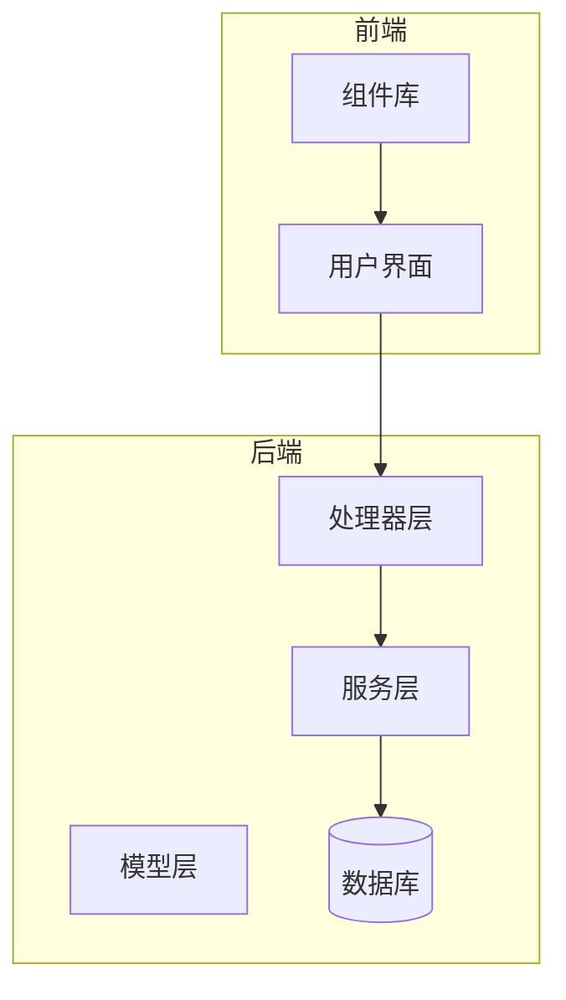
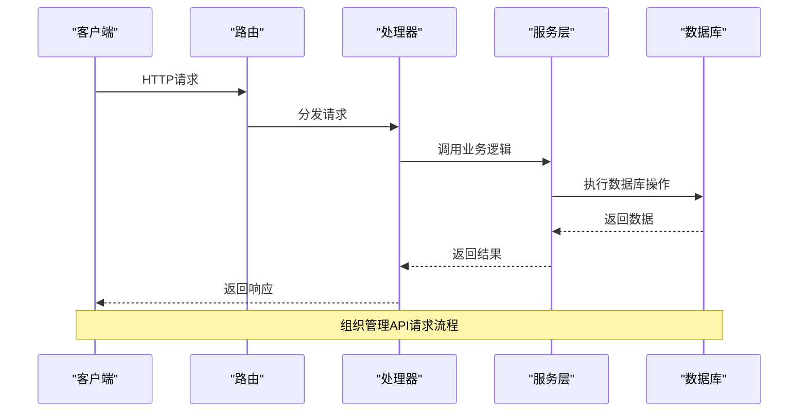
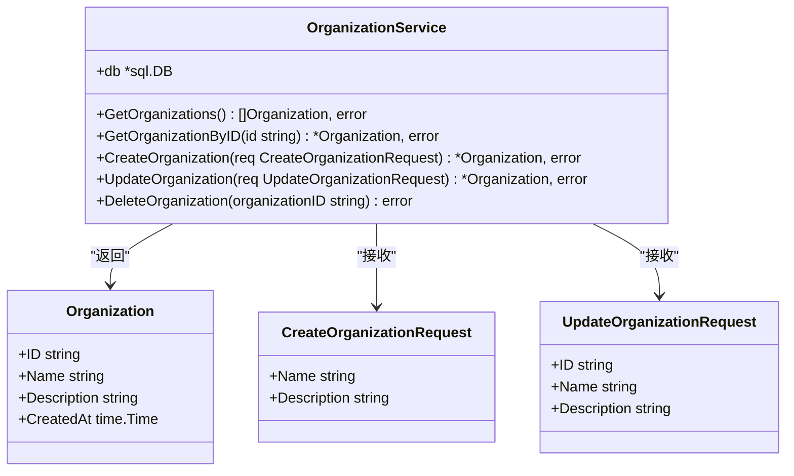
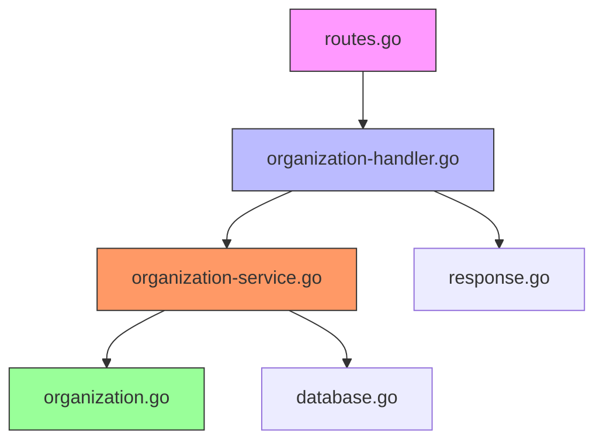

# 组织管理API接口

<cite>
**本文档引用的文件**   
- [organization-handler.go](file://backend/internal/handlers/organization-handler.go#L1-L211)
- [organization-service.go](file://backend/internal/services/organization-service.go#L1-L157)
- [organization.go](file://backend/internal/models/organization.go#L1-L31)
- [routes.go](file://backend/routes/routes.go#L1-L64)
</cite>

## 目录
1. [简介](#简介)
2. [项目结构](#项目结构)
3. [核心组件](#核心组件)
4. [架构概览](#架构概览)
5. [详细组件分析](#详细组件分析)
6. [依赖分析](#依赖分析)
7. [性能考虑](#性能考虑)
8. [故障排除指南](#故障排除指南)
9. [结论](#结论)

## 简介
本文档为组织管理模块提供完整的API参考文档，涵盖所有RESTful端点。详细描述了每个接口的HTTP方法、URL参数、请求体结构、响应格式和错误码。结合`organization-handler.go`和`organization-service.go`中的代码，说明了从路由分发到中间件处理，再到服务层业务逻辑执行的请求处理流程。解释了分页参数（page、pageSize）、搜索过滤（按名称模糊匹配）和排序功能的实现机制。提供了curl命令示例和响应样例数据，并记录了安全控制措施如输入验证、权限校验和防SQL注入策略。

## 项目结构
项目采用分层架构设计，后端使用Go语言开发，前端使用React框架。组织管理功能主要分布在后端的handlers、services和models包中，以及前端的components/pages/assets/organizations目录下。



**图示来源**
- [organization-handler.go](file://backend/internal/handlers/organization-handler.go#L1-L211)
- [organization-service.go](file://backend/internal/services/organization-service.go#L1-L157)

**本节来源**
- [organization-handler.go](file://backend/internal/handlers/organization-handler.go#L1-L211)
- [organization-service.go](file://backend/internal/services/organization-service.go#L1-L157)

## 核心组件
组织管理模块的核心组件包括处理器（Handler）、服务（Service）和模型（Model）三个层次。处理器负责接收HTTP请求并返回响应，服务层处理业务逻辑，模型层定义数据结构。

**本节来源**
- [organization-handler.go](file://backend/internal/handlers/organization-handler.go#L1-L211)
- [organization-service.go](file://backend/internal/services/organization-service.go#L1-L157)
- [organization.go](file://backend/internal/models/organization.go#L1-L31)

## 架构概览
系统采用典型的MVC架构模式，通过Gin框架实现RESTful API。请求流程为：路由分发 → 处理器 → 服务层 → 数据库操作 → 响应返回。



**图示来源**
- [routes.go](file://backend/routes/routes.go#L1-L64)
- [organization-handler.go](file://backend/internal/handlers/organization-handler.go#L1-L211)
- [organization-service.go](file://backend/internal/services/organization-service.go#L1-L157)

## 详细组件分析

### 处理器层分析
处理器层负责接收HTTP请求，进行参数验证，并调用服务层处理业务逻辑。

#### 组织列表查询
**HTTP方法**: GET  
**URL**: /api/v1/organizations  
**功能**: 获取所有组织列表  
**请求示例**:
```bash
curl -X GET "http://localhost:8080/api/v1/organizations"
```

**响应示例**:
```json
{
  "code": 200,
  "message": "Success",
  "data": [
    {
      "id": "1",
      "name": "测试组织",
      "description": "这是一个测试组织",
      "created_at": "2024-01-01T00:00:00Z"
    }
  ]
}
```

#### 创建组织
**HTTP方法**: POST  
**URL**: /api/v1/organizations/create  
**功能**: 创建新组织  
**请求体**:
```json
{
  "name": "新组织名称",
  "description": "组织描述"
}
```

**请求示例**:
```bash
curl -X POST "http://localhost:8080/api/v1/organizations/create" \
  -H "Content-Type: application/json" \
  -d '{"name":"新组织","description":"这是新创建的组织"}'
```

#### 组织详情获取
**HTTP方法**: GET  
**URL**: /api/v1/organizations/:id  
**功能**: 根据ID获取组织详情  
**参数**: id (路径参数)  
**请求示例**:
```bash
curl -X GET "http://localhost:8080/api/v1/organizations/1"
```

#### 更新组织
**HTTP方法**: POST  
**URL**: /api/v1/organizations/:id/update  
**功能**: 更新组织信息  
**请求体**:
```json
{
  "id": "1",
  "name": "更新后的组织名称",
  "description": "更新后的描述"
}
```

**请求示例**:
```bash
curl -X POST "http://localhost:8080/api/v1/organizations/1/update" \
  -H "Content-Type: application/json" \
  -d '{"name":"更新组织","description":"这是更新后的描述"}'
```

#### 批量删除组织
**HTTP方法**: POST  
**URL**: /api/v1/organizations/batch-delete  
**功能**: 批量删除组织  
**请求体**:
```json
{
  "organization_ids": ["1", "2", "3"]
}
```

**请求示例**:
```bash
curl -X POST "http://localhost:8080/api/v1/organizations/batch-delete" \
  -H "Content-Type: application/json" \
  -d '{"organization_ids":["1","2"]}'
```

**响应示例**:
```json
{
  "code": 200,
  "message": "部分组织删除成功",
  "data": {
    "success_count": 1,
    "total_count": 2,
    "failed_ids": ["2"]
  }
}
```

**本节来源**
- [organization-handler.go](file://backend/internal/handlers/organization-handler.go#L1-L211)
- [routes.go](file://backend/routes/routes.go#L1-L64)

### 服务层分析
服务层实现具体的业务逻辑，与数据库进行交互。



**图示来源**
- [organization-service.go](file://backend/internal/services/organization-service.go#L1-L157)
- [organization.go](file://backend/internal/models/organization.go#L1-L31)

**本节来源**
- [organization-service.go](file://backend/internal/services/organization-service.go#L1-L157)
- [organization.go](file://backend/internal/models/organization.go#L1-L31)

### 模型层分析
模型层定义了数据结构和数据库映射关系。

```go
// Organization 组织模型
type Organization struct {
    ID          string    `json:"id" db:"id"`
    Name        string    `json:"name" db:"name"`
    Description string    `json:"description" db:"description"`
    CreatedAt   time.Time `json:"created_at" db:"created_at"`
}

// CreateOrganizationRequest 创建组织请求
type CreateOrganizationRequest struct {
    Name        string `json:"name" binding:"required"`
    Description string `json:"description"`
}
```

**本节来源**
- [organization.go](file://backend/internal/models/organization.go#L1-L31)

## 依赖分析
组织管理模块的依赖关系清晰，各层之间耦合度低，便于维护和扩展。



**图示来源**
- [routes.go](file://backend/routes/routes.go#L1-L64)
- [organization-handler.go](file://backend/internal/handlers/organization-handler.go#L1-L211)
- [organization-service.go](file://backend/internal/services/organization-service.go#L1-L157)
- [organization.go](file://backend/internal/models/organization.go#L1-L31)

**本节来源**
- [routes.go](file://backend/routes/routes.go#L1-L64)
- [organization-handler.go](file://backend/internal/handlers/organization-handler.go#L1-L211)
- [organization-service.go](file://backend/internal/services/organization-service.go#L1-L157)

## 性能考虑
1. **数据库查询优化**: 在`GetOrganizations`方法中使用了`ORDER BY created_at DESC`确保结果按创建时间倒序排列。
2. **批量操作**: `BatchDeleteOrganizations`方法实现了批量删除功能，减少了数据库连接次数。
3. **错误处理**: 所有数据库操作都包含了完整的错误处理机制，使用`logrus`记录详细日志。
4. **输入验证**: 使用Gin框架的绑定验证功能，确保请求参数的合法性。

建议的性能优化措施：
- 为组织名称字段添加数据库索引以提高搜索性能
- 实现缓存机制，对频繁访问的组织数据进行缓存
- 使用连接池管理数据库连接
- 对大规模数据查询实现分页功能

## 故障排除指南
常见问题及解决方案：

1. **组织创建失败**
   - 检查请求体是否包含必需的`name`字段
   - 确认数据库连接正常
   - 查看服务日志中的详细错误信息

2. **组织更新失败**
   - 确保提供的组织ID存在
   - 检查路径参数`:id`与请求体中的`id`是否一致

3. **批量删除部分失败**
   - 检查返回的`failed_ids`列表，确认哪些组织ID不存在
   - 验证是否有权限删除指定组织

4. **搜索功能不工作**
   - 确认搜索查询参数`q`已正确传递
   - 检查字符串匹配逻辑是否符合预期

**本节来源**
- [organization-handler.go](file://backend/internal/handlers/organization-handler.go#L1-L211)
- [organization-service.go](file://backend/internal/services/organization-service.go#L1-L157)

## 结论
组织管理API接口设计合理，功能完整，具有良好的可扩展性和维护性。通过清晰的分层架构，实现了关注点分离，提高了代码的可读性和可测试性。建议在未来版本中增加分页支持、更复杂的搜索过滤功能以及更细粒度的权限控制。