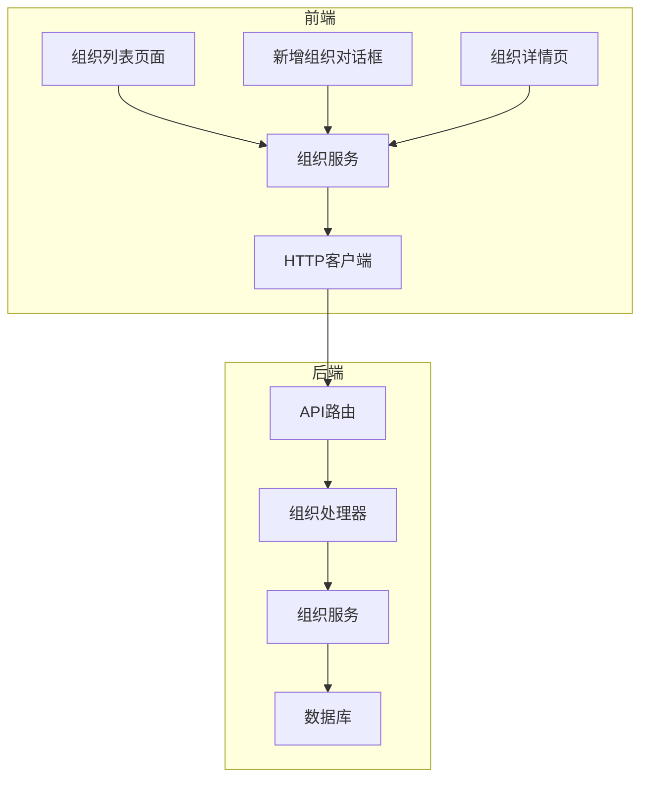
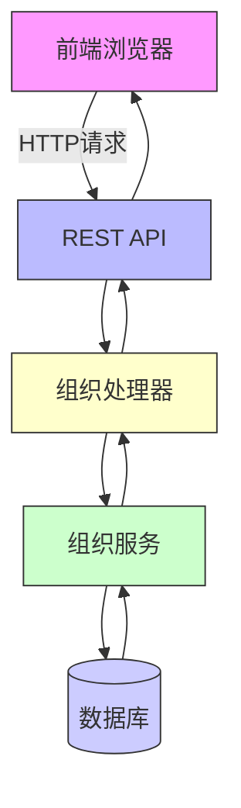
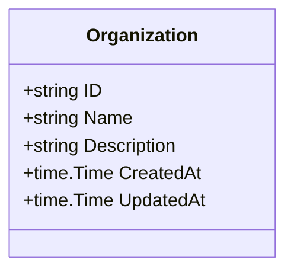
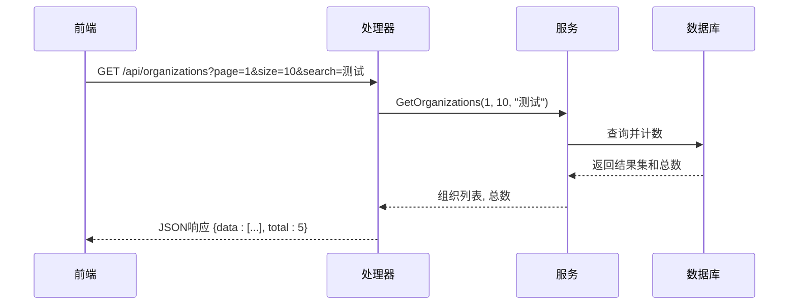
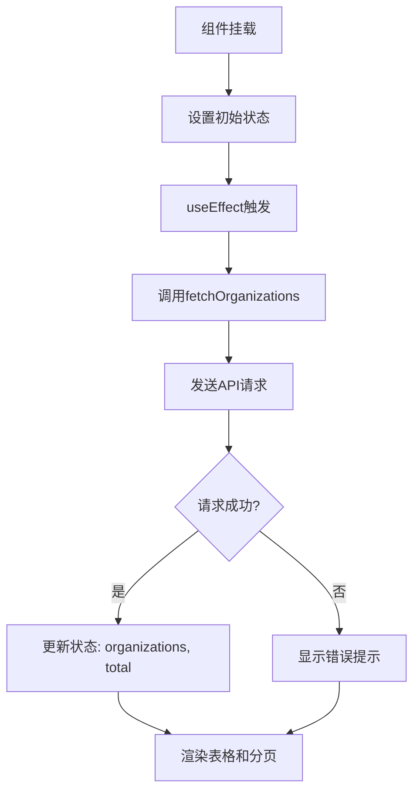
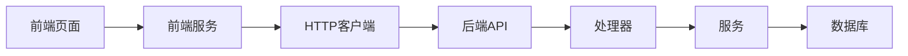

# 组织管理模块

<cite>
**本文档引用文件**  
- [organization-handler.go](file://backend/internal/handlers/organization-handler.go)
- [organization-service.go](file://backend/internal/services/organization-service.go)
- [organization.go](file://backend/internal/models/organization.go)
- [routes.go](file://backend/routes/routes.go)
- [organization.service.ts](file://front/services/organization.service.ts)
- [organization-list.tsx](file://front/components/pages/assets/organizations/organization-list.tsx)
- [add-organization-dialog.tsx](file://front/components/pages/assets/organizations/add-organization-dialog.tsx)
- [organization-detail.tsx](file://front/components/pages/assets/organizations/organization-detail.tsx)
- [page.tsx](file://front/app/assets/organizations/page.tsx)
</cite>

## 目录
1. [简介](#简介)
2. [项目结构](#项目结构)
3. [核心组件](#核心组件)
4. [架构概览](#架构概览)
5. [详细组件分析](#详细组件分析)
6. [依赖关系分析](#依赖关系分析)
7. [性能考虑](#性能考虑)
8. [故障排查指南](#故障排查指南)
9. [结论](#结论)

## 简介
组织管理模块是漏洞扫描系统中的核心功能之一，用于实现企业级多租户环境下的组织隔离与资源管理。该模块支持组织的创建、读取、更新、删除（CRUD）操作，提供搜索过滤、批量删除和分页功能，并与资产（如主域名）建立关联关系。通过RESTful API实现前后端交互，前端采用React组件实时更新组织列表。本模块确保不同组织间的数据隔离，适用于大型企业或服务提供商对多个客户进行安全管理的场景。

## 项目结构
组织管理模块在前后端分别具有清晰的分层结构：

- **后端**：位于 `backend/internal/` 目录下，分为 `handlers`、`services` 和 `models` 三层。
  - `handlers/organization-handler.go`：处理HTTP请求，定义API路由。
  - `services/organization-service.go`：封装业务逻辑，调用数据库操作。
  - `models/organization.go`：定义组织数据模型。
- **前端**：位于 `front/` 目录下，基于Next.js架构。
  - `app/assets/organizations/`：页面路由入口。
  - `components/pages/assets/organizations/`：包含组织列表、详情、新增对话框等UI组件。
  - `services/organization.service.ts`：封装对后端API的HTTP调用。



**图示来源**
- [organization-handler.go](file://backend/internal/handlers/organization-handler.go#L1-L10)
- [organization.service.ts](file://front/services/organization.service.ts#L1-L15)

**本节来源**
- [organization-handler.go](file://backend/internal/handlers/organization-handler.go#L1-L20)
- [organization.service.ts](file://front/services/organization.service.ts#L1-L20)

## 核心组件
组织管理模块的核心组件包括：
- **组织模型（Organization Model）**：定义组织实体结构，包含ID、名称、描述、创建时间等字段。
- **组织服务（Organization Service）**：实现CRUD逻辑，处理事务和数据验证。
- **组织处理器（Organization Handler）**：暴露REST API接口，处理HTTP请求与响应。
- **组织前端服务（Frontend Organization Service）**：封装axios调用，统一处理错误和认证。
- **组织列表组件（Organization List Component）**：展示组织数据表，支持分页、搜索和批量操作。

这些组件共同协作，完成从用户交互到数据持久化的完整流程。

**本节来源**
- [organization.go](file://backend/internal/models/organization.go#L5-L30)
- [organization-service.go](file://backend/internal/services/organization-service.go#L10-L40)
- [organization-handler.go](file://backend/internal/handlers/organization-handler.go#L5-L25)

## 架构概览
系统采用典型的前后端分离架构，组织管理模块遵循MVC设计模式，后端使用Go语言实现，前端使用React + Next.js构建。



**图示来源**
- [routes.go](file://backend/routes/routes.go#L15-L30)
- [organization-handler.go](file://backend/internal/handlers/organization-handler.go#L1-L20)

## 详细组件分析

### 组织模型分析
组织模型定义了数据库中组织表的结构，包含基本属性和时间戳。

```go
type Organization struct {
    ID          string    `json:"id" gorm:"primaryKey"`
    Name        string    `json:"name" gorm:"not null;uniqueIndex"`
    Description string    `json:"description"`
    CreatedAt   time.Time `json:"createdAt"`
    UpdatedAt   time.Time `json:"updatedAt"`
}
```

该结构体通过GORM映射到数据库，`Name`字段具有唯一索引，防止重复命名。



**图示来源**
- [organization.go](file://backend/internal/models/organization.go#L5-L15)

**本节来源**
- [organization.go](file://backend/internal/models/organization.go#L1-L20)

### 组织服务分析
组织服务实现了核心业务逻辑，包括创建、查询、更新、删除和批量删除功能。

```go
func (s *OrganizationService) CreateOrganization(org *model.Organization) error {
    return s.db.Create(org).Error
}

func (s *OrganizationService) GetOrganizations(page, pageSize int, search string) ([]model.Organization, int64, error) {
    var organizations []model.Organization
    var total int64

    query := s.db.Model(&model.Organization{})
    if search != "" {
        query = query.Where("name LIKE ?", "%"+search+"%")
    }

    query.Count(&total)
    query.Offset((page - 1) * pageSize).Limit(pageSize).Find(&organizations)

    return organizations, total, nil
}
```

服务层使用GORM构建动态查询，支持分页和模糊搜索，并返回总记录数用于前端分页控件。



**图示来源**
- [organization-service.go](file://backend/internal/services/organization-service.go#L20-L60)
- [organization-handler.go](file://backend/internal/handlers/organization-handler.go#L30-L50)

**本节来源**
- [organization-service.go](file://backend/internal/services/organization-service.go#L1-L80)

### 组织处理器分析
处理器负责接收HTTP请求，调用服务层方法，并返回标准化响应。

```go
func (h *OrganizationHandler) GetOrganizations(c *gin.Context) {
    page := getIntQuery(c, "page", 1)
    size := getIntQuery(c, "size", 10)
    search := c.Query("search")

    organizations, total, err := h.Service.GetOrganizations(page, size, search)
    if err != nil {
        response.Error(c, 500, err.Error())
        return
    }

    response.Success(c, gin.H{
        "list":  organizations,
        "total": total,
        "page":  page,
        "size":  size,
    })
}
```

处理器使用Gin框架解析参数，调用服务层，并通过统一响应格式返回数据。

**本节来源**
- [organization-handler.go](file://backend/internal/handlers/organization-handler.go#L25-L45)

### 前端组织服务分析
前端通过TypeScript封装API调用，提高代码复用性和可维护性。

```typescript
export const getOrganizations = (params: {
  page: number;
  size: number;
  search?: string;
}) => {
  return httpClient.get('/organizations', { params });
};

export const createOrganization = (data: {
  name: string;
  description: string;
}) => {
  return httpClient.post('/organizations', data);
};
```

`httpClient`基于axios配置了基础URL和认证头，确保所有请求自动携带Token。

**本节来源**
- [organization.service.ts](file://front/services/organization.service.ts#L5-L25)

### 前端组织列表组件分析
组织列表组件使用React函数式组件和Hooks实现状态管理和副作用处理。

```tsx
const OrganizationList = () => {
  const [organizations, setOrganizations] = useState<Organization[]>([]);
  const [total, setTotal] = useState(0);
  const [loading, setLoading] = useState(false);
  const [page, setPage] = useState(1);
  const [size, setSize] = useState(10);
  const [search, setSearch] = useState('');

  useEffect(() => {
    fetchOrganizations();
  }, [page, size, search]);

  const fetchOrganizations = async () => {
    setLoading(true);
    const res = await getOrganizations({ page, size, search });
    setOrganizations(res.data.list);
    setTotal(res.data.total);
    setLoading(false);
  };

  return (
    <div>
      <SearchBar onSearch={setSearch} />
      <Table data={organizations} loading={loading} />
      <Pagination total={total} current={page} onChange={setPage} />
    </div>
  );
};
```

组件通过`useEffect`监听分页和搜索变化，自动刷新数据，并使用自定义分页组件实现分页控制。



**图示来源**
- [organization-list.tsx](file://front/components/pages/assets/organizations/organization-list.tsx#L10-L50)

**本节来源**
- [organization-list.tsx](file://front/components/pages/assets/organizations/organization-list.tsx#L1-L100)
- [organization.service.ts](file://front/services/organization.service.ts#L1-L30)

## 依赖关系分析
组织管理模块的依赖关系清晰，各层之间单向依赖，避免循环引用。



- 前端组件依赖服务层进行数据获取。
- 后端处理器依赖服务层实现业务逻辑。
- 服务层依赖数据库进行持久化操作。
- 所有HTTP通信通过REST API进行，接口定义清晰。

**图示来源**
- [routes.go](file://backend/routes/routes.go#L10-L25)
- [organization-handler.go](file://backend/internal/handlers/organization-handler.go#L1-L15)

**本节来源**
- [routes.go](file://backend/routes/routes.go#L1-L30)
- [organization.service.ts](file://front/services/organization.service.ts#L1-L10)

## 性能考虑
为提升组织管理模块的性能，建议采取以下优化措施：

1. **数据库索引优化**：为`name`字段添加唯一索引，加速搜索查询。
2. **分页查询**：始终使用分页避免全表扫描，限制单次返回数据量。
3. **缓存策略**：对频繁读取但不常变更的组织数据使用Redis缓存。
4. **前端防抖搜索**：在搜索输入框添加防抖（debounce），减少无效请求。
5. **懒加载**：对于组织详情页，采用按需加载方式获取关联资产数据。
6. **连接池配置**：合理设置数据库连接池大小，避免连接耗尽。

这些优化可显著提升系统响应速度和并发处理能力。

## 故障排查指南
以下是组织管理模块常见问题及解决方案：

| 问题现象 | 可能原因 | 解决方案 |
|--------|--------|--------|
| 创建组织失败，返回500错误 | 名称重复或数据库约束冲突 | 检查日志中GORM错误信息，确认是否违反唯一索引 |
| 搜索无结果 | 搜索参数未正确传递或SQL LIKE语法错误 | 使用调试工具检查请求URL和后端查询语句 |
| 分页不生效 | page或size参数未正确解析 | 检查处理器中参数解析逻辑，确保默认值设置正确 |
| 并发创建相同名称组织 | 缺少分布式锁或事务控制 | 在服务层添加事务，并在数据库层面依赖唯一约束保证一致性 |
| 权限校验失败 | Token缺失或过期 | 确保前端请求携带有效JWT Token，检查认证中间件配置 |

**本节来源**
- [organization-handler.go](file://backend/internal/handlers/organization-handler.go#L40-L70)
- [organization-service.go](file://backend/internal/services/organization-service.go#L50-L80)

## 结论
组织管理模块作为漏洞扫描系统的基础功能，实现了完整的CRUD操作和高效的数据展示。其前后端分离架构清晰，代码职责分明，易于维护和扩展。通过RESTful API实现前后端通信，结合分页、搜索和缓存机制，保障了良好的用户体验和系统性能。未来可进一步增强权限控制、审计日志和Webhook通知功能，以满足更复杂的企业级需求。