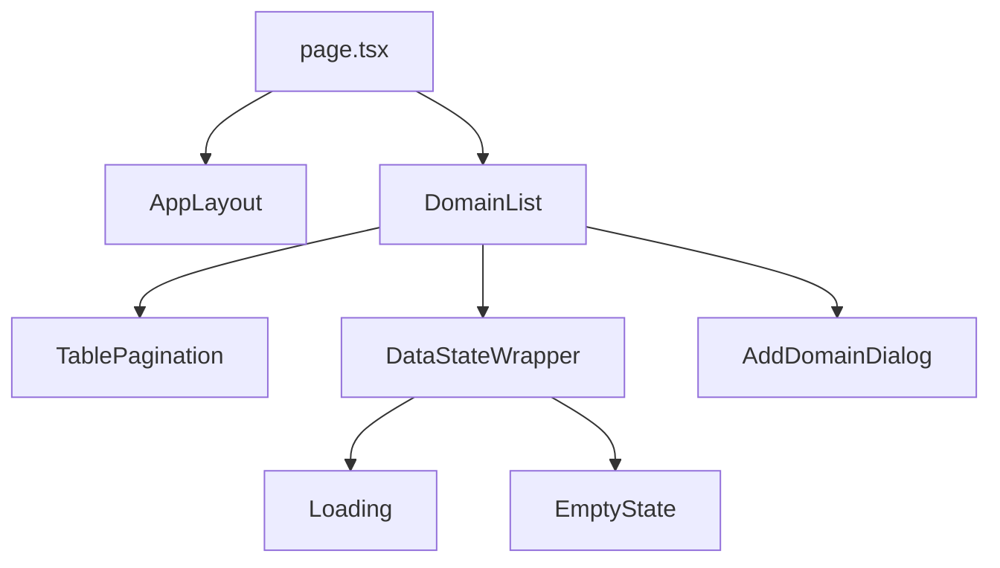
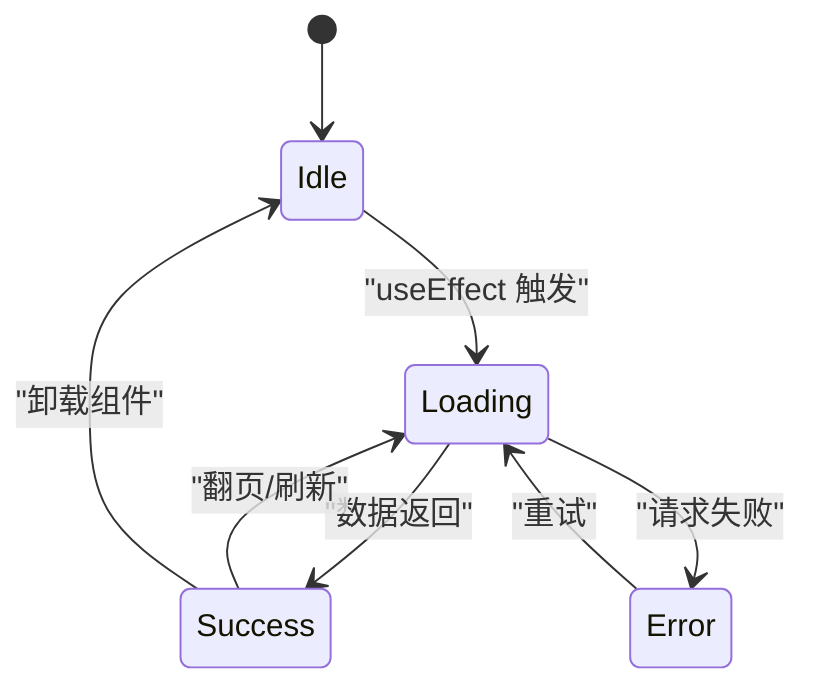
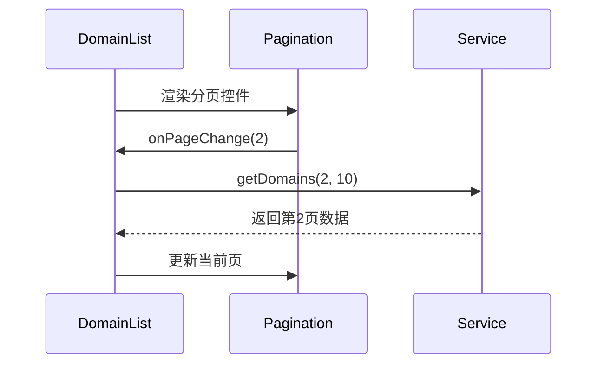
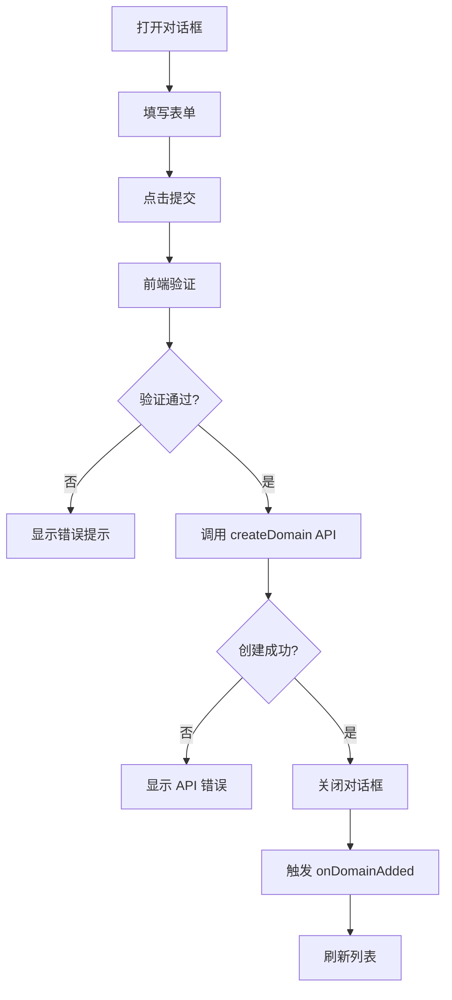

# 前端资产组件

<cite>
**本文档中引用的文件**  
- [domain-list.tsx](file://front/components/pages/assets/domains/domain-list.tsx)
- [add-domain-dialog.tsx](file://front/components/pages/assets/domains/add-domain-dialog.tsx)
- [page.tsx](file://front/app/assets/domains/page.tsx)
- [table-pagination.tsx](file://front/components/common/table-pagination.tsx)
- [domain.service.ts](file://front/services/domain.service.ts)
- [data-state-wrapper.tsx](file://front/components/common/data-state-wrapper.tsx)
- [empty-state.tsx](file://front/components/common/empty-state.tsx)
- [loading.tsx](file://front/components/common/loading.tsx)
- [domain-handler.go](file://backend/internal/handlers/domain-handler.go)
- [domain-service.go](file://backend/internal/services/domain-service.go)
- [domain.go](file://backend/internal/models/domain.go)
</cite>

## 目录
1. [简介](#简介)
2. [项目结构](#项目结构)
3. [核心组件分析](#核心组件分析)
4. [资产列表渲染机制](#资产列表渲染机制)
5. [分页与状态管理](#分页与状态管理)
6. [添加域名对话框实现](#添加域名对话框实现)
7. [页面布局与组件集成](#页面布局与组件集成)
8. [可访问性与性能优化](#可访问性与性能优化)
9. [使用示例](#使用示例)

## 简介
本文档深入分析前端资产管理模块中的核心组件，重点围绕域名资产列表的展示、交互逻辑、状态管理及与后端服务的集成机制。文档详细说明了如何通过 `domain.service.ts` 发起分页请求，处理加载、空状态和错误状态的 UI 展示，并解析添加域名对话框的表单验证与提交流程。同时，结合 `table-pagination.tsx` 阐述分页控件的复用设计，最后提供组件集成示例。

## 项目结构
前端资产组件主要位于 `front/components/pages/assets/domains/` 目录下，采用模块化设计，分离了列表展示、详情页、对话框等不同功能单元。整体结构清晰，遵循 React 组件最佳实践。



**图示来源**  
- [page.tsx](file://front/app/assets/domains/page.tsx)
- [domain-list.tsx](file://front/components/pages/assets/domains/domain-list.tsx)
- [table-pagination.tsx](file://front/components/common/table-pagination.tsx)

**本节来源**  
- [page.tsx](file://front/app/assets/domains/page.tsx#L1-L50)
- [domain-list.tsx](file://front/components/pages/assets/domains/domain-list.tsx#L1-L30)

## 核心组件分析
资产列表功能由多个可复用组件协同完成，主要包括：
- **DomainList**: 主列表组件，负责数据获取、状态管理和 UI 渲染
- **AddDomainDialog**: 模态对话框，用于添加新域名
- **TablePagination**: 通用分页控件，支持回调机制
- **DataStateWrapper**: 状态包装器，统一处理加载、空数据、错误等状态

这些组件通过 props 和回调函数进行通信，实现了高内聚、低耦合的设计。

**本节来源**  
- [domain-list.tsx](file://front/components/pages/assets/domains/domain-list.tsx#L10-L50)
- [add-domain-dialog.tsx](file://front/components/pages/assets/domains/add-domain-dialog.tsx#L5-L30)
- [table-pagination.tsx](file://front/components/common/table-pagination.tsx#L1-L20)

## 资产列表渲染机制

### 数据获取与 API 调用
`domain-list.tsx` 组件通过调用 `domain.service.ts` 中的 `getDomains` 方法获取分页数据。该服务封装了 Axios 请求，与后端 `domain-handler.go` 提供的 REST API 进行通信。

```typescript
// domain.service.ts
const getDomains = async (page: number, pageSize: number) => {
  return await http.get('/domains', {
    params: { page, pageSize }
  });
};
```

后端路由 `/domains` 由 `domain-handler.go` 处理，调用 `domain-service.go` 执行数据库查询并返回分页结果。

### 状态管理与 UI 展示
组件使用 React 的 `useState` 和 `useEffect` 管理以下状态：
- `domains`: 存储域名数据列表
- `loading`: 控制加载状态显示
- `error`: 捕获请求异常
- `pagination`: 分页信息（当前页、总页数等）

通过 `DataStateWrapper` 组件统一处理不同状态的 UI 展示：
- 当 `loading` 为 true 时，显示 `<Loading />` 组件
- 当数据为空且非加载状态时，显示 `<EmptyState />`
- 当 `error` 存在时，展示错误提示
- 正常状态下渲染表格和分页控件



**图示来源**  
- [domain.service.ts](file://front/services/domain.service.ts#L10-L25)
- [domain-handler.go](file://backend/internal/handlers/domain-handler.go#L15-L40)

**本节来源**  
- [domain-list.tsx](file://front/components/pages/assets/domains/domain-list.tsx#L50-L120)
- [data-state-wrapper.tsx](file://front/components/common/data-state-wrapper.tsx#L5-L40)
- [loading.tsx](file://front/components/common/loading.tsx)
- [empty-state.tsx](file://front/components/common/empty-state.tsx)

## 分页与状态管理

### 分页控件设计
`table-pagination.tsx` 是一个通用分页组件，支持以下功能：
- 显示当前页码和总页数
- 上一页/下一页按钮
- 页码跳转
- 每页显示数量选择（可选）

该组件通过回调函数与父组件通信：
- `onPageChange`: 页码变更时触发
- `onPageSizeChange`: 每页数量变更时触发



**图示来源**  
- [table-pagination.tsx](file://front/components/common/table-pagination.tsx#L15-L60)
- [domain-list.tsx](file://front/components/pages/assets/domains/domain-list.tsx#L80-L100)

**本节来源**  
- [table-pagination.tsx](file://front/components/common/table-pagination.tsx#L1-L80)
- [domain-list.tsx](file://front/components/pages/assets/domains/domain-list.tsx#L75-L110)

## 添加域名对话框实现

### 表单验证机制
`add-domain-dialog.tsx` 使用 React Hook Form 进行表单管理，结合 Zod 或 Yup 实现表单验证。主要验证规则包括：
- 域名格式（必须符合 URL 标准）
- 必填字段校验
- 长度限制

### 提交流程
1. 用户点击“添加域名”按钮，打开对话框
2. 输入域名信息并提交
3. 前端验证通过后，调用 `domain.service.ts` 的 `createDomain` 方法
4. 成功后关闭对话框并刷新列表
5. 失败时显示错误提示

### 模态框控制
使用 Radix UI 的 `Dialog` 组件实现模态框，通过 `open` 和 `setOpen` 状态控制显示与隐藏。父组件通过 props 传递 `onDomainAdded` 回调函数，在添加成功后更新列表数据。



**图示来源**  
- [add-domain-dialog.tsx](file://front/components/pages/assets/domains/add-domain-dialog.tsx#L20-L90)
- [domain.service.ts](file://front/services/domain.service.ts#L30-L45)

**本节来源**  
- [add-domain-dialog.tsx](file://front/components/pages/assets/domains/add-domain-dialog.tsx#L1-L100)
- [domain.service.ts](file://front/services/domain.service.ts#L30-L50)

## 页面布局与组件集成

### 页面结构
`page.tsx` 是资产列表的页面入口，负责整体布局和组件组合。其结构如下：
```tsx
<AppLayout>
  <PageHeader title="域名资产" />
  <DomainList onRefresh={refresh} />
</AppLayout>
```

### Props 传递机制
父组件通过 props 向子组件传递事件处理器和数据：
- `onAddDomain`: 传递给列表，用于触发添加对话框
- `onDomainAdded`: 传递给对话框，用于添加成功后回调
- `onPageChange`: 传递给分页组件

这种单向数据流设计确保了组件间的清晰通信。

**本节来源**  
- [page.tsx](file://front/app/assets/domains/page.tsx#L10-L40)
- [domain-list.tsx](file://front/components/pages/assets/domains/domain-list.tsx#L1-L20)

## 可访问性与性能优化

### 可访问性（Accessibility）
- 所有交互元素均支持键盘操作
- 表格提供适当的 ARIA 标签
- 对话框支持焦点陷阱（Focus Trap）
- 错误信息通过 `aria-live` 区域播报

### 响应式设计
- 表格在移动设备上自动切换为卡片视图
- 对话框在小屏幕上全屏显示
- 使用 Tailwind CSS 实现响应式布局

### 性能优化
- **虚拟滚动**：对于大量数据，可集成 `react-window` 或 `virtuoso` 实现虚拟滚动，避免渲染性能瓶颈
- **防抖搜索**：若支持搜索功能，对输入进行防抖处理
- **分页加载**：默认仅加载当前页数据，减少初始请求体积
- **组件懒加载**：对话框等非关键组件可延迟加载

**本节来源**  
- [domain-list.tsx](file://front/components/pages/assets/domains/domain-list.tsx#L120-L150)
- [add-domain-dialog.tsx](file://front/components/pages/assets/domains/add-domain-dialog.tsx#L50-L70)

## 使用示例
以下是如何在其他页面中集成资产列表的代码示例：

```tsx
import DomainList from '@/components/pages/assets/domains/domain-list';

export default function CustomAssetPage() {
  const handleDomainAdded = () => {
    console.log('新域名已添加');
    // 可在此处添加自定义逻辑，如刷新统计
  };

  return (
    <div className="p-6">
      <h1 className="text-2xl font-bold mb-4">自定义资产视图</h1>
      <DomainList onDomainAdded={handleDomainAdded} />
    </div>
  );
}
```

此示例展示了如何复用 `DomainList` 组件，并通过 `onDomainAdded` 监听添加事件，实现业务逻辑的扩展。

**本节来源**  
- [domain-list.tsx](file://front/components/pages/assets/domains/domain-list.tsx#L1-L200)
- [page.tsx](file://front/app/assets/domains/page.tsx#L1-L50)