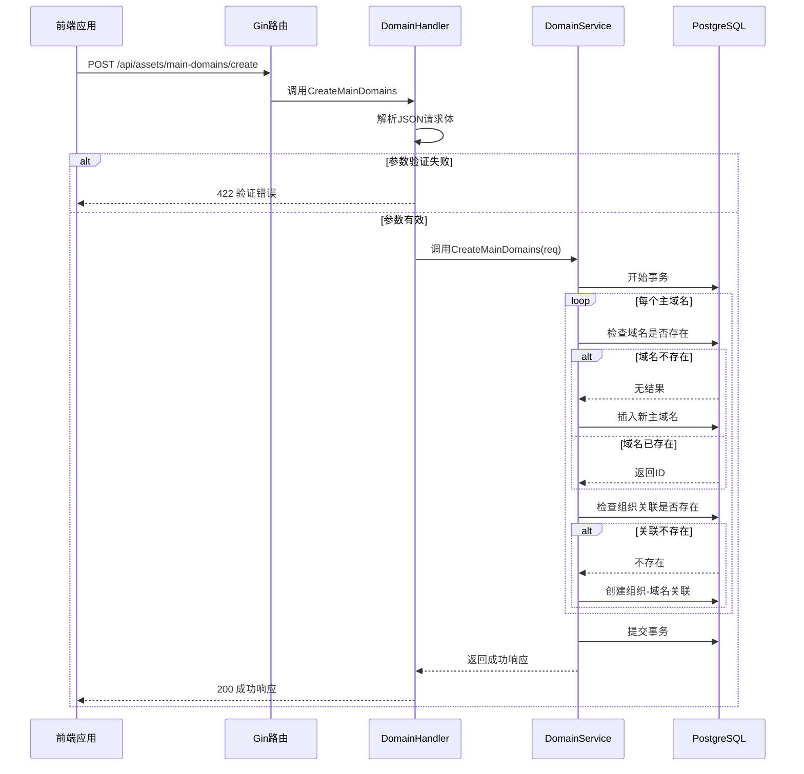
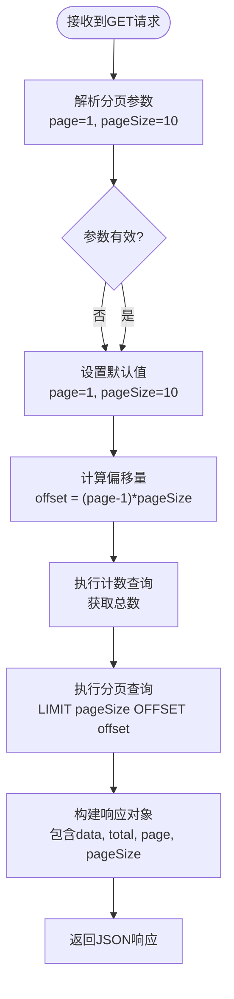

# 资产API接口

<cite>
**本文档引用文件**   
- [domain-handler.go](file://backend/internal/handlers/domain-handler.go)
- [domain-service.go](file://backend/internal/services/domain-service.go)
- [domain.go](file://backend/internal/models/domain.go)
- [response.go](file://backend/internal/utils/response.go)
- [routes.go](file://backend/routes/routes.go)
</cite>

## 目录
1. [简介](#简介)
2. [核心资产接口](#核心资产接口)
3. [请求处理流程](#请求处理流程)
4. [分页查询机制](#分页查询机制)
5. [权限与安全](#权限与安全)
6. [性能优化建议](#性能优化建议)

## 简介
本API文档详细描述了资产管理模块的核心RESTful接口，涵盖主域名和子域名的创建、查询与删除操作。系统采用Gin框架构建，通过分层架构实现请求处理、业务逻辑与数据访问的分离。所有接口均返回标准化的JSON响应格式，确保前端消费的一致性。

## 核心资产接口

### 创建主域名
创建一个或多个主域名并将其关联到指定组织。

**HTTP方法**: `POST`  
**URL路径**: `/api/assets/main-domains/create`  
**认证要求**: 需要有效的用户会话

**请求体结构**:
```json
{
  "main_domains": ["example.com", "test.com"],
  "organization_id": "ORG-001"
}
```

**字段说明**:
- **main_domains**: 主域名字符串数组，不能为空
- **organization_id**: 组织唯一标识符，不能为空

**成功响应 (HTTP 200)**:
```json
{
  "code": "SUCCESS",
  "message": "成功创建 2 个主域名关联，1 个域名已存在: existing.com",
  "data": {
    "success_count": 2,
    "existing_domains": ["existing.com"],
    "total_requested": 3
  }
}
```

**错误响应**:
- **400 Bad Request**: 请求参数缺失或无效
- **422 Unprocessable Entity**: JSON解析失败
- **500 Internal Server Error**: 数据库操作失败

**curl示例**:
```bash
curl -X POST http://localhost:8080/api/assets/main-domains/create \
  -H "Content-Type: application/json" \
  -d '{
    "main_domains": ["example.com", "test.com"],
    "organization_id": "ORG-001"
  }'
```

**Section sources**
- [domain-handler.go](file://backend/internal/handlers/domain-handler.go#L20-L38)
- [domain-service.go](file://backend/internal/services/domain-service.go#L101-L150)
- [domain.go](file://backend/internal/models/domain.go#L29-L34)

### 获取组织主域名列表
获取指定组织关联的所有主域名。

**HTTP方法**: `GET`  
**URL路径**: `/api/organizations/{id}/main-domains`  
**路径参数**:
- **id**: 组织ID (必需)

**成功响应 (HTTP 200)**:
```json
{
  "code": "SUCCESS",
  "message": "操作成功",
  "data": {
    "main_domains": [
      {
        "id": "MD-001",
        "main_domain_name": "example.com",
        "created_at": "2023-01-01T00:00:00Z"
      }
    ]
  }
}
```

**curl示例**:
```bash
curl http://localhost:8080/api/organizations/ORG-001/main-domains
```

**Section sources**
- [domain-handler.go](file://backend/internal/handlers/domain-handler.go#L6-L18)
- [domain-service.go](file://backend/internal/services/domain-service.go#L54-L99)

### 移除组织主域名关联
解除组织与特定主域名的关联关系。

**HTTP方法**: `POST`  
**URL路径**: `/api/organizations/remove-main-domain`  
**请求体结构**:
```json
{
  "organization_id": "ORG-001",
  "main_domain_id": "MD-001"
}
```

**成功响应 (HTTP 200)**:
```json
{
  "code": "SUCCESS",
  "message": "操作成功",
  "data": {
    "message": "主域名关联移除成功"
  }
}
```

**错误响应**:
- **404 Not Found**: 未找到指定的关联关系

**Section sources**
- [domain-handler.go](file://backend/internal/handlers/domain-handler.go#L40-L52)
- [domain-service.go](file://backend/internal/services/domain-service.go#L152-L195)

### 创建子域名
为指定主域名创建一个或多个子域名。

**HTTP方法**: `POST`  
**URL路径**: `/api/assets/sub-domains/create`  
**请求体结构**:
```json
{
  "sub_domains": ["api.example.com", "www.example.com"],
  "main_domain_id": "MD-001",
  "status": "active"
}
```

**字段说明**:
- **sub_domains**: 子域名字符串数组，不能为空
- **main_domain_id**: 主域名ID，不能为空
- **status**: 子域名状态（可选，默认为"unknown"）

**成功响应 (HTTP 200)**:
```json
{
  "code": "SUCCESS",
  "message": "成功创建 2 个子域名，1 个子域名已存在: old.api.example.com",
  "data": {
    "success_count": 2,
    "existing_domains": ["old.api.example.com"],
    "total_requested": 3
  }
}
```

**Section sources**
- [domain-handler.go](file://backend/internal/handlers/domain-handler.go#L101-L115)
- [domain-service.go](file://backend/internal/services/domain-service.go#L280-L322)

### 获取组织子域名列表（分页）
获取指定组织的所有子域名，支持分页查询。

**HTTP方法**: `GET`  
**URL路径**: `/api/organizations/{id}/sub-domains`  
**查询参数**:
- **page**: 页码（可选，默认为1）
- **pageSize**: 每页数量（可选，默认为10，最大100）

**成功响应 (HTTP 200)**:
```json
{
  "code": "SUCCESS",
  "message": "操作成功",
  "data": {
    "sub_domains": [
      {
        "id": "SD-001",
        "sub_domain_name": "api.example.com",
        "main_domain_id": "MD-001",
        "status": "active",
        "created_at": "2023-01-01T00:00:00Z",
        "updated_at": "2023-01-01T00:00:00Z",
        "main_domain": {
          "id": "MD-001",
          "main_domain_name": "example.com",
          "created_at": "2023-01-01T00:00:00Z"
        }
      }
    ],
    "total": 100,
    "page": 1,
    "page_size": 10
  }
}
```

**curl示例**:
```bash
curl "http://localhost:8080/api/organizations/ORG-001/sub-domains?page=1&pageSize=20"
```

**Section sources**
- [domain-handler.go](file://backend/internal/handlers/domain-handler.go#L54-L99)
- [domain-service.go](file://backend/internal/services/domain-service.go#L233-L281)

## 请求处理流程



**Diagram sources**
- [domain-handler.go](file://backend/internal/handlers/domain-handler.go#L20-L38)
- [domain-service.go](file://backend/internal/services/domain-service.go#L101-L150)

## 分页查询机制

### 参数处理逻辑
分页查询通过`page`和`pageSize`两个查询参数控制，处理逻辑如下：

1. 使用`c.DefaultQuery("page", "1")`和`c.DefaultQuery("pageSize", "10")`获取参数
2. 将字符串参数转换为整数
3. 对无效值进行校正：
   - 页码小于1时设为1
   - 每页数量小于1或大于100时设为10

### 响应元数据结构
分页响应包含以下元数据字段：
- **total**: 符合条件的总记录数
- **page**: 当前页码
- **page_size**: 每页显示数量

### SQL查询实现
采用两阶段查询策略：
1. **计数查询**: 使用`COUNT(DISTINCT sd.id)`获取总数
2. **数据查询**: 使用`LIMIT $2 OFFSET $3`实现分页，偏移量计算为`(page-1)*pageSize`



**Diagram sources**
- [domain-handler.go](file://backend/internal/handlers/domain-handler.go#L65-L85)
- [domain-service.go](file://backend/internal/services/domain-service.go#L233-L281)

## 权限与安全

### 组织边界检查
系统通过数据库层面的JOIN查询实现组织边界检查。在查询子域名时，使用三表连接确保只能访问属于该组织的资源：

```sql
SELECT ...
FROM sub_domains sd
INNER JOIN main_domains md ON sd.main_domain_id = md.id
INNER JOIN organization_main_domains omd ON md.id = omd.main_domain_id
WHERE omd.organization_id = $1
```

此设计确保用户无法通过修改请求参数访问其他组织的数据。

### 输入过滤与验证
- **后端验证**: 使用Gin的`binding:"required"`标签进行基本字段验证
- **前端验证**: 在添加域名对话框中实现域名格式正则验证 `/^([a-zA-Z0-9]([a-zA-Z0-9\-]{0,61}[a-zA-Z0-9])?\.)+[a-zA-Z]{2,}$/`
- **SQL注入防护**: 所有数据库查询均使用参数化语句，防止SQL注入攻击

### 错误处理策略
系统采用分层错误处理机制：
- **参数错误**: 返回400状态码
- **验证错误**: 返回422状态码
- **资源未找到**: 返回404状态码
- **服务器错误**: 返回500状态码

所有错误均通过`utils`包中的统一响应函数处理，确保响应格式一致性。

**Section sources**
- [domain-handler.go](file://backend/internal/handlers/domain-handler.go)
- [response.go](file://backend/internal/utils/response.go)
- [add-main-domain-dialog.tsx](file://front/components/pages/assets/organizations/detail/add-main-domain-dialog.tsx#L34-L103)

## 性能优化建议

### 数据库索引优化
为关键查询字段创建索引以提升查询性能：

```sql
-- 主域名表索引
CREATE INDEX idx_main_domains_name ON main_domains(main_domain_name);

-- 子域名表索引
CREATE INDEX idx_sub_domains_main_domain ON sub_domains(main_domain_id);
CREATE INDEX idx_sub_domains_name ON sub_domains(sub_domain_name);

-- 组织关联表复合索引
CREATE INDEX idx_org_main_domains_composite ON organization_main_domains(organization_id, main_domain_id);
```

### 缓存策略
建议实现两级缓存机制：
1. **应用层缓存**: 使用Redis缓存频繁访问的组织域名列表
   - 缓存键: `org:domains:{organization_id}`
   - 过期时间: 5分钟
   - 在创建/删除域名时清除相关缓存

2. **数据库查询优化**: 
   - 对分页查询结果进行缓存
   - 使用连接池管理数据库连接

### 批量操作优化
当前批量创建操作在单个事务中处理所有域名，建议对大量域名的场景进行优化：
- 实现分批处理，每批100个域名
- 提供异步API，立即返回任务ID，通过轮询获取结果
- 添加进度通知机制

**Section sources**
- [domain-service.go](file://backend/internal/services/domain-service.go)
- [database.go](file://backend/pkg/database/database.go)