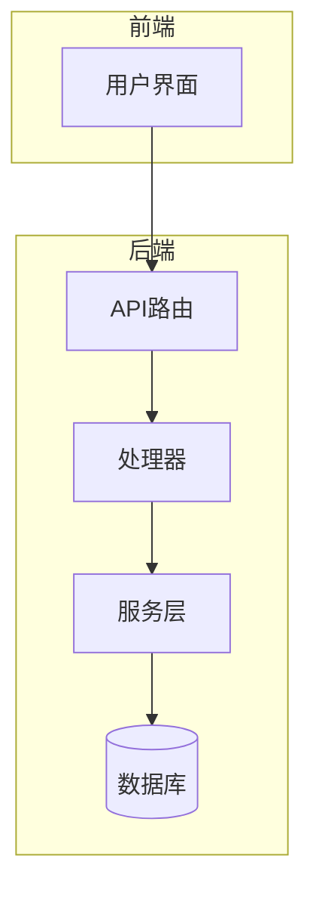
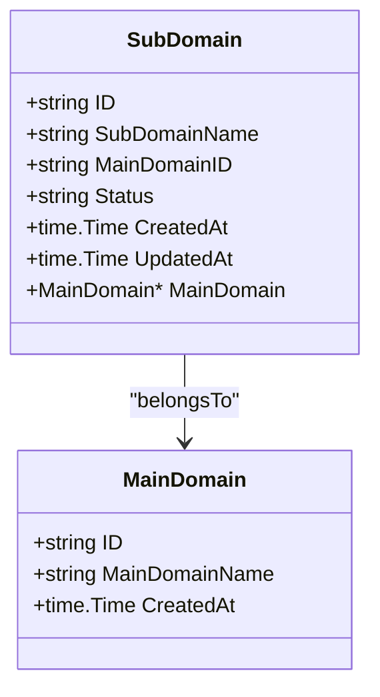
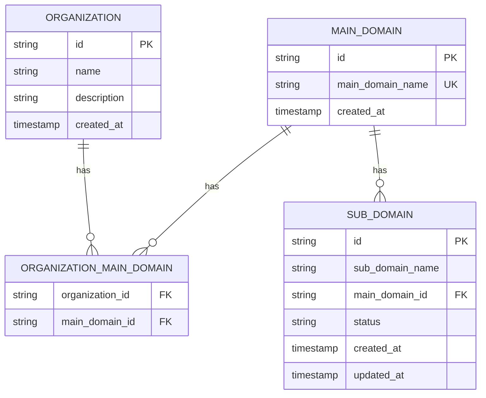
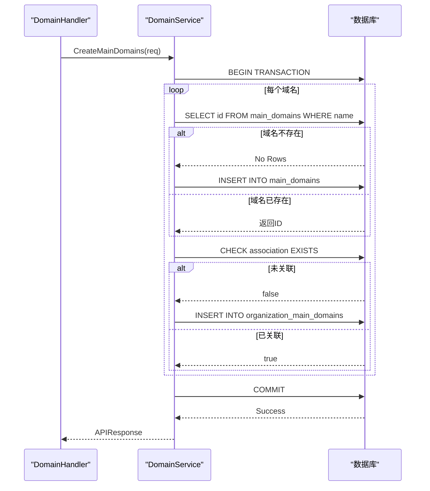
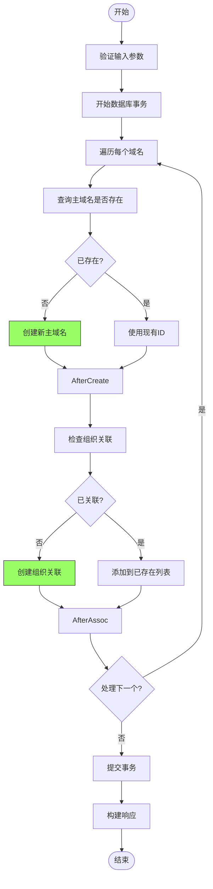

# 资产数据模型

<cite>
**本文档引用的文件**   
- [domain.go](file://backend/internal/models/domain.go)
- [organization.go](file://backend/internal/models/organization.go)
- [domain-service.go](file://backend/internal/services/domain-service.go)
- [organization-service.go](file://backend/internal/services/organization-service.go)
- [初始化.sql](file://backend/初始化.sql)
</cite>

## 目录
1. [引言](#引言)
2. [项目结构](#项目结构)
3. [核心组件](#核心组件)
4. [架构概述](#架构概述)
5. [详细组件分析](#详细组件分析)
6. [依赖分析](#依赖分析)
7. [性能考虑](#性能考虑)
8. [故障排除指南](#故障排除指南)
9. [结论](#结论)

## 引言
本文档详细描述了资产管理模块的数据模型，重点分析主域名（Domain）、子域名（SubDomain）与组织（Organization）之间的实体结构和关联关系。文档涵盖了字段定义、数据类型、验证规则、业务约束、外键关系、GORM映射机制、数据操作示例、数据完整性保障措施以及模型的扩展性设计。

## 项目结构
资产数据模型主要分布在后端的 `models` 和 `services` 目录中，通过数据库表进行持久化存储。

```mermaid
graph TD
subgraph "后端"
subgraph "模型层"
domain_go[domain.go]
organization_go[organization.go]
end
subgraph "服务层"
domain_service_go[domain-service.go]
organization_service_go[organization-service.go]
end
subgraph "数据库"
init_sql[初始化.sql]
end
end
domain_go --> domain_service_go : "被调用"
organization_go --> organization_service_go : "被调用"
domain_service_go --> init_sql : "定义表结构"
organization_service_go --> init_sql : "定义表结构"
```

**图示来源**
- [domain.go](file://backend/internal/models/domain.go)
- [organization.go](file://backend/internal/models/organization.go)
- [domain-service.go](file://backend/internal/services/domain-service.go)
- [organization-service.go](file://backend/internal/services/organization-service.go)
- [初始化.sql](file://backend/初始化.sql)

**本节来源**
- [domain.go](file://backend/internal/models/domain.go)
- [organization.go](file://backend/internal/models/organization.go)

## 核心组件
核心数据模型由 `MainDomain`（主域名）、`SubDomain`（子域名）和 `Organization`（组织）三个实体构成，通过 `OrganizationMainDomain`（组织主域名关联）表建立多对多关系。

**本节来源**
- [domain.go](file://backend/internal/models/domain.go#L5-L15)
- [domain.go](file://backend/internal/models/domain.go#L18-L30)
- [organization.go](file://backend/internal/models/organization.go#L5-L15)

## 架构概述
系统采用分层架构，前端通过API路由调用处理器（Handler），处理器调用服务层（Service），服务层通过数据库包与PostgreSQL数据库交互，实现数据的持久化。



**图示来源**
- [routes.go](file://backend/routes/routes.go)
- [domain-handler.go](file://backend/internal/handlers/domain-handler.go)
- [domain-service.go](file://backend/internal/services/domain-service.go)
- [database.go](file://backend/pkg/database/database.go)

## 详细组件分析

### 主域名与子域名模型分析
`MainDomain` 和 `SubDomain` 模型定义了资产的核心结构，`SubDomain` 通过外键 `MainDomainID` 与 `MainDomain` 建立一对多关系。



**图示来源**
- [domain.go](file://backend/internal/models/domain.go#L5-L30)

**本节来源**
- [domain.go](file://backend/internal/models/domain.go#L5-L30)

### 组织与资产关联模型分析
`Organization` 模型代表一个管理单元，通过中间表 `OrganizationMainDomain` 与 `MainDomain` 建立多对多关系，从而间接管理其下的所有 `SubDomain`。



**图示来源**
- [domain.go](file://backend/internal/models/domain.go)
- [organization.go](file://backend/internal/models/organization.go)
- [初始化.sql](file://backend/初始化.sql)

**本节来源**
- [domain.go](file://backend/internal/models/domain.go)
- [organization.go](file://backend/internal/models/organization.go)
- [初始化.sql](file://backend/初始化.sql)

### 域名服务操作流程分析
`DomainService` 提供了创建和查询域名资产的核心业务逻辑，操作在数据库事务中执行以保证数据一致性。



**图示来源**
- [domain-service.go](file://backend/internal/services/domain-service.go#L54-L99)
- [domain-service.go](file://backend/internal/services/domain-service.go#L99-L130)

**本节来源**
- [domain-service.go](file://backend/internal/services/domain-service.go#L54-L130)

### 创建主域名业务逻辑分析
创建主域名的流程包含域名去重、组织关联检查和事务性写入，确保了数据的唯一性和完整性。



**图示来源**
- [domain-service.go](file://backend/internal/services/domain-service.go#L54-L130)

**本节来源**
- [domain-service.go](file://backend/internal/services/domain-service.go#L54-L130)

## 依赖分析
数据模型的依赖关系清晰，服务层依赖模型层进行数据传输，数据库脚本定义了底层表结构，各组件耦合度低。

```mermaid
graph TD
init_sql[初始化.sql] --> domain_go[domain.go] : "定义结构"
init_sql --> organization_go[organization.go] : "定义结构"
domain_go --> domain_service_go[domain-service.go] : "作为参数/返回值"
organization_go --> organization_service_go[organization-service.go] : "作为参数/返回值"
domain_service_go --> domain_handler_go[domain-handler.go] : "被调用"
organization_service_go --> organization_handler_go[organization-handler.go] : "被调用"
```

**图示来源**
- [domain.go](file://backend/internal/models/domain.go)
- [organization.go](file://backend/internal/models/organization.go)
- [domain-service.go](file://backend/internal/services/domain-service.go)
- [organization-service.go](file://backend/internal/services/organization-service.go)
- [初始化.sql](file://backend/初始化.sql)

**本节来源**
- [domain.go](file://backend/internal/models/domain.go)
- [organization.go](file://backend/internal/models/organization.go)
- [domain-service.go](file://backend/internal/services/domain-service.go)
- [organization-service.go](file://backend/internal/services/organization-service.go)
- [初始化.sql](file://backend/初始化.sql)

## 性能考虑
为提升查询性能，在关键字段上创建了数据库索引，如 `main_domain_name`、`sub_domain_name` 和外键字段，确保了在大数据量下的查询效率。

## 故障排除指南
常见问题包括主域名重复创建和组织关联失败。服务层代码通过事务和 `EXISTS` 查询有效避免了数据重复。日志记录了关键操作，便于追踪问题。

**本节来源**
- [domain-service.go](file://backend/internal/services/domain-service.go#L70-L75)
- [domain-service.go](file://backend/internal/services/domain-service.go#L90-L95)

## 结论
该资产数据模型设计合理，通过清晰的实体划分和关系建模，实现了组织对域名资产的有效管理。模型具备良好的扩展性，为未来支持IP资产或云资产预留了设计空间。