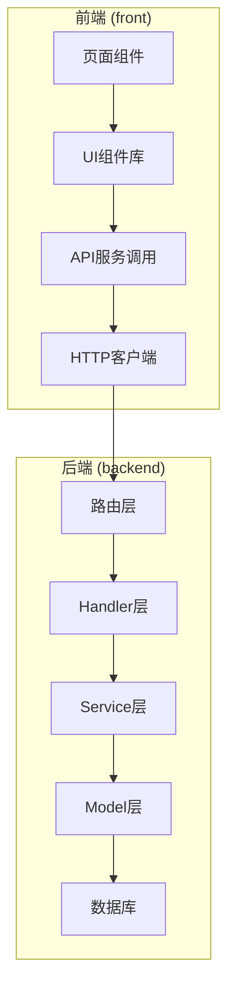
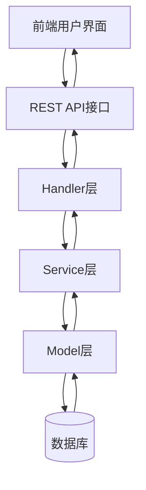
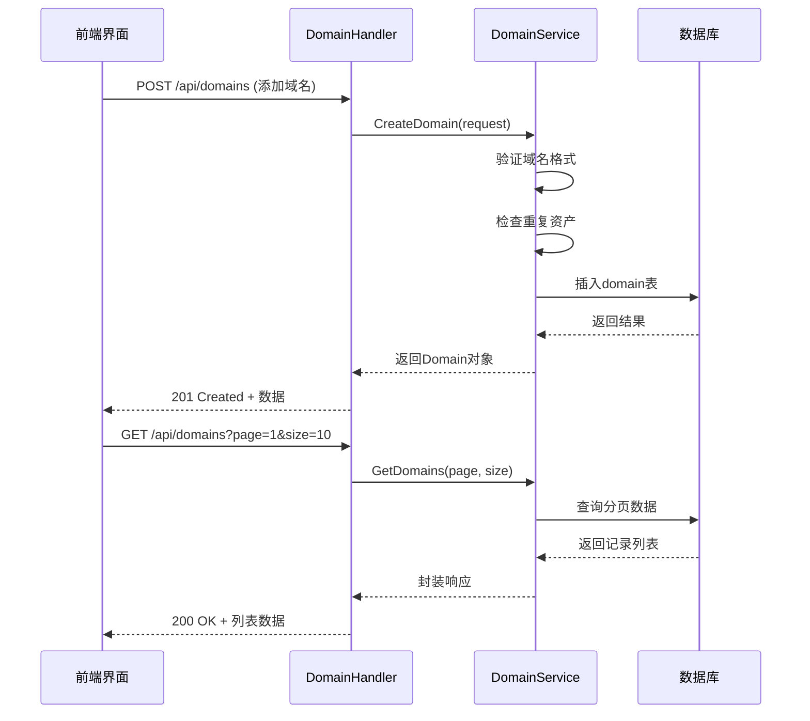
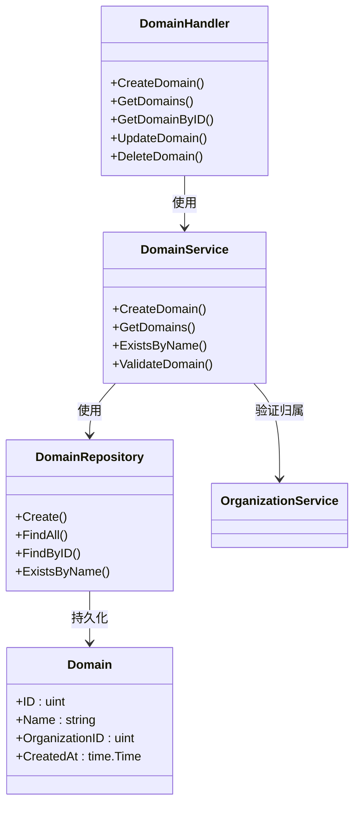

# 资产管理模块

<cite>
**本文档引用文件**  
- [domain-handler.go](file://backend/internal/handlers/domain-handler.go)
- [domain-service.go](file://backend/internal/services/domain-service.go)
- [domain.go](file://backend/internal/models/domain.go)
- [organization-service.go](file://backend/internal/services/organization-service.go)
- [domain-list.tsx](file://front/components/pages/assets/domains/domain-list.tsx)
- [add-domain-dialog.tsx](file://front/components/pages/assets/domains/add-domain-dialog.tsx)
- [domain.service.ts](file://front/services/domain.service.ts)
- [database.go](file://backend/pkg/database/database.go)
- [routes.go](file://backend/routes/routes.go)
</cite>

## 目录
1. [简介](#简介)
2. [项目结构](#项目结构)
3. [核心组件](#核心组件)
4. [架构概览](#架构概览)
5. [详细组件分析](#详细组件分析)
6. [依赖关系分析](#依赖关系分析)
7. [性能考量](#性能考量)
8. [故障排查指南](#故障排查指南)
9. [结论](#结论)

## 简介
本系统为漏洞扫描平台的资产管理模块，主要负责主域名与子域名的全生命周期管理。该模块实现了资产的增删改查（CRUD）操作，支持资产与组织之间的归属关系管理，并通过自动化扫描任务实现资产的持续监控。前端采用React框架结合Next.js进行渲染，后端使用Go语言构建RESTful API服务，数据持久化基于关系型数据库。

## 项目结构
项目采用前后端分离架构，后端遵循分层设计模式（Handler → Service → Model），前端采用组件化开发方式。



**图示来源**
- [routes.go](file://backend/routes/routes.go#L1-L20)
- [domain-handler.go](file://backend/internal/handlers/domain-handler.go#L5-L15)
- [domain-list.tsx](file://front/components/pages/assets/domains/domain-list.tsx#L10-L30)

## 核心组件
资产管理模块的核心功能包括：
- 主域名与子域名的注册、查询、更新和删除
- 资产与组织的归属关系绑定
- 新增资产后自动触发关联扫描任务
- 前端列表分页、筛选与状态加载机制
- 后端API路由解析与数据库操作调用

**本节来源**
- [domain-handler.go](file://backend/internal/handlers/domain-handler.go#L1-L100)
- [domain-service.go](file://backend/internal/services/domain-service.go#L1-L80)
- [domain-list.tsx](file://front/components/pages/assets/domains/domain-list.tsx#L1-L50)

## 架构概览
系统采用典型的MVC分层架构，各层职责清晰，便于维护和扩展。



**图示来源**
- [domain-handler.go](file://backend/internal/handlers/domain-handler.go#L1-L10)
- [domain-service.go](file://backend/internal/services/domain-service.go#L1-L10)
- [domain.go](file://backend/internal/models/domain.go#L1-L10)

## 详细组件分析

### 域名管理功能分析

#### 资产增删改查流程
系统通过标准RESTful接口实现资产的CRUD操作，具体流程如下：



**图示来源**
- [domain-handler.go](file://backend/internal/handlers/domain-handler.go#L20-L60)
- [domain-service.go](file://backend/internal/services/domain-service.go#L30-L90)

#### 资产与组织归属关系实现
资产通过`organization_id`字段与组织建立外键关联，确保每个资产归属于特定组织。

```go
// internal/models/domain.go
type Domain struct {
    ID               uint      `json:"id"`
    Name             string    `json:"name" gorm:"uniqueIndex"`
    OrganizationID   uint      `json:"organization_id"`
    Organization     Organization `json:"organization" gorm:"foreignKey:OrganizationID"`
    CreatedAt        time.Time `json:"created_at"`
    UpdatedAt        time.Time `json:"updated_at"`
}
```

创建资产时需指定组织ID，服务层会验证该组织是否存在：

```go
// internal/services/domain-service.go
func (s *DomainService) CreateDomain(name string, orgID uint) (*models.Domain, error) {
    // 检查组织是否存在
    org, err := s.orgService.GetOrganizationByID(orgID)
    if err != nil {
        return nil, fmt.Errorf("组织不存在: %v", err)
    }

    // 检查域名是否已存在（去重）
    exists, _ := s.domainRepo.ExistsByName(name)
    if exists {
        return nil, fmt.Errorf("域名已存在: %s", name)
    }

    domain := &models.Domain{
        Name:             name,
        OrganizationID:   orgID,
    }
    return s.domainRepo.Create(domain)
}
```

**本节来源**
- [domain.go](file://backend/internal/models/domain.go#L5-L20)
- [domain-service.go](file://backend/internal/services/domain-service.go#L45-L75)

### 前端资产列表渲染逻辑

#### 分页与筛选机制
前端使用`TablePagination`组件实现分页功能，结合`http-client`发起带参数的请求。

```tsx
// front/components/pages/assets/domains/domain-list.tsx
const fetchDomains = async (page: number, size: number, filter?: string) => {
  setLoading(true);
  try {
    const response = await domainService.getDomains(page, size, filter);
    setDomains(response.data);
    setTotal(response.total);
  } catch (error) {
    toast.error('获取域名列表失败');
  } finally {
    setLoading(false);
  }
};
```

分页参数通过URL传递，后端返回标准分页响应结构：

```json
{
  "data": [...],
  "total": 150,
  "page": 1,
  "size": 10,
  "totalPages": 15
}
```

#### 状态加载处理
使用`DataStateWrapper`组件统一处理加载、空状态和错误状态：

```tsx
<DataStateWrapper
  loading={loading}
  error={error}
  isEmpty={domains.length === 0}
  emptyComponent={<EmptyState onAddClick={openAddDialog} />}
>
  <DomainTable domains={domains} />
</DataStateWrapper>
```

**本节来源**
- [domain-list.tsx](file://front/components/pages/assets/domains/domain-list.tsx#L20-L60)
- [domain.service.ts](file://front/services/domain.service.ts#L10-L30)

### API请求处理流程分析

#### 路由与处理函数映射
所有域名相关API由`domain-handler.go`统一处理，并在`routes.go`中注册：

```go
// backend/routes/routes.go
func SetupRoutes(r *gin.Engine) {
    domainGroup := r.Group("/api/domains")
    {
        domainGroup.POST("", domainHandler.CreateDomain)
        domainGroup.GET("", domainHandler.GetDomains)
        domainGroup.GET("/:id", domainHandler.GetDomainByID)
        domainGroup.PUT("/:id", domainHandler.UpdateDomain)
        domainGroup.DELETE("/:id", domainHandler.DeleteDomain)
    }
}
```

#### 请求解析与服务调用
以创建主域名为例，Handler接收请求并调用Service层：

```go
// backend/internal/handlers/domain-handler.go
func (h *DomainHandler) CreateDomain(c *gin.Context) {
    var req struct {
        Name           string `json:"name" binding:"required"`
        OrganizationID uint   `json:"organization_id" binding:"required"`
    }

    if err := c.ShouldBindJSON(&req); err != nil {
        response.Error(c, http.StatusBadRequest, "参数错误: "+err.Error())
        return
    }

    domain, err := h.domainService.CreateDomain(req.Name, req.OrganizationID)
    if err != nil {
        response.Error(c, http.StatusInternalServerError, "创建失败: "+err.Error())
        return
    }

    // 成功后触发扫描任务
    go h.scanService.TriggerScanForDomain(domain.ID)

    response.Success(c, domain, "创建成功")
}
```

**本节来源**
- [routes.go](file://backend/routes/routes.go#L15-L25)
- [domain-handler.go](file://backend/internal/handlers/domain-handler.go#L30-L60)

### 资产去重策略与验证规则

#### 去重机制
系统在数据库层面为主域名字段`name`添加唯一索引，防止重复插入：

```sql
-- 初始化.sql
CREATE UNIQUE INDEX idx_domains_name ON domains(name);
```

同时在服务层进行前置检查：

```go
// domain-service.go
exists, _ := s.domainRepo.ExistsByName(name)
if exists {
    return nil, errors.New("域名已存在")
}
```

#### 验证规则
- 域名格式必须符合标准（如：example.com）
- 组织ID必须对应存在的组织
- 不允许空字符串或空白字符
- 自动去除首尾空格

#### 错误处理机制
统一使用`response.Error()`函数返回结构化错误信息：

```go
response.Error(c, http.StatusBadRequest, "参数错误: 名称不能为空")
```

前端根据状态码和消息类型进行相应提示。

**本节来源**
- [domain-service.go](file://backend/internal/services/domain-service.go#L50-L80)
- [response.go](file://backend/internal/utils/response.go#L10-L25)
- [初始化.sql](file://backend/初始化.sql#L20-L25)

## 依赖关系分析



**图示来源**
- [domain-handler.go](file://backend/internal/handlers/domain-handler.go#L1-L15)
- [domain-service.go](file://backend/internal/services/domain-service.go#L1-L15)
- [domain.go](file://backend/internal/models/domain.go#L1-L15)

## 性能考量
- 数据库查询使用分页避免全表扫描
- 频繁查询字段建立索引（如：name, organization_id）
- 扫描任务异步执行，避免阻塞API响应
- 前端采用虚拟滚动优化大数据量渲染性能
- HTTP接口启用GZIP压缩减少传输体积

## 故障排查指南

### 资产导入失败常见原因
1. **域名格式错误**：检查是否包含非法字符或协议头（http://）
2. **组织不存在**：确认`organization_id`在数据库中存在
3. **重复资产**：系统阻止同名域名重复添加
4. **权限不足**：当前用户无权操作目标组织

### 同步延迟问题排查
1. 检查后台扫描任务队列是否积压
2. 查看日志中是否有`TriggerScanForDomain`调用记录
3. 确认消息队列或异步任务处理器是否正常运行
4. 检查数据库连接池是否耗尽

**本节来源**
- [domain-handler.go](file://backend/internal/handlers/domain-handler.go#L50-L70)
- [domain-service.go](file://backend/internal/services/domain-service.go#L80-L100)

## 结论
资产管理模块设计合理，实现了完整的资产生命周期管理功能。系统通过清晰的分层架构保证了可维护性，前后端协同良好，具备较强的扩展能力。建议后续增加批量导入、CSV导出、资产标签分类等功能以提升用户体验。