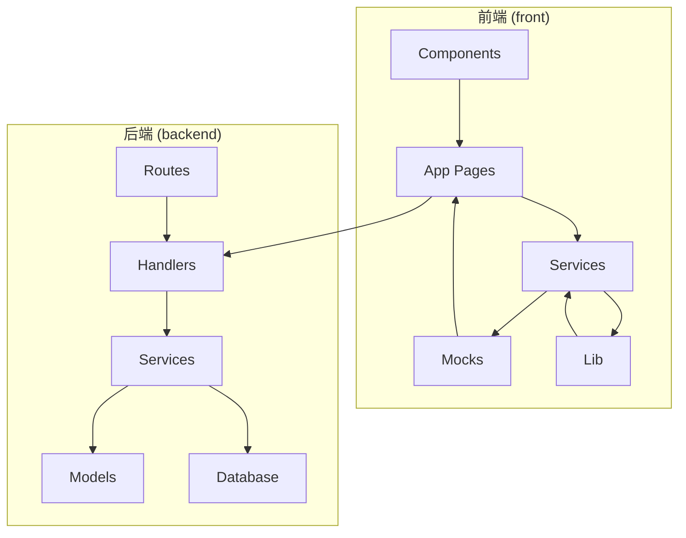
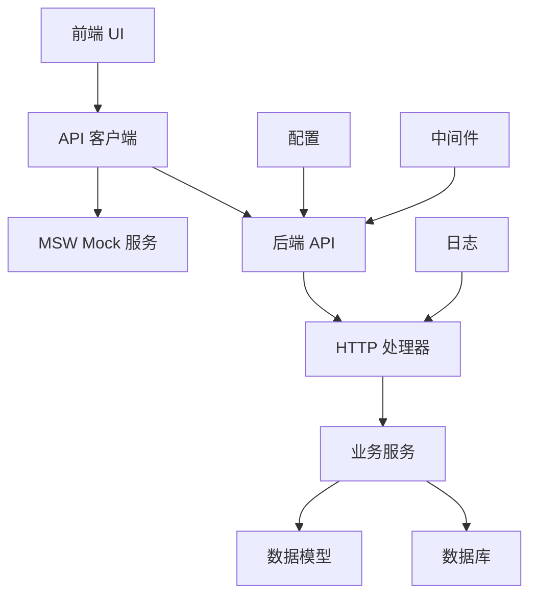
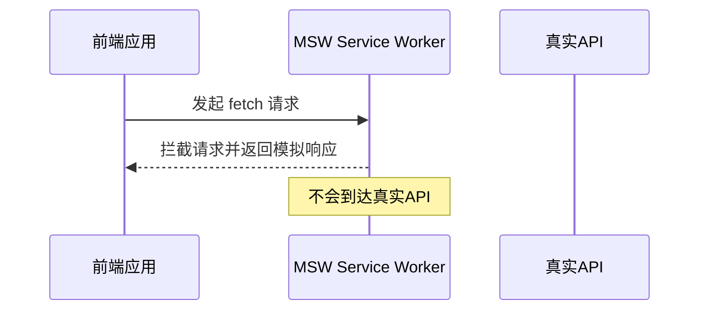
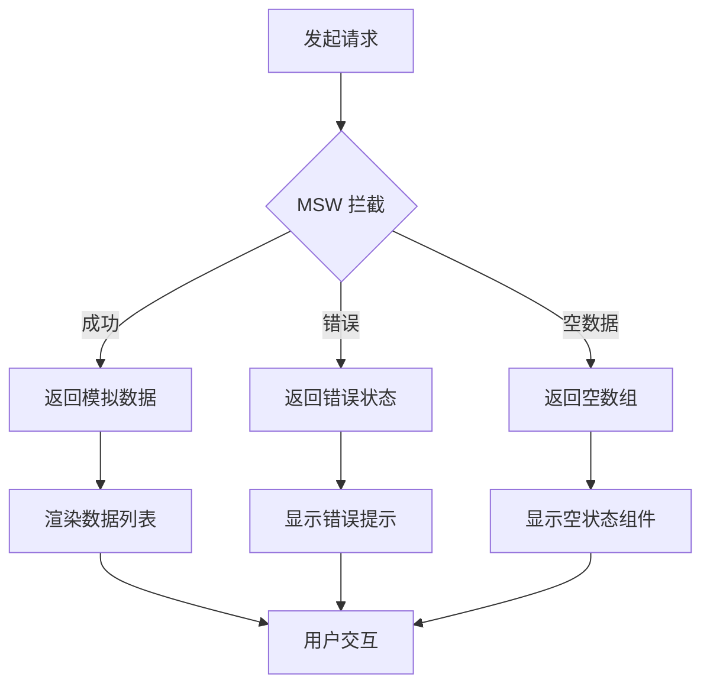
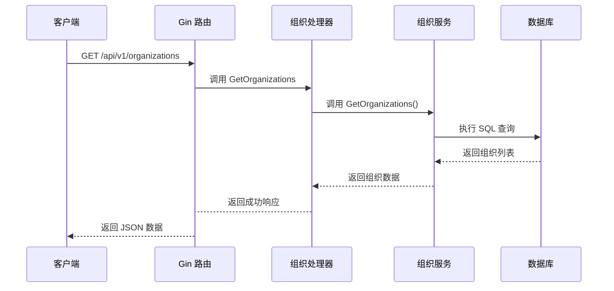
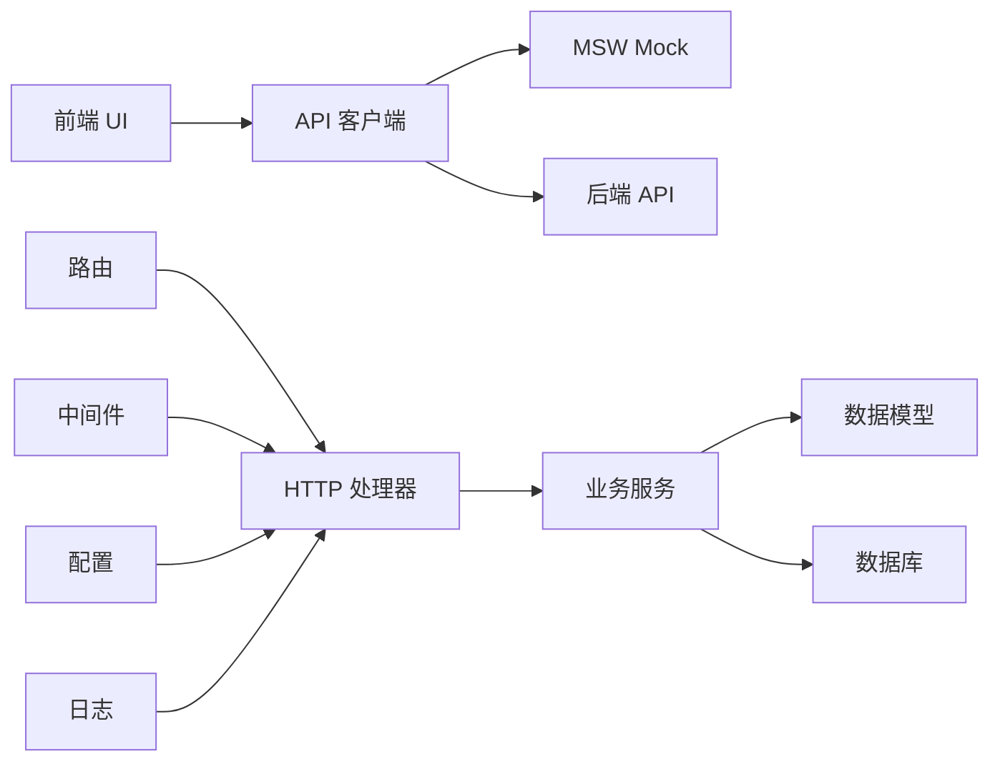
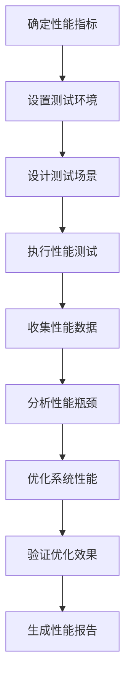
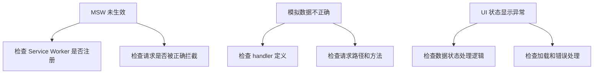
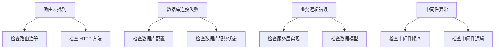

# 测试策略

<cite>
**本文档引用的文件**   
- [main.go](file://backend/cmd/main.go)
- [organization-handler.go](file://backend/internal/handlers/organization-handler.go)
- [organization-service.go](file://backend/internal/services/organization-service.go)
- [organization.go](file://backend/internal/models/organization.go)
- [routes.go](file://backend/routes/routes.go)
- [config.go](file://backend/config/config.go)
- [browser.ts](file://front/mocks/browser.ts)
- [handlers.ts](file://front/mocks/handlers.ts)
- [msw-provider.tsx](file://front/components/msw-provider.tsx)
- [http-client.ts](file://front/lib/http-client.ts)
- [workflow-api.ts](file://front/services/workflow/workflow-api.ts)
</cite>

## 目录
1. [引言](#引言)
2. [项目结构](#项目结构)
3. [核心组件](#核心组件)
4. [架构概览](#架构概览)
5. [详细组件分析](#详细组件分析)
6. [依赖分析](#依赖分析)
7. [性能考量](#性能考量)
8. [故障排除指南](#故障排除指南)
9. [结论](#结论)

## 引言
本测试策略文档旨在为漏洞扫描系统建立全面的质量保障体系，覆盖前端与后端的测试方案。文档详细说明了如何使用MSW（Mock Service Worker）进行前端Mock测试，以及如何编写HTTP处理器测试用例来验证后端路由、中间件和业务逻辑。同时提供了测试覆盖率目标、CI/CD集成建议和初步性能测试方案，确保系统在功能、稳定性和性能方面达到高质量标准。

## 项目结构
本项目采用前后端分离架构，前端基于Next.js框架，后端使用Go语言和Gin框架构建。整体结构清晰，按功能模块组织代码，便于维护和扩展。



**图示来源**
- [项目结构](file://#L1-L100)

## 核心组件
系统的核心组件包括前端的MSW Mock服务、API客户端和服务层，以及后端的Gin路由、处理器和业务服务。这些组件协同工作，实现组织管理、资产扫描和漏洞检测等核心功能。

**本节来源**
- [main.go](file://backend/cmd/main.go#L1-L110)
- [organization-handler.go](file://backend/internal/handlers/organization-handler.go#L1-L212)
- [organization-service.go](file://backend/internal/services/organization-service.go#L1-L158)

## 架构概览
系统采用典型的分层架构，从前端UI到后端服务再到数据库，各层职责分明，耦合度低。



**图示来源**
- [main.go](file://backend/cmd/main.go#L1-L110)
- [routes.go](file://backend/routes/routes.go#L1-L65)
- [msw-provider.tsx](file://front/components/msw-provider.tsx#L1-L50)

## 详细组件分析

### 前端 Mock 测试方案

#### MSW 拦截机制
MSW通过注册Service Worker来拦截浏览器发出的网络请求，允许开发者定义模拟响应，从而在不依赖真实后端的情况下进行前端测试。



**图示来源**
- [browser.ts](file://front/mocks/browser.ts#L1-L20)
- [handlers.ts](file://front/mocks/handlers.ts#L1-L30)
- [msw-provider.tsx](file://front/components/msw-provider.tsx#L1-L50)

#### 模拟响应定义
通过定义请求处理器来模拟不同API端点的响应，支持动态响应和错误场景。

```typescript
// 示例：模拟组织列表响应
import { rest } from 'msw'

const handlers = [
  rest.get('/api/v1/organizations', (req, res, ctx) => {
    return res(
      ctx.status(200),
      ctx.json([
        {
          id: '1',
          name: '测试组织',
          description: '用于测试的组织',
          createdAt: new Date().toISOString()
        }
      ])
    )
  }),

  // 模拟错误响应
  rest.get('/api/v1/organizations/error', (req, res, ctx) => {
    return res(
      ctx.status(500),
      ctx.json({ error: '服务器内部错误' })
    )
  }),

  // 模拟空数据响应
  rest.get('/api/v1/organizations/empty', (req, res, ctx) => {
    return res(
      ctx.status(200),
      ctx.json([])
    )
  })
]
```

**本节来源**
- [handlers.ts](file://front/mocks/handlers.ts#L1-L100)
- [browser.ts](file://front/mocks/browser.ts#L1-L50)

#### UI 状态测试
使用MSW可以轻松测试不同状态下的UI表现，包括加载、错误和空数据状态。



**图示来源**
- [data-state-wrapper.tsx](file://front/components/common/data-state-wrapper.tsx#L1-L50)
- [empty-state.tsx](file://front/components/common/empty-state.tsx#L1-L30)
- [loading.tsx](file://front/components/common/loading.tsx#L1-L20)

### 后端接口测试方案

#### HTTP 处理器测试
后端使用Gin框架处理HTTP请求，每个处理器负责特定的业务逻辑。



**图示来源**
- [routes.go](file://backend/routes/routes.go#L1-L65)
- [organization-handler.go](file://backend/internal/handlers/organization-handler.go#L1-L212)
- [organization-service.go](file://backend/internal/services/organization-service.go#L1-L158)

#### 路由与中间件测试
测试路由配置和中间件的正确性，确保请求被正确处理。

```go
// 示例：组织处理器测试
func TestGetOrganizations(t *testing.T) {
    // 设置测试用的 Gin 引擎
    router := gin.New()
    
    // 注册组织相关路由
    api := router.Group("/api/v1")
    {
        routes.SetupOrganizationRoutes(api)
    }
    
    // 创建测试请求
    req, _ := http.NewRequest("GET", "/api/v1/organizations", nil)
    w := httptest.NewRecorder()
    
    // 执行请求
    router.ServeHTTP(w, req)
    
    // 验证响应状态码
    assert.Equal(t, http.StatusOK, w.Code)
    
    // 验证响应内容类型
    assert.Equal(t, "application/json", w.Header().Get("Content-Type"))
}
```

**本节来源**
- [routes.go](file://backend/routes/routes.go#L1-L65)
- [organization-handler.go](file://backend/internal/handlers/organization-handler.go#L1-L212)
- [main.go](file://backend/cmd/main.go#L1-L110)

#### 业务逻辑测试
测试服务层的业务逻辑，确保数据处理的正确性。

```go
// 示例：组织服务测试
func TestCreateOrganization(t *testing.T) {
    service := services.NewOrganizationService()
    
    req := models.CreateOrganizationRequest{
        Name:        "测试组织",
        Description: "这是一个测试组织",
    }
    
    // 调用创建组织方法
    organization, err := service.CreateOrganization(req)
    
    // 验证没有错误
    assert.NoError(t, err)
    
    // 验证返回的组织信息
    assert.NotEmpty(t, organization.ID)
    assert.Equal(t, req.Name, organization.Name)
    assert.Equal(t, req.Description, organization.Description)
    
    // 验证创建时间
    assert.WithinDuration(t, time.Now(), organization.CreatedAt, time.Second)
}
```

**本节来源**
- [organization-service.go](file://backend/internal/services/organization-service.go#L1-L158)
- [organization.go](file://backend/internal/models/organization.go#L1-L32)

## 依赖分析
系统各组件之间的依赖关系清晰，遵循依赖倒置原则，高层模块不直接依赖低层模块，而是通过接口进行交互。



**图示来源**
- [go.mod](file://backend/go.mod#L1-L20)
- [package.json](file://front/package.json#L1-L30)

## 性能考量
为确保系统在高负载下的稳定性和响应速度，需要进行性能测试和优化。

### 性能测试方案


**本节来源**
- [main.go](file://backend/cmd/main.go#L1-L110)
- [config.go](file://backend/config/config.go#L1-L50)

### 性能优化建议
1. **数据库优化**：为常用查询字段添加索引，优化SQL查询语句
2. **缓存机制**：对频繁访问但不经常变化的数据使用Redis缓存
3. **连接池配置**：合理配置数据库连接池大小，避免连接耗尽
4. **异步处理**：将耗时操作（如扫描任务）改为异步处理，提高响应速度
5. **API批处理**：提供批量操作API，减少网络往返次数

## 故障排除指南
当测试过程中遇到问题时，可以参考以下常见问题的解决方案。

### 前端测试问题


**本节来源**
- [msw-provider.tsx](file://front/components/msw-provider.tsx#L1-L50)
- [handlers.ts](file://front/mocks/handlers.ts#L1-L100)

### 后端测试问题


**本节来源**
- [main.go](file://backend/cmd/main.go#L1-L110)
- [routes.go](file://backend/routes/routes.go#L1-L65)
- [organization-service.go](file://backend/internal/services/organization-service.go#L1-L158)

## 结论
本测试策略为漏洞扫描系统建立了完整的质量保障体系。通过前端MSW Mock测试，可以在不依赖后端的情况下充分测试UI的各种状态；通过后端HTTP处理器测试，可以验证路由、中间件和业务逻辑的正确性。建议设置80%以上的测试覆盖率目标，并在CI/CD流程中集成自动化测试，确保每次代码变更都不会引入新的问题。同时，应定期进行性能测试，监控系统在高负载下的表现，及时发现和解决性能瓶颈，确保系统稳定可靠。