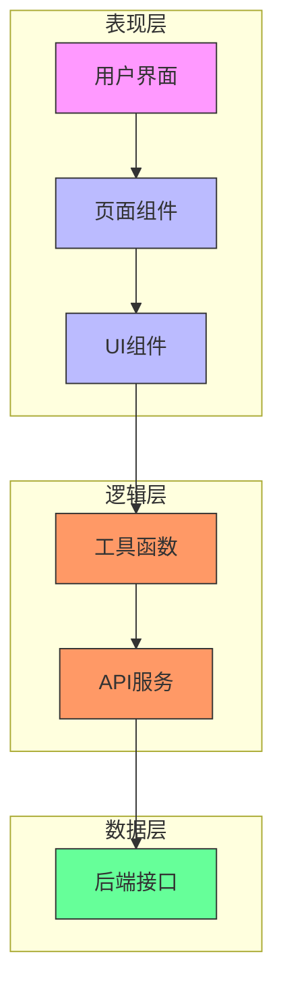
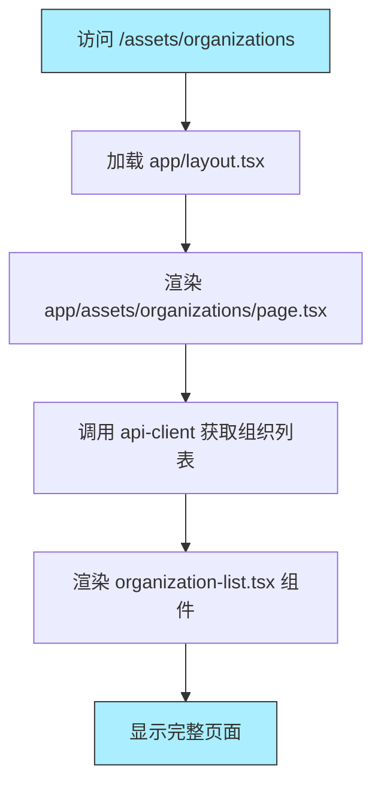
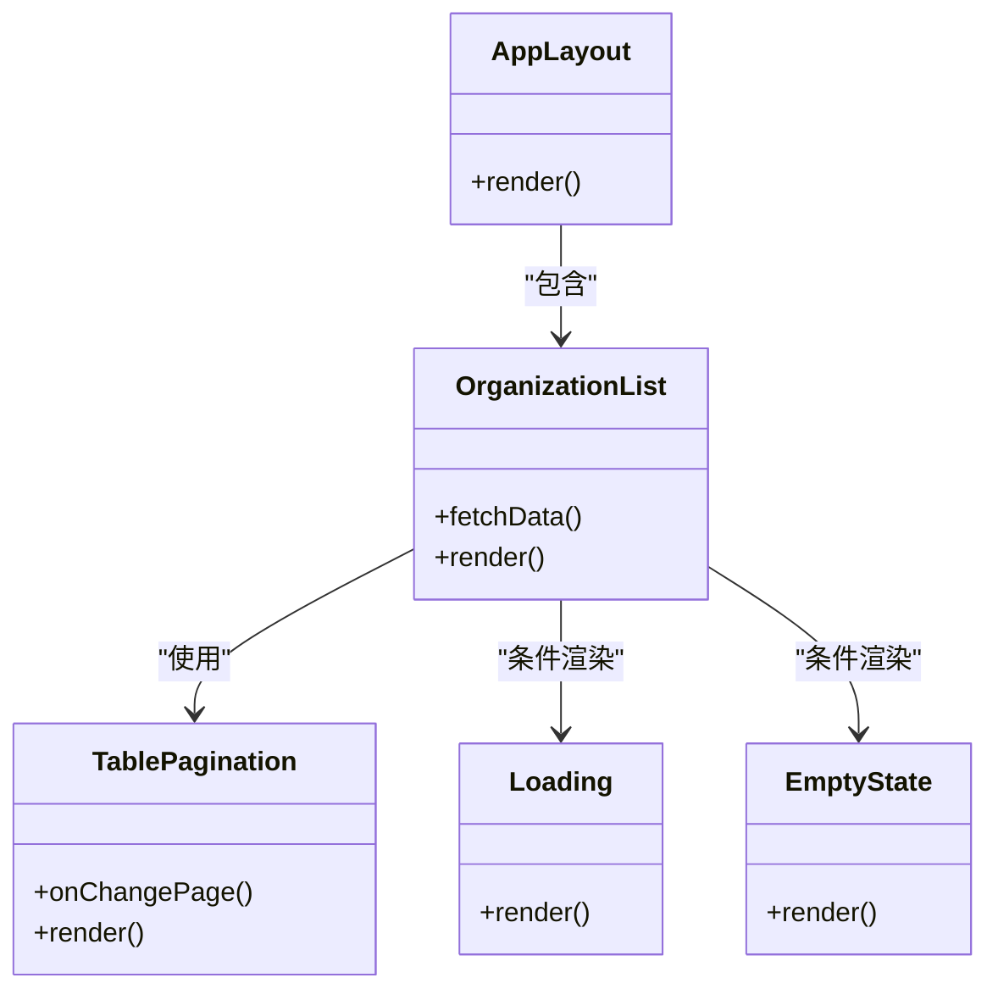
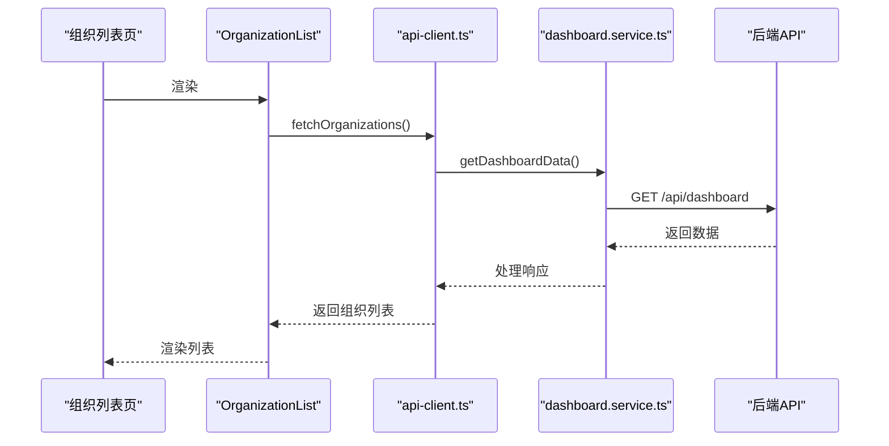
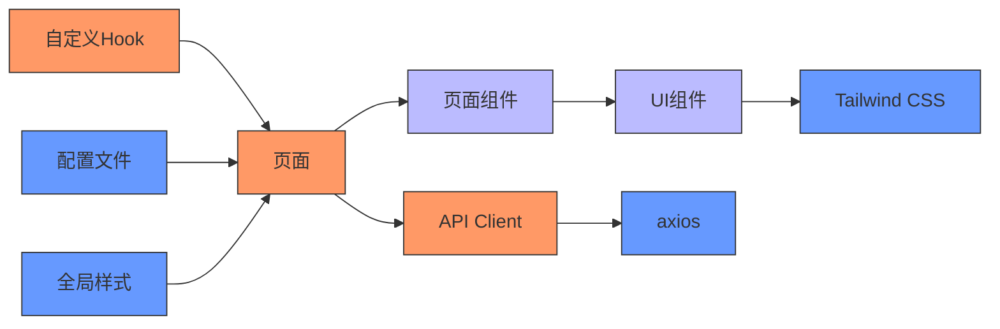

# 前端目录结构

<cite>
**本文档中引用的文件**  
- [app/page.tsx](file://front/app/page.tsx)
- [app/layout.tsx](file://front/app/layout.tsx)
- [app/not-found.tsx](file://front/app/not-found.tsx)
- [app/assets/organizations/page.tsx](file://front/app/assets/organizations/page.tsx)
- [app/assets/organizations/[id]/page.tsx](file://front/app/assets/organizations/[id]/page.tsx)
- [components/layout/app-layout.tsx](file://front/components/layout/app-layout.tsx)
- [components/layout/app-sidebar.tsx](file://front/components/layout/app-sidebar.tsx)
- [components/pages/assets/organizations/organization-list.tsx](file://front/components/pages/assets/organizations/organization-list.tsx)
- [components/pages/assets/organizations/organization-detail.tsx](file://front/components/pages/assets/organizations/organization-detail.tsx)
- [components/pages/assets/overview/assets-overview.tsx](file://front/components/pages/assets/overview/assets-overview.tsx)
- [components/common/loading.tsx](file://front/components/common/loading.tsx)
- [components/common/empty-state.tsx](file://front/components/common/empty-state.tsx)
- [components/common/table-pagination.tsx](file://front/components/common/table-pagination.tsx)
- [lib/api-client.ts](file://front/lib/api-client.ts)
- [lib/export-to-csv.ts](file://front/lib/export-to-csv.ts)
- [lib/utils.ts](file://front/lib/utils.ts)
- [lib/cache/cache-service.ts](file://front/lib/cache/cache-service.ts)
- [services/dashboard.service.ts](file://front/services/dashboard.service.ts)
- [next.config.mjs](file://front/next.config.mjs)
- [tailwind.config.ts](file://front/tailwind.config.ts)
- [components/ui/button.tsx](file://front/components/ui/button.tsx)
- [components/ui/table.tsx](file://front/components/ui/table.tsx)
- [components/ui/card.tsx](file://front/components/ui/card.tsx)
- [components/providers/navigation-provider.tsx](file://front/components/providers/navigation-provider.tsx)
- [hooks/use-mobile.tsx](file://front/hooks/use-mobile.tsx)
- [hooks/use-toast.ts](file://front/hooks/use-toast.ts)
</cite>

## 目录

1. [项目结构概览](#项目结构概览)
2. [核心组件分析](#核心组件分析)
3. [架构总览](#架构总览)
4. [详细组件分析](#详细组件分析)
5. [依赖关系分析](#依赖关系分析)
6. [性能考量](#性能考量)
7. [故障排查指南](#故障排查指南)
8. [结论](#结论)

## 项目结构概览

本项目采用 Next.js 13+ 的 App Router 架构，基于文件系统的路由机制组织前端页面与布局。整体结构清晰，遵循功能模块化、组件分层化的设计原则。

主要目录结构如下：

- `app/`：核心页面与布局文件，基于文件系统实现路由
- `components/`：UI 组件分层管理，包含通用组件、页面级组件与布局组件
- `lib/`：工具函数、缓存服务与基础逻辑封装
- `services/`：API 服务层，封装业务数据请求
- `hooks/`：自定义 React Hook
- `types/`：全局类型定义
- `public/`：静态资源
- `styles/`：全局样式
- 根目录配置文件：`next.config.mjs`、`tailwind.config.ts` 等

```mermaid
graph TB
subgraph "页面路由"
App[app/]
HomePage["app/page.tsx (首页)"]
AssetsPage["app/assets/organizations/page.tsx"]
OrgDetail["app/assets/organizations/[id]/page.tsx"]
Layout["app/layout.tsx"]
end
subgraph "组件层"
Components[components/]
UI[ui/ (基础UI组件)]
Pages[pages/ (页面组件)]
Layout[layout/ (布局组件)]
Common[common/ (通用功能组件)]
end
subgraph "逻辑层"
Lib[lib/]
Utils["utils.ts"]
ApiClient["api-client.ts"]
Cache["cache/cache-service.ts"]
end
subgraph "服务层"
Services[services/]
DashboardService["dashboard.service.ts"]
end
subgraph "配置"
Config["next.config.mjs"]
Tailwind["tailwind.config.ts"]
end
App --> Components
App --> Lib
App --> Services
Components --> Lib
Lib --> Services
Config --> App
Tailwind --> Components
```

**图示来源**  
- [app/page.tsx](file://front/app/page.tsx)
- [components/ui/button.tsx](file://front/components/ui/button.tsx)
- [lib/api-client.ts](file://front/lib/api-client.ts)
- [services/dashboard.service.ts](file://front/services/dashboard.service.ts)
- [next.config.mjs](file://front/next.config.mjs)

**本节来源**  
- [app/page.tsx](file://front/app/page.tsx)
- [components/layout/app-layout.tsx](file://front/components/layout/app-layout.tsx)

## 核心组件

项目的核心组件围绕资产（Assets）、扫描（Scan）和工作流（Workflow）三大功能模块构建。通过 `app` 目录下的文件系统路由实现页面导航，结合 `components` 中的可复用 UI 组件与 `lib` 中的工具函数，形成完整的前端架构。

例如，组织资产列表页 `app/assets/organizations/page.tsx` 负责渲染组织列表，调用 `organization-list.tsx` 组件，并通过 `api-client.ts` 获取数据。错误状态由 `empty-state.tsx` 处理，加载状态由 `loading.tsx` 管理，分页功能由 `table-pagination.tsx` 提供。

**本节来源**  
- [app/assets/organizations/page.tsx](file://front/app/assets/organizations/page.tsx)
- [components/pages/assets/organizations/organization-list.tsx](file://front/components/pages/assets/organizations/organization-list.tsx)
- [components/common/loading.tsx](file://front/components/common/loading.tsx)
- [components/common/empty-state.tsx](file://front/components/common/empty-state.tsx)
- [lib/api-client.ts](file://front/lib/api-client.ts)

## 架构总览

整个前端架构采用分层设计，确保关注点分离与高可维护性。



**图示来源**  
- [app/page.tsx](file://front/app/page.tsx)
- [components/pages/assets/organizations/organization-list.tsx](file://front/components/pages/assets/organizations/organization-list.tsx)
- [lib/api-client.ts](file://front/lib/api-client.ts)
- [services/dashboard.service.ts](file://front/services/dashboard.service.ts)

## 详细组件分析

### 页面路由与布局机制

Next.js 的 `app` 目录采用基于文件系统的路由。每个子目录代表一个路由段，`page.tsx` 为入口组件，`layout.tsx` 定义共享布局。

例如：
- `app/assets/organizations/page.tsx` → `/assets/organizations`
- `app/assets/organizations/[id]/page.tsx` → 动态路由 `/assets/organizations/123`

`layout.tsx` 可嵌套，外层布局包裹内层内容，实现一致的导航与样式。



**图示来源**  
- [app/layout.tsx](file://front/app/layout.tsx)
- [app/assets/organizations/page.tsx](file://front/app/assets/organizations/page.tsx)
- [lib/api-client.ts](file://front/lib/api-client.ts)

**本节来源**  
- [app/layout.tsx](file://front/app/layout.tsx#L1-L50)
- [app/assets/organizations/page.tsx](file://front/app/assets/organizations/page.tsx#L1-L30)

### UI 组件分层结构

组件分为四类：

1. **UI 基础组件**（`components/ui/`）：基于 Radix UI 和 Tailwind CSS 封装的可复用原子组件，如按钮、表格、弹窗等。
2. **页面组件**（`components/pages/`）：针对特定页面的复合组件，如 `organization-list.tsx`。
3. **布局组件**（`components/layout/`）：应用级布局，如 `app-layout.tsx` 包含侧边栏与主内容区。
4. **通用功能组件**（`components/common/`）：跨页面复用的逻辑组件，如加载态、空状态、分页器。

这种分层提升了组件复用性与维护效率。



**图示来源**  
- [components/layout/app-layout.tsx](file://front/components/layout/app-layout.tsx)
- [components/pages/assets/organizations/organization-list.tsx](file://front/components/pages/assets/organizations/organization-list.tsx)
- [components/common/table-pagination.tsx](file://front/components/common/table-pagination.tsx)

**本节来源**  
- [components/layout/app-layout.tsx](file://front/components/layout/app-layout.tsx#L1-L40)
- [components/pages/assets/organizations/organization-list.tsx](file://front/components/pages/assets/organizations/organization-list.tsx#L1-L60)

### 工具函数与服务层

`lib/` 目录封装通用逻辑：
- `api-client.ts`：基于 axios 的 HTTP 客户端，统一请求配置与错误处理。
- `utils.ts`：通用工具函数，如格式化、验证等。
- `export-to-csv.ts`：导出数据为 CSV 文件。
- `cache/cache-service.ts`：本地缓存管理，提升性能。

`services/` 目录提供业务服务接口，如 `dashboard.service.ts` 聚合仪表板所需数据。



**图示来源**  
- [lib/api-client.ts](file://front/lib/api-client.ts)
- [services/dashboard.service.ts](file://front/services/dashboard.service.ts)
- [components/pages/assets/organizations/organization-list.tsx](file://front/components/pages/assets/organizations/organization-list.tsx)

**本节来源**  
- [lib/api-client.ts](file://front/lib/api-client.ts#L1-L50)
- [services/dashboard.service.ts](file://front/services/dashboard.service.ts#L1-L30)

## 依赖关系分析

项目依赖关系清晰，层级分明：



**图示来源**  
- [package.json](file://front/package.json)
- [lib/api-client.ts](file://front/lib/api-client.ts)
- [tailwind.config.ts](file://front/tailwind.config.ts)

**本节来源**  
- [package.json](file://front/package.json#L1-L20)
- [tailwind.config.ts](file://front/tailwind.config.ts#L1-L15)

## 性能考量

- **代码分割**：Next.js 自动按页面进行代码分割，减少初始加载体积。
- **缓存策略**：`lib/cache/cache-service.ts` 实现内存缓存，避免重复请求。
- **懒加载**：通过 `Suspense` 与 `loading.tsx` 实现组件级懒加载。
- **静态生成**：支持 SSG，提升首屏性能。
- **图片优化**：可通过 `next/image` 进行自动优化（当前未使用）。

## 故障排查指南

常见问题及解决方案：

1. **页面空白或加载失败**
   - 检查 `app/page.tsx` 或对应 `page.tsx` 是否导出默认组件
   - 查看控制台是否有模块导入错误
   - 确认 `layout.tsx` 是否正确包裹子节点

2. **API 请求失败**
   - 检查 `lib/api-client.ts` 中的基础 URL 配置
   - 确认后端服务是否运行
   - 查看网络面板请求状态码

3. **样式未生效**
   - 确认 `globals.css` 是否在 `app/layout.tsx` 中引入
   - 检查 `tailwind.config.ts` 是否正确配置 content 路径

4. **动态路由参数未获取**
   - 确保文件夹名为 `[id]` 格式
   - 在 `page.tsx` 中通过 `async function Page({ params })` 获取参数

**本节来源**  
- [app/page.tsx](file://front/app/page.tsx#L1-L20)
- [lib/api-client.ts](file://front/lib/api-client.ts#L10-L40)
- [tailwind.config.ts](file://front/tailwind.config.ts#L5-L15)

## 结论

该项目采用现代化的 Next.js App Router 架构，具备清晰的目录结构与分层设计。通过文件系统路由简化导航逻辑，组件分层提升复用性，工具与服务层解耦业务逻辑。整体架构有利于团队协作与长期维护，适合中大型前端项目开发。