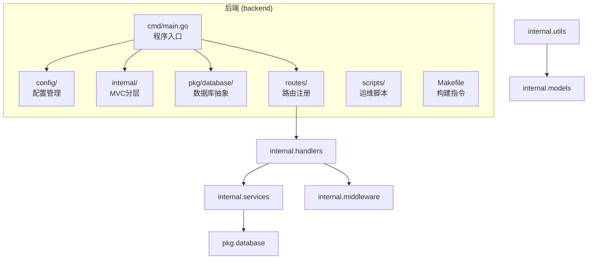
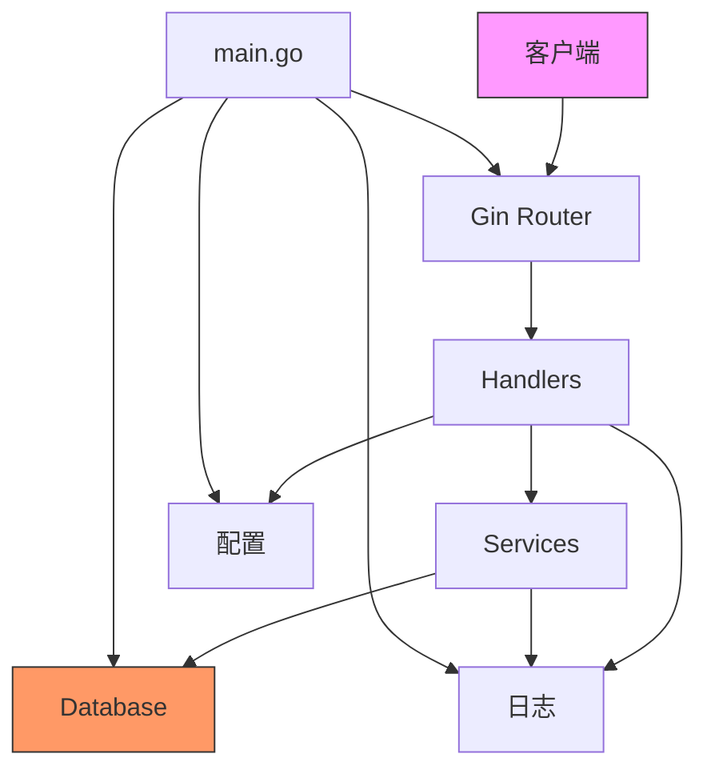
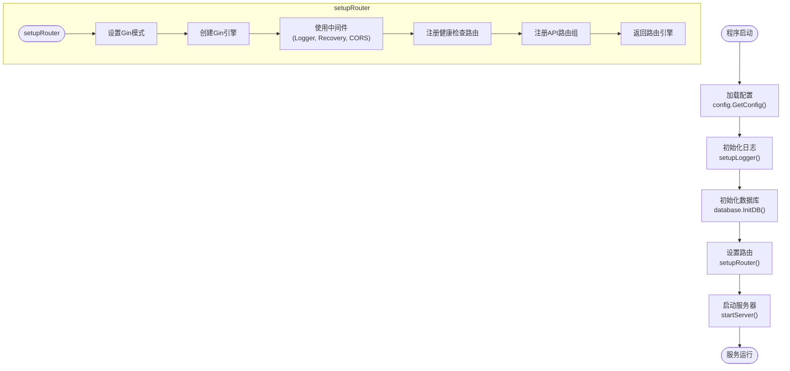
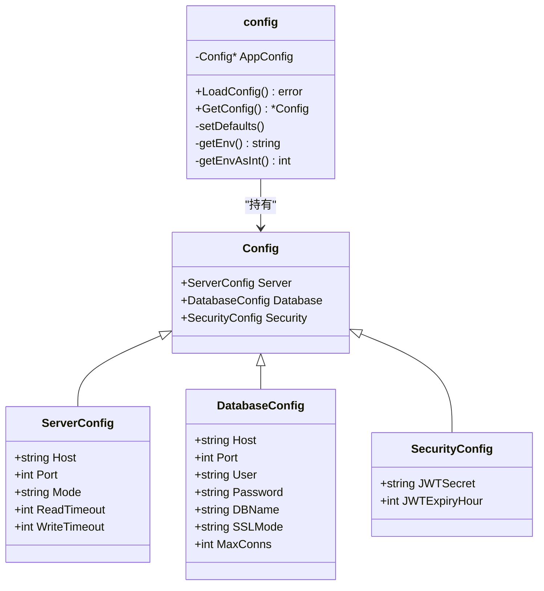
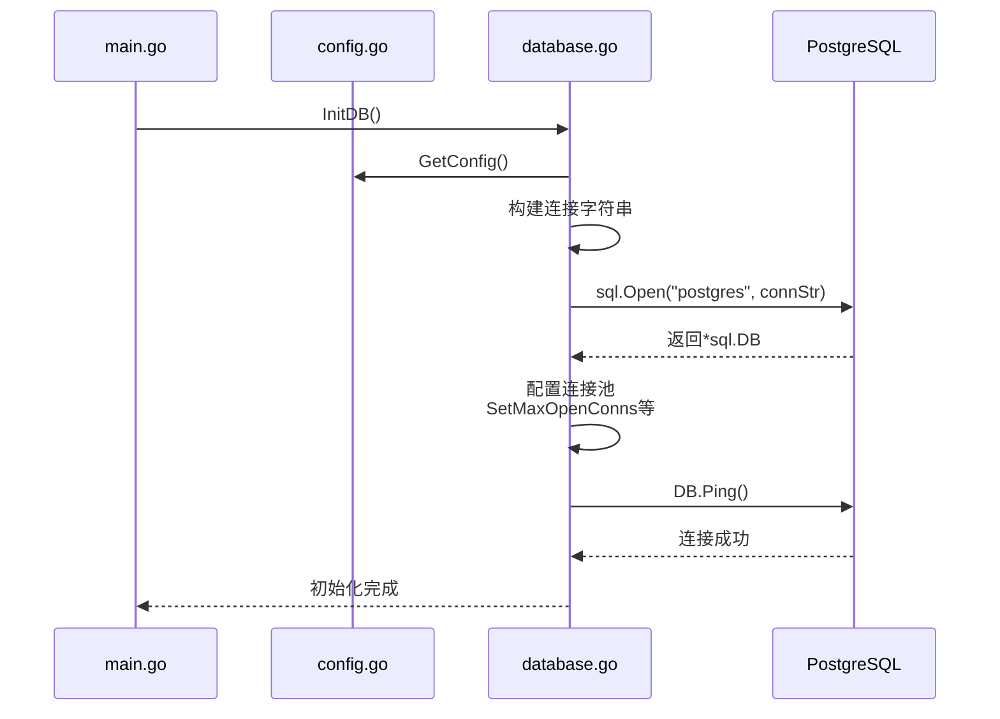
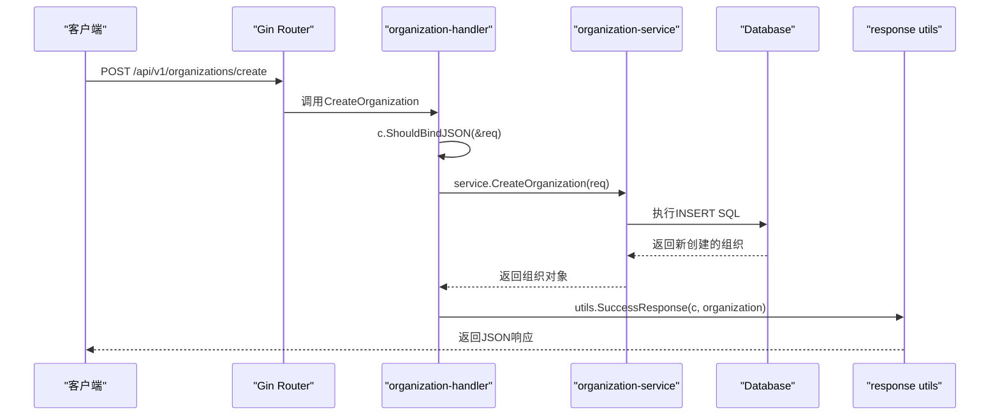
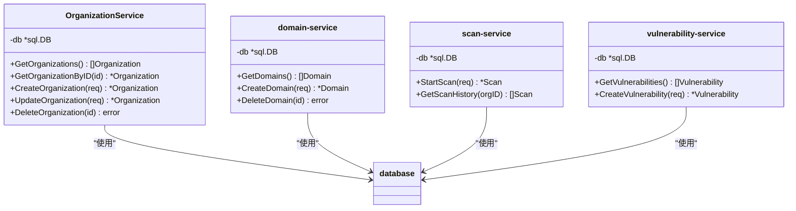
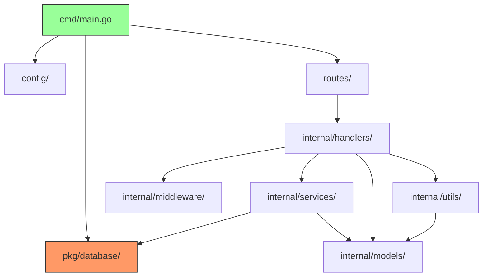
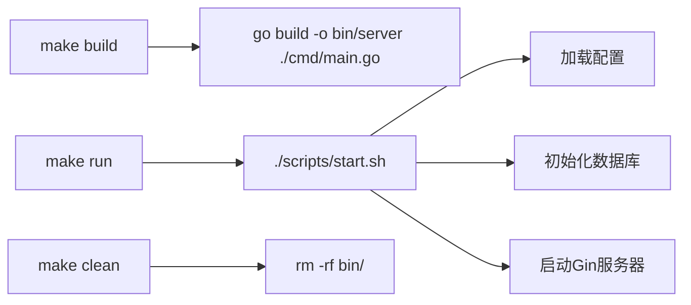

# 后端目录结构

<cite>
**本文档引用的文件**   
- [main.go](file://backend/cmd/main.go)
- [config.go](file://backend/config/config.go)
- [config.yaml](file://backend/config/config.yaml)
- [database.go](file://backend/pkg/database/database.go)
- [routes.go](file://backend/routes/routes.go)
- [organization-handler.go](file://backend/internal/handlers/organization-handler.go)
- [domain-handler.go](file://backend/internal/handlers/domain-handler.go)
- [scan-handler.go](file://backend/internal/handlers/scan-handler.go)
- [vulnerability-handler.go](file://backend/internal/handlers/vulnerability-handler.go)
- [organization-service.go](file://backend/internal/services/organization-service.go)
- [domain-service.go](file://backend/internal/services/domain-service.go)
- [scan-service.go](file://backend/internal/services/scan-service.go)
- [vulnerability-service.go](file://backend/internal/services/vulnerability-service.go)
- [organization.go](file://backend/internal/models/organization.go)
- [domain.go](file://backend/internal/models/domain.go)
- [scan.go](file://backend/internal/models/scan.go)
- [vulnerability.go](file://backend/internal/models/vulnerability.go)
- [response.go](file://backend/internal/models/response.go)
- [response.go](file://backend/internal/utils/response.go)
- [cors.go](file://backend/internal/middleware/cors.go)
- [logger.go](file://backend/internal/middleware/logger.go)
- [Makefile](file://backend/Makefile)
- [start.sh](file://backend/scripts/start.sh)
</cite>

## 目录

1. [项目结构](#项目结构)
2. [核心组件](#核心组件)
3. [架构概览](#架构概览)
4. [详细组件分析](#详细组件分析)
5. [依赖分析](#依赖分析)
6. [构建与运行流程](#构建与运行流程)
7. [结论](#结论)

## 项目结构

本项目采用标准的Go后端MVC分层架构，目录结构清晰，职责分明。主要分为以下几个核心部分：

- **cmd/main.go**: 程序入口，负责初始化配置、数据库、路由和启动服务器。
- **config/**: 配置管理，包含配置文件和加载逻辑。
- **internal/**: 核心业务逻辑，包含handlers、services、models和middleware。
- **pkg/database/**: 数据库连接层，提供数据库抽象。
- **routes/**: API路由注册中心。
- **scripts/**: 运维脚本，如启动脚本。
- **Makefile**: 构建和管理指令。



**Diagram sources**
- [main.go](file://backend/cmd/main.go)
- [config.go](file://backend/config/config.go)
- [database.go](file://backend/pkg/database/database.go)
- [routes.go](file://backend/routes/routes.go)

## 核心组件

项目遵循MVC（Model-View-Controller）设计模式，其中"View"层由API响应结构替代。各层职责明确：

- **Models**: 定义数据结构和数据库映射。
- **Handlers**: 处理HTTP请求，调用服务层，返回响应。
- **Services**: 封装核心业务逻辑，与数据库交互。
- **Middleware**: 处理跨切面关注点，如CORS、日志。

**Section sources**
- [organization.go](file://backend/internal/models/organization.go)
- [organization-handler.go](file://backend/internal/handlers/organization-handler.go)
- [organization-service.go](file://backend/internal/services/organization-service.go)
- [response.go](file://backend/internal/utils/response.go)

## 架构概览

系统采用分层架构，从上至下依次为：HTTP路由层 -> 请求处理层 -> 业务服务层 -> 数据访问层 -> 数据库。



**Diagram sources**
- [main.go](file://backend/cmd/main.go#L1-L110)
- [routes.go](file://backend/routes/routes.go#L1-L65)
- [organization-handler.go](file://backend/internal/handlers/organization-handler.go#L1-L212)

## 详细组件分析

### 程序入口分析

`cmd/main.go`是整个应用的启动入口，其初始化流程是理解系统的关键。



**Diagram sources**
- [main.go](file://backend/cmd/main.go#L15-L110)

**Section sources**
- [main.go](file://backend/cmd/main.go#L15-L110)

### 配置管理分析

配置系统使用`viper`库实现，支持YAML文件和环境变量，提供默认值回退机制。



**Diagram sources**
- [config.go](file://backend/config/config.go#L1-L121)

**Section sources**
- [config.go](file://backend/config/config.go#L1-L121)

### 数据库连接层分析

`pkg/database/database.go`提供了数据库连接的单例模式和连接池管理。



**Diagram sources**
- [database.go](file://backend/pkg/database/database.go#L1-L95)
- [config.go](file://backend/config/config.go#L1-L121)

**Section sources**
- [database.go](file://backend/pkg/database/database.go#L1-L95)

### 路由注册机制分析

`routes/routes.go`是API路由的集中注册点，采用模块化分组设计。

```mermaid
flowchart TD
A["r := gin.New()"] --> B["api := r.Group(\"/api/v1\")"]
B --> C["SetupOrganizationRoutes(api)"]
B --> D["SetupScanRoutes(api)"]
B --> E["SetupAssetsRoutes(api)"]
B --> F["SetupWorkflowRoutes(api)"]
B --> G["SetupDashboardRoutes(api)"]
subgraph "组织路由"
C --> C1["GET /organizations"]
C --> C2["POST /organizations/create"]
C --> C3["GET /organizations/:id"]
C --> C4["POST /organizations/:id/update"]
C --> C5["POST /organizations/delete"]
C --> C6["GET /organizations/search"]
end
subgraph "扫描路由"
D --> D1["POST /scan/organizations/:id/start"]
D --> D2["GET /scan/organizations/:id/history"]
end
subgraph "资产路由"
E --> E1["POST /assets/main-domains/create"]
E --> E2["POST /assets/sub-domains/create"]
end
```

**Diagram sources**
- [routes.go](file://backend/routes/routes.go#L1-L65)

**Section sources**
- [routes.go](file://backend/routes/routes.go#L1-L65)

### HTTP请求处理流程分析

以创建组织为例，展示完整的MVC调用链路。



**Diagram sources**
- [organization-handler.go](file://backend/internal/handlers/organization-handler.go#L1-L212)
- [organization-service.go](file://backend/internal/services/organization-service.go#L1-L158)
- [response.go](file://backend/internal/utils/response.go#L1-L49)

**Section sources**
- [organization-handler.go](file://backend/internal/handlers/organization-handler.go#L1-L212)
- [organization-service.go](file://backend/internal/services/organization-service.go#L1-L158)

### 业务服务封装分析

`services`层封装了与数据库交互的业务逻辑，确保了数据一致性和业务规则。



**Diagram sources**
- [organization-service.go](file://backend/internal/services/organization-service.go#L1-L158)
- [domain-service.go](file://backend/internal/services/domain-service.go)
- [scan-service.go](file://backend/internal/services/scan-service.go)
- [vulnerability-service.go](file://backend/internal/services/vulnerability-service.go)

**Section sources**
- [organization-service.go](file://backend/internal/services/organization-service.go#L1-L158)

## 依赖分析

项目依赖关系清晰，遵循单向依赖原则，高层模块依赖低层模块。



**Diagram sources**
- [go.mod](file://backend/go.mod)
- [main.go](file://backend/cmd/main.go)
- [routes.go](file://backend/routes/routes.go)

**Section sources**
- [main.go](file://backend/cmd/main.go)
- [routes.go](file://backend/routes/routes.go)

## 构建与运行流程

通过`Makefile`和`scripts/start.sh`实现标准化的构建和部署流程。



**Diagram sources**
- [Makefile](file://backend/Makefile)
- [start.sh](file://backend/scripts/start.sh)

**Section sources**
- [Makefile](file://backend/Makefile)
- [start.sh](file://backend/scripts/start.sh)

## 结论

本后端服务采用清晰的MVC分层架构，各组件职责明确，耦合度低。`cmd/main.go`作为统一入口，协调配置、数据库、路由的初始化。`config`包提供灵活的配置管理，`pkg/database`实现数据库连接抽象。`internal`目录下的`handlers`、`services`、`models`构成核心业务逻辑层，通过`routes`包注册API路由。整个系统通过`Makefile`和`start.sh`脚本实现可重复的构建和部署流程，为漏洞扫描平台提供了稳定可靠的后端支持。