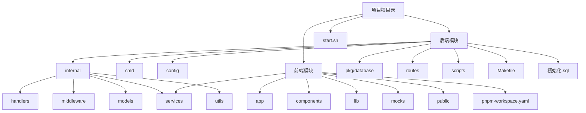
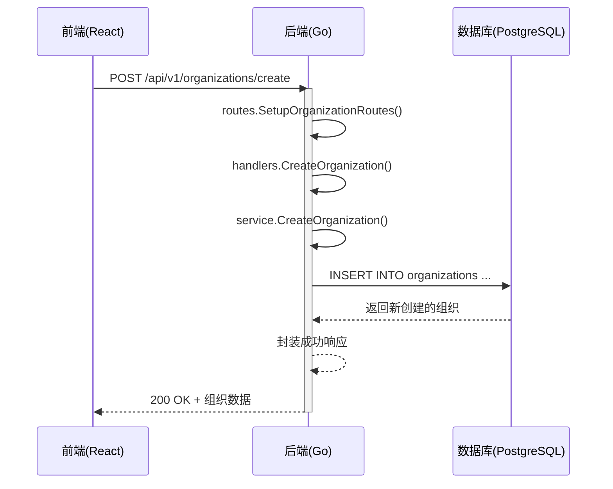

# 目录结构详解

<cite>
**本文档引用的文件**  
- [main.go](file://backend/cmd/main.go)
- [config.go](file://backend/config/config.go)
- [config.yaml](file://backend/config/config.yaml)
- [database.go](file://backend/pkg/database/database.go)
- [routes.go](file://backend/routes/routes.go)
- [organization-handler.go](file://backend/internal/handlers/organization-handler.go)
- [organization-service.go](file://backend/internal/services/organization-service.go)
- [organization.go](file://backend/internal/models/organization.go)
- [start.sh](file://start.sh)
- [Makefile](file://backend/Makefile)
- [pnpm-workspace.yaml](file://front/pnpm-workspace.yaml)
- [初始化.sql](file://backend/初始化.sql)
</cite>

## 目录结构

本项目采用前后端分离架构，整体目录清晰划分为 `backend`（后端）和 `front`（前端）两大模块，辅以统一的启动脚本 `start.sh` 协调服务运行。以下将深入解析各核心目录的设计逻辑与职责划分。

**Diagram sources**
- [main.go](file://backend/cmd/main.go)
- [config.go](file://backend/config/config.go)
- [organization-handler.go](file://backend/internal/handlers/organization-handler.go)
- [organization-service.go](file://backend/internal/services/organization-service.go)
- [organization.go](file://backend/internal/models/organization.go)
- [start.sh](file://start.sh)

### 后端模块 (backend)

后端采用 Go 语言开发，遵循标准的分层架构模式，确保代码的高内聚与低耦合。

#### cmd
- **职责**：应用的入口点。
- **说明**：`cmd/main.go` 是整个后端服务的启动文件，负责初始化配置、日志、数据库连接，并启动 HTTP 服务器。

#### config
- **职责**：集中管理应用配置。
- **说明**：包含 `config.go`（配置加载逻辑）和 `config.yaml`（配置文件）。通过 Viper 库实现配置的加载与环境变量覆盖，支持灵活的部署环境切换。

#### internal
- **职责**：存放核心业务逻辑，对外不可见。
- **说明**：`internal` 目录下的子目录构成了典型的 MVC（或更准确地说是 API 服务）分层结构。

##### handlers
- **职责**：处理 HTTP 请求，作为控制器层。
- **说明**：每个 `*-handler.go` 文件对应一个业务领域的 API 接口。例如，`organization-handler.go` 处理所有与组织相关的请求，负责参数校验、调用服务层并返回响应。

##### services
- **职责**：实现核心业务逻辑，作为服务层。
- **说明**：`*-service.go` 文件包含具体的业务规则和流程。例如，`organization-service.go` 封装了对组织数据的增删改查操作，是连接 `handlers` 和 `models` 的桥梁。

##### models
- **职责**：定义数据结构和数据库模型。
- **说明**：`*.go` 文件定义了与数据库表结构对应的 Go 结构体（如 `Organization`），以及处理请求和响应的 DTO（数据传输对象）。

##### middleware
- **职责**：提供可复用的请求处理中间件。
- **说明**：`cors.go` 处理跨域资源共享，`logger.go` 提供请求级别的日志记录。

##### utils
- **职责**：存放通用的工具函数。
- **说明**：`response.go` 定义了统一的成功和错误响应格式，确保 API 返回数据的一致性。

#### pkg/database
- **职责**：封装数据库操作。
- **说明**：`database.go` 负责数据库连接的初始化、连接池配置、健康检查和事务管理，为上层业务提供稳定的数据库访问能力。

#### routes
- **职责**：定义 API 路由。
- **说明**：`routes.go` 将不同的 API 路径（如 `/api/v1/organizations`）映射到相应的 `handlers` 函数，是请求分发的中心。

#### scripts
- **职责**：存放脚本文件。
- **说明**：`start.sh` 是一个 shell 脚本，用于协调前后端服务的启动，但后端的构建和运行主要依赖 `Makefile`。

#### Makefile
- **职责**：定义后端项目的构建和管理任务。
- **说明**：`Makefile` 提供了一组命令，如 `make build`（编译）、`make run`（运行）、`make dev`（开发模式，带热重载）、`make test`（运行测试）、`make lint`（代码检查）等，极大地简化了开发和部署流程。

#### 初始化.sql
- **职责**：初始化数据库表结构。
- **说明**：该 SQL 脚本定义了项目所需的数据库表（如 `organizations` 表），可通过 `Makefile` 中的 `db-init` 命令执行。

**Section sources**
- [main.go](file://backend/cmd/main.go#L1-L110)
- [config.go](file://backend/config/config.go#L1-L121)
- [database.go](file://backend/pkg/database/database.go#L1-L95)
- [routes.go](file://backend/routes/routes.go#L1-L65)
- [organization-handler.go](file://backend/internal/handlers/organization-handler.go#L1-L212)
- [organization-service.go](file://backend/internal/services/organization-service.go#L1-L158)
- [organization.go](file://backend/internal/models/organization.go#L1-L32)
- [Makefile](file://backend/Makefile#L1-L79)
- [初始化.sql](file://backend/初始化.sql)

### 前端模块 (front)

前端采用 Next.js 框架，遵循组件化和模块化的开发模式。

#### app
- **职责**：基于文件系统的路由和页面入口。
- **说明**：`app` 目录下的子目录（如 `assets`, `scan`, `workflow`）对应不同的功能页面。每个 `page.tsx` 文件定义了一个路由页面。

#### components
- **职责**：存放可复用的 UI 组件。
- **说明**：分为 `common`（通用组件）、`layout`（布局组件）、`pages`（特定页面的复杂组件）、`ui`（基础 UI 组件库，如按钮、对话框等）和 `workflow`（工作流专用组件）。

#### lib
- **职责**：存放通用的业务逻辑和工具函数。
- **说明**：`lib` 目录下的代码不直接渲染 UI，而是提供如 `http-client.ts`（封装 API 调用）、`exportToCsv.ts`（数据导出）等服务。

#### services
- **职责**：封装与后端 API 的交互。
- **说明**：`*.service.ts` 文件定义了调用后端 API 的方法，是前端业务逻辑与后端数据的桥梁。

#### mocks
- **职责**：提供模拟数据，用于开发和测试。
- **说明**：`mocks` 目录包含模拟的 API 响应数据，允许前端在后端服务未就绪时独立开发。

#### pnpm-workspace.yaml
- **职责**：定义 pnpm 工作区。
- **说明**：该文件指定了项目中哪些目录属于同一个 pnpm 工作区，使得工作区内的包可以被高效地链接和共享，优化了依赖管理。

**Section sources**
- [pnpm-workspace.yaml](file://front/pnpm-workspace.yaml)

### 启动协调机制

#### start.sh
- **职责**：统一的项目启动脚本。
- **说明**：`start.sh` 是一个功能强大的 Bash 脚本，它能够：
  1.  **检查环境**：验证 Node.js、pnpm、Go 等必要工具是否已安装。
  2.  **初始化依赖**：自动为前端（`pnpm install`）和后端（`go mod download`）安装依赖。
  3.  **协调启动**：根据用户输入的参数（如 `dev`, `all`），并行或串行地启动前端和后端服务。
  4.  **提供多种模式**：支持 `dev`（开发模式）、`frontend`（仅前端）、`backend`（仅后端）、`build`（构建后端）等多种启动方式。

#### Makefile
- **职责**：后端构建和管理的基石。
- **说明**：虽然 `start.sh` 可以启动后端，但 `Makefile` 提供了更细粒度的控制。`start.sh` 在启动后端时，会调用 `go run` 或 `go build`，而这些命令的逻辑与 `Makefile` 中的 `run` 和 `build` 目标高度一致，确保了构建过程的标准化。

**Section sources**
- [start.sh](file://start.sh#L1-L316)

## 核心功能流程分析

以下以“创建组织”功能为例，展示前后端的完整调用流程。

**Diagram sources**
- [routes.go](file://backend/routes/routes.go#L15-L18)
- [organization-handler.go](file://backend/internal/handlers/organization-handler.go#L35-L50)
- [organization-service.go](file://backend/internal/services/organization-service.go#L70-L90)
- [organization.go](file://backend/internal/models/organization.go#L10-L15)

### 流程说明
1.  **前端发起请求**：用户在前端页面点击“创建组织”按钮，前端通过 `organization.service.ts` 调用 `POST /api/v1/organizations/create` 接口。
2.  **路由匹配**：后端的 `routes.go` 文件将该请求路由到 `handlers.CreateOrganization` 函数。
3.  **参数处理**：`CreateOrganization` 函数从请求体中解析 `CreateOrganizationRequest` 结构体。
4.  **业务逻辑**：调用 `services.OrganizationService` 的 `CreateOrganization` 方法执行业务逻辑。
5.  **数据持久化**：服务层通过 `database.DB` 执行 SQL 插入语句，将数据写入数据库。
6.  **返回响应**：服务层返回创建的组织对象，`handler` 层将其封装为统一的成功响应格式并返回给前端。

## 总结

本项目结构清晰，职责分明。后端采用 Go Gin 框架，通过 `handlers`、`services`、`models` 的分层设计，实现了业务逻辑的解耦。前端采用 Next.js，组件化程度高。`Makefile` 和 `start.sh` 共同构成了强大的自动化构建和部署体系，`pnpm-workspace.yaml` 则优化了前端的依赖管理。新开发者可以依据此文档快速理解项目架构，定位关键代码。