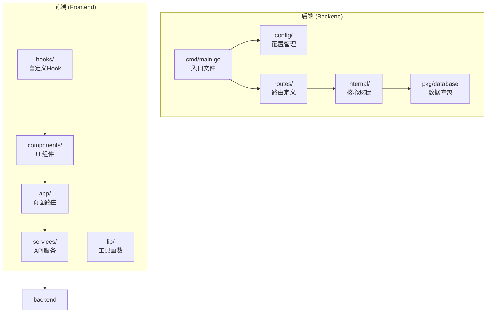
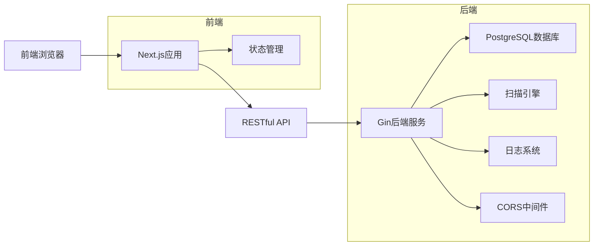
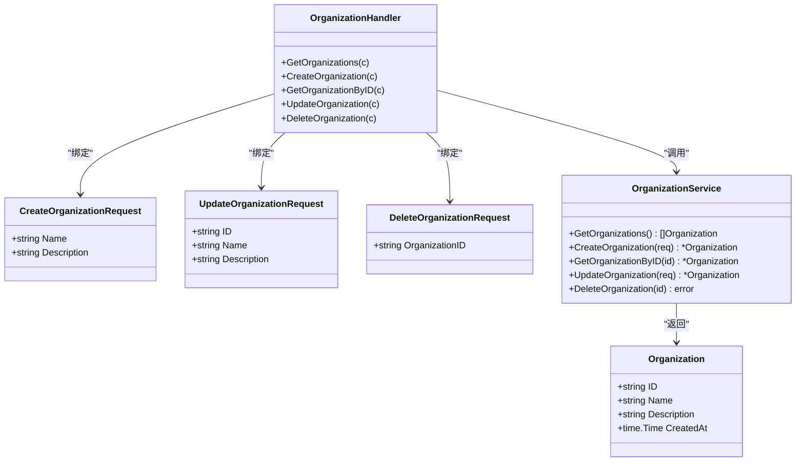
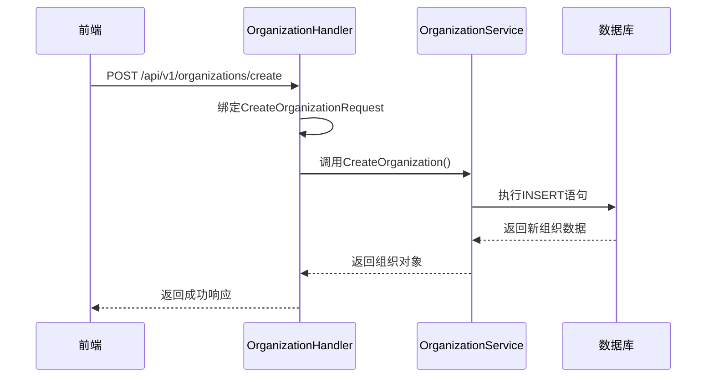
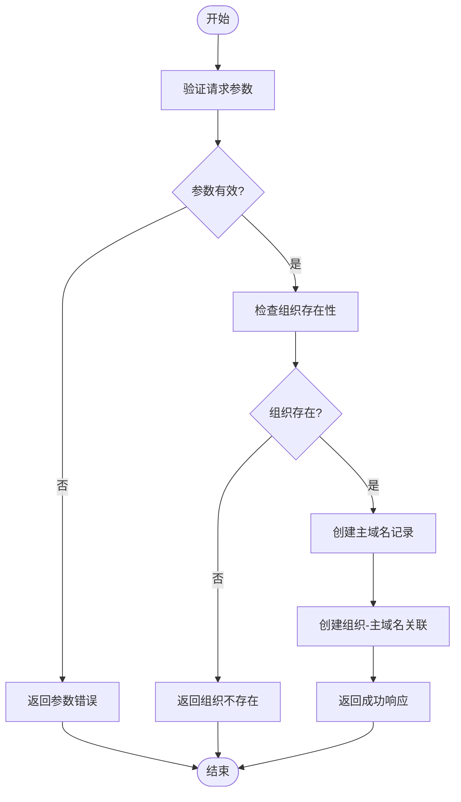
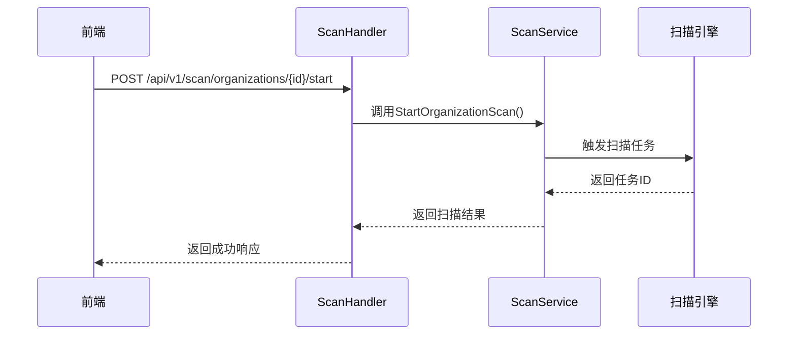
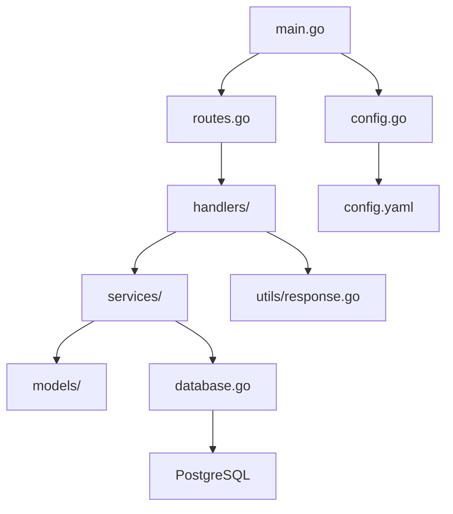

# 系统概述

<cite>
**本文档引用的文件**
- [main.go](file://backend/cmd/main.go)
- [config.go](file://backend/config/config.go)
- [routes.go](file://backend/routes/routes.go)
- [organization-handler.go](file://backend/internal/handlers/organization-handler.go)
- [domain-handler.go](file://backend/internal/handlers/domain-handler.go)
- [scan-handler.go](file://backend/internal/handlers/scan-handler.go)
- [organization-service.go](file://backend/internal/services/organization-service.go)
- [domain-service.go](file://backend/internal/services/domain-service.go)
- [scan-service.go](file://backend/internal/services/scan-service.go)
- [organization.go](file://backend/internal/models/organization.go)
- [domain.go](file://backend/internal/models/domain.go)
- [scan.go](file://backend/internal/models/scan.go)
- [database.go](file://backend/pkg/database/database.go)
- [README.md](file://backend/README.md)
</cite>

## 目录
1. [简介](#简介)
2. [项目结构](#项目结构)
3. [核心组件](#核心组件)
4. [架构概述](#架构概述)
5. [详细组件分析](#详细组件分析)
6. [依赖分析](#依赖分析)
7. [性能考虑](#性能考虑)
8. [故障排除指南](#故障排除指南)
9. [结论](#结论)

## 简介
本漏洞扫描系统是一个前后端分离的安全管理平台，旨在帮助组织管理资产、执行漏洞扫描并分析安全风险。系统采用Go语言构建后端服务，使用Next.js开发前端界面，通过RESTful API进行通信。核心功能包括组织管理、资产发现（主域名与子域名）、扫描任务调度和漏洞分析。系统支持通过工作流编排安全检测流程，提供直观的用户界面进行资产管理与结果查看。

**Section sources**
- [README.md](file://backend/README.md#L1-L155)

## 项目结构
项目分为`backend`和`front`两个主要目录，分别存放后端和前端代码。后端采用分层架构设计，包含配置、路由、处理器、服务、模型和数据库访问层。前端基于Next.js框架，使用组件化开发模式，包含页面、组件、服务和状态管理模块。

**Diagram sources**
- [main.go](file://backend/cmd/main.go#L1-L110)
- [routes.go](file://backend/routes/routes.go#L1-L65)
- [app](file://front/app)

**Section sources**
- [main.go](file://backend/cmd/main.go#L1-L110)
- [routes.go](file://backend/routes/routes.go#L1-L65)

## 核心组件
系统的核心组件包括组织管理、资产管理和扫描引擎。组织管理模块负责创建、查询、更新和删除组织实体；资产管理模块处理主域名和子域名的生命周期；扫描引擎模块协调扫描任务的启动与历史记录查询。所有组件通过清晰的分层架构解耦，确保可维护性和可扩展性。

**Section sources**
- [organization-handler.go](file://backend/internal/handlers/organization-handler.go#L1-L212)
- [domain-handler.go](file://backend/internal/handlers/domain-handler.go#L1-L134)
- [scan-handler.go](file://backend/internal/handlers/scan-handler.go)

## 架构概述
系统采用典型的前后端分离架构，后端提供RESTful API服务，前端通过HTTP请求与后端交互。后端基于Gin框架构建，遵循MVC模式，分为路由层、处理器层、服务层和数据访问层。前端使用Next.js框架，结合React组件和自定义Hook管理状态与API调用。

**Diagram sources**
- [main.go](file://backend/cmd/main.go#L1-L110)
- [routes.go](file://backend/routes/routes.go#L1-L65)
- [organization-handler.go](file://backend/internal/handlers/organization-handler.go#L1-L212)

## 详细组件分析

### 组织管理模块分析
组织管理模块负责处理组织实体的CRUD操作。用户可以通过API创建组织、获取组织列表、查询特定组织详情、更新组织信息以及删除组织。该模块包含处理器、服务和数据模型三层结构，确保业务逻辑与数据访问分离。

#### 类图

**Diagram sources**
- [organization.go](file://backend/internal/models/organization.go#L1-L32)
- [organization-handler.go](file://backend/internal/handlers/organization-handler.go#L1-L212)
- [organization-service.go](file://backend/internal/services/organization-service.go#L1-L158)

#### 创建组织序列图

**Diagram sources**
- [organization-handler.go](file://backend/internal/handlers/organization-handler.go#L45-L65)
- [organization-service.go](file://backend/internal/services/organization-service.go#L75-L105)

**Section sources**
- [organization-handler.go](file://backend/internal/handlers/organization-handler.go#L1-L212)
- [organization-service.go](file://backend/internal/services/organization-service.go#L1-L158)

### 资产管理模块分析
资产管理模块负责管理主域名和子域名。系统支持为组织添加主域名，为主域名发现子域名，并建立组织与主域名的关联关系。该模块支持分页查询子域名列表，便于大规模资产管理。

#### 主域名创建流程图

**Diagram sources**
- [domain-handler.go](file://backend/internal/handlers/domain-handler.go#L50-L85)
- [domain-service.go](file://backend/internal/services/domain-service.go)

**Section sources**
- [domain-handler.go](file://backend/internal/handlers/domain-handler.go#L1-L134)
- [domain.go](file://backend/internal/models/domain.go#L1-L62)

### 扫描管理模块分析
扫描管理模块负责启动和查询扫描任务。用户可以为特定组织启动扫描任务，系统会记录扫描历史供后续分析。该模块通过API暴露扫描功能，为未来集成实际扫描引擎提供接口。

#### 扫描任务启动序列图

**Diagram sources**
- [scan-handler.go](file://backend/internal/handlers/scan-handler.go)
- [scan-service.go](file://backend/internal/services/scan-service.go)

**Section sources**
- [scan-handler.go](file://backend/internal/handlers/scan-handler.go)
- [scan-service.go](file://backend/internal/services/scan-service.go)

## 依赖分析
系统依赖关系清晰，各层之间单向依赖。处理器层依赖服务层，服务层依赖数据访问层，形成稳定的架构模式。外部依赖包括Gin Web框架、PostgreSQL数据库驱动、Logrus日志库和UUID生成库。

**Diagram sources**
- [go.mod](file://backend/go.mod)
- [main.go](file://backend/cmd/main.go#L1-L110)
- [routes.go](file://backend/routes/routes.go#L1-L65)

**Section sources**
- [go.mod](file://backend/go.mod)
- [main.go](file://backend/cmd/main.go#L1-L110)

## 性能考虑
系统在设计时考虑了基本的性能优化。数据库查询使用预编译语句防止SQL注入并提升执行效率。日志系统采用结构化输出便于分析。分页机制避免一次性加载大量数据。未来可优化方向包括数据库索引优化、查询缓存机制和并发扫描任务处理。

## 故障排除指南
常见问题包括数据库连接失败、API路由错误和参数验证失败。检查数据库服务是否运行，确认配置文件中的连接信息正确。确保请求Content-Type为application/json，请求体符合API文档要求。查看日志文件获取详细错误信息，日志采用JSON格式记录时间、级别和上下文信息。

**Section sources**
- [logger.go](file://backend/internal/middleware/logger.go)
- [response.go](file://backend/internal/utils/response.go)
- [README.md](file://backend/README.md#L30-L50)

## 结论
本漏洞扫描系统提供了完整的组织管理、资产发现和扫描调度功能。系统架构清晰，代码分层合理，具备良好的可维护性和扩展性。通过RESTful API设计，前后端完全解耦，便于独立开发和部署。未来可集成实际的漏洞扫描引擎，增强安全检测能力，并通过工作流引擎实现复杂的扫描策略编排。