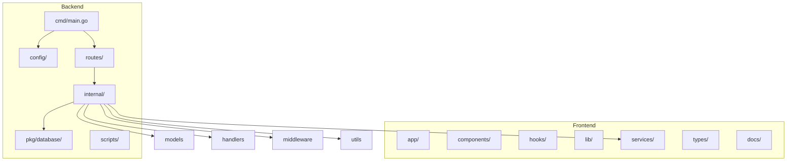
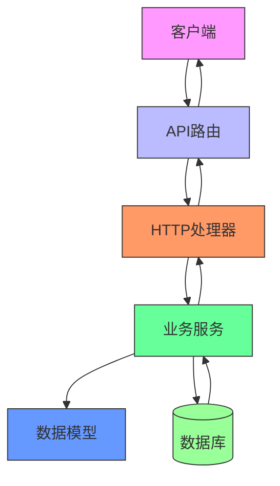
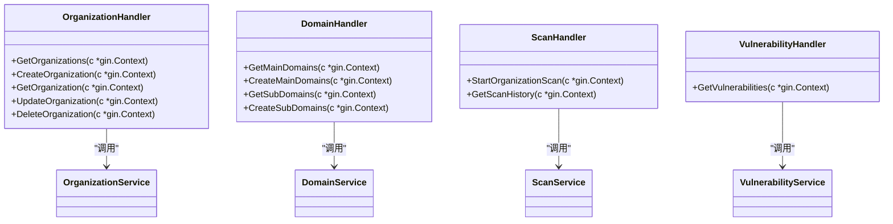
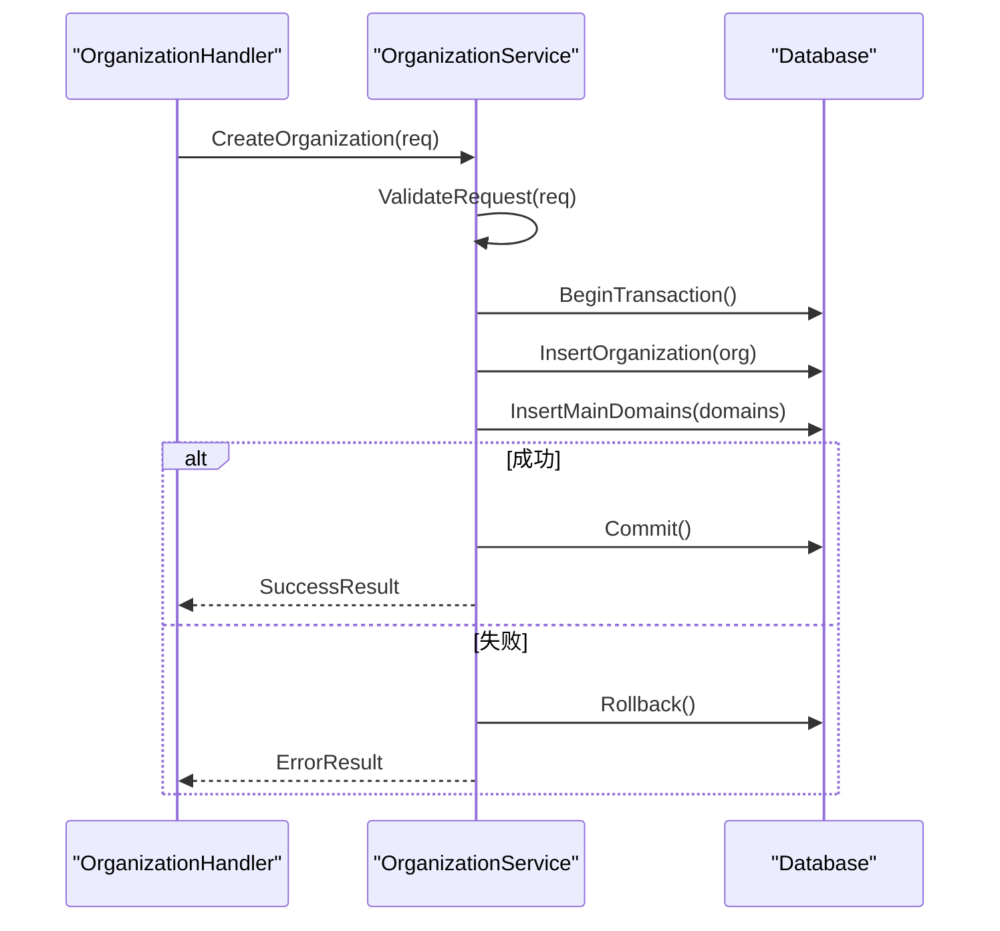
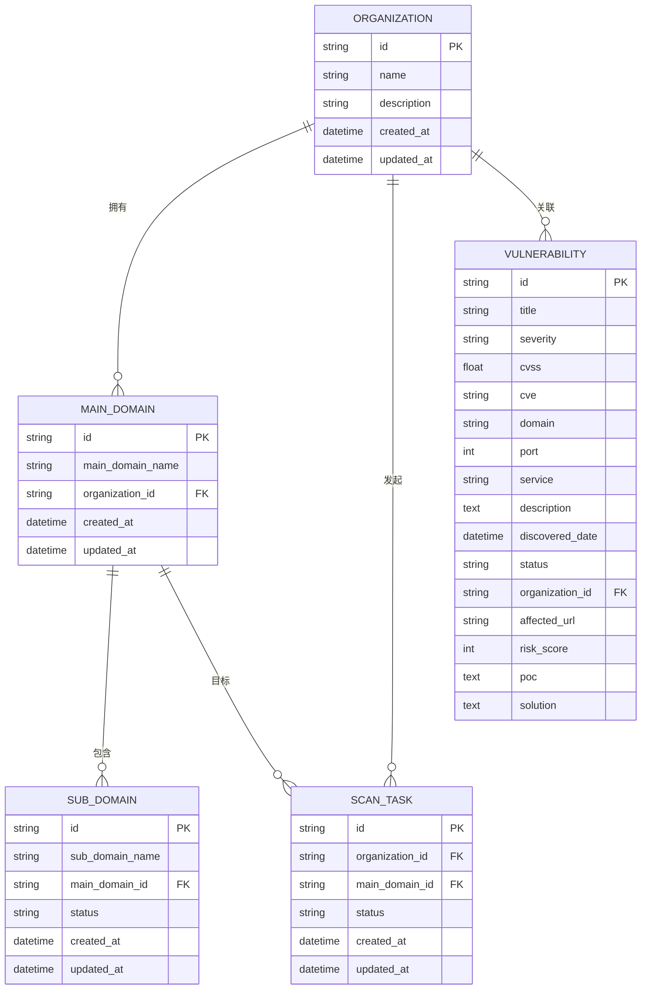
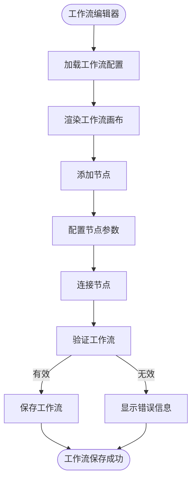
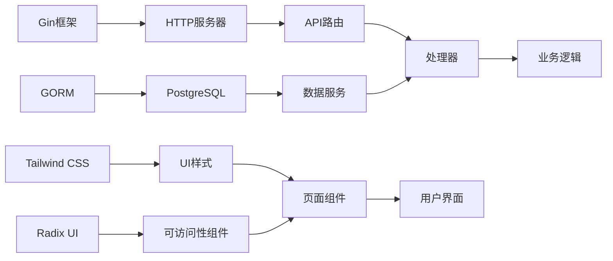

# 贡献指南

<cite>
**本文档引用的文件**   
- [main.go](file://backend/cmd/main.go)
- [config.go](file://backend/config/config.go)
- [config.yaml](file://backend/config/config.yaml)
- [domain-handler.go](file://backend/internal/handlers/domain-handler.go)
- [organization-handler.go](file://backend/internal/handlers/organization-handler.go)
- [scan-handler.go](file://backend/internal/handlers/scan-handler.go)
- [vulnerability-handler.go](file://backend/internal/handlers/vulnerability-handler.go)
- [cors.go](file://backend/internal/middleware/cors.go)
- [logger.go](file://backend/internal/middleware/logger.go)
- [domain.go](file://backend/internal/models/domain.go)
- [organization.go](file://backend/internal/models/organization.go)
- [response.go](file://backend/internal/models/response.go)
- [scan.go](file://backend/internal/models/scan.go)
- [vulnerability.go](file://backend/internal/models/vulnerability.go)
- [domain-service.go](file://backend/internal/services/domain-service.go)
- [organization-service.go](file://backend/internal/services/organization-service.go)
- [scan-service.go](file://backend/internal/services/scan-service.go)
- [vulnerability-service.go](file://backend/internal/services/vulnerability-service.go)
- [response.go](file://backend/internal/utils/response.go)
- [database.go](file://backend/pkg/database/database.go)
- [routes.go](file://backend/routes/routes.go)
- [start.sh](file://backend/scripts/start.sh)
- [API_DOCUMENTATION.md](file://backend/API_DOCUMENTATION.md)
- [README.md](file://backend/README.md)
- [初始化.sql](file://backend/初始化.sql)
- [workflow-directory-structure.md](file://front/docs/workflow-directory-structure.md)
</cite>

## 目录
1. [简介](#简介)
2. [项目结构](#项目结构)
3. [核心组件](#核心组件)
4. [架构概览](#架构概览)
5. [详细组件分析](#详细组件分析)
6. [依赖分析](#依赖分析)
7. [性能考量](#性能考量)
8. [故障排除指南](#故障排除指南)
9. [结论](#结论)

## 简介
本指南旨在为开发者提供一个清晰、全面的贡献流程和规范说明，帮助新成员快速融入项目开发。项目分为前后端两个主要部分：后端采用Go语言基于Gin框架构建，负责API服务、数据库交互和业务逻辑处理；前端采用Next.js框架，提供现代化的用户界面。本指南将详细介绍代码贡献流程、代码风格要求、测试覆盖标准以及文档更新义务，并特别强调工作流引擎的扩展开发规范。

## 项目结构
项目采用分层架构设计，前后端分离，便于独立开发和部署。后端遵循标准的Go项目结构，包含配置、路由、处理器、服务、模型等目录；前端采用Next.js的App Router模式，按功能模块组织页面和组件。

**图示来源**
- [main.go](file://backend/cmd/main.go#L1-L20)
- [routes.go](file://backend/routes/routes.go#L10-L30)
- [README.md](file://backend/README.md#L5-L50)

**本节来源**
- [README.md](file://backend/README.md#L1-L100)

## 核心组件
项目的核心组件包括API路由、HTTP处理器、业务服务层、数据模型和数据库连接。这些组件共同构成了系统的业务逻辑处理能力。后端使用Gin框架处理HTTP请求，通过中间件进行CORS和日志记录，处理器调用服务层完成具体业务逻辑，服务层与数据库交互完成数据持久化。

**本节来源**
- [main.go](file://backend/cmd/main.go#L25-L100)
- [routes.go](file://backend/routes/routes.go#L15-L60)
- [organization-service.go](file://backend/internal/services/organization-service.go#L10-L50)

## 架构概览
系统采用典型的三层架构：表现层（API路由和处理器）、业务逻辑层（服务）和数据访问层（数据库）。这种分层设计提高了代码的可维护性和可测试性。

**图示来源**
- [routes.go](file://backend/routes/routes.go#L1-L20)
- [organization-handler.go](file://backend/internal/handlers/organization-handler.go#L5-L30)
- [organization-service.go](file://backend/internal/services/organization-service.go#L10-L40)
- [database.go](file://backend/pkg/database/database.go#L15-L35)

## 详细组件分析
### 后端组件分析
#### HTTP处理器分析
HTTP处理器负责接收和解析HTTP请求，调用相应的业务服务，并返回格式化的响应。每个处理器对应一组相关的API端点。

**图示来源**
- [organization-handler.go](file://backend/internal/handlers/organization-handler.go#L10-L50)
- [domain-handler.go](file://backend/internal/handlers/domain-handler.go#L8-L45)
- [scan-handler.go](file://backend/internal/handlers/scan-handler.go#L7-L40)
- [vulnerability-handler.go](file://backend/internal/handlers/vulnerability-handler.go#L6-L35)

**本节来源**
- [organization-handler.go](file://backend/internal/handlers/organization-handler.go#L1-L100)
- [domain-handler.go](file://backend/internal/handlers/domain-handler.go#L1-L80)

#### 业务服务分析
业务服务层封装了核心业务逻辑，是连接处理器和数据访问层的桥梁。服务层负责事务管理、业务规则验证和跨模型操作。

**图示来源**
- [organization-service.go](file://backend/internal/services/organization-service.go#L20-L80)
- [database.go](file://backend/pkg/database/database.go#L25-L60)

**本节来源**
- [organization-service.go](file://backend/internal/services/organization-service.go#L1-L100)
- [domain-service.go](file://backend/internal/services/domain-service.go#L1-L70)

#### 数据模型分析
数据模型定义了系统中实体的数据结构和关系。项目使用GORM作为ORM工具，通过结构体标签定义数据库表结构。

**图示来源**
- [organization.go](file://backend/internal/models/organization.go#L5-L25)
- [domain.go](file://backend/internal/models/domain.go#L5-L30)
- [scan.go](file://backend/internal/models/scan.go#L5-L20)
- [vulnerability.go](file://backend/internal/models/vulnerability.go#L5-L40)

**本节来源**
- [organization.go](file://backend/internal/models/organization.go#L1-L50)
- [domain.go](file://backend/internal/models/domain.go#L1-L60)

### 前端组件分析
#### 工作流引擎分析
工作流引擎是前端的核心功能模块，允许用户可视化地设计和管理安全扫描流程。其目录结构遵循`workflow-directory-structure.md`文档的规范。

**图示来源**
- [workflow-directory-structure.md](file://front/docs/workflow-directory-structure.md#L1-L30)
- [workflow-canvas.tsx](file://front/components/workflow/canvas/workflow-canvas.tsx#L10-L50)
- [use-workflow.ts](file://front/hooks/workflow/use-workflow.ts#L15-L40)

**本节来源**
- [workflow-directory-structure.md](file://front/docs/workflow-directory-structure.md#L1-L50)
- [use-workflow.ts](file://front/hooks/workflow/use-workflow.ts#L1-L80)

## 依赖分析
项目依赖关系清晰，各层之间耦合度低。后端主要依赖Gin框架、GORM ORM和PostgreSQL数据库驱动。前端依赖Next.js、React、Tailwind CSS和Radix UI组件库。

**图示来源**
- [go.mod](file://backend/go.mod#L1-L20)
- [package.json](file://front/package.json#L1-L30)

**本节来源**
- [go.mod](file://backend/go.mod#L1-L50)
- [package.json](file://front/package.json#L1-L60)

## 性能考量
系统性能主要受数据库查询效率和API响应时间影响。建议对频繁查询的字段建立索引，使用连接池管理数据库连接，并对大型响应进行分页处理。前端应实现数据缓存和懒加载，避免不必要的渲染。

## 故障排除指南
常见问题包括数据库连接失败、API响应超时和前端组件渲染错误。检查数据库配置、网络连接和日志文件是解决问题的第一步。使用`API_DOCUMENTATION.md`中的示例请求测试API端点，可以帮助定位问题。

**本节来源**
- [config.go](file://backend/config/config.go#L10-L50)
- [logger.go](file://backend/internal/middleware/logger.go#L15-L40)
- [API_DOCUMENTATION.md](file://backend/API_DOCUMENTATION.md#L1-L100)

## 结论
本贡献指南为开发者提供了全面的项目开发规范和流程说明。遵循这些规范将确保代码质量和项目一致性。鼓励贡献者在开发新功能前仔细阅读相关文档，特别是工作流引擎的扩展开发规范。通过遵循统一的代码风格、编写充分的测试并及时更新文档，我们可以共同维护一个高质量、可维护的代码库。