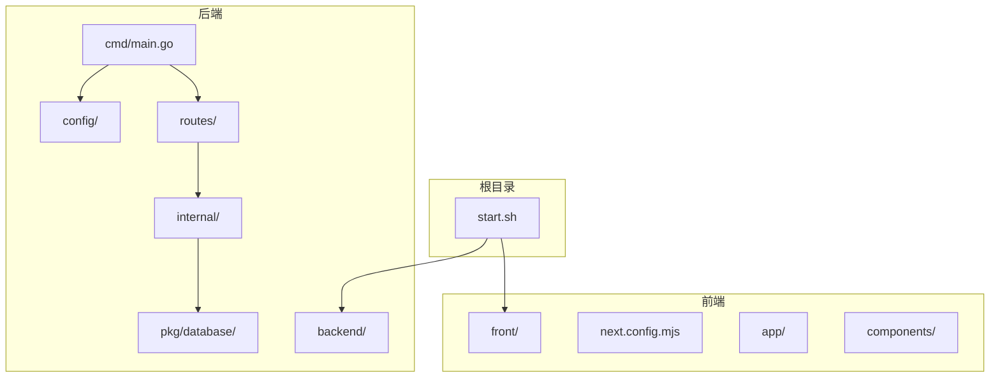
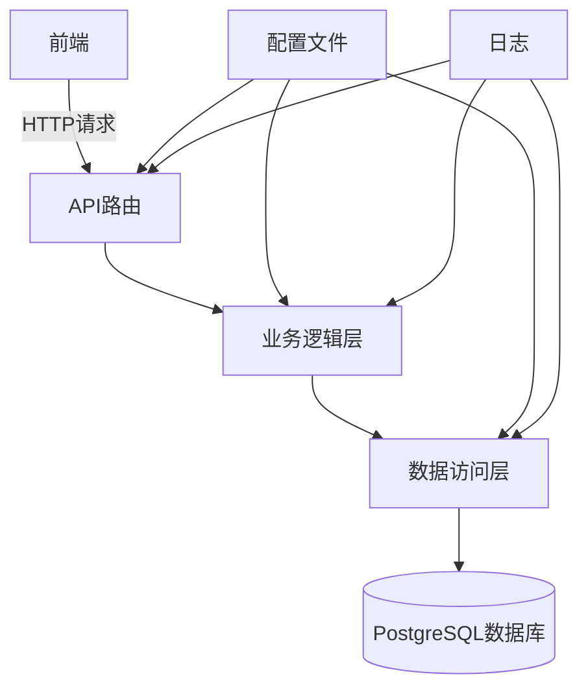
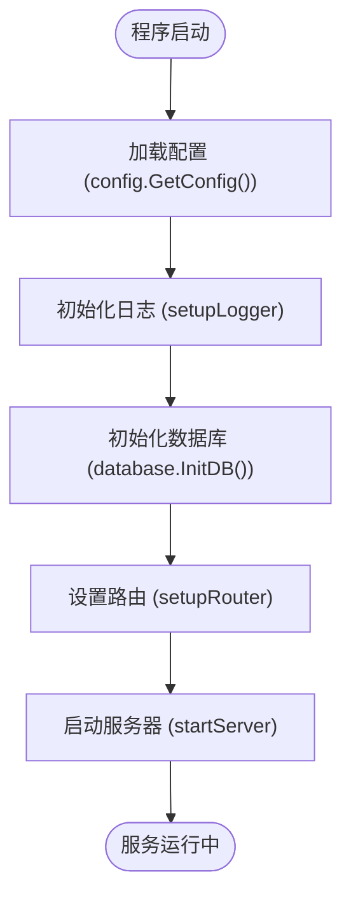
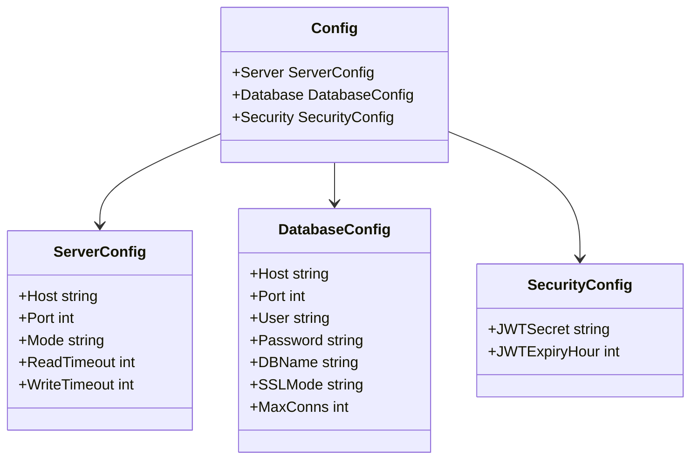
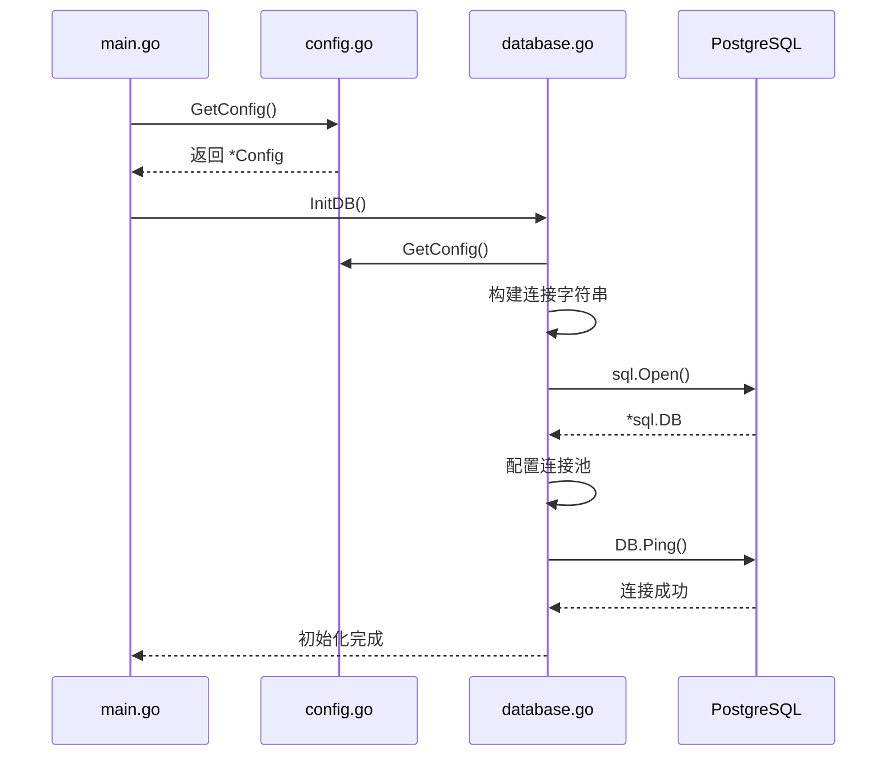
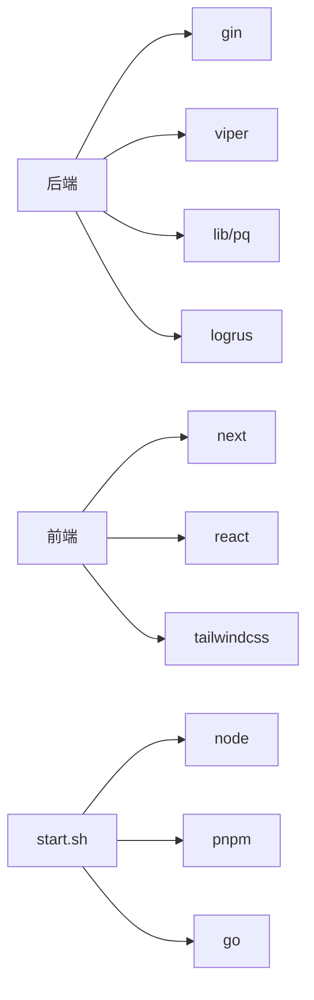

# 部署指南

<cite>
**本文档引用的文件**  
- [main.go](file://backend/cmd/main.go) - *更新于最近提交*
- [config.go](file://backend/config/config.go) - *更新于最近提交*
- [config.yaml](file://backend/config/config.yaml)
- [database.go](file://backend/pkg/database/database.go)
- [routes.go](file://backend/routes/routes.go)
- [start.sh](file://start.sh) - *包含构建与启动逻辑*
- [init.sql](file://backend/init.sql)
</cite>

## 更新摘要
**已做更改**  
- 更新了构建流程说明，确认 `Makefile` 已被 `start.sh` 脚本替代
- 修正了服务编译与打包流程描述，基于 `start.sh` 中的实际命令
- 更新了生产环境配置调整建议，参考 `config.yaml` 和 `config.go` 中的环境变量机制
- 移除了对已删除 `Makefile` 的引用，确保文档与当前代码库一致
- 更新了反向代理和 HTTPS 配置建议，保持通用性
- 补充了基于 `start.sh` 的 Docker 容器化和进程管理方案

## 目录
1. [简介](#简介)
2. [项目结构](#项目结构)
3. [核心组件](#核心组件)
4. [架构概览](#架构概览)
5. [详细组件分析](#详细组件分析)
6. [依赖分析](#依赖分析)
7. [性能考虑](#性能考虑)
8. [故障排除指南](#故障排除指南)
9. [结论](#结论)

## 简介
本指南详细说明如何将“漏洞扫描系统”从开发环境部署到生产环境。系统由Go语言编写的后端和Next.js构建的前端组成，采用PostgreSQL作为数据库。文档涵盖构建流程、配置调整、反向代理设置、HTTPS配置、Docker容器化、进程管理、性能调优、日志与监控等关键环节，确保系统在生产环境中的稳定与安全。

## 项目结构
项目采用前后端分离的架构，后端位于`backend`目录，前端位于`front`目录。后端使用Go语言，基于Gin框架构建RESTful API，遵循分层架构（handlers, services, models, database）。前端使用Next.js框架，采用App Router模式。根目录的`start.sh`脚本用于协调前后端的启动。

**图示来源**
- [start.sh](file://start.sh)
- [main.go](file://backend/cmd/main.go)

**本节来源**
- [start.sh](file://start.sh)
- [main.go](file://backend/cmd/main.go)

## 核心组件
系统的核心组件包括：配置管理（`config`）、数据库连接（`database`）、HTTP服务器（`main.go`）、路由（`routes`）和业务逻辑（`internal/services`）。`main.go`是程序入口，负责加载配置、初始化数据库、设置路由并启动服务器。`config`包使用Viper库管理配置，支持YAML文件和环境变量。`database`包封装了PostgreSQL的连接和连接池管理。

**本节来源**
- [main.go](file://backend/cmd/main.go#L1-L110)
- [config.go](file://backend/config/config.go#L1-L121)
- [database.go](file://backend/pkg/database/database.go#L1-L95)

## 架构概览
系统采用典型的三层架构：表现层（API路由）、业务逻辑层（服务）和数据访问层（数据库）。前端通过HTTP请求与后端API交互，后端处理业务逻辑并访问数据库。整个流程由`main.go`协调，配置和数据库连接是全局共享的基础设施。

**图示来源**
- [main.go](file://backend/cmd/main.go#L1-L110)
- [routes.go](file://backend/routes/routes.go#L1-L65)
- [database.go](file://backend/pkg/database/database.go#L1-L95)

## 详细组件分析

### 后端服务分析
后端服务以`main.go`为入口，其`main`函数是启动的核心。

#### 启动流程分析

**图示来源**
- [main.go](file://backend/cmd/main.go#L15-L30)

#### 配置管理分析
`config`包负责管理应用的所有配置。它使用`viper`库从`config.yaml`文件中读取配置，并允许通过环境变量进行覆盖。`Config`结构体定义了服务器、数据库和安全三部分的配置。

**图示来源**
- [config.go](file://backend/config/config.go#L15-L45)

#### 数据库连接分析
`database`包负责与PostgreSQL数据库的连接和管理。`InitDB`函数根据配置构建连接字符串，建立连接，并配置连接池。

**图示来源**
- [main.go](file://backend/cmd/main.go#L25-L30)
- [database.go](file://backend/pkg/database/database.go#L15-L45)

**本节来源**
- [main.go](file://backend/cmd/main.go#L1-L110)
- [config.go](file://backend/config/config.go#L1-L121)
- [database.go](file://backend/pkg/database/database.go#L1-L95)

### 前端服务分析
前端基于Next.js 15构建，使用App Router和Server Components。`next.config.mjs`、`tailwind.config.ts`等文件定义了构建和样式配置。`app`目录下的文件结构直接映射到路由。

**本节来源**
- [next.config.mjs](file://front/next.config.mjs)
- [tailwind.config.ts](file://front/tailwind.config.ts)

## 依赖分析
项目的主要依赖通过`go.mod`和`pnpm-lock.yaml`管理。后端依赖`gin`作为Web框架，`viper`用于配置，`lib/pq`用于PostgreSQL驱动。前端依赖`next`、`react`、`tailwindcss`等。`start.sh`脚本依赖`node`、`pnpm`、`go`等命令行工具。

**图示来源**
- [go.mod](file://backend/go.mod)
- [package.json](file://front/package.json)
- [start.sh](file://start.sh)

**本节来源**
- [go.mod](file://backend/go.mod)
- [package.json](file://front/package.json)
- [start.sh](file://start.sh)

## 性能考虑
生产环境部署需关注以下性能方面：
- **数据库连接池**：`database.go`中`SetMaxOpenConns`和`SetMaxIdleConns`的配置应根据生产数据库的规格进行调整，避免连接耗尽。
- **Gin模式**：确保`config.yaml`中`server.mode`为`release`，以关闭调试信息。
- **静态资源**：前端构建后，应通过CDN或反向代理高效提供静态资源。
- **超时设置**：`config.yaml`中的`read_timeout`和`write_timeout`应根据实际业务需求合理设置。

## 故障排除指南
- **服务无法启动**：检查`config.yaml`中的数据库连接信息是否正确，确保PostgreSQL服务已运行。查看`start.sh`脚本的输出日志。
- **数据库连接失败**：确认数据库主机、端口、用户名、密码无误。检查防火墙设置。
- **API返回404**：确认`main.go`中的路由组`/api/v1`是否正确，检查`routes.go`中的路由定义。
- **前端无法访问后端**：检查反向代理配置，确保前端请求被正确转发到后端服务端口。

**本节来源**
- [main.go](file://backend/cmd/main.go#L100-L105)
- [database.go](file://backend/pkg/database/database.go#L40-L50)
- [config.yaml](file://backend/config/config.yaml)

## 结论
本部署指南提供了将漏洞扫描系统从开发环境迁移到生产环境的完整方案。通过遵循构建、配置、部署和监控的最佳实践，可以确保系统的稳定、安全和高性能。建议在生产环境中使用Docker容器化和Kubernetes编排以获得更好的可扩展性和管理性。