<h1 align="center">XingRin - 星环</h1>

<p align="center">
  <b>🛡️ 攻击面管理平台 (ASM) | 自动化资产发现与漏洞扫描系统</b>
</p>

<p align="center">
  <a href="https://github.com/yyhuni/xingrin/stargazers"></a>
  <a href="https://github.com/yyhuni/xingrin/network/members"></a>
  <a href="https://github.com/yyhuni/xingrin/issues"></a>
  <a href="https://github.com/yyhuni/xingrin/blob/main/LICENSE"></a>
</p>

<p align="center">
  <a href="#-功能特性">功能特性</a> •
  <a href="#-全局资产搜索">资产搜索</a> •
  <a href="#-快速开始">快速开始</a> •
  <a href="#-文档">文档</a> •
  <a href="#-反馈与贡献">反馈与贡献</a>
</p>

<p align="center">
  <sub>🔍 关键词: ASM | 攻击面管理 | 漏洞扫描 | 资产发现 | 资产搜索 | Bug Bounty | 渗透测试 | Nuclei | 子域名枚举 | EASM</sub>
</p>

---

## 🌐 在线 Demo

👉 **[https://xingrin.vercel.app/](https://xingrin.vercel.app/)**

> ⚠️ 仅用于 UI 展示，未接入后端数据库

---

<p align="center">
  <b>🎨 现代化 UI </b>
</p>

<p align="center">
  
  
  
  
</p>

## 📚 文档

- [📖 技术文档](./docs/README.md) - 技术文档导航（🚧 持续完善中）
- [🚀 快速开始](./docs/quick-start.md) - 一键安装和部署指南
- [🔄 版本管理](./docs/version-management.md) - Git Tag 驱动的自动化版本管理系统
- [📦 Nuclei 模板架构](./docs/nuclei-template-architecture.md) - 模板仓库的存储与同步
- [📖 字典文件架构](./docs/wordlist-architecture.md) - 字典文件的存储与同步
- [🔍 扫描流程架构](./docs/scan-flow-architecture.md) - 完整扫描流程与工具编排


---

## ✨ 功能特性

### 🎯 目标与资产管理
- **组织管理** - 多层级目标组织，灵活分组
- **目标管理** - 支持域名、IP目标类型
- **资产发现** - 子域名、网站、端点、目录自动发现
- **资产快照** - 扫描结果快照对比，追踪资产变化

### 🔍 漏洞扫描
- **多引擎支持** - 集成 Nuclei 等主流扫描引擎
- **自定义流程** - YAML 配置扫描流程，灵活编排
- **定时扫描** - Cron 表达式配置，自动化周期扫描

### 🔖 指纹识别
- **多源指纹库** - 内置 EHole、Goby、Wappalyzer、Fingers、FingerPrintHub、ARL 等 2.7W+ 指纹规则
- **自动识别** - 扫描流程自动执行，识别 Web 应用技术栈
- **指纹管理** - 支持查询、导入、导出指纹规则

#### 扫描流程架构

完整的扫描流程包括：子域名发现、端口扫描、站点发现、指纹识别、URL 收集、目录扫描、漏洞扫描等阶段


详细说明请查看 [扫描流程架构文档](./docs/scan-flow-architecture.md)

### 🖥️ 分布式架构
- **多节点扫描** - 支持部署多个 Worker 节点，横向扩展扫描能力
- **本地节点** - 零配置，安装即自动注册本地 Docker Worker
- **远程节点** - SSH 一键部署远程 VPS 作为扫描节点
- **负载感知调度** - 实时感知节点负载，自动分发任务到最优节点
- **节点监控** - 实时心跳检测，CPU/内存/磁盘状态监控
- **断线重连** - 节点离线自动检测，恢复后自动重新接入

```mermaid
flowchart TB
    subgraph MASTER["主服务器 (Master Server)"]
        direction TB
        
        REDIS["Redis 负载缓存"]
        
        subgraph SCHEDULER["任务调度器 (Task Distributor)"]
            direction TB
            SUBMIT["接收扫描任务"]
            SELECT["负载感知选择"]
            DISPATCH["智能分发"]
            
            SUBMIT --> SELECT
            SELECT --> DISPATCH
        end
        
        REDIS -.负载数据.-> SELECT
    end
    
    subgraph WORKERS["Worker 节点集群"]
        direction TB
        
        W1["Worker 1 (本地)<br/>CPU: 45% | MEM: 60%"]
        W2["Worker 2 (远程)<br/>CPU: 30% | MEM: 40%"]
        W3["Worker N (远程)<br/>CPU: 90% | MEM: 85%"]
    end
    
    DISPATCH -->|任务分发| W1
    DISPATCH -->|任务分发| W2
    DISPATCH -->|高负载跳过| W3
    
    W1 -.心跳上报.-> REDIS
    W2 -.心跳上报.-> REDIS
    W3 -.心跳上报.-> REDIS
```



### 🔎 全局资产搜索
- **多类型搜索** - 支持 Website 和 Endpoint 两种资产类型
- **表达式语法** - 支持 `=`（模糊）、`==`（精确）、`!=`（不等于）操作符
- **逻辑组合** - 支持 `&&` (AND) 和 `||` (OR) 逻辑组合
- **多字段查询** - 支持 host、url、title、tech、status、body、header 字段
- **CSV 导出** - 流式导出全部搜索结果，无数量限制

#### 搜索语法示例

```bash
# 基础搜索
host="api"                    # host 包含 "api"
status=="200"                 # 状态码精确等于 200
tech="nginx"                  # 技术栈包含 nginx

# 组合搜索
host="api" && status=="200"   # host 包含 api 且状态码为 200
tech="vue" || tech="react"    # 技术栈包含 vue 或 react

# 复杂查询
host="admin" && tech="php" && status=="200"
url="/api/v1" && status!="404"
```

### 📊 可视化界面
- **数据统计** - 资产/漏洞统计仪表盘
- **实时通知** - WebSocket 消息推送
- **通知推送** - 实时企业微信，tg，discard消息推送服务

---

## 📦 快速开始

### 环境要求

- **操作系统**: Ubuntu 20.04+ / Debian 11+ 
- **系统架构**: AMD64 (x86_64) / ARM64 (aarch64)
- **硬件**: 2核 4G 内存起步，20GB+ 磁盘空间

### 一键安装

```bash
# 克隆项目
git clone https://github.com/yyhuni/xingrin.git
cd xingrin

# 安装并启动（生产模式）
sudo ./install.sh

# 🇨🇳 中国大陆用户推荐使用镜像加速（第三方加速服务可能会失效，不保证长期可用）
sudo ./install.sh --mirror
```

> **💡 --mirror 参数说明**
> - 自动配置 Docker 镜像加速（国内镜像源）
> - 加速 Git 仓库克隆（Nuclei 模板等）
> - 大幅提升安装速度，避免网络超时

### 访问服务

- **Web 界面**: `https://ip:8083` 
- **默认账号**: admin / admin（首次登录后请修改密码）

### 常用命令

```bash
# 启动服务
sudo ./start.sh

# 停止服务
sudo ./stop.sh

# 重启服务
sudo ./restart.sh

# 卸载
sudo ./uninstall.sh
```

## 🤝 反馈与贡献

- 💡 **发现 Bug，有新想法，比如UI设计，功能设计等** 欢迎点击右边链接进行提交建议 [Issue](https://github.com/yyhuni/xingrin/issues) 或者公众号私信

## 📧 联系
- 微信公众号: **塔罗安全学苑**
- 微信群去公众号底下的菜单，有个交流群，点击就可以看到了，链接过期可以私信我拉你


## ⚠️ 免责声明

**重要：请在使用前仔细阅读**

1. 本工具仅供**授权的安全测试**和**安全研究**使用
2. 使用者必须确保已获得目标系统的**合法授权**
3. **严禁**将本工具用于未经授权的渗透测试或攻击行为
4. 未经授权扫描他人系统属于**违法行为**，可能面临法律责任
5. 开发者**不对任何滥用行为负责**

使用本工具即表示您同意：
- 仅在合法授权范围内使用
- 遵守所在地区的法律法规
- 承担因滥用产生的一切后果

## 🌟 Star History

如果这个项目对你有帮助，请给一个 ⭐ Star 支持一下！

[](https://star-history.com/#yyhuni/xingrin&Date)

## 📄 许可证

本项目采用 [GNU General Public License v3.0](LICENSE) 许可证。

### 允许的用途

- ✅ 个人学习和研究
- ✅ 商业和非商业使用
- ✅ 修改和分发
- ✅ 专利使用
- ✅ 私人使用

### 义务和限制

- 📋 **开源义务**：分发时必须提供源代码
- 📋 **相同许可**：衍生作品必须使用相同许可证
- 📋 **版权声明**：必须保留原始版权和许可证声明
- ❌ **责任免除**：不提供任何担保
- ❌ 未经授权的渗透测试
- ❌ 任何违法行为

