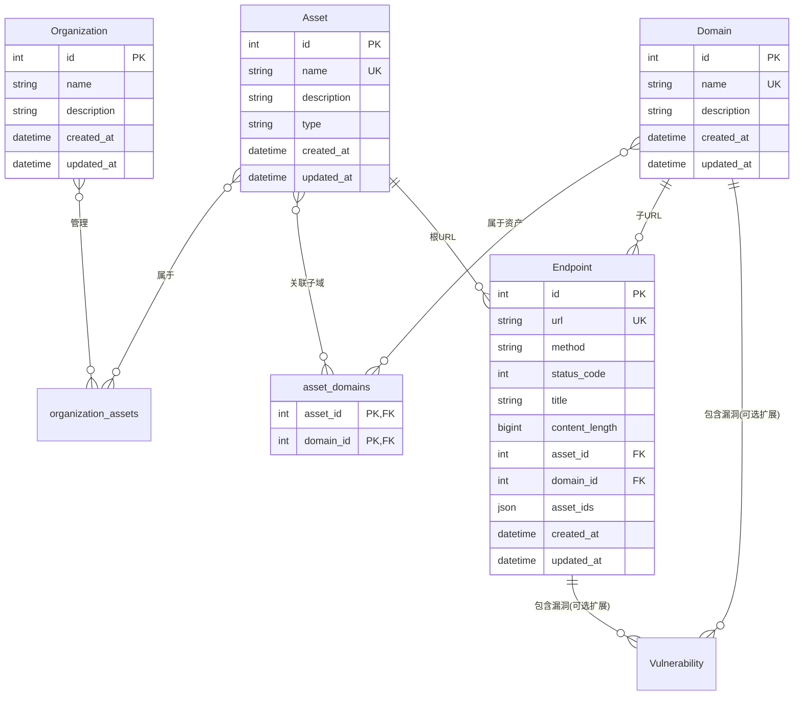

# XingRin 数据模型设计：核心资产模型文档

基于 Django ORM 的数据库模型设计文档，针对 XingRin 开源 Web 应用侦察工具的核心资产管理模块。本文档聚焦于核心领域模型，包括组织、资产、域名、端点等实体，支持多重域名归属（通过 Asset-Domain ManyToMany 实现子域共享），确保灵活性和无冗余存储。

## 核心资产模型概述
- **设计原则**：
  - **以 Asset 为中心**：所有侦察活动围绕 Asset 实体展开，Asset 表示独立侦察目标（如域名 FQDN），支持多 Domain 关联（共享子域）。Asset.name 直接代表根域，无需额外 Domain 记录。
  - **松散耦合**：Organization 和 Asset 通过 ManyToMany 松散分组；Asset 和 Domain 通过 ManyToMany 支持共享（e.g., c.b.a.com 同时属于 a.com 和 b.a.com）。
  - **规范化与优化**：Domain.name 全局唯一，只存储发现的子域（非根 FQDN）；Endpoint 通过 Domain 间接关联 Asset，使用 JSONField 冗余 asset_ids 提升查询性能；根 URL 直接关联 Asset（通过 asset_id）。
  - **查询优化**：复合索引和 ORM prefetch_related 支持高效多表查询；级联删除仅限强依赖（如 Domain → Endpoint）。
  - **扩展性**：未来支持 IP/CIDR 类型 Asset，通过关联表加 relation_type 字段。
- **关键变更**（相对于初始设计）：引入 asset_domains 关联表，实现 Asset-Domain ManyToMany；Endpoint 添加 asset_id（根 URL 用）和 asset_ids JSONField 冗余；Domain 只用于子域，无根 Domain 创建。

## 核心模型详细设计

### Organization 模型
**作用**: 组织管理，实现多个 Asset 的分组，支持项目隔离。

| 字段名      | 类型            | 限制                 | 默认值   | 说明       |
| ----------- | --------------- | -------------------- | -------- | ---------- |
| id          | AutoField       | 主键                 | 自增     | 主键标识符 |
| created_at  | DateTimeField   | 非空，auto_now_add   | 当前时间 | 创建时间   |
| updated_at  | DateTimeField   | 非空，auto_now，索引 | 当前时间 | 更新时间   |
| name        | CharField(255)  | unique，非空         | -        | 组织名称   |
| description | CharField(1000) | 可为空               | NULL     | 描述信息   |

**业务逻辑**:
- **独立存在**: 组织可以独立存在，不需要关联任何资产。
- **松散耦合**: 删除组织不会影响资产实体，只会清理关联表中的记录。
- **灵活管理**: 支持先创建组织，后续再关联资产；也支持随时解除关联。

**关系**:
- ManyToManyField: assets (通过 organization_assets 关联表)

**数据库表名**: `organizations`

### organization_assets 关联表
**作用**: Organization 和 Asset 的多对多关联表。

| 字段名          | 类型       | 限制       | 默认值 | 说明                              |
| --------------- | ---------- | ---------- | ------ | --------------------------------- |
| organization_id | ForeignKey | 主键，非空 | -      | 组织ID，外键关联 organizations 表 |
| asset_id        | ForeignKey | 主键，非空 | -      | 资产ID，外键关联 assets 表        |

**约束**:
- **复合主键**: (organization_id, asset_id) - 确保每个组织-资产组合只能存在一条记录
- **外键约束**: organization_id → organizations.id (CASCADE DELETE)
- **外键约束**: asset_id → assets.id (CASCADE DELETE)
- **唯一性保证**: 通过复合主键自动防止同一组织重复关联同一资产

**删除行为**:
- **删除组织**: 只删除关联表记录，资产实体保留（可能成为未分组资产）
- **删除资产**: 只删除关联表记录，组织实体保留
- **清理关联**: 解除关联时不影响任何一方的实体数据

**关系**:
- ForeignKey: Organization
- ForeignKey: Asset

**数据库表名**: `assets_organization_assets` (Django 自动生成)

### Asset 模型
**作用**: 侦察目标的核心实体，表示资产（目前专门表示域名，未来可扩展到 IP 等），支持多 Domain 关联；Asset.name 直接代表根域。

| 字段名      | 类型            | 限制                 | 默认值   | 说明                                                         |
| ----------- | --------------- | -------------------- | -------- | ------------------------------------------------------------ |
| id          | AutoField       | 主键，索引           | 自增     | 主键标识符                                                   |
| created_at  | DateTimeField   | 非空，auto_now_add   | 当前时间 | 创建时间                                                     |
| updated_at  | DateTimeField   | 非空，auto_now，索引 | 当前时间 | 更新时间                                                     |
| name        | CharField(255)  | unique，非空，索引   | -        | 完整的域名 FQDN（如 example.com），直接作为根域标识          |
| description | CharField(1000) | 可为空               | NULL     | 描述信息                                                     |
| type        | CharField(20)   | 非空，索引           | domain   | 资产类型：domain（域名）/ ip（IP地址）/ cidr（网段），自动判断 |

**业务逻辑**:
- **独立存在**: 资产可以独立存在，不需要关联任何 Domain（允许存在未分组资产）。
- **松散耦合**: 删除所有关联的组织不会删除资产本身，资产仍可正常使用。
- **根域处理**: Asset.name 直接代表根域；扫描根 URL 时，直接通过 Endpoint.asset_id 关联 Asset，无需 Domain。
- **子域共享**: 扫描时，发现子域后动态添加关联到 asset_domains（基于域名匹配，如 endswith）。
- **类型扩展**: type 字段支持 'domain'（域名）、'ip'（IP地址）、'cidr'（网段）等类型。

**关系**:
- ManyToManyField: domains (通过 asset_domains 关联表，related_name='assets')
- reverse ManyToMany: organizations (通过 organization_assets 关联表)
- reverse ForeignKey: endpoints (根 URL 通过 asset_id)

**数据库表名**: `assets`

### asset_domains 关联表
**作用**: Asset 和 Domain 的多对多关联表，支持子域多重归属（e.g., c.b.a.com 共享给多个 Asset）。

| 字段名    | 类型       | 限制       | 默认值 | 说明                              |
| --------- | ---------- | ---------- | ------ | --------------------------------- |
| id        | AutoField  | 可选主键   | 自增   | 主键标识符（可选，Django 默认无） |
| asset_id  | ForeignKey | 非空，索引 | -      | 资产ID，外键关联 assets 表        |
| domain_id | ForeignKey | 非空，索引 | -      | 域名ID，外键关联 domains 表       |

**约束**:
- **复合主键/唯一**: (asset_id, domain_id) - 确保每个资产-域名组合只能存在一条记录
- **外键约束**: asset_id → assets.id (CASCADE DELETE)
- **外键约束**: domain_id → domains.id (CASCADE DELETE)
- **复合索引**: (asset_id, domain_id) - 优化 "Asset 的所有 Domain" 查询

**删除行为**:
- **删除资产**: 只删除关联表记录，Domain 实体保留（可被其他 Asset 共享）
- **删除域名**: 只删除关联表记录，Asset 实体保留
- **清理关联**: 解除关联时不影响任何一方的实体数据

**关系**:
- ForeignKey: Asset
- ForeignKey: Domain

**数据库表名**: `assets_domains` (Django 自动生成，或自定义)

### Domain 模型
**作用**: 域名发现和特征信息存储（全局唯一，只用于子域）。

| 字段名      | 类型            | 限制                 | 默认值   | 说明                                          |
| ----------- | --------------- | -------------------- | -------- | --------------------------------------------- |
| id          | AutoField       | 主键，索引           | 自增     | 主键标识符                                    |
| created_at  | DateTimeField   | 非空，auto_now_add   | 当前时间 | 创建时间                                      |
| updated_at  | DateTimeField   | 非空，auto_now，索引 | 当前时间 | 更新时间                                      |
| name        | CharField(255)  | unique，非空，索引   | -        | 完整的域名 FQDN（如 api.example.com），仅子域 |
| description | CharField(1000) | 可为空               | NULL     | 描述信息                                      |

**约束**:
- **全局唯一索引**: name - 确保整个系统无重复 FQDN
- **外键无**: 通过 ManyToMany 关联 Asset

**业务逻辑**:
- **全局唯一**: name 字段存储完整的子域 FQDN，不存储根域（根域用 Asset.name）。
- **级联删除**: 删除 Domain 时自动删除相关 Endpoint/Vulnerability（通过 on_delete=CASCADE 实现）。
- **扫描逻辑**: 发现 FQDN 时，如果 FQDN != asset.name 且 endswith('.' + asset.name)，则 get_or_create(name=FQDN)，并为匹配的 Asset 添加关联。

**关系**:
- ManyToManyField: assets (通过 asset_domains 关联表，related_name='domains')
- reverse ForeignKey: endpoints (OneToMany，包括 URL)
- reverse ForeignKey: vulnerabilities (OneToMany，包括漏洞)

**数据库表名**: `domains`

### Endpoint 模型
**作用**: 存储发现的 URL 信息（包括完整的 URL、HTTP 探测结果等），根 URL 直接关联 Asset，子 URL 关联 Domain。

| 字段名         | 类型            | 限制                 | 默认值   | 说明                                                         |
| -------------- | --------------- | -------------------- | -------- | ------------------------------------------------------------ |
| id             | AutoField       | 主键，索引           | 自增     | 主键标识符                                                   |
| created_at     | DateTimeField   | 非空，auto_now_add   | 当前时间 | 创建时间                                                     |
| updated_at     | DateTimeField   | 非空，auto_now，索引 | 当前时间 | 更新时间                                                     |
| url            | CharField(2048) | 非空，unique         | -        | 完整的 URL（包括协议、域名、路径、查询参数等，如 https://www.baidu.com/a/b?a=123） |
| method         | CharField(10)   | 可为空               | NULL     | HTTP方法(GET/POST/PUT/DELETE等)                              |
| status_code    | IntegerField    | 可为空               | NULL     | HTTP响应状态码                                               |
| title          | CharField(255)  | 可为空               | NULL     | 页面标题                                                     |
| content_length | BigIntegerField | 可为空               | NULL     | 响应内容长度(字节)                                           |
| asset_id       | ForeignKey      | 可为空，外键，索引   | NULL     | 根 URL 直接关联 Asset ID (CASCADE DELETE)                    |
| domain_id      | ForeignKey      | 可为空，外键，索引   | NULL     | 子 URL 关联 Domain ID (CASCADE DELETE)                       |
| asset_ids      | JSONField       | 可为空               | []       | 冗余：关联 Asset ID 数组（e.g., [1,2]），保存时从 Domain.assets 填充，优化查询 |

**业务逻辑约束**:
- **统一归属**: 根 URL 用 asset_id（domain_id=NULL）；子 URL 用 domain_id（asset_id=NULL）。约束：两者不能同时非空。
- **级联删除**: 删除 Asset/Domain 时自动删除相关 URL（通过 on_delete=CASCADE 实现）。
- **性能优化**: asset_ids 允许直接过滤 Asset（e.g., JSONB 查询 WHERE asset_ids @> '[1]'）；复合索引 (asset_id, domain_id) 优化分支查询。

**性能优化说明**:
- 查询路径：Organization → organization_assets → Asset → asset_domains → Domain → Endpoint (用 prefetch_related 批量加载)。
- 复合索引：(domain_id, status_code)；GIN on asset_ids (PostgreSQL)。

**关系**:
- ForeignKey: asset (根 URL，通过 asset_id)
- ForeignKey: domain (子 URL，通过 domain_id)
- 间接 ManyToMany: assets (通过 Domain 的 asset_domains)
- reverse ForeignKey: vulnerabilities

**数据库表名**: `endpoints` (语义上应理解为 URL 模型)

## 实体关系图

## 设计扩展与优化
- **Vulnerability 集成**（可选扩展）：类似 Endpoint，使用 domain_id FK（子域漏洞） + asset_id（根漏洞） + asset_ids JSONField，支持多 Asset 归属。
- **索引建议**：
  - assets: idx_assets_name_type (name, type)
  - domains: idx_domains_name (name)
  - endpoints: idx_endpoints_asset_domain (asset_id, domain_id); idx_endpoints_status (status_code); GIN on asset_ids
  - asset_domains: UNIQUE (asset_id, domain_id)
- **查询示例**：
  - 组织下所有 Endpoint: Endpoint.objects.filter(Q(domain__assets__organization_assets__organization_id=org.id) | Q(asset_id__organization_assets__organization_id=org.id)).distinct()
  - Asset 的所有 Endpoint: Endpoint.objects.filter(Q(domain__assets__id=asset.id) | Q(asset_id=asset.id)).distinct()
- **扫描业务逻辑**（关键）：
  - 对于根 URL (FQDN == asset.name): Endpoint.objects.create(..., asset_id=asset.id, domain_id=None)
  - 对于子 URL: Domain.get_or_create(name=FQDN); asset.domains.add(domain); Endpoint.objects.create(..., domain_id=domain.id, asset_id=None)
- **迁移注意**：使用 Django migrations 逐步引入 asset_domains 和 Endpoint 的 asset_id；数据迁移脚本基于现有 Endpoint URL 解析 FQDN，填充根/子关联。
- **性能基准**：目标查询延迟 <50ms（用 EXPLAIN ANALYZE 测试多 JOIN）；适用于 PostgreSQL，支持 JSONB 操作。

此文档为最终简化版核心资产模块参考，如需工具执行模型或漏洞模型扩展，请进一步指定。