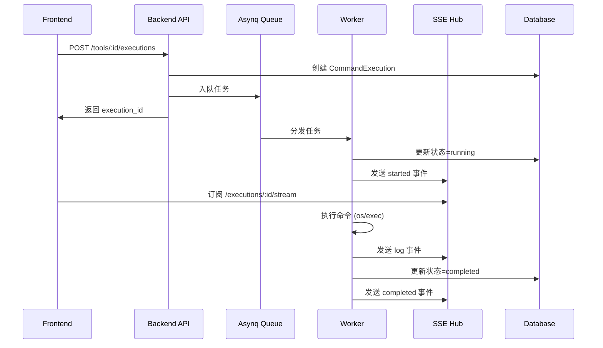

# 工具执行与实时通知系统设计

## 1. 系统概述

### 1.1 业务背景
安全扫描平台需要支持动态添加新工具，并能够：
- 后端安全可控地执行安全扫描工具命令
- 实时推送执行进展、日志到前端 notification
- 支持任务管理（启动、取消、状态查询）
- 保持与现有项目架构的一致性

### 1.2 设计目标
- **实时性**：命令执行进度实时推送到前端
- **可控性**：完全掌控执行流程，支持超时、取消
- **可扩展**：支持任意安全工具的集成
- **高可用**：任务队列、错误恢复、日志持久化
- **一致性**：遵循项目现有规范（端口8888、Swagger、zerolog等）

### 1.3 技术选型
采用**混合方案**：核心自研 + 开源增强
- **任务队列**：Asynq (Redis) - Go原生，轻量级
- **执行引擎**：自研 (os/exec + 增强)
- **实时通信**：自研 SSE Hub
- **数据存储**：GORM (现有技术栈)

## 2. 系统架构

### 2.1 整体架构图
```
┌─────────────────┐    ┌──────────────┐    ┌─────────────┐
│   Go Backend   │───▶│ Asynq Queue  │───▶│ Worker Pool │
│  (API Layer)   │    │   (Redis)    │    │ (执行器)    │
└─────────────────┘    └──────────────┘    └─────────────┘
         │                                        │
         ▼                                        ▼
┌─────────────────┐                    ┌─────────────────┐
│   SSE Hub      │◀───────────────────│  Tool Executor  │
│  (实时通知)     │                    │  (命令执行)     │
└─────────────────┘                    └─────────────────┘
         │                                        │
         ▼                                        ▼
┌─────────────────┐                    ┌─────────────────┐
│  React Frontend │                    │   Database      │
│ (React Query)   │                    │   (GORM)        │
└─────────────────┘                    └─────────────────┘
```

### 2.2 数据流程


## 3. 数据模型设计

### 3.1 Tool 模型
```go
type Tool struct {
    ID               uint      `json:"id" gorm:"primaryKey"`
    Name             string    `json:"name" gorm:"not null;uniqueIndex"`
    DisplayName      string    `json:"display_name"`
    Description      string    `json:"description"`
    CommandTemplate  string    `json:"command_template" gorm:"not null"`
    Workdir          string    `json:"workdir"`
    TimeoutSeconds   int       `json:"timeout_seconds" gorm:"default:300"`
    Env              string    `json:"env" gorm:"type:text"`
    Category         string    `json:"category"`
    Version          string    `json:"version"`
    IsActive         bool      `json:"is_active" gorm:"default:true"`
    CreatedAt        time.Time `json:"created_at"`
    UpdatedAt        time.Time `json:"updated_at"`
    
    // 关联关系
    CommandExecutions []CommandExecution `json:"command_executions"`
}
```

### 3.2 CommandExecution 模型
```go
type CommandExecution struct {
    ID            uint       `json:"id" gorm:"primaryKey"`
    ToolID        uint       `json:"tool_id" gorm:"not null;index"`
    Status        string     `json:"status" gorm:"not null;index;default:'queued'"`
    ExitCode      *int       `json:"exit_code"`
    Pid           *int       `json:"pid"`
    Args          string     `json:"args" gorm:"type:text"`
    LogFilePath   string     `json:"log_file_path"`
    ErrorMessage  *string    `json:"error_message" gorm:"type:text"`
    StartedAt     *time.Time `json:"started_at"`
    FinishedAt    *time.Time `json:"finished_at"`
    CreatedAt     time.Time  `json:"created_at"`
    UpdatedAt     time.Time  `json:"updated_at"`
    
    // 关联关系
    Tool Tool `json:"tool" gorm:"foreignKey:ToolID"`
}
```

### 3.3 状态定义
```go
const (
    StatusQueued    = "queued"     // 已入队
    StatusRunning   = "running"    // 执行中
    StatusCompleted = "completed"  // 成功完成
    StatusFailed    = "failed"     // 执行失败
    StatusCanceled  = "canceled"   // 用户取消
    StatusTimeout   = "timeout"    // 执行超时
)
```

## 4. API 接口设计

### 4.1 工具管理接口
```yaml
# 获取工具列表
GET /api/v1/tools
# 获取工具详情
GET /api/v1/tools/:id
# 创建工具
POST /api/v1/tools
# 更新工具
PUT /api/v1/tools/:id
# 删除工具
DELETE /api/v1/tools/:id
```

### 4.2 执行管理接口
```yaml
# 启动工具执行
POST /api/v1/tools/:id/executions
# 获取执行详情
GET /api/v1/executions/:id
# 取消执行
POST /api/v1/executions/:id/cancel
# 获取执行列表
GET /api/v1/executions
# 实时事件流
GET /api/v1/executions/:id/stream
```

### 4.3 请求响应示例

#### 启动执行
```bash
POST /api/v1/tools/1/executions
Content-Type: application/json

{
  "args": {
    "target": "https://example.com",
    "depth": 2,
    "threads": 10
  },
  "timeout_seconds": 600
}
```

响应：
```json
{
  "code": 200,
  "message": "执行任务已启动",
  "data": {
    "execution_id": 123,
    "status": "queued",
    "created_at": "2025-10-14T21:30:00+08:00"
  }
}
```

#### SSE 事件流
```bash
GET /api/v1/executions/123/stream
Accept: text/event-stream
```

事件示例：
```
event: started
data: {"execution_id":123,"pid":4567,"started_at":"2025-10-14T21:30:05+08:00"}

event: log
data: {"execution_id":123,"stream":"stdout","timestamp":"2025-10-14T21:30:10+08:00","line":"[nuclei] Starting scan..."}

event: completed
data: {"execution_id":123,"exit_code":0,"finished_at":"2025-10-14T21:35:00+08:00","duration_ms":295000}
```

## 5. 核心组件设计

### 5.1 ExecutionService
```go
type ExecutionService struct {
    db       *gorm.DB
    queue    *asynq.Client
    sseHub   *SSEHub
    logger   zerolog.Logger
}

func (s *ExecutionService) StartExecution(toolID uint, args map[string]interface{}) (*CommandExecution, error)
func (s *ExecutionService) CancelExecution(executionID uint) error
func (s *ExecutionService) GetExecution(executionID uint) (*CommandExecution, error)
```

### 5.2 SSE Hub
```go
type SSEHub struct {
    subscribers map[uint][]chan []byte  // executionID -> channels
    mu          sync.RWMutex
}

func (h *SSEHub) Subscribe(executionID uint) <-chan []byte
func (h *SSEHub) Unsubscribe(executionID uint, ch <-chan []byte)
func (h *SSEHub) Publish(executionID uint, event SSEEvent)
```

### 5.3 Worker 执行器
```go
func ExecuteToolTask(ctx context.Context, t *asynq.Task) error {
    // 1. 解析任务参数
    // 2. 查询工具配置
    // 3. 构建命令
    // 4. 执行命令并实时读取输出
    // 5. 更新数据库状态
    // 6. 发送 SSE 事件
}
```

### 5.4 取消与超时处理

- 进程组：执行时通过 `syscall.SysProcAttr{ Setpgid: true }` 将子进程放入独立进程组。
- 超时：触发 `context.WithTimeout` 后，向进程组发送 `SIGTERM`，等待短暂宽限（例如 5s），仍未退出则 `SIGKILL`。
- 取消：`POST /executions/:id/cancel` 标记状态为 `canceled` 并通过内部信号桥转发终止指令（同超时流程）。
- 状态机：`queued -> running -> completed|failed|timeout|canceled`，任何终止态均写入 `finished_at` 与 `exit_code`（如有）。

### 5.5 命令模板与安全

- 模板引擎：使用 `text/template` 渲染参数，开启 `Option("missingkey=error")`，避免缺失参数静默。
- 参数白名单：Tool 级定义允许的参数键与类型，拒绝未知键；在 handler 层完成参数校验与默认值。
- 参数拼接：避免字符串拼接成整行命令；渲染后转为“参数数组”。必要时使用 shlex 进行安全拆分。
- 工作目录与环境：执行前设置 `cmd.Dir = tool.Workdir`；将 `tool.Env(JSON)` 解码为键值对，合并到 `cmd.Env`。

## 6. 前端集成方案

### 6.1 类型定义 (@types)
```typescript
export interface Tool {
  id: number
  name: string
  display_name: string
  command_template: string
  timeout_seconds: number
  is_active: boolean
}

export interface CommandExecution {
  id: number
  tool_id: number
  status: ExecutionStatus
  exit_code?: number
  started_at?: string
  finished_at?: string
  error_message?: string
}

export interface SSEEvent {
  event: 'started' | 'log' | 'progress' | 'completed' | 'failed' | 'canceled'
  execution_id: number
  data: any
}
```

### 6.2 API 服务 (@services)
```typescript
export const toolExecutionService = {
  startExecution: (toolId: number, args: Record<string, any>) =>
    apiClient.post(`/tools/${toolId}/executions`, { args }),
  
  getExecution: (executionId: number) =>
    apiClient.get(`/executions/${executionId}`),
  
  cancelExecution: (executionId: number) =>
    apiClient.post(`/executions/${executionId}/cancel`),
  
  getExecutions: (params?: GetExecutionsParams) =>
    apiClient.get('/executions', { params })
}
```

### 6.3 实时通知 Hook
```typescript
export function useExecutionStream(executionId: number) {
  const [events, setEvents] = useState<SSEEvent[]>([])
  const [status, setStatus] = useState<ExecutionStatus>('queued')
  
  useEffect(() => {
    const eventSource = new EventSource(`/api/v1/executions/${executionId}/stream`)
    
    eventSource.addEventListener('started', (evt: MessageEvent) => {
      const data = JSON.parse(evt.data as string)
      setEvents(prev => [...prev, { event: 'started', ...data }])
      setStatus('running')
    })
    eventSource.addEventListener('log', (evt: MessageEvent) => {
      const data = JSON.parse(evt.data as string)
      setEvents(prev => [...prev, { event: 'log', ...data }])
    })
    eventSource.addEventListener('completed', (evt: MessageEvent) => {
      const data = JSON.parse(evt.data as string)
      setEvents(prev => [...prev, { event: 'completed', ...data }])
      setStatus('completed')
      toast.success('工具执行完成')
      eventSource.close()
    })
    eventSource.addEventListener('failed', (evt: MessageEvent) => {
      const data = JSON.parse(evt.data as string)
      setEvents(prev => [...prev, { event: 'failed', ...data }])
      setStatus('failed')
      toast.error('工具执行失败')
      eventSource.close()
    })
    eventSource.addEventListener('canceled', (evt: MessageEvent) => {
      const data = JSON.parse(evt.data as string)
      setEvents(prev => [...prev, { event: 'canceled', ...data }])
      setStatus('canceled')
      eventSource.close()
    })
    
    return () => eventSource.close()
  }, [executionId])
  
  return { events, status }
}
```

## 7. 部署与运维

### 7.1 依赖服务
```yaml
# docker-compose.yml 新增 Redis
services:
  redis:
    image: redis:7-alpine
    ports:
      - "6379:6379"
    volumes:
      - redis_data:/data
    command: redis-server --appendonly yes
```

### 7.2 配置文件
```yaml
# config.yaml 新增
execution:
  redis_url: "redis://localhost:6379"
  worker_concurrency: 10
  max_execution_time: 3600
  log_retention_days: 30
  
tools:
  workspace_dir: "/tmp/vulun-scan"
  max_log_size_mb: 100
```

### 7.3 监控面板
- Asynq Web UI: `http://localhost:8080`
- 执行统计: 成功率、平均耗时、队列长度
- 日志查看: 实时日志、历史日志检索

### 7.4 并发与队列策略

- **队列划分**：`critical/default/low` 三档，按工具重要程度分配权重，例如 `critical:6 default:3 low:1`。
- **并发控制**：`execution.worker_concurrency` 控制全局并发；可选增加 per-tool 并发上限（通过工具配置或业务层限流）。
- **重试策略**：`MaxRetry=3` + 指数退避；对幂等操作谨慎重试（避免重复扫描）。
- **幂等去重**：`idempotency_key` + `asynq.Unique(10m)` 降低重复提交风险。
- **资源保护**：结合工作目录与磁盘空间监控，限制单任务最大日志体积与执行超时。

### 7.5 SSE 重连与 Last-Event-ID

- **事件ID**：服务端在每条事件加 `id:`，客户端断线后 `Last-Event-ID` 参与续传。
- **重连间隔**：可选 `retry: 5000` 指示 5s 后重连。
- **保活**：服务端周期发送 `: keepalive`，Nginx/代理需开启长连接与合适的超时。
- **前端策略**：订阅端在 `completed/failed/canceled` 后主动关闭；异常断开时自动重连并从最后事件继续。

## 8. 测试验证

### 8.1 curl 测试脚本
```bash
#!/bin/bash
# test-execution.sh

# 1. 启动执行
EXECUTION_ID=$(curl -sS -X POST "http://localhost:8888/api/v1/tools/1/executions" \
  -H "Content-Type: application/json" \
  -d '{"args":{"target":"https://example.com"}}' | jq -r '.data.execution_id')

echo "Started execution: $EXECUTION_ID"

# 2. 监听进展
curl -N -H "Accept: text/event-stream" \
  "http://localhost:8888/api/v1/executions/$EXECUTION_ID/stream" &

# 3. 查询状态
sleep 5
curl -sS "http://localhost:8888/api/v1/executions/$EXECUTION_ID" | jq

# 4. 取消执行 (可选)
# curl -sS -X POST "http://localhost:8888/api/v1/executions/$EXECUTION_ID/cancel"
```

### 8.2 单元测试覆盖
- ExecutionService 核心逻辑
- SSE Hub 订阅/发布
- Worker 任务执行
- API Handler 参数验证

## 9. 实施计划

### Phase 1: 核心功能 (Week 1)
- [ ] 数据模型与迁移
- [ ] ExecutionService 基础实现
- [ ] Asynq 集成与 Worker
- [ ] SSE Hub 实现
- [ ] 基础 API endpoints

### Phase 2: 前端集成 (Week 2)
- [ ] TypeScript 类型定义
- [ ] API 服务层
- [ ] useExecutionStream Hook
- [ ] 工具管理界面
- [ ] 执行历史列表

### Phase 3: 完善优化 (Week 3)
- [ ] Asynq Web UI 集成
- [ ] 日志持久化与清理
- [ ] 错误处理与重试
- [ ] 性能监控与告警
- [ ] 文档与测试

## 10. 风险与应对

### 10.1 技术风险
- **进程泄漏**：使用 context 超时控制，进程组管理
- **资源占用**：限制并发数，磁盘空间监控
- **Redis 故障**：任务持久化，故障恢复机制

### 10.2 安全风险
- **命令注入**：参数白名单，模板引擎验证
- **权限提升**：容器隔离，用户权限限制
- **敏感信息泄露**：日志脱敏，环境变量管理

### 10.3 运维风险
- **日志爆炸**：日志轮转，大小限制
- **队列堆积**：监控告警，自动扩容
- **网络中断**：SSE 重连，状态同步

---

**文档版本**: v1.0  
**最后更新**: 2025-10-14  
**负责人**: 系统架构团队
