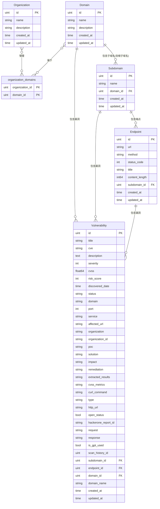

# my-vulun-scan 数据模型设计：当前实现版本

基于 GORM 的数据库模型设计文档，针对 my-vulun-scan 开源 Web 应用侦察工具的核心模型。

## 核心领域模型
### Organization 模型
**作用**: 组织管理，实现多个 Domain 的分组

| 字段名 | 类型 | 限制 | 默认值 | 说明 |
|--------|------|------|--------|------|
| ID | uint | 主键 | 自增 | 主键标识符 |
| CreatedAt | time.Time | 非空 | 当前时间 | 创建时间 |
| UpdatedAt | time.Time | 非空 | 当前时间 | 更新时间 |
| Name | string(255) | 唯一，非空 | - | 组织名称 |
| Description | varchar(1000) | 可为空 | NULL | 描述信息 |

**关系**:
- Many2Many: Domains (通过 organization_domains 关联表)

### organization_domains 关联表
**作用**: Organization 和 Domain 的多对多关联表

| 字段名 | 类型 | 限制 | 默认值 | 说明 |
|--------|------|------|--------|------|
| organization_id | uint | 主键，非空 | - | 组织ID，外键关联 organizations 表 |
| domain_id | uint | 主键，非空 | - | 域名ID，外键关联 domains 表 |

**约束**:
- **复合主键**: (organization_id, domain_id) - 确保每个组织-域名组合只能存在一条记录
- **外键约束**: organization_id → organizations.id (CASCADE DELETE)
- **外键约束**: domain_id → domains.id (CASCADE DELETE)
- **唯一性保证**: 通过复合主键自动防止同一组织重复关联同一域名

**关系**:
- BelongsTo: Organization
- BelongsTo: Domain

### Domain 模型
**作用**: 侦察目标的核心实体，专门表示域名

| 字段名 | 类型 | 限制 | 默认值 | 说明 |
|--------|------|------|--------|------|
| ID | uint | 主键，索引 | 自增 | 主键标识符 |
| CreatedAt | time.Time | 非空 | 当前时间 | 创建时间 |
| UpdatedAt | time.Time | 非空 | 当前时间 | 更新时间 |
| Name | string(255) | 唯一，非空，索引 | - | 规范化域名名称 |
| Description | varchar(1000) | 可为空 | NULL | 描述信息 |

**业务逻辑**:
- **自动创建根子域名**: 创建 Domain 时，系统自动创建一个同名的 Subdomain 作为根子域名，用于关联主域名的 Endpoint

**关系**:
- HasMany: Subdomains (包括自动创建的根子域名)
- HasMany: Vulnerabilities
- Many2Many: Organizations (通过 organization_domains 关联表)

### Subdomain 模型
**作用**: 子域名发现和特征信息存储（包括根子域名）

| 字段名 | 类型 | 限制 | 默认值 | 说明 |
|--------|------|------|--------|------|
| ID | uint | 主键，索引 | 自增 | 主键标识符 |
| CreatedAt | time.Time | 非空 | 当前时间 | 创建时间 |
| UpdatedAt | time.Time | 非空 | 当前时间 | 更新时间 |
| Name | string(255) | 非空，索引 | - | 子域名名称（根子域名与 Domain 同名） |
| DomainID | uint | 非空，外键，索引 | - | 所属域名ID |

**业务逻辑**:
- **根子域名**: 每个 Domain 创建时自动生成一个同名的 Subdomain，用于关联主域名的 Endpoint
- **外键字段**: `DomainID` - 通过此字段建立与 Domain 的关联
- **级联删除**: 删除域名时自动删除相关子域名（包括根子域名）

**关系**:
- BelongsTo: Domain (通过 DomainID 外键关联)
- HasMany: Endpoints
- HasMany: Vulnerabilities

### Endpoint 模型
**作用**: 存储发现的 API 端点和 URL 路径信息

| 字段名 | 类型 | 限制 | 默认值 | 说明 |
|--------|------|------|--------|------|
| ID | uint | 主键，索引 | 自增 | 主键标识符 |
| CreatedAt | time.Time | 非空 | 当前时间 | 创建时间 |
| UpdatedAt | time.Time | 非空 | 当前时间 | 更新时间 |
| URL | string(2048) | 非空，索引 | - | 完整的端点URL |
| Method | string(10) | 可为空 | NULL | HTTP方法(GET/POST/PUT/DELETE等) |
| StatusCode | int | 可为空 | NULL | HTTP响应状态码 |
| Title | string(255) | 可为空 | NULL | 页面标题 |
| ContentLength | int64 | 可为空 | NULL | 响应内容长度(字节) |
| SubdomainID | uint | 非空，外键，索引 | - | 所属子域名ID |

**业务逻辑约束**:
- **统一归属**: 所有 Endpoint 必须属于某个 Subdomain
- **主域名处理**: 主域名的 Endpoint 关联到自动创建的根子域名
- **级联删除**: 删除子域名时自动删除相关端点

**关系**:
- BelongsTo: Subdomain (通过 SubdomainID 外键关联)
- HasMany: Vulnerabilities

### Vulnerability 模型
**作用**: 漏洞信息和安全评估结果

**严重等级定义**:
- -1: unknown (未知)
- 0: info (信息级)
- 1: low (低危)
- 2: medium (中危)
- 3: high (高危)
- 4: critical (严重)

**优化说明**: 新增 DomainName 冗余字段减少联表；分区表建议（按 Severity）；加密 CurlCommand 如果敏感。

| 字段名 | 类型 | 限制 | 默认值 | 说明 |
|--------|------|------|--------|------|
| ID | uint | 主键，索引 | 自增 | 主键标识符 |
| CreatedAt | time.Time | 非空 | 当前时间 | 创建时间 |
| UpdatedAt | time.Time | 非空 | 当前时间 | 更新时间 |
| Title | string(500) | 非空 | - | 漏洞名称 |
| CVE | string(50) | 可为空，索引 | NULL | CVE 编号 |
| Description | text | 可为空 | NULL | 漏洞描述 |
| Severity | int | 非空，索引 | -1 | 严重等级 |
| CVSS | float64 | 可为空 | 0 | CVSS 分数 |
| RiskScore | int | 非空 | - | 风险评分 |
| DiscoveredDate | time.Time | 非空，索引 | - | 发现时间 |
| Status | string(50) | 非空，索引 | - | 漏洞状态 |
| Domain | string(255) | 非空 | - | 目标域名 |
| Port | int | 非空 | - | 端口号 |
| Service | string(100) | 可为空 | NULL | 服务名称 |
| AffectedURL | string(1000) | 可为空 | NULL | 受影响URL |
| Organization | string(255) | 可为空 | NULL | 组织名称 |
| OrganizationID | string | 非空 | - | 组织ID |
| POC | varchar(4096) | 可为空 | NULL | POC信息 |
| Solution | varchar(2000) | 可为空 | NULL | 解决方案 |
| Impact | varchar(1000) | 可为空 | NULL | 影响评估 |
| Remediation | varchar(1000) | 可为空 | NULL | 修复建议 |
| ExtractedResults | []string | 可为空 | [] | 提取结果 |
| CVSSMetrics | string(500) | 可为空 | NULL | CVSS 向量 |
| CurlCommand | string(4096) | 可为空 | NULL | 复现命令 |
| Type | string(100) | 可为空 | NULL | 漏洞类型 |
| HTTPURL | string(2048) | 可为空 | NULL | 漏洞 URL |
| OpenStatus | bool | 可为空 | true | 开放状态 |
| HackeroneReportID | string(50) | 可为空 | NULL | HackerOne 报告 ID |
| Request | varchar(8192) | 可为空 | NULL | 请求包 |
| Response | varchar(8192) | 可为空 | NULL | 响应包 |
| IsGPTUsed | bool | 可为空 | false | 是否使用 GPT |
| ScanHistoryID | uint | 非空 | - | 扫描历史 ID |
| SubdomainID | uint | 可为空，外键，复合索引 | NULL | 所属子域名 ID |
| EndPointID | uint | 可为空，外键，复合索引 | NULL | 所属端点 ID |
| DomainID | uint | 可为空，外键，复合索引 | NULL | 目标域名 ID |
| DomainName | string(255) | 可为空 | NULL | 冗余域名名称（优化查询） |

**业务逻辑约束**:
- **灵活归属**: DomainID、SubdomainID 和 EndPointID 至少有一个非空
- **级联删除**: 删除域名、子域名或端点时自动删除相关漏洞
- **严重等级**: Severity 字段必须在 -1 到 4 范围内
- **复合索引**: (DomainID, SubdomainID, EndPointID) 优化关联查询

**关系**:
- BelongsTo: Domain (通过 DomainID 外键关联，可选)
- BelongsTo: Subdomain (通过 SubdomainID 外键关联，可选)
- BelongsTo: Endpoint (通过 EndPointID 外键关联，可选)

## 设计原则

1. **以 Domain 为中心**: 所有侦察活动围绕 Domain 实体展开，Domain 专门用于表示域名，关联子域名和组织。
2. **规范化设计**: 避免数据冗余，保持关系完整性，使用 BelongsTo、HasMany 和 Many2Many 关系。
3. **查询优化**: 使用 GORM 的索引标签（如 `gorm:"index"`）和预加载（Preload）优化性能。
4. **级联删除**: 删除父级记录时自动删除关联的子级记录，保持数据一致性。
5. **性能提升**: 统一字段长度减少碎片。

## 实体关系图

