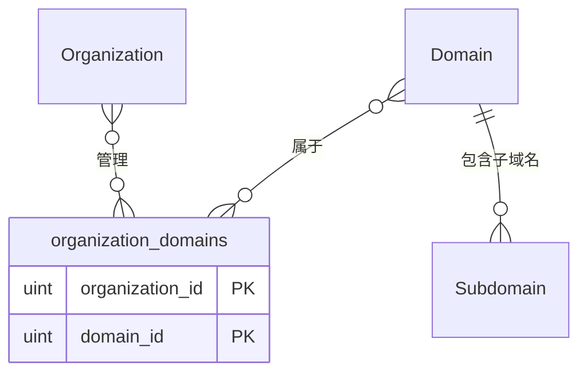

# my-vulun-scan 数据模型设计：当前实现版本

基于 GORM 的数据库模型设计文档，针对 my-vulun-scan 开源 Web 应用侦察工具的核心模型。

## 核心领域模型
### Organization 模型
**作用**: 组织管理，实现多个 Domain 的分组

| 字段名 | 类型 | 限制 | 默认值 | 说明 |
|--------|------|------|--------|------|
| ID | uint | 主键 | 自增 | 主键标识符 |
| CreatedAt | time.Time | 非空 | 当前时间 | 创建时间 |
| UpdatedAt | time.Time | 非空 | 当前时间 | 更新时间 |
| DeletedAt | gorm.DeletedAt | 可为空 | NULL | 软删除时间 |
| Name | string(255) | 唯一，非空 | - | 组织名称 |
| Description | varchar(1000) | 可为空 | NULL | 描述信息 |

**关系**:
- Many2Many: Domains (通过 organization_domains 关联表)

### organization_domains 关联表
**作用**: Organization 和 Domain 的多对多关联表

| 字段名 | 类型 | 限制 | 默认值 | 说明 |
|--------|------|------|--------|------|
| organization_id | uint | 主键，非空 | - | 组织ID，外键关联 organizations 表 |
| domain_id | uint | 主键，非空 | - | 域名ID，外键关联 domains 表 |

**约束**:
- **复合主键**: (organization_id, domain_id) - 确保每个组织-域名组合只能存在一条记录
- **外键约束**: organization_id → organizations.id (CASCADE DELETE)
- **外键约束**: domain_id → domains.id (CASCADE DELETE)
- **唯一性保证**: 通过复合主键自动防止同一组织重复关联同一域名

**关系**:
- BelongsTo: Organization
- BelongsTo: Domain

### Domain 模型
**作用**: 侦察目标的核心实体，专门表示域名ß

| 字段名 | 类型 | 限制 | 默认值 | 说明 |
|--------|------|------|--------|------|
| ID | uint | 主键 | 自增 | 主键标识符 |
| CreatedAt | time.Time | 非空 | 当前时间 | 创建时间 |
| UpdatedAt | time.Time | 非空 | 当前时间 | 更新时间 |
| DeletedAt | gorm.DeletedAt | 可为空 | NULL | 软删除时间 |
| Name | string(255) | 唯一，非空 | - | 规范化域名名称 |
| Description | varchar(1000) | 可为空 | NULL | 描述信息 |

**关系**:
- HasMany: Subdomains
- Many2Many: Organizations (通过 organization_domains 关联表)

### Subdomain 模型
**作用**: 子域名发现和特征信息存储

| 字段名 | 类型 | 限制 | 默认值 | 说明 |
|--------|------|------|--------|------|
| ID | uint | 主键 | 自增 | 主键标识符 |
| CreatedAt | time.Time | 非空 | 当前时间 | 创建时间 |
| UpdatedAt | time.Time | 非空 | 当前时间 | 更新时间 |
| DeletedAt | gorm.DeletedAt | 可为空 | NULL | 软删除时间 |
| Name | string(255) | 非空 | - | 子域名名称 |
| DomainID | uint | 非空，外键 | - | 所属域名ID |

**一对多关系实现**:
- **外键字段**: `DomainID` - 通过此字段建立与 Domain 的关联
- **级联删除**: 删除域名时自动删除相关子域名

**关系**:
- BelongsTo: Domain (通过 DomainID 外键关联)

## 设计原则

1. **以 Domain 为中心**: 所有侦察活动围绕 Domain 实体展开，Domain 专门用于表示域名，关联子域名和组织。
2. **规范化设计**: 避免数据冗余，保持关系完整性，使用 BelongsTo、HasMany 和 Many2Many 关系。
3. **查询优化**: 使用 GORM 的索引标签（如 `gorm:"index"`）和预加载（Preload）优化性能。
4. **扩展性**: 支持 JSONB 和数组类型，钩子函数处理业务逻辑。
5. **性能提升**: 统一字段长度减少碎片。

## 实体关系图

