### 关键优化点
- **当前模型整体评估**：原设计已较为成熟，以Domain为核心，项目隔离良好，支持GORM特性如软删除和JSONB。关系设计规范，查询优化有基础。但存在潜在问题：部分字段长度不一致（如string(500) vs string(1000)），索引覆盖不全（缺少漏洞标签等高频查询索引），约束不足（缺乏外键级联删除），扩展性可提升（更多使用JSONB减少表数）。无需重大重构，但可优化为更高效、一致、安全的版本。
- **优化方向**：统一字段命名与长度；增强索引与约束；合并冗余模型（如将Registrar与DomainRegistration简化）；添加加密（如密码字段）；提升性能（如批量预加载建议）；保持中文文档完整性。
- **不确定性与争议**：模型优化因具体应用场景而异（如高并发时需更多分区），研究建议优先测试性能瓶颈。证据显示，类似工具（如Nuclei或OWASP ZAP）强调可扩展性和安全性，本优化基于这些最佳实践。
- **实施建议**：使用Atlas迁移工具逐步应用，避免数据丢失。

#### 优化亮点
- **一致性提升**：统一string字段长度为合理值（如Name统一为string(255)），减少内存浪费。
- **性能增强**：添加复合索引，覆盖常见查询场景；引入分区表建议。
- **安全性改进**：密码字段加密；添加审计日志模型。
- **扩展性**：更多使用JSONB存储动态数据，减少关系表。
- **其他**：新增模型如AuditLog用于跟踪变更；优化ER图以反映变化。

---

### my-vulun-scan 数据模型优化设计：基于 GORM 的数据库模型

#### 概述

本优化设计文档针对 my-vulun-scan 开源 Web 应用侦察工具的数据库模型进行了细化，从原设计基础上提升一致性、性能和安全性。原模型基于 GORM 迁移自 Django ORM，现优化统一字段长度、增强索引与约束、简化部分关系（如合并注册信息），并新增审计日志支持。设计仍以 **Domain** 为核心，强调项目隔离、规范化与扩展性，适配 GORM 特性（如自动时间戳、软删除、JSONB 和数组类型）。本文档以表格形式详细描述所有数据模型的字段定义、关系和约束，适用于 PostgreSQL 14+ 数据库。

#### 技术栈与依赖

- **ORM 框架**: GORM (Go ORM Framework)
- **数据库**: PostgreSQL 14+
- **字段类型**: GORM 原生字段类型 + PostgreSQL 扩展类型（如 JSONB、数组）
- **特殊字段**: JSONB 存储复杂数据，[]string 替代 ArrayField，HasMany 和 Many2Many 关系；新增加密支持（如 bcrypt 对于密码字段）
- **新增依赖**: Atlas 迁移工具（用于版本化迁移），加密库（如 golang.org/x/crypto/bcrypt）

#### 核心架构设计

##### 设计原则

1. **以 Domain 为中心**: 所有侦察活动围绕 Domain 实体展开，关联扫描、子域名、漏洞等。
2. **规范化设计**: 避免数据冗余，保持关系完整性，使用 BelongsTo 和 HasMany 关系；优化合并冗余模型。
3. **查询优化**: 使用 GORM 的索引标签（如 `gorm:"index"`）和预加载（Preload）优化性能；新增复合索引。
4. **扩展性**: 支持 JSONB 和数组类型，钩子函数处理业务逻辑；新增加密钩子。
5. **安全性提升**: 密码字段加密；新增审计日志模型跟踪变更。
6. **性能提升**: 引入分区表建议（针对大表如 Vulnerability）；统一字段长度减少碎片。

#### 数据模型详细设计

##### 核心领域模型

###### Domain 模型
**作用**: 侦察目标的核心实体，可表示域名或 IP 地址

> **优化说明**:
> - 统一 Name 字段长度。

| 字段名 | 类型 | 限制 | 默认值 | 说明 |
|--------|------|------|--------|------|
| ID | uint | 主键 | 自增 | 主键标识符 |
| CreatedAt | time.Time | 非空 | 当前时间 | 创建时间 |
| UpdatedAt | time.Time | 非空 | 当前时间 | 更新时间 |
| DeletedAt | gorm.DeletedAt | 可为空 | NULL | 软删除时间 |
| Name | string(255) | 唯一，非空 | - | 规范化目标名称：域名或单个 IP |
| InputType | string(100) | 非空 | domain | 输入类型：domain/ip/cidr |
| H1TeamHandle | string(100) | 可为空 | NULL | HackerOne 团队标识 |
| Description | varchar(1000) | 可为空 | NULL | 描述信息 |
| CidrRange | string(100) | 可为空 | NULL | 输入的 CIDR 的值 |
| DomainInfoID | uint | 可为空 | NULL | 域名详细信息 ID（一对一） |

**关系**:
- BelongsTo: DomainInfo
- HasMany: ScanHistories, Subdomains, EndPoints, Vulnerabilities, MetaFinderDocuments

###### Organization 模型
**作用**: 组织管理，实现多个 Domain 的分组

| 字段名 | 类型 | 限制 | 默认值 | 说明 |
|--------|------|------|--------|------|
| ID | uint | 主键 | 自增 | 主键标识符 |
| CreatedAt | time.Time | 非空 | 当前时间 | 创建时间 |
| UpdatedAt | time.Time | 非空 | 当前时间 | 更新时间 |
| DeletedAt | gorm.DeletedAt | 可为空 | NULL | 软删除时间 |
| Name | string(255) | 唯一，非空 | - | 组织名称 |
| Description | varchar(1000) | 可为空 | NULL | 描述信息 |

**关系**:
- Many2Many: Domains

##### 域名信息聚合模型

###### DomainInfo 模型
**作用**: WHOIS 和 DNS 信息的聚合容器

> **优化说明**: 合并 Registrar、Registrant 等为 JSONB 字段，减少表数；新增分区建议（按 CreatedAt）。

| 字段名 | 类型 | 限制 | 默认值 | 说明 |
|--------|------|------|--------|------|
| ID | uint | 主键 | 自增 | 主键标识符 |
| CreatedAt | time.Time | 非空 | 当前时间 | 创建时间 |
| UpdatedAt | time.Time | 非空 | 当前时间 | 更新时间 |
| DeletedAt | gorm.DeletedAt | 可为空 | NULL | 软删除时间 |
| DNSSEC | bool | - | false | DNSSEC 支持状态 |
| Created | time.Time | 可为空 | NULL | 域名创建时间 |
| Updated | time.Time | 可为空 | NULL | 域名更新时间 |
| Expires | time.Time | 可为空 | NULL | 域名过期时间 |
| GeolocationISO | string(10) | 可为空 | NULL | 地理位置 ISO 代码 |
| WhoisServer | string(150) | 可为空 | NULL | WHOIS 服务器 |
| RegistrationInfo | jsonb | 可为空 | NULL | 注册信息（合并 Registrar、Registrant 等） |

**关系**:
- Many2Many: Statuses, NameServers, DNSRecords, RelatedDomains, RelatedTLDs, SimilarDomains, HistoricalIPs

###### DomainRegistration 模型（已合并至 DomainInfo 的 JSONB，保留作为历史参考）

（优化中移除独立模型，使用 JSONB 存储以简化。）

##### 扫描执行模型

###### ScanHistory 模型
**作用**: 扫描任务的执行记录和状态管理

**扫描状态说明**:
- **-1**: INITIATED (初始化)
- **0**: FAILED (失败)
- **1**: RUNNING (运行中)
- **2**: SUCCESS (成功)
- **3**: ABORTED (终止)

> **优化说明**: 统一数组字段默认；新增索引：DomainID + ScanStatus。

| 字段名 | 类型 | 限制 | 默认值 | 说明 |
|--------|------|------|--------|------|
| ID | uint | 主键 | 自增 | 主键标识符 |
| CreatedAt | time.Time | 非空 | 当前时间 | 创建时间 |
| UpdatedAt | time.Time | 非空 | 当前时间 | 更新时间 |
| DeletedAt | gorm.DeletedAt | 可为空 | NULL | 软删除时间 |
| DomainID | uint | 非空 | - | 目标域名 ID |
| ScanTypeID | uint | 非空 | - | 扫描引擎类型 ID |
| InitiatedByID | uint | 可为空 | NULL | 发起人 ID |
| AbortedByID | uint | 可为空 | NULL | 终止人 ID |
| StartScanDate | time.Time | 非空 | - | 扫描开始时间 |
| ScanStatus | int | 选项 | -1 | 扫描状态 |
| ResultsDir | string(255) | - | - | 结果目录 |
| StopScanDate | time.Time | 可为空 | NULL | 扫描结束时间 |
| UsedGFPatterns | string(500) | 可为空 | NULL | 使用的 GF 模式 |
| ErrorMessage | string(300) | 可为空 | NULL | 错误信息 |
| CeleryIDs | []string | 数组 | [] | Celery 任务 ID 列表 |
| Tasks | []string | 数组 | [] | 任务列表 |
| CfgOutOfScopeSubdomains | []string | 数组 | [] | 排除的子域名列表 |
| CfgStartingPointPath | string(255) | 可为空 | NULL | 扫描起始路径 |
| CfgExcludedPaths | []string | 数组 | [] | 排除的路径列表 |
| CfgImportedSubdomains | []string | 数组 | [] | 导入的子域名列表 |

**关系**:
- BelongsTo: Domain, ScanType (EngineType), InitiatedBy, AbortedBy (User)
- HasMany: Subdomains, EndPoints, Vulnerabilities, ScanActivities, Commands, SubScans, MetaFinderDocuments, TodoNotes
- Many2Many: Emails, Employees, Buckets, Dorks

##### 侦察结果模型

###### Subdomain 模型
**作用**: 子域名发现和特征信息存储

> **优化说明**: 统一 string 长度；新增索引：Name + DomainID。

| 字段名 | 类型 | 限制 | 默认值 | 说明 |
|--------|------|------|--------|------|
| ID | uint | 主键 | 自增 | 主键标识符 |
| CreatedAt | time.Time | 非空 | 当前时间 | 创建时间 |
| UpdatedAt | time.Time | 非空 | 当前时间 | 更新时间 |
| DeletedAt | gorm.DeletedAt | 可为空 | NULL | 软删除时间 |
| Name | string(255) | 非空 | - | 子域名名称 |
| HTTPURL | string(2048) | 可为空 | NULL | HTTP URL |
| DiscoveredDate | time.Time | 可为空 | NULL | 发现时间 |
| IsImportedSubdomain | bool | - | false | 是否为导入的子域名 |
| IsImportant | bool | 可为空 | false | 是否为重要子域名 |
| IsCDN | bool | 可为空 | false | 是否为 CDN |
| HTTPStatus | int | - | 0 | HTTP 状态码 |
| ContentType | string(100) | 可为空 | NULL | 内容类型 |
| ResponseTime | float64 | 可为空 | 0 | 响应时间 |
| ContentLength | int | 可为空 | 0 | 内容长度 |
| PageTitle | string(255) | 可为空 | NULL | 页面标题 |
| Webserver | string(255) | 可为空 | NULL | Web 服务器信息 |
| CNAME | string(500) | 可为空 | NULL | CNAME 记录 |
| CDNName | string(200) | 可为空 | NULL | CDN 名称 |
| ScreenshotPath | string(255) | 可为空 | NULL | 截图路径 |
| HTTPHeaderPath | string(255) | 可为空 | NULL | HTTP 响应头路径 |
| AttackSurface | varchar(8192) | 可为空 | NULL | 攻击面信息 |
| ScanHistoryID | uint | 可为空 | NULL | 扫描历史 ID |
| DomainID | uint | 可为空 | NULL | 目标域名 ID |

**关系**:
- BelongsTo: ScanHistory, Domain
- HasMany: EndPoints, Vulnerabilities, SubScans, MetaFinderDocuments, TodoNotes
- Many2Many: Technologies, IPAddresses, Directories, WAFs

###### EndPoint 模型
**作用**: URL 端点和 HTTP 响应信息

> **优化说明**: 统一长字段；新增检查约束：HTTPStatus 0-599。

| 字段名 | 类型 | 限制 | 默认值 | 说明 |
|--------|------|------|--------|------|
| ID | uint | 主键 | 自增 | 主键标识符 |
| CreatedAt | time.Time | 非空 | 当前时间 | 创建时间 |
| UpdatedAt | time.Time | 非空 | 当前时间 | 更新时间 |
| DeletedAt | gorm.DeletedAt | 可为空 | NULL | 软删除时间 |
| HTTPURL | string(2048) | 非空 | - | HTTP URL |
| ContentLength | int | 可为空 | 0 | 内容长度 |
| PageTitle | string(255) | 可为空 | NULL | 页面标题 |
| HTTPStatus | int | 可为空 | 0 | HTTP 状态码 |
| ContentType | string(100) | 可为空 | NULL | 内容类型 |
| DiscoveredDate | time.Time | 可为空 | NULL | 发现时间 |
| ResponseTime | float64 | 可为空 | 0 | 响应时间 |
| Webserver | string(255) | 可为空 | NULL | Web 服务器信息 |
| IsDefault | bool | 可为空 | false | 是否为默认端点 |
| MatchedGFPatterns | string(1024) | 可为空 | NULL | 匹配的 GF 模式 |
| Source | string(200) | 可为空 | NULL | 发现源 |
| ScanHistoryID | uint | 可为空 | NULL | 扫描历史 ID |
| DomainID | uint | 可为空 | NULL | 目标域名 ID |
| SubdomainID | uint | 可为空 | NULL | 所属子域名 ID |

**关系**:
- BelongsTo: ScanHistory, Domain, Subdomain
- HasMany: Vulnerabilities
- Many2Many: Techs, SubScans

###### Vulnerability 模型
**作用**: 漏洞信息和安全评估结果

**严重等级定义**:
- **-1**: unknown (未知)
- **0**: info (信息级)
- **1**: low (低危)
- **2**: medium (中危)
- **3**: high (高危)
- **4**: critical (严重)

> **优化说明**: 新增 DomainName 冗余字段减少联表；分区表建议（按 Severity）；加密 CurlCommand 如果敏感。

| 字段名 | 类型 | 限制 | 默认值 | 说明 |
|--------|------|------|--------|------|
| ID | uint | 主键 | 自增 | 主键标识符 |
| CreatedAt | time.Time | 非空 | 当前时间 | 创建时间 |
| UpdatedAt | time.Time | 非空 | 当前时间 | 更新时间 |
| Title | string(500) | 非空 | - | 漏洞名称 |
| CVE | string(50) | 可为空 | NULL | CVE 编号 |
| Description | text | 可为空 | NULL | 漏洞描述 |
| Severity | int | 非空 | -1 | 严重等级 |
| CVSS | float64 | 可为空 | 0 | CVSS 分数 |
| RiskScore | int | 非空 | - | 风险评分 |
| DiscoveredDate | time.Time | 非空 | - | 发现时间 |
| Status | string(50) | 非空 | - | 漏洞状态 |
| Domain | string(255) | 非空 | - | 目标域名 |
| Port | int | 非空 | - | 端口号 |
| Service | string(100) | 可为空 | NULL | 服务名称 |
| AffectedURL | string(1000) | 可为空 | NULL | 受影响URL |
| Organization | string(255) | 可为空 | NULL | 组织名称 |
| OrganizationID | string | 非空 | - | 组织ID |
| POC | varchar(4096) | 可为空 | NULL | POC信息 |
| Solution | varchar(2000) | 可为空 | NULL | 解决方案 |
| Impact | varchar(1000) | 可为空 | NULL | 影响评估 |
| Remediation | varchar(1000) | 可为空 | NULL | 修复建议 |
| ExtractedResults | []string | 可为空 | [] | 提取结果 |
| CVSSMetrics | string(500) | 可为空 | NULL | CVSS 向量 |
| CurlCommand | string(4096) | 可为空 | NULL | 复现命令 |
| Type | string(100) | 可为空 | NULL | 漏洞类型 |
| HTTPURL | string(2048) | 可为空 | NULL | 漏洞 URL |
| OpenStatus | bool | 可为空 | true | 开放状态 |
| HackeroneReportID | string(50) | 可为空 | NULL | HackerOne 报告 ID |
| Request | varchar(8192) | 可为空 | NULL | 请求包 |
| Response | varchar(8192) | 可为空 | NULL | 响应包 |
| IsGPTUsed | bool | 可为空 | false | 是否使用 GPT |
| ScanHistoryID | uint | 非空 | - | 扫描历史 ID |
| SubdomainID | uint | 可为空 | NULL | 所属子域名 ID |
| EndPointID | uint | 可为空 | NULL | 所属端点 ID |
| DomainID | uint | 可为空 | NULL | 目标域名 ID |
| DomainName | string(255) | 可为空 | NULL | 冗余域名名称（优化查询） |

**关系**:
- BelongsTo: ScanHistory, Subdomain, EndPoint, Domain
- Many2Many: Tags, References, CVEIDs, CWEIDs, SubScans

##### 漏洞辅助模型

###### VulnerabilityTags 模型
**作用**: 漏洞标签分类

| 字段名 | 类型 | 限制 | 默认值 | 说明 |
|--------|------|------|--------|------|
| ID | uint | 主键 | 自增 | 主键标识符 |
| CreatedAt | time.Time | 非空 | 当前时间 | 创建时间 |
| UpdatedAt | time.Time | 非空 | 当前时间 | 更新时间 |
| DeletedAt | gorm.DeletedAt | 可为空 | NULL | 软删除时间 |
| Name | string(100) | 非空，唯一 | - | 标签名称 |

###### VulnerabilityReference 模型
**作用**: 漏洞参考链接

| 字段名 | 类型 | 限制 | 默认值 | 说明 |
|--------|------|------|--------|------|
| ID | uint | 主键 | 自增 | 主键标识符 |
| CreatedAt | time.Time | 非空 | 当前时间 | 创建时间 |
| UpdatedAt | time.Time | 非空 | 当前时间 | 更新时间 |
| DeletedAt | gorm.DeletedAt | 可为空 | NULL | 软删除时间 |
| URL | string(2048) | 非空 | - | 参考链接 URL |

###### CveId 模型
**作用**: CVE 编号管理

| 字段名 | 类型 | 限制 | 默认值 | 说明 |
|--------|------|------|--------|------|
| ID | uint | 主键 | 自增 | 主键标识符 |
| CreatedAt | time.Time | 非空 | 当前时间 | 创建时间 |
| UpdatedAt | time.Time | 非空 | 当前时间 | 更新时间 |
| DeletedAt | gorm.DeletedAt | 可为空 | NULL | 软删除时间 |
| Name | string(100) | 非空，唯一 | - | CVE 编号 |

###### CweId 模型
**作用**: CWE 分类管理

| 字段名 | 类型 | 限制 | 默认值 | 说明 |
|--------|------|------|--------|------|
| ID | uint | 主键 | 自增 | 主键标识符 |
| CreatedAt | time.Time | 非空 | 当前时间 | 创建时间 |
| UpdatedAt | time.Time | 非空 | 当前时间 | 更新时间 |
| DeletedAt | gorm.DeletedAt | 可为空 | NULL | 软删除时间 |
| Name | string(100) | 非空，唯一 | - | CWE 编号 |

###### GPTVulnerabilityReport 模型
**作用**: GPT 生成的漏洞报告

| 字段名 | 类型 | 限制 | 默认值 | 说明 |
|--------|------|------|--------|------|
| ID | uint | 主键 | 自增 | 主键标识符 |
| CreatedAt | time.Time | 非空 | 当前时间 | 创建时间 |
| UpdatedAt | time.Time | 非空 | 当前时间 | 更新时间 |
| DeletedAt | gorm.DeletedAt | 可为空 | NULL | 软删除时间 |
| URLPath | string(2048) | 非空 | - | URL 路径 |
| Title | string(255) | 非空 | - | 报告标题 |
| Description | varchar(1000) | 可为空 | NULL | 漏洞描述 |
| Impact | varchar(1000) | 可为空 | NULL | 影响评估 |
| Remediation | varchar(1000) | 可为空 | NULL | 修复建议 |

**关系**:
- Many2Many: References (VulnerabilityReference)

##### 网络资产模型

###### IPAddress 模型
**作用**: IP 地址信息管理

| 字段名 | 类型 | 限制 | 默认值 | 说明 |
|--------|------|------|--------|------|
| ID | uint | 主键 | 自增 | 主键标识符 |
| CreatedAt | time.Time | 非空 | 当前时间 | 创建时间 |
| UpdatedAt | time.Time | 非空 | 当前时间 | 更新时间 |
| DeletedAt | gorm.DeletedAt | 可为空 | NULL | 软删除时间 |
| Address | string(100) | 可为空 | NULL | IP 地址 |
| IsCDN | bool | - | false | 是否为 CDN |
| GeoISOID | uint | 可为空 | NULL | 地理位置 ID |
| Version | int | 可为空 | 0 | IP 版本 |
| IsPrivate | bool | - | false | 是否为私有 IP |
| ReversePointer | string(100) | 可为空 | NULL | 反向指针 |

**关系**:
- BelongsTo: GeoISO (CountryISO)
- Many2Many: Ports, SubScans

###### Port 模型
**作用**: 端口信息管理

| 字段名 | 类型 | 限制 | 默认值 | 说明 |
|--------|------|------|--------|------|
| ID | uint | 主键 | 自增 | 主键标识符 |
| CreatedAt | time.Time | 非空 | 当前时间 | 创建时间 |
| UpdatedAt | time.Time | 非空 | 当前时间 | 更新时间 |
| DeletedAt | gorm.DeletedAt | 可为空 | NULL | 软删除时间 |
| Number | int | - | 0 | 端口号 |
| ServiceName | string(100) | 可为空 | NULL | 服务名称 |
| Description | string(255) | 可为空 | NULL | 服务描述 |
| IsUncommon | bool | - | false | 是否为非常见端口 |

###### CountryISO 模型
**作用**: 国家地理位置信息

| 字段名 | 类型 | 限制 | 默认值 | 说明 |
|--------|------|------|--------|------|
| ID | uint | 主键 | 自增 | 主键标识符 |
| CreatedAt | time.Time | 非空 | 当前时间 | 创建时间 |
| UpdatedAt | time.Time | 非空 | 当前时间 | 更新时间 |
| DeletedAt | gorm.DeletedAt | 可为空 | NULL | 软删除时间 |
| ISO | string(10) | 非空，唯一 | - | ISO 国家代码 |
| Name | string(100) | 非空 | - | 国家名称 |

##### 技术和安全模型

###### Technology 模型
**作用**: 技术栈识别管理

| 字段名 | 类型 | 限制 | 默认值 | 说明 |
|--------|------|------|--------|------|
| ID | uint | 主键 | 自增 | 主键标识符 |
| CreatedAt | time.Time | 非空 | 当前时间 | 创建时间 |
| UpdatedAt | time.Time | 非空 | 当前时间 | 更新时间 |
| DeletedAt | gorm.DeletedAt | 可为空 | NULL | 软删除时间 |
| Name | string(255) | 非空，唯一 | - | 技术名称 |

###### Waf 模型
**作用**: Web 应用防火墙检测

| 字段名 | 类型 | 限制 | 默认值 | 说明 |
|--------|------|------|--------|------|
| ID | uint | 主键 | 自增 | 主键标识符 |
| CreatedAt | time.Time | 非空 | 当前时间 | 创建时间 |
| UpdatedAt | time.Time | 非空 | 当前时间 | 更新时间 |
| DeletedAt | gorm.DeletedAt | 可为空 | NULL | 软删除时间 |
| Name | string(255) | 非空 | - | WAF 名称 |
| Manufacturer | string(255) | 可为空 | NULL | 厂商信息 |

##### 目录扫描模型

###### DirectoryScan 模型
**作用**: 目录扫描结果管理

| 字段名 | 类型 | 限制 | 默认值 | 说明 |
|--------|------|------|--------|------|
| ID | uint | 主键 | 自增 | 主键标识符 |
| CreatedAt | time.Time | 非空 | 当前时间 | 创建时间 |
| UpdatedAt | time.Time | 非空 | 当前时间 | 更新时间 |
| DeletedAt | gorm.DeletedAt | 可为空 | NULL | 软删除时间 |
| CommandLine | string(2048) | 可为空 | NULL | 扫描命令 |
| ScannedDate | time.Time | 可为空 | NULL | 扫描时间 |

**关系**:
- Many2Many: DirectoryFiles, DirSubscans

###### DirectoryFile 模型
**作用**: 目录扫描发现的文件

| 字段名 | 类型 | 限制 | 默认值 | 说明 |
|--------|------|------|--------|------|
| ID | uint | 主键 | 自增 | 主键标识符 |
| CreatedAt | time.Time | 非空 | 当前时间 | 创建时间 |
| UpdatedAt | time.Time | 非空 | 当前时间 | 更新时间 |
| DeletedAt | gorm.DeletedAt | 可为空 | NULL | 软删除时间 |
| Length | int | - | 0 | 内容长度 |
| Lines | int | - | 0 | 行数 |
| HTTPStatus | int | - | 0 | HTTP 状态码 |
| Words | int | - | 0 | 单词数 |
| Name | string(255) | 可为空 | NULL | 文件名 |
| URL | string(2048) | 可为空 | NULL | 文件 URL |
| ContentType | string(100) | 可为空 | NULL | 内容类型 |

##### OSINT 模型

###### Email 模型
**作用**: 邮箱信息管理

> **优化说明**: Password 使用加密存储（GORM 钩子）。

| 字段名 | 类型 | 限制 | 默认值 | 说明 |
|--------|------|------|--------|------|
| ID | uint | 主键 | 自增 | 主键标识符 |
| CreatedAt | time.Time | 非空 | 当前时间 | 创建时间 |
| UpdatedAt | time.Time | 非空 | 当前时间 | 更新时间 |
| DeletedAt | gorm.DeletedAt | 可为空 | NULL | 软删除时间 |
| Address | string(200) | 可为空 | NULL | 邮箱地址 |
| Password | string(255) | 可为空 | NULL | 密码（加密） |

###### Employee 模型
**作用**: 员工信息管理

| 字段名 | 类型 | 限制 | 默认值 | 说明 |
|--------|------|------|--------|------|
| ID | uint | 主键 | 自增 | 主键标识符 |
| CreatedAt | time.Time | 非空 | 当前时间 | 创建时间 |
| UpdatedAt | time.Time | 非空 | 当前时间 | 更新时间 |
| DeletedAt | gorm.DeletedAt | 可为空 | NULL | 软删除时间 |
| Name | string(255) | 可为空 | NULL | 员工姓名 |
| Designation | string(255) | 可为空 | NULL | 职位 |

###### Dork 模型
**作用**: Google Dork 搜索结果

| 字段名 | 类型 | 限制 | 默认值 | 说明 |
|--------|------|------|--------|------|
| ID | uint | 主键 | 自增 | 主键标识符 |
| CreatedAt | time.Time | 非空 | 当前时间 | 创建时间 |
| UpdatedAt | time.Time | 非空 | 当前时间 | 更新时间 |
| DeletedAt | gorm.DeletedAt | 可为空 | NULL | 软删除时间 |
| Type | string(255) | 可为空 | NULL | Dork 类型 |
| URL | string(2048) | 可为空 | NULL | 搜索结果 URL |

###### S3Bucket 模型
**作用**: AWS S3 桶信息管理

| 字段名 | 类型 | 限制 | 默认值 | 说明 |
|--------|------|------|--------|------|
| ID | uint | 主键 | 自增 | 主键标识符 |
| CreatedAt | time.Time | 非空 | 当前时间 | 创建时间 |
| UpdatedAt | time.Time | 非空 | 当前时间 | 更新时间 |
| DeletedAt | gorm.DeletedAt | 可为空 | NULL | 软删除时间 |
| Name | string(255) | 可为空 | NULL | 桶名称 |
| Region | string(255) | 可为空 | NULL | 所在区域 |
| Provider | string(100) | 可为空 | NULL | 服务提供商 |
| OwnerID | string(255) | 可为空 | NULL | 所有者 ID |
| OwnerDisplayName | string(255) | 可为空 | NULL | 所有者显示名 |
| PermAuthUsersRead | int | - | 0 | 认证用户读权限 |
| PermAuthUsersWrite | int | - | 0 | 认证用户写权限 |
| PermAuthUsersReadACL | int | - | 0 | 认证用户 ACL 读权限 |
| PermAuthUsersWriteACL | int | - | 0 | 认证用户 ACL 写权限 |
| PermAuthUsersFullControl | int | - | 0 | 认证用户完全控制 |
| PermAllUsersRead | int | - | 0 | 所有用户读权限 |
| PermAllUsersWrite | int | - | 0 | 所有用户写权限 |
| PermAllUsersReadACL | int | - | 0 | 所有用户 ACL 读权限 |
| PermAllUsersWriteACL | int | - | 0 | 所有用户 ACL 写权限 |
| PermAllUsersFullControl | int | - | 0 | 所有用户完全控制 |
| NumObjects | int | - | 0 | 对象数量 |
| Size | int64 | - | 0 | 桶大小（优化为 int64） |

###### MetaFinderDocument 模型
**作用**: 元数据文档信息

| 字段名 | 类型 | 限制 | 默认值 | 说明 |
|--------|------|------|--------|------|
| ID | uint | 主键 | 自增 | 主键标识符 |
| CreatedAt | time.Time | 非空 | 当前时间 | 创建时间 |
| UpdatedAt | time.Time | 非空 | 当前时间 | 更新时间 |
| DeletedAt | gorm.DeletedAt | 可为空 | NULL | 软删除时间 |
| ScanHistoryID | uint | 可为空 | NULL | 扫描历史 ID |
| DomainID | uint | 可为空 | NULL | 目标域名 ID |
| SubdomainID | uint | 可为空 | NULL | 子域名 ID |
| DocName | string(255) | 可为空 | NULL | 文档名称 |
| URL | string(2048) | 可为空 | NULL | 文档 URL |
| Title | string(255) | 可为空 | NULL | 文档标题 |
| Author | string(255) | 可为空 | NULL | 作者 |
| Producer | string(255) | 可为空 | NULL | 生产者 |
| Creator | string(255) | 可为空 | NULL | 创建者 |
| OS | string(255) | 可为空 | NULL | 操作系统 |
| HTTPStatus | int | 可为空 | 0 | HTTP 状态码 |
| CreationDate | string(100) | 可为空 | NULL | 创建日期 |
| ModifiedDate | string(100) | 可为空 | NULL | 修改日期 |

**关系**:
- BelongsTo: ScanHistory, Domain, Subdomain

##### 扫描活动管理模型

###### ScanActivity 模型
**作用**: 扫描活动详细记录

| 字段名 | 类型 | 限制 | 默认值 | 说明 |
|--------|------|------|--------|------|
| ID | uint | 主键 | 自增 | 主键标识符 |
| CreatedAt | time.Time | 非空 | 当前时间 | 创建时间 |
| UpdatedAt | time.Time | 非空 | 当前时间 | 更新时间 |
| DeletedAt | gorm.DeletedAt | 可为空 | NULL | 软删除时间 |
| ScanOfID | uint | 可为空 | NULL | 所属扫描 ID |
| Title | string(255) | 非空 | - | 活动标题 |
| Name | string(255) | 非空 | - | 活动名称 |
| Time | time.Time | 非空 | - | 执行时间 |
| Status | int | 非空 | - | 执行状态 |
| ErrorMessage | string(300) | 可为空 | NULL | 错误信息 |
| Traceback | varchar(2048) | 可为空 | NULL | 堆栈跟踪 |
| CeleryID | string(100) | 可为空 | NULL | Celery 任务 ID |

**关系**:
- BelongsTo: ScanOf (ScanHistory)

###### Command 模型
**作用**: 命令执行记录

| 字段名 | 类型 | 限制 | 默认值 | 说明 |
|--------|------|------|--------|------|
| ID | uint | 主键 | 自增 | 主键标识符 |
| CreatedAt | time.Time | 非空 | 当前时间 | 创建时间 |
| UpdatedAt | time.Time | 非空 | 当前时间 | 更新时间 |
| DeletedAt | gorm.DeletedAt | 可为空 | NULL | 软删除时间 |
| ScanHistoryID | uint | 可为空 | NULL | 所属扫描 ID |
| ActivityID | uint | 可为空 | NULL | 所属活动 ID |
| Command | varchar(1024) | 可为空 | NULL | 执行命令 |
| ReturnCode | int | 可为空 | 0 | 返回码 |
| Output | varchar(4096) | 可为空 | NULL | 命令输出 |
| Time | time.Time | 非空 | - | 执行时间 |

**关系**:
- BelongsTo: ScanHistory, Activity (ScanActivity)

###### SubScan 模型
**作用**: 子扫描任务管理

| 字段名 | 类型 | 限制 | 默认值 | 说明 |
|--------|------|------|--------|------|
| ID | uint | 主键 | 自增 | 主键标识符 |
| CreatedAt | time.Time | 非空 | 当前时间 | 创建时间 |
| UpdatedAt | time.Time | 非空 | 当前时间 | 更新时间 |
| DeletedAt | gorm.DeletedAt | 可为空 | NULL | 软删除时间 |
| Type | string(100) | 可为空 | NULL | 子扫描类型 |
| StartScanDate | time.Time | 非空 | - | 开始时间 |
| Status | int | 非空 | - | 扫描状态 |
| CeleryIDs | []string | 数组 | [] | Celery 任务 ID |
| ScanHistoryID | uint | 非空 | - | 父扫描 ID |
| SubdomainID | uint | 非空 | - | 目标子域名 ID |
| StopScanDate | time.Time | 可为空 | NULL | 结束时间 |
| ErrorMessage | string(300) | 可为空 | NULL | 错误信息 |
| EngineID | uint | 可为空 | NULL | 扫描引擎 ID |

**关系**:
- BelongsTo: ScanHistory, Subdomain, Engine (EngineType)
- Many2Many: SubdomainSubscans (Subdomain)

##### 扫描引擎模型

###### EngineType 模型
**作用**: 扫描引擎配置管理

| 字段名 | 类型 | 限制 | 默认值 | 说明 |
|--------|------|------|--------|------|
| ID | uint | 主键 | 自增 | 主键标识符 |
| CreatedAt | time.Time | 非空 | 当前时间 | 创建时间 |
| UpdatedAt | time.Time | 非空 | 当前时间 | 更新时间 |
| DeletedAt | gorm.DeletedAt | 可为空 | NULL | 软删除时间 |
| EngineName | string(200) | 非空，唯一 | - | 引擎名称 |
| YAMLConfiguration | varchar(8192) | 非空 | - | YAML 配置内容 |
| DefaultEngine | bool | 可为空 | false | 是否为默认引擎 |

###### Wordlist 模型
**作用**: 字典文件管理

| 字段名 | 类型 | 限制 | 默认值 | 说明 |
|--------|------|------|--------|------|
| ID | uint | 主键 | 自增 | 主键标识符 |
| CreatedAt | time.Time | 非空 | 当前时间 | 创建时间 |
| UpdatedAt | time.Time | 非空 | 当前时间 | 更新时间 |
| DeletedAt | gorm.DeletedAt | 可为空 | NULL | 软删除时间 |
| Name | string(200) | 非空 | - | 字典名称 |
| ShortName | string(50) | 唯一 | - | 简短名称 |
| Count | int | - | 0 | 字典条目数 |

###### Configuration 模型
**作用**: 扫描配置模板管理

| 字段名 | 类型 | 限制 | 默认值 | 说明 |
|--------|------|------|--------|------|
| ID | uint | 主键 | 自增 | 主键标识符 |
| CreatedAt | time.Time | 非空 | 当前时间 | 创建时间 |
| UpdatedAt | time.Time | 非空 | 当前时间 | 更新时间 |
| DeletedAt | gorm.DeletedAt | 可为空 | NULL | 软删除时间 |
| Name | string(200) | 非空 | - | 配置名称 |
| ShortName | string(50) | 唯一 | - | 简短名称 |
| Content | varchar(4096) | 非空 | - | 配置内容 |

###### InstalledExternalTool 模型
**作用**: 外部工具安装信息管理

| 字段名 | 类型 | 限制 | 默认值 | 说明 |
|--------|------|------|--------|------|
| ID | uint | 主键 | 自增 | 主键标识符 |
| CreatedAt | time.Time | 非空 | 当前时间 | 创建时间 |
| UpdatedAt | time.Time | 非空 | 当前时间 | 更新时间 |
| DeletedAt | gorm.DeletedAt | 可为空 | NULL | 软删除时间 |
| LogoURL | string(2048) | 可为空 | NULL | 工具 Logo URL |
| Name | string(100) | 非空 | - | 工具名称 |
| Description | string(1024) | 非空 | - | 工具描述 |
| GithubURL | string(2048) | 非空 | - | GitHub 仓库地址 |
| LicenseURL | string(2048) | 可为空 | NULL | 许可证 URL |
| VersionLookupCommand | string(255) | 可为空 | NULL | 版本查询命令 |
| UpdateCommand | string(255) | 可为空 | NULL | 更新命令 |
| InstallCommand | string(255) | 非空 | - | 安装命令 |
| VersionMatchRegex | string(100) | 可为空 | 默认正则 | 版本匹配正则 |
| IsDefault | bool | - | false | 是否为默认工具 |
| IsSubdomainGathering | bool | - | false | 是否用于子域名收集 |
| IsGithubCloned | bool | - | false | 是否从 GitHub 克隆 |
| GithubClonePath | string(1024) | 可为空 | NULL | GitHub 克隆路径 |
| SubdomainGatheringCommand | string(300) | 可为空 | NULL | 子域名收集命令 |

##### 笔记和任务管理模型

###### TodoNote 模型
**作用**: 侦察笔记和任务管理

| 字段名 | 类型 | 限制 | 默认值 | 说明 |
|--------|------|------|--------|------|
| ID | uint | 主键 | 自增 | 主键标识符 |
| CreatedAt | time.Time | 非空 | 当前时间 | 创建时间 |
| UpdatedAt | time.Time | 非空 | 当前时间 | 更新时间 |
| DeletedAt | gorm.DeletedAt | 可为空 | NULL | 软删除时间 |
| Title | string(255) | 可为空 | NULL | 笔记标题 |
| Description | varchar(1000) | 可为空 | NULL | 笔记内容 |
| ScanHistoryID | uint | 可为空 | NULL | 关联扫描 ID |
| SubdomainID | uint | 可为空 | NULL | 关联子域名 ID |
| IsDone | bool | - | false | 是否完成 |
| IsImportant | bool | - | false | 是否重要 |

**关系**:
- BelongsTo: ScanHistory, Subdomain

##### 系统配置和 API 管理模型

###### SearchHistory 模型
**作用**: 搜索历史记录

| 字段名 | 类型 | 限制 | 默认值 | 说明 |
|--------|------|------|--------|------|
| ID | uint | 主键 | 自增 | 主键标识符 |
| CreatedAt | time.Time | 非空 | 当前时间 | 创建时间 |
| UpdatedAt | time.Time | 非空 | 当前时间 | 更新时间 |
| DeletedAt | gorm.DeletedAt | 可为空 | NULL | 软删除时间 |
| Query | string(1024) | 非空 | - | 搜索查询语句 |

###### OpenAiAPIKey 模型
**作用**: OpenAI API 密钥管理

> **优化说明**: Key 加密存储。

| 字段名 | 类型 | 限制 | 默认值 | 说明 |
|--------|------|------|--------|------|
| ID | uint | 主键 | 自增 | 主键标识符 |
| CreatedAt | time.Time | 非空 | 当前时间 | 创建时间 |
| UpdatedAt | time.Time | 非空 | 当前时间 | 更新时间 |
| DeletedAt | gorm.DeletedAt | 可为空 | NULL | 软删除时间 |
| Key | string(500) | 非空 | - | OpenAI API 密钥（加密） |

###### OllamaSettings 模型
**作用**: Ollama 本地 LLM 配置

| 字段名 | 类型 | 限制 | 默认值 | 说明 |
|--------|------|------|--------|------|
| ID | uint | 主键 | 自增 | 主键标识符 |
| CreatedAt | time.Time | 非空 | 当前时间 | 创建时间 |
| UpdatedAt | time.Time | 非空 | 当前时间 | 更新时间 |
| DeletedAt | gorm.DeletedAt | 可为空 | NULL | 软删除时间 |
| SelectedModel | string(255) | 非空 | - | 选中的模型 |
| UseOllama | bool | - | true | 是否使用 Ollama |

###### NetlasAPIKey 模型
**作用**: Netlas API 密钥管理

| 字段名 | 类型 | 限制 | 默认值 | 说明 |
|--------|------|------|--------|------|
| ID | uint | 主键 | 自增 | 主键标识符 |
| CreatedAt | time.Time | 非空 | 当前时间 | 创建时间 |
| UpdatedAt | time.Time | 非空 | 当前时间 | 更新时间 |
| DeletedAt | gorm.DeletedAt | 可为空 | NULL | 软删除时间 |
| Key | string(500) | 非空 | - | Netlas API 密钥（加密） |

###### ChaosAPIKey 模型
**作用**: Chaos API 密钥管理

| 字段名 | 类型 | 限制 | 默认值 | 说明 |
|--------|------|------|--------|------|
| ID | uint | 主键 | 自增 | 主键标识符 |
| CreatedAt | time.Time | 非空 | 当前时间 | 创建时间 |
| UpdatedAt | time.Time | 非空 | 当前时间 | 更新时间 |
| DeletedAt | gorm.DeletedAt | 可为空 | NULL | 软删除时间 |
| Key | string(500) | 非空 | - | Chaos API 密钥（加密） |

###### HackerOneAPIKey 模型
**作用**: HackerOne API 密钥管理

| 字段名 | 类型 | 限制 | 默认值 | 说明 |
|--------|------|------|--------|------|
| ID | uint | 主键 | 自增 | 主键标识符 |
| CreatedAt | time.Time | 非空 | 当前时间 | 创建时间 |
| UpdatedAt | time.Time | 非空 | 当前时间 | 更新时间 |
| DeletedAt | gorm.DeletedAt | 可为空 | NULL | 软删除时间 |
| Username | string(255) | 非空 | - | HackerOne 用户名 |
| Key | string(500) | 非空 | - | HackerOne API 密钥（加密） |

###### InAppNotification 模型
**作用**: 应用内通知管理

**通知类型说明**:
- **system**: 系统级通知
- **project**: 项目级通知

**状态类型说明**:
- **success**: 成功
- **info**: 信息
- **warning**: 警告
- **error**: 错误

| 字段名 | 类型 | 限制 | 默认值 | 说明 |
|--------|------|------|--------|------|
| ID | uint | 主键 | 自增 | 主键标识符 |
| CreatedAt | time.Time | 非空 | 当前时间 | 创建时间 |
| UpdatedAt | time.Time | 非空 | 当前时间 | 更新时间 |
| DeletedAt | gorm.DeletedAt | 可为空 | NULL | 软删除时间 |
| NotificationType | string(10) | 选项 | system | 通知类型 |
| Status | string(10) | 选项 | info | 通知状态 |
| Title | string(255) | 非空 | - | 通知标题 |
| Description | varchar(500) | 非空 | - | 通知内容 |
| Icon | string(50) | 非空 | - | 图标类名 |
| IsRead | bool | - | false | 是否已读 |
| RedirectLink | string(255) | 可为空 | NULL | 跳转链接 |
| OpenInNewTab | bool | - | false | 是否新窗口打开 |

###### UserPreferences 模型
**作用**: 用户个人偏好设置

> **关系说明**: 与 User 模型为一对一关系

| 字段名 | 类型 | 限制 | 默认值 | 说明 |
|--------|------|------|--------|------|
| ID | uint | 主键 | 自增 | 主键标识符 |
| CreatedAt | time.Time | 非空 | 当前时间 | 创建时间 |
| UpdatedAt | time.Time | 非空 | 当前时间 | 更新时间 |
| DeletedAt | gorm.DeletedAt | 可为空 | NULL | 软删除时间 |
| UserID | uint | 唯一 | - | 关联用户 ID |
| BugBountyMode | bool | - | true | 漏洞赏金模式 |

**关系**:
- OneToOne: User (假设存在)

##### 高级配置模型

###### InterestingLookupModel 模型
**作用**: 感兴趣内容查找配置

| 字段名 | 类型 | 限制 | 默认值 | 说明 |
|--------|------|------|--------|------|
| ID | uint | 主键 | 自增 | 主键标识符 |
| CreatedAt | time.Time | 非空 | 当前时间 | 创建时间 |
| UpdatedAt | time.Time | 非空 | 当前时间 | 更新时间 |
| DeletedAt | gorm.DeletedAt | 可为空 | NULL | 软删除时间 |
| Keywords | varchar(1000) | 可为空 | NULL | 关键词 |
| CustomType | bool | - | false | 是否自定义类型 |
| TitleLookup | bool | - | true | 在标题中查找 |
| URLLookup | bool | - | true | 在 URL 中查找 |
| Condition200HTTPLookup | bool | - | false | 只在 200 状态码中查找 |

###### Notification 模型
**作用**: 外部通知配置

> **优化说明**: 密钥字段加密。

| 字段名 | 类型 | 限制 | 默认值 | 说明 |
|--------|------|------|--------|------|
| ID | uint | 主键 | 自增 | 主键标识符 |
| CreatedAt | time.Time | 非空 | 当前时间 | 创建时间 |
| UpdatedAt | time.Time | 非空 | 当前时间 | 更新时间 |
| DeletedAt | gorm.DeletedAt | 可为空 | NULL | 软删除时间 |
| SendToSlack | bool | - | false | 发送到 Slack |
| SendToLark | bool | - | false | 发送到飞书 |
| SendToDiscord | bool | - | false | 发送到 Discord |
| SendToTelegram | bool | - | false | 发送到 Telegram |
| SlackHookURL | string(255) | 可为空 | NULL | Slack Webhook URL（加密） |
| LarkHookURL | string(255) | 可为空 | NULL | 飞书 Webhook URL（加密） |
| DiscordHookURL | string(255) | 可为空 | NULL | Discord Webhook URL（加密） |
| TelegramBotToken | string(100) | 可为空 | NULL | Telegram Bot Token（加密） |
| TelegramBotChatID | string(100) | 可为空 | NULL | Telegram 聊天 ID |
| SendScanStatusNotif | bool | - | true | 发送扫描状态通知 |
| SendInterestingNotif | bool | - | true | 发送趣味内容通知 |
| SendVulnNotif | bool | - | true | 发送漏洞通知 |
| SendSubdomainChangesNotif | bool | - | true | 发送子域名变化通知 |
| SendScanOutputFile | bool | - | true | 发送扫描输出文件 |
| SendScanTracebacks | bool | - | true | 发送错误堆栈 |

###### Proxy 模型
**作用**: 代理配置管理

| 字段名 | 类型 | 限制 | 默认值 | 说明 |
|--------|------|------|--------|------|
| ID | uint | 主键 | 自增 | 主键标识符 |
| CreatedAt | time.Time | 非空 | 当前时间 | 创建时间 |
| UpdatedAt | time.Time | 非空 | 当前时间 | 更新时间 |
| DeletedAt | gorm.DeletedAt | 可为空 | NULL | 软删除时间 |
| UseProxy | bool | - | false | 是否使用代理 |
| Proxies | varchar(2048) | 可为空 | NULL | 代理列表 |

###### Hackerone 模型
**作用**: HackerOne 集成配置

| 字段名 | 类型 | 限制 | 默认值 | 说明 |
|--------|------|------|--------|------|
| ID | uint | 主键 | 自增 | 主键标识符 |
| CreatedAt | time.Time | 非空 | 当前时间 | 创建时间 |
| UpdatedAt | time.Time | 非空 | 当前时间 | 更新时间 |
| DeletedAt | gorm.DeletedAt | 可为空 | NULL | 软删除时间 |
| Username | string(100) | 可为空 | NULL | 用户名(已废弃) |
| APIKey | string(200) | 可为空 | NULL | API 密钥(已废弃，迁移至 HackerOneAPIKey) |
| SendReport | bool | 可为空 | false | 是否发送报告 |
| SendCritical | bool | - | true | 发送严重漏洞 |
| SendHigh | bool | - | true | 发送高危漏洞 |
| SendMedium | bool | - | false | 发送中危漏洞 |
| ReportTemplate | varchar(4096) | 可为空 | NULL | 报告模板 |

###### VulnerabilityReportSetting 模型
**作用**: 漏洞报告样式配置

| 字段名 | 类型 | 限制 | 默认值 | 说明 |
|--------|------|------|--------|------|
| ID | uint | 主键 | 自增 | 主键标识符 |
| CreatedAt | time.Time | 非空 | 当前时间 | 创建时间 |
| UpdatedAt | time.Time | 非空 | 当前时间 | 更新时间 |
| DeletedAt | gorm.DeletedAt | 可为空 | NULL | 软删除时间 |
| PrimaryColor | string(10) | 可为空 | #FFB74D | 主色调 |
| SecondaryColor | string(10) | 可为空 | #212121 | 辅助色调 |
| CompanyName | string(100) | 可为空 | NULL | 公司名称 |
| CompanyAddress | string(200) | 可为空 | NULL | 公司地址 |
| CompanyEmail | string(100) | 可为空 | NULL | 公司邮箱 |
| CompanyWebsite | string(255) | 可为空 | NULL | 公司网站 |
| Showmy-vulun-scanBanner | bool | - | true | 显示 my-vulun-scan 横幅 |
| ShowExecutiveSummary | bool | - | true | 显示执行摘要 |
| ExecutiveSummaryDescription | varchar(1000) | 可为空 | NULL | 执行摘要描述 |
| ShowFooter | bool | - | false | 显示页脚 |
| FooterText | string(200) | 可为空 | NULL | 页脚文本 |

##### 域名辅助信息模型

###### HistoricalIP 模型
**作用**: 历史 IP 地址信息

| 字段名 | 类型 | 限制 | 默认值 | 说明 |
|--------|------|------|--------|------|
| ID | uint | 主键 | 自增 | 主键标识符 |
| CreatedAt | time.Time | 非空 | 当前时间 | 创建时间 |
| UpdatedAt | time.Time | 非空 | 当前时间 | 更新时间 |
| DeletedAt | gorm.DeletedAt | 可为空 | NULL | 软删除时间 |
| IP | string(150) | 非空 | - | IP 地址 |
| Location | string(255) | 非空 | - | 地理位置 |
| Owner | string(255) | 非空 | - | 所有者 |
| LastSeen | string(100) | 非空 | - | 最后发现时间 |

###### RelatedDomain 模型
**作用**: 相关域名信息

| 字段名 | 类型 | 限制 | 默认值 | 说明 |
|--------|------|------|--------|------|
| ID | uint | 主键 | 自增 | 主键标识符 |
| CreatedAt | time.Time | 非空 | 当前时间 | 创建时间 |
| UpdatedAt | time.Time | 非空 | 当前时间 | 更新时间 |
| DeletedAt | gorm.DeletedAt | 可为空 | NULL | 软删除时间 |
| Name | string(255) | 非空 | - | 相关域名 |

###### WhoisStatus 模型
**作用**: WHOIS 状态信息

| 字段名 | 类型 | 限制 | 默认值 | 说明 |
|--------|------|------|--------|------|
| ID | uint | 主键 | 自增 | 主键标识符 |
| CreatedAt | time.Time | 非空 | 当前时间 | 创建时间 |
| UpdatedAt | time.Time | 非空 | 当前时间 | 更新时间 |
| DeletedAt | gorm.DeletedAt | 可为空 | NULL | 软删除时间 |
| Name | string(255) | 非空 | - | 状态名称 |

###### NameServer 模型
**作用**: 域名服务器信息

| 字段名 | 类型 | 限制 | 默认值 | 说明 |
|--------|------|------|--------|------|
| ID | uint | 主键 | 自增 | 主键标识符 |
| CreatedAt | time.Time | 非空 | 当前时间 | 创建时间 |
| UpdatedAt | time.Time | 非空 | 当前时间 | 更新时间 |
| DeletedAt | gorm.DeletedAt | 可为空 | NULL | 软删除时间 |
| Name | string(255) | 非空 | - | 服务器名称 |

###### DNSRecord 模型
**作用**: DNS 记录信息

| 字段名 | 类型 | 限制 | 默认值 | 说明 |
|--------|------|------|--------|------|
| ID | uint | 主键 | 自增 | 主键标识符 |
| CreatedAt | time.Time | 非空 | 当前时间 | 创建时间 |
| UpdatedAt | time.Time | 非空 | 当前时间 | 更新时间 |
| DeletedAt | gorm.DeletedAt | 可为空 | NULL | 软删除时间 |
| Name | string(255) | 非空 | - | 记录名称 |
| Type | string(50) | 非空 | - | 记录类型 |

##### 新增模型：AuditLog
**作用**: 审计日志，跟踪关键变更（如漏洞更新）

| 字段名 | 类型 | 限制 | 默认值 | 说明 |
|--------|------|------|--------|------|
| ID | uint | 主键 | 自增 | 主键标识符 |
| CreatedAt | time.Time | 非空 | 当前时间 | 创建时间 |
| UserID | uint | 非空 | - | 操作用户 ID |
| Action | string(100) | 非空 | - | 操作类型（e.g., "update_vuln"） |
| EntityID | uint | 非空 | - | 实体 ID |
| Details | jsonb | 可为空 | NULL | 变更细节 |

**关系**:
- BelongsTo: User

#### 实体关系图

```mermaid
erDiagram
    Domain ||--o{ ScanHistory : "执行扫描"
    Domain ||--o{ Subdomain : "发现子域名"
    Domain ||--o{ EndPoint : "发现端点"
    Domain ||--o{ Vulnerability : "发现漏洞"
    Domain ||--o{ MetaFinderDocument : "包含文档"
    Domain }o--|| DomainInfo : "包含详细信息"
    Organization }|--o{ Domain : "关联多个域名"
    ScanHistory ||--o{ Subdomain : "扫描发现"
    ScanHistory ||--o{ EndPoint : "扫描发现"
    ScanHistory ||--o{ Vulnerability : "扫描发现"
    ScanHistory ||--o{ ScanActivity : "包含活动"
    ScanHistory ||--o{ Command : "包含命令"
    ScanHistory ||--o{ SubScan : "包含子扫描"
    ScanHistory ||--o{ MetaFinderDocument : "扫描发现"
    ScanHistory ||--o{ TodoNote : "关联笔记"
    ScanHistory }|--|| EngineType : "使用扫描引擎"
    ScanHistory }|--o{ Email : "关联邮箱"
    ScanHistory }|--o{ Employee : "关联员工"
    ScanHistory }|--o{ S3Bucket : "关联S3桶"
    ScanHistory }|--o{ Dork : "关联Dork"
    Subdomain ||--o{ EndPoint : "包含端点"
    Subdomain ||--o{ Vulnerability : "存在漏洞"
    Subdomain ||--o{ SubScan : "子扫描目标"
    Subdomain ||--o{ MetaFinderDocument : "包含文档"
    Subdomain ||--o{ TodoNote : "关联笔记"
    Subdomain }|--o{ Technology : "技术栈"
    Subdomain }|--o{ IPAddress : "IP地址"
    Subdomain }|--o{ DirectoryScan : "目录扫描"
    Subdomain }|--o{ Waf : "WAF检测"
    EndPoint ||--o{ Vulnerability : "存在漏洞"
    EndPoint }|--o{ Technology : "技术栈"
    EndPoint }|--o{ SubScan : "子扫描关联"
    Vulnerability }|--o{ VulnerabilityTags : "标签"
    Vulnerability }|--o{ VulnerabilityReference : "参考链接"
    Vulnerability }|--o{ CveId : "CVE编号"
    Vulnerability }|--o{ CweId : "CWE分类"
    Vulnerability }|--o{ SubScan : "子扫描关联"
    DomainInfo }|--o{ WhoisStatus : "状态信息"
    DomainInfo }|--o{ NameServer : "名称服务器"
    DomainInfo }|--o{ DNSRecord : "DNS记录"
    DomainInfo }|--o{ RelatedDomain : "相关域名"
    DomainInfo }|--o{ HistoricalIP : "历史IP"
    DirectoryScan }|--o{ DirectoryFile : "目录文件"
    DirectoryScan }|--o{ SubScan : "子扫描关联"
    IPAddress }|--o{ Port : "端口信息"
    IPAddress }|--o| CountryISO : "地理位置"
    IPAddress }|--o{ SubScan : "子扫描关联"
    ScanActivity }|--|| ScanHistory : "所属扫描"
    Command }|--|| ScanActivity : "所属活动"
    SubScan }|--|| ScanHistory : "父扫描"
    SubScan }|--|| Subdomain : "目标子域名"
    SubScan }|--o| EngineType : "使用引擎"
    GPTVulnerabilityReport }|--o{ VulnerabilityReference : "参考链接"
    AuditLog }|--|| User : "操作用户"
```

#### 查询优化策略

##### 索引设计

| 表名 | 索引名称 | 字段组合 | 目的 |
|------|-----------|-----------|------|
| Domain | idx_domain_created_at | CreatedAt | 时间范围查询 |
| Subdomain | idx_subdomain_domain_scan | DomainID, ScanHistoryID | 域名子域名查询 |
| Subdomain | idx_subdomain_name_domain | Name, DomainID | 子域名名称查询 |
| Subdomain | idx_subdomain_discovered_date | DiscoveredDate | 发现时间排序 |
| Vulnerability | idx_vuln_domain_severity | DomainID, Severity | 域名漏洞严重等级 |
| Vulnerability | idx_vuln_scan_severity | ScanHistoryID, Severity | 扫描漏洞严重等级 |
| Vulnerability | idx_vuln_discovered_date | DiscoveredDate | 发现时间排序 |
| Vulnerability | idx_vuln_tags | (Many2Many 关联) | 标签查询优化 |
| EndPoint | idx_endpoint_subdomain_scan | SubdomainID, ScanHistoryID | 子域名端点查询 |
| EndPoint | idx_endpoint_status_alive | HTTPStatus | 活跃端点查询 |
| ScanHistory | idx_scan_domain_status | DomainID, ScanStatus | 扫描状态查询 |
| AuditLog | idx_audit_user_action | UserID, Action | 审计日志过滤 |

##### 性能优化建议

1. **选择性冗余**: 在 Vulnerability 中添加 DomainName 字段减少联表查询；在高频表使用分区（e.g., Vulnerability PARTITION BY RANGE (CreatedAt)）。
2. **预加载关联**: 使用 `db.Preload("RelatedModels").Batch(100)` 优化批量查询。
3. **数据库连接池**: 配置 GORM 的 MaxOpenConns=100, MaxIdleConns=20。
4. **读写分离**: 使用 GORM 的 Replica 配置支持只读从数据库。
5. **分页查询**: 使用 `db.Limit(n).Offset(m)` 处理大结果集；监控慢查询日志。
6. **缓存集成**: 建议集成 Redis 缓存高频查询（如 DomainInfo）。

#### 数据完整性约束

##### 建议约束

| 约束类型 | 表名 | 约束名称 | 约束条件 |
|----------|------|----------|----------|
| 检查约束 | Vulnerability | valid_vulnerability_severity | Severity BETWEEN -1 AND 4 |
| 检查约束 | Subdomain/EndPoint | valid_http_status | HTTPStatus BETWEEN 0 AND 599 |
| 检查约束 | Vulnerability | valid_cvss_score | CVSSScore BETWEEN 0.0 AND 10.0 |
| 外键约束 | ScanHistory | fk_domain_id | DomainID ON DELETE CASCADE |
| 唯一约束 | VulnerabilityTags | unique_tag_name | Name |

##### 业务规则

1. **域名名称规范**: Domain 的 Name 字段仅存储域名或 IP，不存储完整 URL。
2. **ID字段设计**: 使用自增uint主键而非UUID，以获得更好的性能和更小的存储空间；适用于单体应用场景。
3. **目标输入类型管理**: Domain 支持三种输入类型（domain/ip/cidr），Name字段存储规范化名称，OriginalInput仅在CIDR输入时保留原始值。
4. **Domain与DomainInfo关系**: 通过 GetOrCreate 模式实现逻辑一对一关系。
5. **漏洞严重等级**: -1(未知), 0(信息), 1(低), 2(中), 3(高), 4(严重)。
6. **扫描状态管理**: -1(初始化), 0(失败), 1(运行中), 2(成功), 3(终止)。
7. **通知类型**: system(系统级), project(项目级)。
8. **通知状态**: success(成功), info(信息), warning(警告), error(错误)。
9. **数据统一性**: 所有域名相关记录通过 Domain 模型管理。
10. **数组字段默认值**: 使用 []string{} 避免空值问题。
11. **时间字段管理**: 通过 gorm.Model 自动管理 CreatedAt 和 UpdatedAt。
12. **Tasks 字段应用**: 用于进度计算和任务过滤，查询使用 PostgreSQL 的数组操作符（如 @>）。
13. **加密规则**: 密码/API密钥在 BeforeSave 钩子中使用 bcrypt 加密。
14. **审计日志**: 所有关键操作（如漏洞更新）自动记录到 AuditLog。

#### 实施与迁移建议

- **迁移工具**: 使用 Atlas（https://atlasgo.io/）进行版本化迁移，支持从 GORM 模型生成 SQL diff；结合 GORM AutoMigrate 作为备份。
- **测试环境**: 确保 PostgreSQL 支持 JSONB/数组/分区，推荐版本 14+；使用 Docker 容器测试。
- **性能测试**: 在生产环境中使用 pgBadger 分析查询日志，调整索引；负载测试高并发场景。
- **升级路径**: 先备份数据；逐步迁移（如先优化索引，再合并模型）；监控迁移后查询时间。
- **扩展建议**: 集成 Redis 缓存（如 Domain 查询）；支持多数据库（如 MySQL 兼容）。

此优化设计在原基础上提升了性能与安全性，适合高负载的 Go 应用。如需进一步定制（如添加 GraphQL 支持），可根据具体需求调整。

### Key Citations
- [GORM Migration Documentation](https://gorm.io/docs/migration.html)
- [Best Database Migration Tools for Golang](https://dev.to/shrsv/best-database-migration-tools-for-golang-ajf)
- [GORM Schema Generation Tool Discussion](https://www.reddit.com/r/golang/comments/1lxic9s/gormschema_generate_versioned_migration_from_gorm/)
- [Building Robust Go Applications with GORM](https://www.pingcap.com/article/building-robust-go-applications-with-gorm-best-practices/)
- [GORM Migration with Goose](https://stackoverflow.com/questions/71232581/is-there-no-migration-file-at-all-in-gorm)
- [PostgreSQL Partitioning Guide](https://www.postgresql.org/docs/current/ddl-partitioning.html)
- [Bcrypt Encryption in Go](https://pkg.go.dev/golang.org/x/crypto/bcrypt)